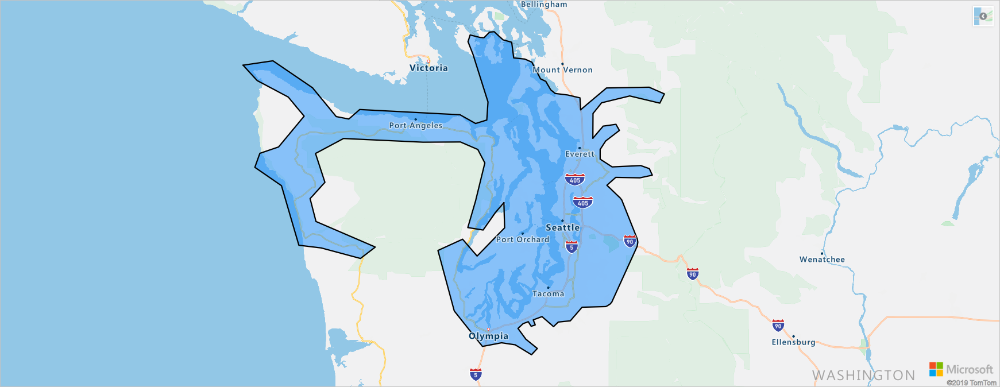

# Data structures in Azure Maps Mobility Service

This article introduces the concept of Metro Area in [Azure Maps Mobility Service](https://aka.ms/AzureMapsMobilityService) and some of the common fields returned via the services, when it is queried for public transit stops and lines. We recommend going through this article before starting out with the Mobility Service APIs. We discuss these common fields below.

## Metro area

Mobility Service data is split into supported metro areas. Metro areas do not follow city boundaries, a metro area can contain multiple cities, for example, densely populated city and its surrounding cities; and a country/region can be one metro area. 

The `metroID` is a metro area's ID that can be used to call the [Get Metro Area Info API](https://aka.ms/AzureMapsMobilityMetroAreaInfo) to request supported transit types and additional details for the metro area such as transit agencies and active alerts. You can use the Azure Maps Get Metro API to request the supported metro areas and metroIDs. Metro area IDs are subject to change.

**metroID:** 522   **Name:** Seattle-Tacoma-Bellevue

## Stop IDs

Transit stops can be referred to by two types of IDs, the [General Transit Feed Specification (GFTS)](https://gtfs.org/) ID (referred to as stopKey) and the Azure Maps stop ID (referred to as stopId). When referring to stops over time, it is suggested to use the Azure Maps stop ID, as this ID is more stable and will not likely change as long as the physical stop exists. The GTFS stop ID is updated more often, for example, in case the GTFS provider needs to change it or new GTFS version is released, although the physical stop had no change.

To start, you can request nearby transit stops by using [Get Nearby Transit API](https://aka.ms/AzureMapsMobilityNearbyTransit).

## Line Groups and Lines

Mobility Service uses a parallel data model for Lines and Line Groups to better deal with changes inherited from [GTFS](https://gtfs.org/) routes and trips data model.

### Line Groups

A Line Group is an entity, which groups together all lines that are logically part of the same group. Usually a line group will contain two lines, one going from point A to B, and the other returning from point B to A, both belonging to the same Public Transport agency and having the same line number. However, there may be cases in which a line group has more than two lines or only a single line within it.

### Lines

As discussed above, each line group is composed of a set of lines. Often each line describes a direction and each line group is composed of two lines. However there are cases in which more lines comprise a line group, for example there is a line that sometimes detours through a certain neighborhood and sometimes does not, and is operated in both cases under the same line number, and there are other cases in which a line group is composed of a single line, for example a circular line with a single direction.

To begin, you can request line groups by using the [Get Transit Line API](https://aka.ms/AzureMapsMobilityTransitLine) and later drill down to lines.

## Next steps

Learn how to request transit data using Mobility Service:

> [!div class="nextstepaction"]
> [How to request transit data](how-to-request-transit-data.md)

Learn how to request real-time data using Mobility Service:

> [!div class="nextstepaction"]
> [How to request real-time data](how-to-request-real-time-data.md)

Explore the Azure Maps Mobility Service API documentation

> [!div class="nextstepaction"]
> [Mobility Service API documentation](https://aka.ms/AzureMapsMobilityService)
