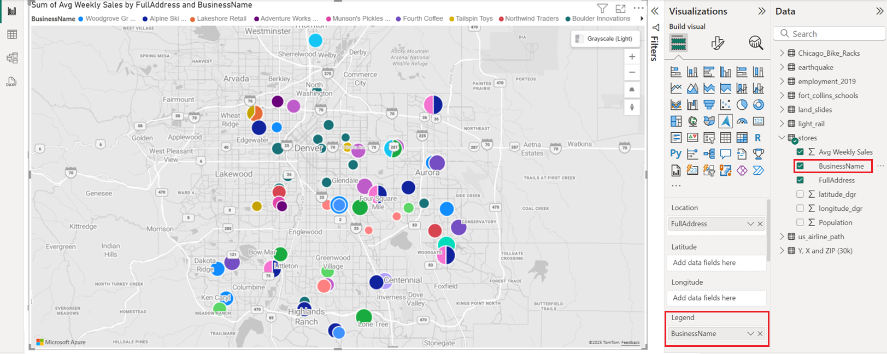

# Add a bubble layer

The **Bubble layer** renders location data as scaled circles on the map.

> [!div class="mx-imgBorder"]
> 

Initially all bubbles have the same fill color. If a field is passed into the **Legend** bucket of the **Fields** pane, the bubbles will be colored based on their categorization. The outline of the bubbles is white be default but can be changed to a new color or by enabling the high-contrast outline option. The **High-contrast outline** option dynamically assigns an outline color that is a high-contrast variant of the fill color. This helps to ensure the bubbles are clearly visible regardless of the style of the map. The following are the primary settings in the **Format** pane that are available in the **Bubble layer** section.

| Setting               | Description    |
|-----------------------|----------------|
| Size                  | The size of each bubble. This option is hidden when a field is passed into the **Size** bucket of the **Fields** pane. Additional options will appear as outlined in the [Bubble size scaling](#bubble-size-scaling) topic further down in this article. |
| Fill color            | Color of each bubble. This option is hidden when a field is passed into the **Legend** bucket of the **Fields** pane and a separate **Data colors** section will appear in the **Format** pane. |
| Fill transparency     | Transparency of each bubble. |
| High-contrast outline | Makes the outline color contrast with the fill color for better accessibility by using a high-contrast variant of the fill color. |
| Outline color         | Color that outlines the bubble. This option is hidden when the **High-contrast outline** option is enabled. |
| Outline transparency  | Transparency of the outline. |
| Outline width         | Width of the outline in pixels. |
| Blur                  | Amount of blur applied to the outline. A value of 1 blurs the bubbles such that only the center point has no transparency. A value of 0 apply any blur effect. |
| Pitch alignment       | Specifies how the bubbles look when the map is pitched.   &nbsp;&nbsp;&nbsp;&nbsp;• Viewport - Bubbles appear on their edge on the map relative to viewport. (default) &nbsp;&nbsp;&nbsp;&nbsp;• Map - Bubbles are rendered flat on the surface of the map. |
| Zoom scale            | Amount the bubbles should scale relative to the zoom level. A zoom scale of one means no scaling. Large values will make bubbles smaller when zoomed out and larger when zoomed in. This helps to reduce the clutter on the map when zoomed out, yet ensures points stand out more when zoomed in. A value of 1 does not apply any scaling. |
| Min zoom              | Minimum zoom level tiles are available. |
| Max zoom              | Maximum zoom level tiles are available. |
| Layer position        | Specifies the position of the layer relative to other map layers. |

## Bubble size scaling

If a field is passed into the **Size** bucket of the **Fields** pane, the bubbles will be scaled relatively to the measure value of each data point. The **Size** option in the **Bubble layer** section of the **Format** pane will disappear when a field is passed into the **Size** bucket, as the bubbles will have their radii scaled between a min and max value. The following options will appear in the **Bubble layer** section of the **Format** pane when a **Size** bucket has a field specified.

| Setting             | Description  |
|---------------------|--------------|
| Min size            | Minimum bubble size when scaling the data.|
| Max size            | Maximum bubble size when scaling the data.|
| Size scaling method | Scaling algorithm used to determine relative bubble size.  &nbsp;&nbsp;&nbsp;&nbsp;• Linear - Range of input data linearly mapped to the min and max size. (default) &nbsp;&nbsp;&nbsp;&nbsp;• Log - Range of input data logarithmically mapped to the min and max size. &nbsp;&nbsp;&nbsp;&nbsp;• Cubic-Bezier - Specify X1, Y1, X2, Y2 values of a Cubic-Bezier curve to create a custom scaling method. |

When the **Size scaling method** is set to **Log**, the following options will be made available.

| Setting   | Description      |
|-----------|------------------|
| Log scale | The logarithmic scale to apply when calculating the size of the bubbles. |

When the **Size scaling method** is set to **Cubic-Bezier**, the following options will be made available to customize the scaling curve.

| Setting | Description                           |
|---------|---------------------------------------|
| X1      | X1 parameter of a cubic Bezier curve. |
| Y1      | X2 parameter of a cubic Bezier curve. |
| X2      | Y1 parameter of a cubic Bezier curve. |
| Y2      | Y2 parameter of a cubic Bezier curve. |

> [!TIP]
> [https://cubic-bezier.com/](https://cubic-bezier.com/) has a handy tool for creating the parameters for Cubic-Bezier curves.

## Next steps

Change how your data is displayed on the map:

> [!div class="nextstepaction"]
> [Add a bar chart layer](power-bi-visual-add-bar-chart-layer.md)

Add more context to the map:

> [!div class="nextstepaction"]
> [Add a reference layer](power-bi-visual-add-reference-layer.md)

> [!div class="nextstepaction"]
> [Add a tile layer](power-bi-visual-add-tile-layer.md)

> [!div class="nextstepaction"]
> [Show real-time traffic](power-bi-visual-show-real-time-traffic.md)

Customize the visual:

> [!div class="nextstepaction"]
> [Tips and tricks for color formatting in Power BI](https://docs.microsoft.com/power-bi/visuals/service-tips-and-tricks-for-color-formatting)

> [!div class="nextstepaction"]
> [Customize visualization titles, backgrounds, and legends](https://docs.microsoft.com/power-bi/visuals/power-bi-visualization-customize-title-background-and-legend)