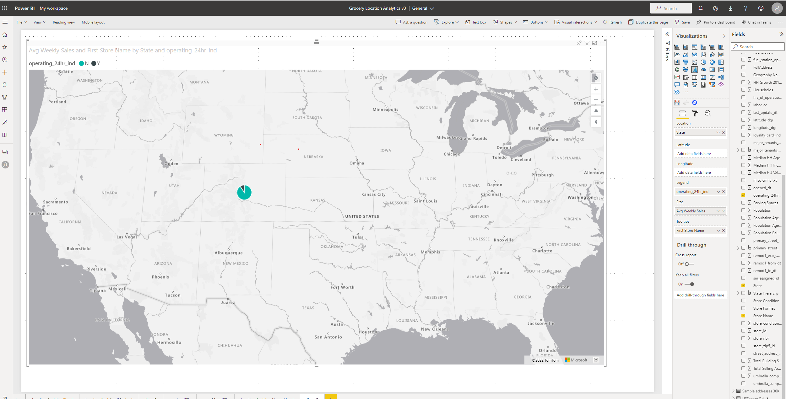

# Add a pie chart layer

In this article, you will learn how to add a pie chart layer to an Azure Maps Power BI visual.

The **Pie Chart layer** renders location data as scaled circles which divided into sectors of pie that each represent a proportion of the whole on the map. A pie chart displays data, information, and statistics in the pie-slice format with varying slice sizes represent to one data element exists. The greater portion of the slice in eah pie chart, the more of the data was gathered and represented.

> 

## Prerequisites

- [Get started with Azure Maps Power BI visual](./power-bi-visual-get-started.md).
- Understand [layers in the Azure Maps Power BI visual](./power-bi-visual-understanding-layers.md).

## Add the pie chart layer

1. In Power BI Desktop, select the Azure map that you created.
2. In the **Format** pane, switch the **Bubble Layer** toggle to **On**.
3. Pass a condition into the **Legend** bucket from the **Fields** pane, the **Pie Charts** will be populated.
4. Pass a condition into the **Size** bucket from the **Fields** pane, each slices in the **Pie Charts** will be populated into corresponding proportion. 

Now you can adjust all the Pie chart layer settings to suit your report.

## Pie chart layer settings

Pie Chart layer is treated as the transformation of bubble layer. Settings options will be shared with the **Bubble layer**. If a field is passed into the **Legend** bucket of the **Fields** pane, the pie charts will be populated and will be colored based on their categorization. The outline of the pie chart is white be default but can be changed to a new color. The following are the primary settings in the **Format** pane that are available in the **Pie Chart layer** section.

| Setting               | Description    |
|-----------------------|----------------|
| Size                  | The size of each bubble. This option is hidden when a field is passed into the **Size** bucket of the **Fields** pane.|
| Fill color            | Color of each bubble. This option is hidden when a field is passed into the **Legend** bucket of the **Fields** pane and a separate **Data colors** section will appear in the **Format** pane. |
| Fill transparency     | Transparency of each pie chart. |
| Outline color         | Color that outlines the pie chart. |
| Outline transparency  | Transparency of the outline. |
| Outline width         | Width of the outline in pixels. |
| Min zoom              | Minimum zoom level tiles are available. |
| Max zoom              | Maximum zoom level tiles are available. |
| Layer position        | Specifies the position of the layer relative to other map layers. |

## Next steps

Change how your data is displayed on the map:

> [!div class="nextstepaction"]
> [Add a bar chart layer](power-bi-visual-add-bar-chart-layer.md)

> [!div class="nextstepaction"]
> [Add a heat map layer](power-bi-visual-add-heat-map-layer.md)

Add more context to the map:

> [!div class="nextstepaction"]
> [Add a reference layer](power-bi-visual-add-reference-layer.md)

> [!div class="nextstepaction"]
> [Add a tile layer](power-bi-visual-add-tile-layer.md)

> [!div class="nextstepaction"]
> [Show real-time traffic](power-bi-visual-show-real-time-traffic.md)

Customize the visual:

> [!div class="nextstepaction"]
> [Tips and tricks for color formatting in Power BI](/power-bi/visuals/service-tips-and-tricks-for-color-formatting)

> [!div class="nextstepaction"]
> [Customize visualization titles, backgrounds, and legends](/power-bi/visuals/power-bi-visualization-customize-title-background-and-legend)
