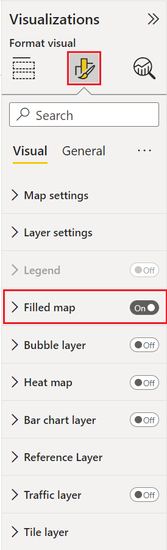
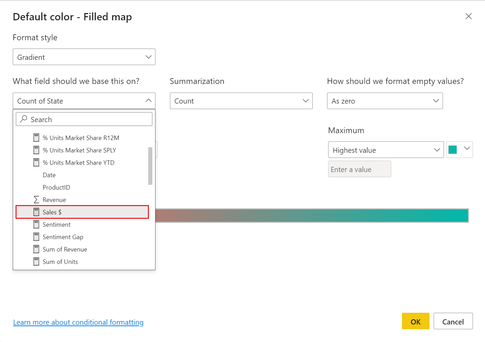

# Fill map in Azure Maps Power BI Visual (Preview)

Filled maps use varying degrees of shading, tinting or different patterns to provide a visual display that quickly shows differences in values across a geography or region. Showing these relative differences with shading that ranges from light (less-frequent/lower) to dark (more-frequent/more) is a useful way to quickly convey pertinent information to viewers.

<!--
:::image type="content" source="media/power-bi-visual/fill-map-us-teal.png" lightbox="media/power-bi-visual/fill-map-us-teal.png" alt-text="A screenshot showing a map of America with states colored in varying degrees depending on the amount of sales attained in each.":::
-->

The image above shows an example of a filled map. The map of America shows each state with a different shade that represents the sales by state. With a quick glance of the map a viewer can immediately see that California brings has the most sales followed by Texas, then Florida.

## When to use a filled map

Filled maps can be a great choice:

* to display quantitative information on a map.
* to show spatial patterns and relationships.
* when your data is standardized.
* when working with socioeconomic data.
* when defined regions are important.
* to get an overview of the distribution across geographic locations.

Some common uses for filled maps include:

* Visualize sales or revenue results by country or state.
* Visualize election results where the color represent the party that won and the shading represent the margin of victory.
* Visualize unemployment rates  by region, state or county.

## Prerequisites

This article uses [Sales and Marketing Sample PBIX](https://download.microsoft.com/download/9/7/6/9767913A-29DB-40CF-8944-9AC2BC940C53/Sales%20and%20Marketing%20Sample%20PBIX.pbix) as the data source for demonstration purposes. You can create a new report using this before continuing if you wish to follow along.

## Create a filled map

1. From the **Fields** pane, select the **Geo > State** field. Notice that it populates the **Location** field in the **Visualizations** pane.

    

    <!--
    :::image type="content" source="media/power-bi-visual/fill-map-geo-state.png" alt-text="A screenshot showing the selection of the state field from the geo table.":::
    -->

1. Select **Sales $** from the **SalesFact** table and drag it to the **Tooltips** field in the **Visualizations** pane.

1. In the **Visualizations** pane select **Format your visual**

1. Set **Filled map** to **On**

    

    <!--
    :::image type="content" source="media/power-bi-visual/filled-map-visualization-setting.png" alt-text="A screenshot showing the filled maps option in the visualizations pane in the Format your visual view.":::
    -->
1. Select **Filled maps** to expand that section then select **Colors**.

1. Select **Conditional formatting**.

    

    <!--
    :::image type="content" source="media/power-bi-visual/fill-map-conditional-formatting.png" alt-text="A screenshot showing the Conditional formatting button in the colors section.":::
    -->
1. The **Default color - Filled map** dialog should appear, select the **What field should we base this on?** Drop down, then select **Sales $** from the **SalesFact** table.

    

    <!--
    :::image type="content" source="media/power-bi-visual/filled-map-sales.png" alt-text="A screenshot showing Default color - Filled map dialog box with sales selected from the What field should we base this on? Drop down.":::
    -->
1. Set the **Minimum** color to white then select the **OK** button.

    > The map should appear with varying degrees of shading depicting the relative sales. Since this data only includes numbers for the contental United States, you can filter out Alaska if you wish.

1. Filter the map to display only the continental United States.

    a. To the left of the "Visualizations" pane, look for the "Filters" pane. Expand it if it is minimized.

    b. Hover over **State** and select the expand chevron.

    c. Place a check mark next to **Select all** and remove the check mark next to **AK**.

    

<!--
    :::image type="content" source="media/power-bi-visual/fill-map-us-minus-alaska.png" lightbox="media/power-bi-visual/fill-map-us-minus-alaska.png" alt-text="A screenshot showing a map of America with states colored in teal with varying degrees of shading depending on the amount of sales attained in each state.":::
-->