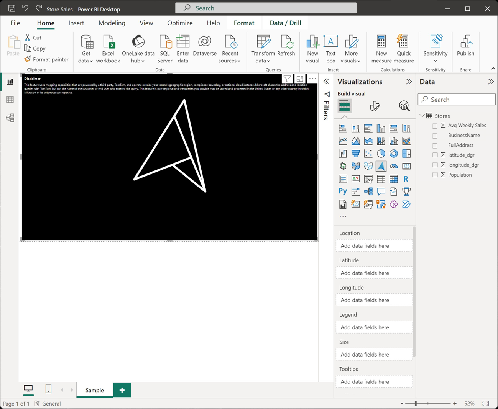
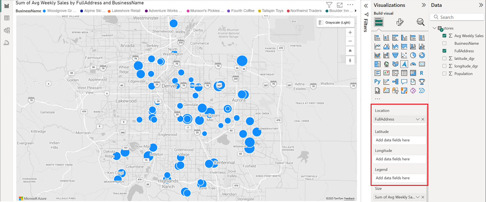
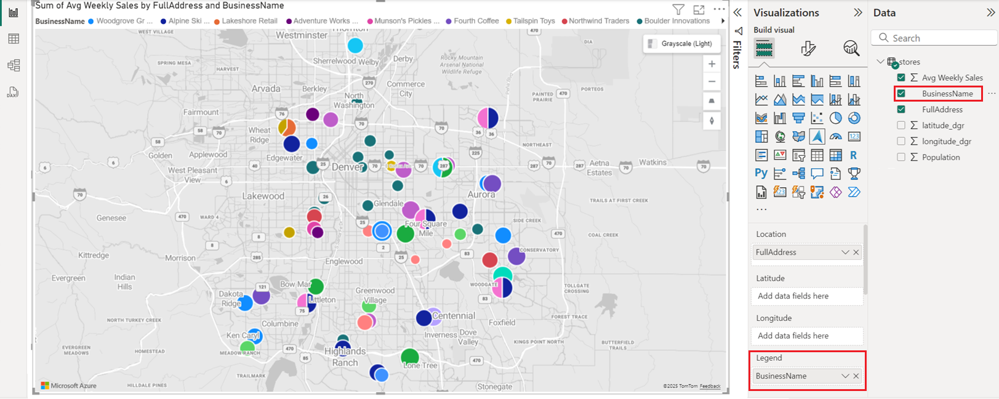
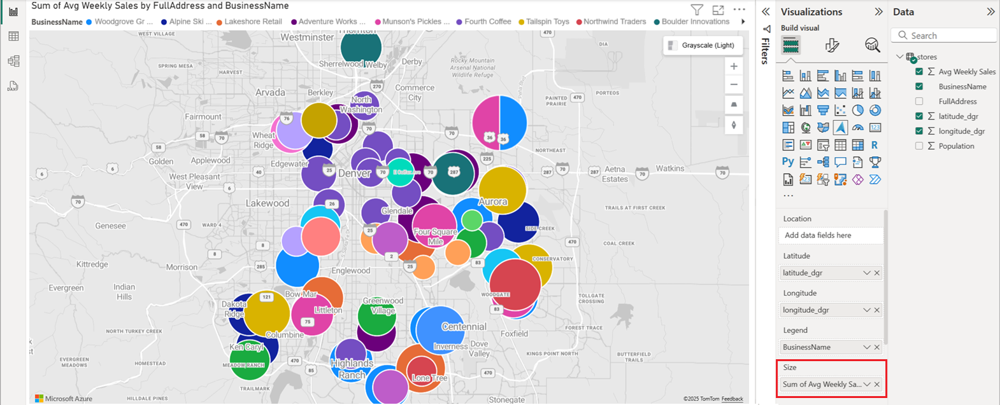
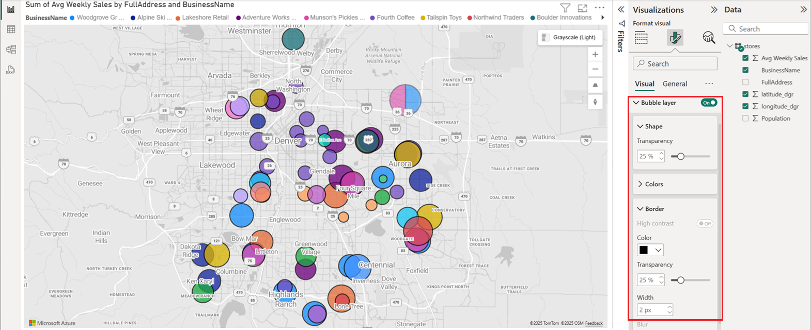

# Getting started with the Azure Maps Power BI visual

<Token>**APPLIES TO:**  Power BI service for ***consumers***  Power BI service for designers & developers  Power BI Desktop  Requires Pro or Premium license </Token>

This article shows how to use the Microsoft Azure Maps visual for Power BI.

> [!NOTE]
> This visual can be created and viewed in both Power BI Desktop and the Power BI service. The steps and illustrations in this article are from Power BI Desktop.

The Azure Maps visual for Power BI provides a rich set of data visualizations for spatial data on top of a map. It is estimated that over 80% of business data has a location context. The Azure Maps visual can be used to gain insights into how this location context relates to and influences your business data.

## What is sent to Azure?

The Azure Maps visual connects to cloud service hosted in Azure to retrieve location data such as map images and coordinates that are used to create the map visualization. 

-   Details about the area the map is focused on are sent to Azure to retrieve images needed to render the map canvas (also known as map tiles). 
-   Data in the Location, Latitude, and Longitude buckets may be sent to Azure to retrieve map coordinates (a process called geocoding). 
-   Telemetry data may be collected on the health of the visual (i.e. crash reports), if the telemetry option in Power BI is enabled.

Other than the scenarios described above, no other data overlaid on the map is sent to the Azure Maps servers. All rendering of data happens locally within the client.

You, or your administrator, may need to update your firewall to allow access to the Azure Maps platform which uses the following URL.

> `https://atlas.microsoft.com`

To learn more, about privacy and terms of use related to the Azure Maps visual see [Microsoft Azure Legal Information](https://azure.microsoft.com/support/legal/).

## Azure Maps visual (Preview) behavior and requirements

There are a few considerations and requirements for **Azure Maps** visual. :

-   The **Azure Maps** visual (Preview) must be enabled in Power BI Desktop. To enable **Azure Maps** visual, select **File** &gt; **Options and Settings** &gt; **Options** &gt; **Preview features**, then select the **Azure Maps Visual** checkbox. If the Azure Maps visual is not available after doing this, it's likely that a tenant admin switch in the Admin Portal needs to be enabled.
-   The data set must have fields that contain **latitude** and **longitude** information. Geocoding of location fields will be added in a future update.
-   The built-in legend control for Power BI does not currently appear in this preview. It will be added in a future update.

## Use the Azure Maps visual (Preview)

Once the **Azure Maps** visual  is enabled, select the **Azure Maps** icon from the **Visualizations** pane.

Power BI creates an empty Azure Maps visual design canvas. While in preview, an additional disclaimer is displayed.

Take the following steps to load the Azure Maps visual:

1.  In the **Fields** pane, drag data fields that contain latitude and longitude coordinate information into the **Latitude** and/or **Longitude** buckets. This is the minimal data needed to load the Azure Maps visual.
    
    > [!div class="mx-imgBorder"]
    > 

2.  To color the data based on categorization, drag a categorical field into the **Legend** bucket of the **Fields** pane. In this example, we're using the **AdminDistrict** column (also known as state or province).  
    
    > [!div class="mx-imgBorder"]
    > 

    > [!NOTE]
    > The built-in legend control for Power BI does not currently appear in this preview. It will be added in a future update.

3.  To scale the data relatively, drag a measure into the **Size** bucket of the **Fields** pane. In this example, we're using **Sales** column.  
    
    > [!div class="mx-imgBorder"]
    > 

4.  Use the options in the **Format** pane to customize how data is rendered. The following image is the same map as above, but with the bubble layers fill transparency option set to 50% and the high-contrast outline option enabled.  
    
    > [!div class="mx-imgBorder"]
    > 

## Fields pane buckets

The following data buckets are available in the **Fields** pane of the Azure Maps visual.

| Field     | Description  |
|-----------|--------------|
| Latitude  | The field used to specify the latitude value of the data points. Latitude values should be between -90 and 90 in decimal degrees format.  |
| Longitude | The field used to specify the longitude value of the data points. Longitude values should be between -180 and 180 in decimal degrees format.  |
| Legend    | The field used to categorize the data and assign a unique color for data points in each category. When this bucket is filled, a **Data colors** section will appear in the **Format** pane which allows adjustments to the colors. |
| Size      | The measure used for relative sizing of data points on the map.   |
| Tooltips  | Additional data fields that are displayed in tooltips when shapes are hovered. |

## Map settings

The **Map settings** section of the Format pane provide options for customizing how the map is displayed and reacts to updates.

| Setting             | Description  |
|---------------------|--------------|
| Auto zoom           | Automatically zooms the map into the data loaded through the **Fields** pane of the visual. As the data changes, the map will update its position accordingly. When the slider is in the **Off** position, additional map view settings are displayed for the default map view. |
| World wrap          | Allows the user to pan the map horizontally infinitely. |
| Style picker        | Adds a button to the map that allows the report readers to change the style of the map. |
| Navigation controls | Adds buttons to the map as another method to allow the report readers to zoom, rotate, and change the pitch of the map. For more information, see this document on [Navigating the map](map-accessibility.md#navigating-the-map) for details on all the different ways users can navigate the map. |
| Map style           | The style of the map. For more information, see this document for more information on [supported map styles](supported-map-styles.md). |

### Map view settings

If the **Auto zoom** slider is in the **Off** position, the following settings are displayed and allow the user to specify the default map view information.

| Setting          | Description   |
|------------------|---------------|
| Zoom             | The default zoom level of the map. Can be a number between 0 and 22. |
| Center latitude  | The default latitude at the center of the map. |
| Center longitude | The default longitude at the center of the map. |
| Heading          | The default orientation of the map in degrees, where 0 is north, 90 is east, 180 is south, and 270 is west. Can be any number between 0 and 360. |
| Pitch            | The default tilt of the map in degrees between 0 and 60, where 0 is looking straight down at the map. |

## Considerations and Limitations

The Azure Maps visual is available in the following services and applications:

| Service/App                              | Availability |
|------------------------------------------|--------------|
| Power BI Desktop                         | Yes          |
| Power BI service (app.powerbi.com)       | Yes          |
| Power BI mobile applications             | Yes          |
| Power BI publish to web                  | No           |
| Power BI Embedded                        | No           |
| Power BI service embedding (PowerBI.com) | Yes          |

Support for additional Power BI services/apps will be added in future updates.

**Where is Azure Maps available?**

At this time, Azure Maps is currently available in all countries and regions except the following:

- China
- South Korea

For coverage details for the different Azure Maps services that power this visual, see the [Geographic coverage information](geographic-coverage.md) document.

**Which web browsers are supported by the Azure Maps visual?**

See this documentation for information on [Azure Maps Web SDK supported browsers](supported-browsers.md).

**How many data points can I visualize?**

This visual supports up to 30,000 data points.

**Can addresses or other location strings be used in this visual?**

The initial preview of this visual only supports latitude and longitude values in decimal degrees. A future update will add support for addresses and other location strings.

## Next steps

Learn more about the Azure Maps Power BI visual:

> [!div class="nextstepaction"]
> [Understanding layers in the Azure Maps Power BI visual](power-bi-visual-understanding-layers.md)

> [!div class="nextstepaction"]
> [Manage the Azure Maps visual within your organization](power-bi-visual-manage-access.md)

Customize the visual:

> [!div class="nextstepaction"]
> [Tips and tricks for color formatting in Power BI](/power-bi/visuals/service-tips-and-tricks-for-color-formatting)

> [!div class="nextstepaction"]
> [Customize visualization titles, backgrounds, and legends](/power-bi/visuals/power-bi-visualization-customize-title-background-and-legend)