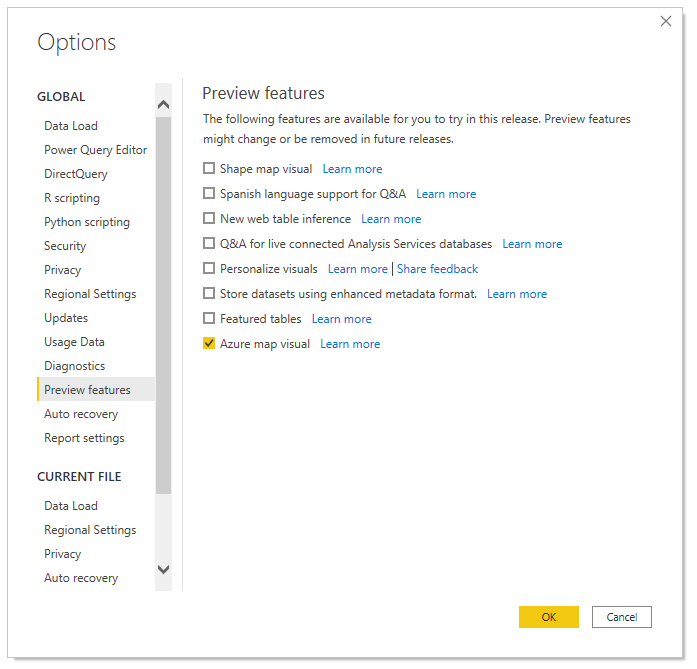
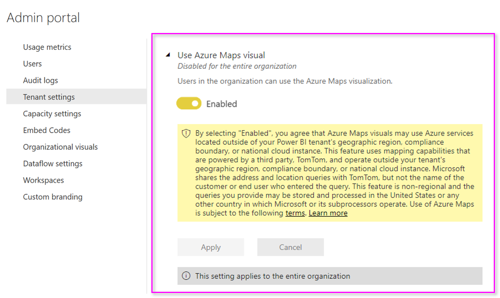

# Manage the Azure Maps visual within your organization

Power BI provides the ability for designers and tenant administrators to manage the use of the Azure Maps visual. Below you will find steps each role can take.

### Designer options

In Power BI Desktop, designers can disable the Azure Maps visual on the security tab. Select **File** &gt; **Options and settings** and then select **Options** &gt; **Preview features**. When disabled, Azure Maps will not load by default.  
  

## Tenant admin options

In PowerBI.com, tenant administrators can turn off the Azure Maps visual for all users. Select **Settings** &gt; **Admin** **Portal** &gt; **Tenant settings**. When disabled, Power BI will no longer display the Azure Maps visual in the visualizations pane.

> [!div class="mx-imgBorder"]
> 

## Next steps

Learn more about the Azure Maps Power BI visual:

> [!div class="nextstepaction"]
> [Understanding layers in the Azure Maps Power BI visual](power-bi-visual-understanding-layers.md)
