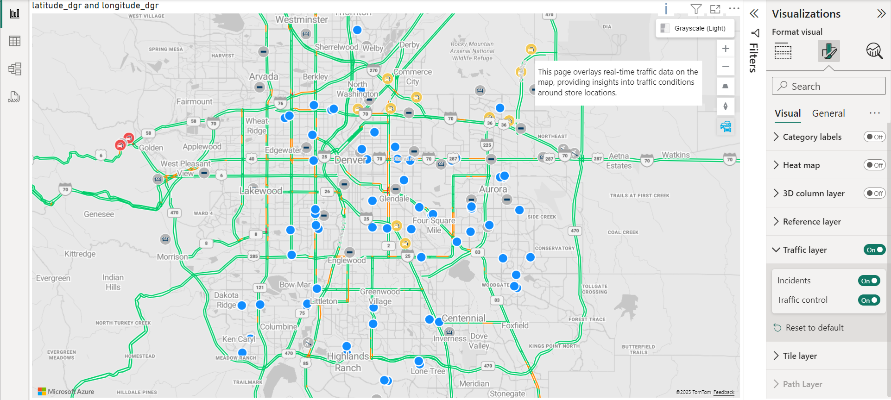

# Show real-time traffic

The traffic layer feature overlays real-time traffic data on top of the map. To enable this feature, move the **Traffic layer** slider in the **Format** pane to the **On** position. This will overlay traffic flow data as color coded roads.

> [!div class="mx-imgBorder"]
> 

The following settings are available in the **Traffic layer** section.

| Setting         | Description    |
|-----------------|----------------|
| Show incidents  | Specifies if traffic incidents, such as road closures and construction, should be displayed on the map. |
| Traffic control | Adds a button to the map that allows report readers to turn the traffic layer on or off.  |

## Next steps

Learn more about the Azure Maps Power BI visual:

> [!div class="nextstepaction"]
> [Understanding layers in the Azure Maps Power BI visual](power-bi-visual-understanding-layers.md)

> [!div class="nextstepaction"]
> [Manage the Azure Maps visual within your organization](power-bi-visual-manage-access.md)
