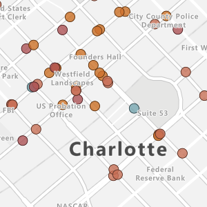
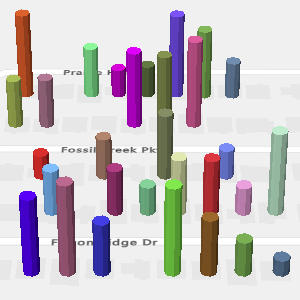
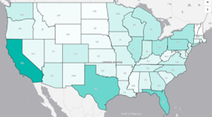
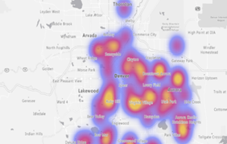
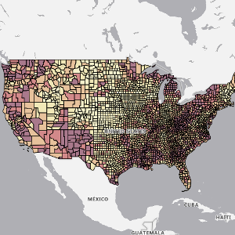
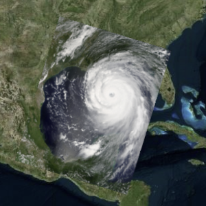
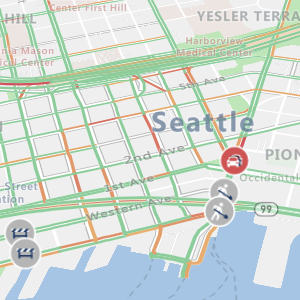

# Layers in Azure Maps Power BI visual

There are two types of layers available in an Azure Maps Power BI visual. The first type focuses on rendering data that is passed into the **Fields** pane of the visual and consist of the following layers, let's call these data rendering layers.

:::row:::
    :::column span="":::
        **Bubble layer**

        Renders points as scaled circles on the map.

        
    :::column-end:::
    :::column span="":::
        **3D column layer**

        Renders points as 3D columns on the map.

        
    :::column-end:::
:::row-end:::

:::row:::
    :::column span="":::
        **Filled map layer**

        Provides a visual display to shows differences in values across a geography or region.

        
    :::column-end:::
    :::column span="":::
        **Heat map layer**

        Shows data "hot spots" on a map.
        
        
    :::column-end:::
:::row-end:::

The second type of layer connects addition external sources of data to map to provide more context and consists of the following layers.

:::row:::
    :::column span="":::
        **Reference layer**

        Overlay an uploaded GeoJSON file on top of the map.

        
    :::column-end:::
    :::column span="":::
        **Tile layer**

        Overlay a custom tile layer on top of the map.
        
        
    :::column-end:::
    :::column span="":::
        **Traffic layer**

        Overlay real-time traffic information on the map.
        
        
    :::column-end:::
:::row-end:::

All the data rendering layers and the **Tile layer**, have options for min and max zoom levels that are used to specify a zoom level range these layers should be displayed at. These options allow one type of rendering layer to be used at one zoom level and a transition to another rendering layer at another zoom level.

These layers can also be positioned relative to other layers in the map. When multiple data rendering layers are used, the order in which they're added to the map determines their relative layering order when they have the same **Layer position** value.

## General layer settings

The general layer section of the **Format** pane are common settings that apply to the layers that are connected to the Power BI dataset in the **Fields** pane (Bubble layer, 3D column layer).

| Setting        | Description                            |
|----------------|----------------------------------------|
| Unselected transparency | The transparency of shapes that aren't selected, when one or more shapes are selected.  |
| Show zeros     | (Deprecated) Specifies if points that have a size value of zero should be shown on the map using the minimum radius. |
| Show negatives | (Deprecated) Specifies if absolute value of negative size values should be plotted.   |
| Min data value | The minimum value of the input data to scale against. Good for clipping outliers.  |
| Max data value | The maximum value of the input data to scale against. Good for clipping outliers.  |

> [!NOTE]
>
> **General layer settings retirement**
>
> The **Show zeros** and **Show negatives** Power BI Visual General layer settings were deprecated starting in the September 2023 release of Power BI. You can no longer create new reports using these settings, but existing reports will continue to work. It is recomended that you upgrade existing reports. To upgrade to the new **range scaling** property, select the desired option in the **Range scaling** drop-down list:
>
> :::image type="content" source="./media/power-bi-visual/range-scaling-drop-down.png" alt-text="A screenshot of the range scaling drop-down":::
>
> For more information on the range scaling option, see **Range scaling** in the properties table of the [Add a bubble layer] article.

## Next steps

Change how your data is displayed on the map:

> [!div class="nextstepaction"]
> [Add a bubble layer](power-bi-visual-add-bubble-layer.md)

> [!div class="nextstepaction"]
> [Add a 3D column layer](power-bi-visual-add-3d-column-layer.md)

Add more context to the map:

> [!div class="nextstepaction"]
> [Add a reference layer](power-bi-visual-add-reference-layer.md)

> [!div class="nextstepaction"]
> [Add a tile layer](power-bi-visual-add-tile-layer.md)

> [!div class="nextstepaction"]
> [Show real-time traffic](power-bi-visual-show-real-time-traffic.md)

 [Add a bubble layer]: power-bi-visual-add-bubble-layer.md
