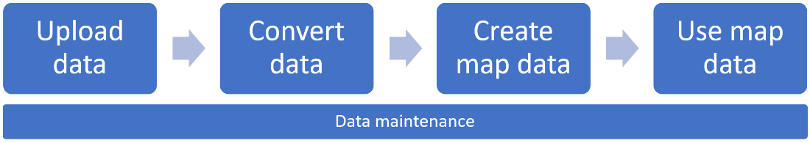

# Private Atlas for indoor maps

Private Atlas makes it possible to develop applications based on indoor map data using Azure Maps API and SDK. This article introduces concepts that apply to Private Atlas such as Drawing package uploading and conversion, as well as understanding and creating resources such as datasets, tilesets, and feature statesets. In addition, this article provides an overview of how modules or applications can use indoor map data for the purposes of querying, rendering, updating, or deleting indoor map data, as well as providing suggestions for possible integration with Azure Map data and IoT services.

## Create Private Atlas

In order to use Private Atlas services, Private Atlas must be created in an Azure Maps account. For information on how to create Private Atlas in Azure Maps, see [Manage Private Atlas](tutorial-private-atlas-indoor-maps.md).

After you create Private Atlas, you are now ready to upload data, convert data, and then create and use your map data. Finally, data maintenance allows you then to list, update, and delete your map data. The workflow is illustrated in the following diagram.

## Drawing package requirements

Private Atlas collects indoor map data by converting a Drawing package that represents a facility. The Drawing package must contain the DWG files that were typically produced by means of CAD tools during the facility construction or remodeling phase.

In addition, the Drawing package must contain a _manifest.json_ file that defines additional metadata to be included in the indoor map data. This metadata file is meant to provide you with an option for adding metadata not included in the CAD drawings.

The minimum set of data required in the Drawing package is defined by the mandatory elements. However, depending on data availability and solution requirements, those mandatory elements can be expanded further to include, for example, space names, categories and zones. For information on Drawing package requirements, see [Drawing package requirements](drawing-requirements.md).

## Uploading a Drawing package

Drawing packages must be uploaded using the [Azure Maps Data Upload API](https://docs.microsoft.com/rest/api/maps/data/uploadpreview) into the Azure Maps account for which Private Atlas has been created. Any tool or developer framework capable of performing REST API calls can be used to call this, and any other, API.

Once the Drawing package is successfully uploaded, the `udid` (user data identifier) returned by [Data Upload API](https://docs.microsoft.com/rest/api/maps/data/uploadpreview) will be needed in order to call the [Azure Maps Conversion service](https://docs.microsoft.com/rest/api/maps/data/conversion). for converting the uploaded package into indoor map data.

## Converting a Drawing package

The [Azure Maps Conversion service](https://docs.microsoft.com/rest/api/maps/data/conversion) converts and validates an uploaded Drawing package into indoor map data.  Validation issues are mainly classified into two types: errors and warnings. If any errors are detected, the conversion process fails. If either warnings are detected or neither warnings nor errors, the indoor map data is created and stored in Private Atlas.  To get more information on Drawing package errors and warnings, see [Drawing package warnings and errors](dwg-conversion-error-codes.md).

If the Drawing package fails to convert due to validation errors, you will have to fix the error or errors and reupload the Drawing package. To help inspect errors and warnings detected during conversion, the Conversion service provides a means to download the [Azure Maps Drawing Error Visualizer](azure-maps-drawing-errors-visualizer.md), a standalone web application for visualizing and inspecting Drawing package conversion errors and warnings.

## Creating indoor maps

Private Atlas provides the [Dataset service](https://docs.microsoft.com/rest/api/maps/dataset/createpreview), which is used to create a dataset from converted Drawing package data. A single dataset can contain any number of facilities and can be updated or removed at any time. In order for applications to render datasets in a visual way, Private Atlas provides the [Tileset service](https://docs.microsoft.com/rest/api/maps/tileset/createpreview), which provides a vector-based representation of a dataset and so allows applications to present visual tile-based views of the indoor map data. Through the [Feature State service](https://docs.microsoft.com/rest/api/maps/featurestate), datasets can further be augmented to support dynamic map styling, which allows map applications using tilesets to reflect real-time events on spaces provided by IoT systems.

### Datasets

A dataset is a collection of indoor map features that represents facilities as defined in the converted Drawing package. After creating a dataset with the [dataset service](https://docs.microsoft.com/rest/api/maps/dataset/createpreview) developers can create any number of [tilesets](#tilesets) or [feature statesets](#feature-statesets). 

The [Dataset service](https://docs.microsoft.com/rest/api/maps/dataset/createpreview) allows developers, at any time, to add new facilities to an existing dataset by uploading and converting new Drawing packages. For more information on how to update an existing dataset, see the append options in [Dataset service](https://docs.microsoft.com/rest/api/maps/dataset/createpreview) and [Data Maintenance](#data-maintenance).

### Tilesets

A tileset is a collection of vector data that represents a set of uniform grid tiles optimized for map rendering at preset zoom levels.  Developers can use the [Tileset service](https://docs.microsoft.com/rest/api/maps/tileset/createpreview) to create tilesets from any dataset that is deemed ready for map visualization scenarios.

A tileset, identified by a unique tileset identifier, is independent of the dataset from which it was created. This means that tilesets are not affected by any of the changes applied to the source dataset. It also means that if you delete a tileset, it will not delete the dataset. Furthermore, developers can create multiple tilesets from the same dataset in order to reflect different content stages. For example, a developer can create a tileset with and without furniture and equipment, or with and without the most recent data updates.

During tileset creation, additional metadata is generated which is useful for rendering tilesets in applications. For example, the metadata stores a bounding box defining the geographic extent the tileset covers. The bounding box coordinates allow an application to programmatically set the correct center point for rendering. Also, the metadata contains a min and max zoom level for the tileset. For more information about tileset metadata, see [Tileset List API](https://docs.microsoft.com/rest/api/maps/tileset/listpreview).

Once a tileset has been created, it can be retrieved by the [Render V2 - Get Map Tile API](https://docs.microsoft.com/rest/api/maps/renderv2/getmaptilepreview) using Azure Maps SDK or any third-party applications that have been created to consume and render the tileset.

The [Alias service]() allows for the efficient governance and distribution of tilesets and respective metadata. It is often the case that an application utilizes a tileset that needs to be periodically replaced to always reference the most appropriate tileset, such as the most recent. In order to achieve this without any application code change or update to communicate to third-party developers, you can use the Alias Assign API to configure an alias for a tileset. For more information on how to use the [Alias service](), see [How to use the Alias API]().

If a tileset becomes outdated and is considered no longer useful, you can delete the tileset. For more details on how to list and delete tilesets, see the [Data Maintenance](#data-maintenance) section.

### Feature statesets

The [Feature State service](https://docs.microsoft.com/rest/api/maps/featurestate/featurestate) is designed for defining, retrieving, and updating dynamic properties (*states*) of features, such as rooms or equipment, defined in a dataset.  

The [Feature State service](https://docs.microsoft.com/rest/api/maps/featurestate/createstatesetpreview) allows developers to create a feature stateset for a dataset. The stateset is defined by one or more states such as temperature and occupancy and their respective map styles. Each feature, such as a room, can have one state attached to it. Based on the feature stateset, an application is able to dynamically render features in a facility according to their current state and respective map style.

The value of each *state* in a stateset can be updated or retrieved by IoT devices or other applications.  For example, using the [Feature State Update API](https://docs.microsoft.com/rest/api/maps/featurestate/updatestatespreview), devices measuring space occupancy can systematically post the state change of a room. An application interested in showing room occupancy can easily deliver updates via maps that change the color of the rooms based on last known occupancy states.

Like tilesets, changing a dataset does not affect the existing feature stateset and deleting a feature stateset will have no effect on the dataset to which it is attached.

For more information on how feature statesets are used to dynamically broadcast state changes, see the [Render V2 API](#render-v2-api) section below.

## Using indoor maps

### Render V2 service

The [Render V2 service](https://docs.microsoft.com/rest/api/maps/renderv2/getmaptilepreview) has been extended to not only support Azure Maps provided maps, but also Private Atlas tilesets. Developers can use the same API and skill set to develop applications that use one or more tilesets.

For scenarios in which you make use of feature stateset for tracking IoT and third-party systems sharing live data related to indoor spaces, the Render V2 service provides a means to broadcast and dynamically update maps. The [Get Map State Tile API](https://docs.microsoft.com/rest/api/maps/renderv2/getmaptilepreview) is responsible for delivering updates to all running applications configured to support dynamic map styling.  For a step-by-step walk-through on how to implement feature stateset dynamic styling in an application, see [Indoor Map Dynamic Styling](indoor-map-dynamic-styling.md).

### Web Feature Service API

Datasets can be queried using the [Web Feature Service (WFS) API](https://docs.microsoft.com/rest/api/maps/wfs). WFS follows the [Open Geospatial Consortium API Features](http://docs.opengeospatial.org/DRAFTS/17-069r1.html). The WFS API is particularly helpful when there is a need to query features within the dataset itself. For example, you can use WFS to find rooms by name or all mid-size meeting rooms of a given facility and floor level.  

### Indoor Web SDK Module

The [Azure Maps Web SDK](https://docs.microsoft.com/azure/azure-maps/) includes the Indoor Maps Module. This module offers extended functionalities to the Azure Maps *Map Control* library. It conveniently renders indoor maps created in Private Atlas, and it integrates indoor specific widgets such as floor picker, which helps users to visualize the different floors.

In addition, the Indoor Maps Module allows developers to create web applications using indoor map data together with other [Azure Maps services](https://docs.microsoft.com/azure/azure-maps/). The most common application setups could include enabling indoor map visualization and adding knowledge from other maps such as road, imagery, weather, and transit to help put indoor in context and provide a more informed map to users.

For more information, see the [Indoor Maps Module]()documentation. To learn how to implement the Indoor Maps Module with feature stateset dynamic styling, see [How to Use the Indoor Map Module](how-to-use-indoor-module.md).  

### Azure Maps integration

As you begin to develop solutions for indoor maps, more can be done by leveraging existing Azure Maps capabilities. For example, asset tracking or safety scenarios can be implemented by combining Azure Maps geofencing and other spatial calculations with an indoor positioning technology. The [Azure Maps Geofence API](tutorial-geofence.md) is designed to work with user provided data, hence, ready to support automated processing and logic based on whether an asset or a worker, enters, or leaves specific indoor areas. An example of how to connect Azure Maps with IoT telemetry is available [here](tutorial-iot-hub-maps.md).

### Data Maintenance

 Private Atlas allows you to list and delete your datasets, tilesets, and feature statesets by means of the List and Delete API. For example, you may want to know how many tilesets exist in your subscription in order to review their relevance and update/delete them as appropriate.

>[!NOTE]
>Whenever you review a list of items and decide to delete them, you must consider the impact of that deletion on all dependent API or applications. For example, if you should delete a tileset that is currently being used by an application by means of the [Render V2 - Get Map Tile API](https://docs.microsoft.com/rest/api/maps/renderv2/getmaptilepreview), deleting that tileset would result in an application failure to render that tileset.

### Example: Updating a dataset

If you wish to add a new facility to a dataset and tileset that is currently in production and consumed by one or more applications, you can update the dataset by uploading and converting a new Drawing package that contains the new facility data. Once the package has been successfully uploaded and converted, you can then simply update the current dataset by calling the [Dataset Create API](https://docs.microsoft.com/rest/api/maps/dataset/createpreview). You then would generate a new tileset from the updated dataset and update the application with the new tileset identifier. The entire process is outlined in the following steps.

1. Follow steps in the [Uploading a Drawing package](#uploading-a-dwg-package)] and [Converting a Drawing package](#converting-a-dwg-package) sections to upload and convert the new Drawing package.

2. Use the [Dataset Create API](https://docs.microsoft.com/rest/api/maps/dataset/createpreview) to append the converted data to the existing campus dataset.

3. Use the [Tileset Create API](https://docs.microsoft.com/rest/api/maps/tileset/createpreview) to generate a new tileset out of the updated campus Dataset. Save the new tilesetId for step 4.

4. Update the tileset identifier in your application to enable the visualization of the updated campus dataset. If you have no control over the application, you can use the [Alias API]() to configure the newly created tileset as a replacement of the old tileset. Optionally, you can now delete the old tileset if it is no longer in use.

## Next steps

> [!div class="nextstepaction"]
> [Tutorial: Creating a Private Atlas indoor map](tutorial-private-atlas-indoor-maps.md)
