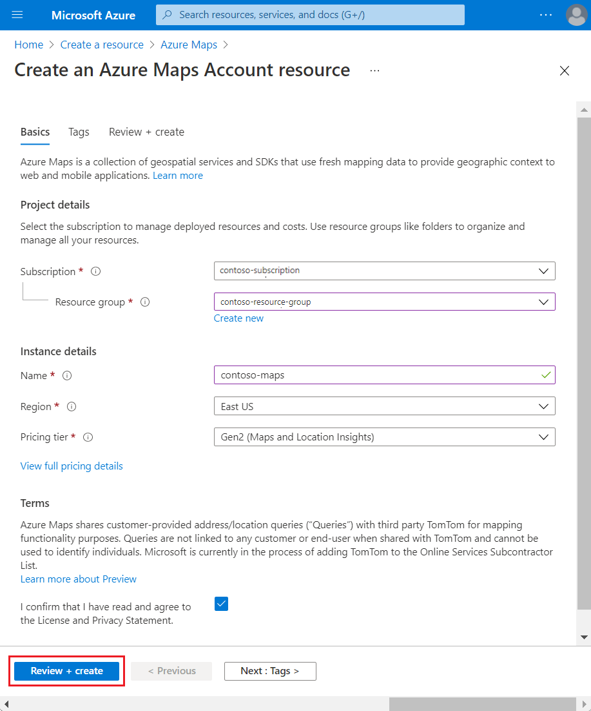
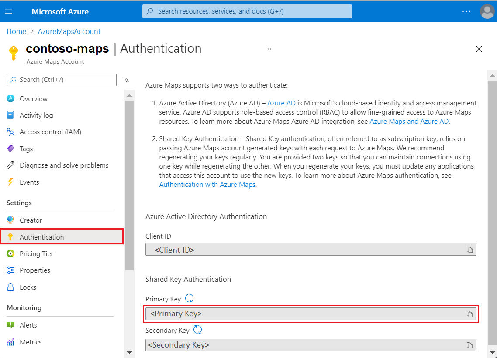
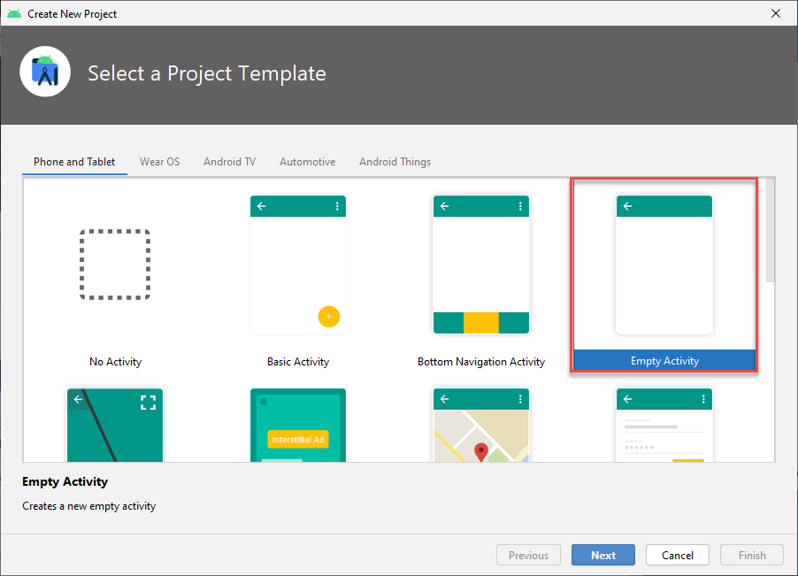
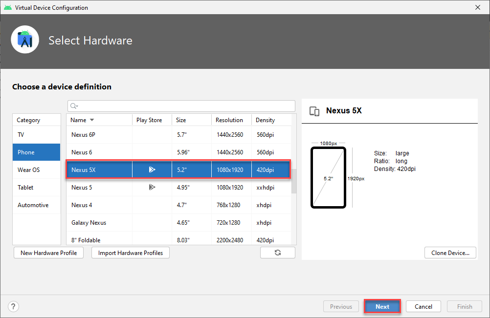
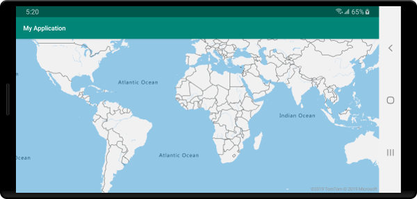

# Quickstart: Create an Android app with Azure Maps

This article shows you how to add the Azure Maps to an Android app. It walks you through these basic steps:

* Setup your development environment.
* Create your own Azure Maps account.
* Get your primary Azure Maps key to use in the app.
* Reference the Azure Maps libraries from the project.
* Add an Azure Maps control to the app.

## Prerequisites

1. Create an Azure Maps account by signing into the [Azure portal](https://portal.azure.com). If you don't have an Azure subscription, create a [free account](https://azure.microsoft.com/free/) before you begin.
2. [Make an Azure Maps account](quick-demo-map-app.md#create-an-azure-maps-account)
3. [Obtain a primary subscription key](quick-demo-map-app.md#get-the-primary-key-for-your-account), also known as the primary key or the subscription key. For more information on authentication in Azure Maps, see [manage authentication in Azure Maps](how-to-manage-authentication.md).
4. [Download Android Studio](https://developer.android.com/studio/) for free from Google.

## Create an Azure Maps account

Create a new Azure Maps account with the following steps:

1. In the upper left-hand corner of the [Azure portal](https://portal.azure.com), click **Create a resource**.
2. In the *Search the Marketplace* box, type **Azure Maps**.
3. From the *Results*, select **Azure Maps**. Click **Create** button that appears below the map.
4. On the **Create Maps Account** page, enter the following values:
    * The *Subscription* that you want to use for this account.
    * The *Resource group* name for this account. You may choose to *Create new* or *Use existing* resource group.
    * The *Name* of your new account.
    * The *Pricing tier* for this account.
    * Read the *License* and *Privacy Statement*, and check the checkbox to accept the terms.
    * Click the **Create** button.

    

## Get the primary key for your account

Once your Maps account is successfully created, retrieve the primary key that enables you to query the Maps APIs.

1. Open your Maps account in the portal.
2. In the settings section, select **Authentication**.
3. Copy the **Primary Key** to your clipboard. Save it locally to use later in this tutorial.

>[!NOTE]
> If you use the Azure subscription key instead of the Azure Maps primary key, your map won't render properly. Also, for security purposes, it is recommended that you rotate between your primary and secondary keys. To rotate keys, update your app to use the secondary key, deploy, then press the cycle/refresh button beside the primary key to generate a new primary key. The old primary key will be disabled. For more information on key rotation, see [Set up Azure Key Vault with key rotation and auditing](../key-vault/secrets/tutorial-rotation-dual.md)



## Create a project in Android Studio

First, create a new project with an empty activity. Complete these steps to create an Android Studio project:

1. Under **Choose your project**, select **Phone and Tablet**. Your application will run on this form factor.
2. On the **Phone and Tablet** tab, select **Empty  Activity**, and then select **Next**.
3. Under **Configure your project**, select `API 21: Android 5.0.0 (Lollipop)` as the minimum SDK. This is the earliest version supported by the Azure Maps Android SDK.
4. Accept the default `Activity Name` and `Layout Name` and select **Finish**.

See the [Android Studio documentation](https://developer.android.com/studio/intro/) for more help with installing Android Studio and creating a new project.



## Set up a virtual device

Android Studio lets you set up a virtual Android device on your computer. Doing so can help you test your application during development. To set up a virtual device, select the Android Virtual Device (AVD) Manager icon in the upper-right corner of your project screen, and then select **Create Virtual Device**. You can also get to the AVD Manager by selecting **Tools** > **Android** > **AVD Manager** from the toolbar. In the **Phones** category, select **Nexus 5X**, and then select **Next**.

You can learn more about setting up an AVD in the [Android Studio documentation](https://developer.android.com/studio/run/managing-avds).



## Install the Azure Maps Android SDK

The next step in building your application is to install the Azure Maps Android SDK. Complete these steps to install the SDK:

1. Open the top-level **build.gradle** file and add the following code to the **all projects**, **repositories** block section:

    ```gradle
    maven {
        url "https://atlas.microsoft.com/sdk/android"
    }
    ```

2. Update your **app/build.gradle** and add the following code to it:

    1. Make sure that your project's **minSdkVersion** is at API 21 or higher.

    2. Add the following code to the Android section:

        ```gradle
        compileOptions {
            sourceCompatibility JavaVersion.VERSION_1_8
            targetCompatibility JavaVersion.VERSION_1_8
        }
        ```

    3. Update your dependencies block and add a new implementation dependency line for the latest Azure Maps Android SDK:

        ```gradle
        implementation "com.microsoft.azure.maps:mapcontrol:0.7"
        ```

        > [!Note]
        > You can set the version number to "0+" to have your code always point to the latest version.

    4. Go to **File** in the toolbar and then click on **Sync Project with Gradle Files**.
3. Add a map fragment to the main activity (res \> layout \> activity\_main.xml):

    ```xml
    <com.microsoft.azure.maps.mapcontrol.MapControl
        android:id="@+id/mapcontrol"
        android:layout_width="match_parent"
        android:layout_height="match_parent"
        />
    ```

::: zone pivot="programming-language-java-android"

4. In the **MainActivity.java** file you'll need to:

    * add imports for the Azure Maps SDK
    * set your Azure Maps authentication information
    * get the map control instance in the **onCreate** method

    Setting the authentication information on the `AzureMaps` class globally using the `setSubscriptionKey` or `setAadProperties` methods makes it so you won't have to add your authentication information on every view.

    The map control contains its own lifecycle methods for managing Android's OpenGL lifecycle. These lifecycle methods must be called directly from the containing Activity. For your app to correctly call the map control's lifecycle methods, you must override the following lifecycle methods in the Activity that contains the map control. And, you must call the respective map control method.

    * `onCreate(Bundle)`
    * `onDestroy()`
    * `onLowMemory()`
    * `onPause()`
    * `onResume()`
    * `onSaveInstanceState(Bundle)`
    * `onStart()`
    * `onStop()`

    Edit the **MainActivity.java** file as follows:

    ```java
    package com.example.myapplication;
    
    import androidx.appcompat.app.AppCompatActivity;
    import com.microsoft.azure.maps.mapcontrol.AzureMaps;
    import com.microsoft.azure.maps.mapcontrol.MapControl;
    import com.microsoft.azure.maps.mapcontrol.layer.SymbolLayer;
    import com.microsoft.azure.maps.mapcontrol.options.MapStyle;
    import com.microsoft.azure.maps.mapcontrol.source.DataSource;
    
    public class MainActivity extends AppCompatActivity {
        
    static {
        AzureMaps.setSubscriptionKey("<Your Azure Maps subscription key>");

        //Alternatively use Azure Active Directory authenticate.
        //AzureMaps.setAadProperties("<Your aad clientId>", "<Your aad AppId>", "<Your aad Tenant>");
    }

    MapControl mapControl;

    @Override
    protected void onCreate(Bundle savedInstanceState) {
        super.onCreate(savedInstanceState);
        setContentView(R.layout.activity_main);

        mapControl = findViewById(R.id.mapcontrol);

        mapControl.onCreate(savedInstanceState);

        //Wait until the map resources are ready.
        mapControl.onReady(map -> {
            //Add your post map load code here.

        });
    }

    @Override
    public void onResume() {
        super.onResume();
        mapControl.onResume();
    }

    @Override
    protected void onStart(){
        super.onStart();
        mapControl.onStart();
    }

    @Override
    public void onPause() {
        super.onPause();
        mapControl.onPause();
    }

    @Override
    public void onStop() {
        super.onStop();
        mapControl.onStop();
    }

    @Override
    public void onLowMemory() {
        super.onLowMemory();
        mapControl.onLowMemory();
    }

    @Override
    protected void onDestroy() {
        super.onDestroy();
        mapControl.onDestroy();
    }

    @Override
    protected void onSaveInstanceState(Bundle outState) {
        super.onSaveInstanceState(outState);
        mapControl.onSaveInstanceState(outState);
    }}
    ```

    > [!NOTE]
    > After you complete the preceding steps, you may get warnings from Android Studio about some of the code. To resolve these warnings, import the classes referenced in `MainActivity.java`.
    > You can automatically import these classes by selecting `Alt` + `Enter` (`Option` + `Return` on a Mac).

::: zone-end

::: zone pivot="programming-language-kotlin"

4. In the **MainActivity.kt** file you'll need to:

    * add imports for the Azure Maps SDK
    * set your Azure Maps authentication information
    * get the map control instance in the **onCreate** method

    Setting the authentication information on the `AzureMaps` class globally using the `setSubscriptionKey` or `setAadProperties` methods makes it so you won't have to add your authentication information on every view.

    The map control contains its own lifecycle methods for managing Android's OpenGL lifecycle. These lifecycle methods must be called directly from the containing Activity. For your app to correctly call the map control's lifecycle methods, you must override the following lifecycle methods in the Activity that contains the map control. And, you must call the respective map control method.

    * `onCreate(Bundle)`
    * `onDestroy()`
    * `onLowMemory()`
    * `onPause()`
    * `onResume()`
    * `onSaveInstanceState(Bundle)`
    * `onStart()`
    * `onStop()`

    Edit the **MainActivity.kt** file as follows:

    ```kotlin
    package com.example.myapplication;

    import androidx.appcompat.app.AppCompatActivity
    import android.os.Bundle
    import com.microsoft.azure.maps.mapcontrol.AzureMap
    import com.microsoft.azure.maps.mapcontrol.AzureMaps
    import com.microsoft.azure.maps.mapcontrol.MapControl
    import com.microsoft.azure.maps.mapcontrol.events.OnReady
    
    class MainActivity : AppCompatActivity() {
    
        companion object {
            init {
                AzureMaps.setSubscriptionKey("<Your Azure Maps subscription key>");
    
                //Alternatively use Azure Active Directory authenticate.
                //AzureMaps.setAadProperties("<Your aad clientId>", "<Your aad AppId>", "<Your aad Tenant>");
            }
        }
    
        var mapControl: MapControl? = null
    
        override fun onCreate(savedInstanceState: Bundle?) {
            super.onCreate(savedInstanceState)
            setContentView(R.layout.activity_main)
    
            mapControl = findViewById(R.id.mapcontrol)
    
            mapControl?.onCreate(savedInstanceState)
    
            //Wait until the map resources are ready.
            mapControl?.onReady(OnReady { map: AzureMap -> })
        }
    
        public override fun onStart() {
            super.onStart()
            mapControl?.onStart()
        }
    
        public override fun onResume() {
            super.onResume()
            mapControl?.onResume()
        }
    
        public override fun onPause() {
            mapControl?.onPause()
            super.onPause()
        }
    
        public override fun onStop() {
            mapControl?.onStop()
            super.onStop()
        }
    
        override fun onLowMemory() {
            mapControl?.onLowMemory()
            super.onLowMemory()
        }
    
        override fun onDestroy() {
            mapControl?.onDestroy()
            super.onDestroy()
        }
    
        override fun onSaveInstanceState(outState: Bundle) {
            super.onSaveInstanceState(outState)
            mapControl?.onSaveInstanceState(outState)
        }
    }
    ```

    > [!NOTE]
    > After you complete the preceding steps, you may get warnings from Android Studio about some of the code. To resolve these warnings, import the classes referenced in `MainActivity.kt`.
    > You can automatically import these classes by selecting `Alt` + `Enter` (`Option` + `Return` on a Mac).

::: zone-end

5. Select the run button, as shown in the following graphic (or press `Control` + `R` on a Mac), to build your application.

    

Android Studio will take a few seconds to build the application. After the build is complete, you can test your application in the emulated Android device. You should see a map like this one:



## Clean up resources

>[!WARNING]
> The tutorials listed in the [Next Steps](#next-steps) section detail how to use and configure Azure Maps with your account. Don't clean up the resources created in this quickstart if you plan to continue to the tutorials.

If you don't plan to continue to the tutorials, take these steps to clean up the resources:

1. Close Android Studio and delete the application you created.
2. If you tested the application on an external device, uninstall the application from that device.

If you don't plan on continuing to develop with the Azure Maps Android SDK:

1. Navigate to the Azure portal page. Select **All resources** from the main portal page. Or, click on the menu icon in the upper left-hand corner. Select **All resources**.
2. Click on your Azure Maps account. At the top of the page, click **Delete**.
3. Optionally, if you don't plan to continue developing Android apps, uninstall Android Studio.

For more code examples, see these guides:

* [Manage authentication in Azure Maps](how-to-manage-authentication.md)
* [Change map styles in Android maps](set-android-map-styles.md)
* [Add a symbol layer](how-to-add-symbol-to-android-map.md)
* [Add a line layer](android-map-add-line-layer.md)
* [Add a polygon layer](how-to-add-shapes-to-android-map.md)

## Next steps

In this quickstart, you created your Azure Maps account and created a demo application. Take a look at the following tutorials to learn more about Azure Maps:

> [!div class="nextstepaction"]
> [Load GeoJSON data into Azure Maps](tutorial-load-geojson-file-android.md)