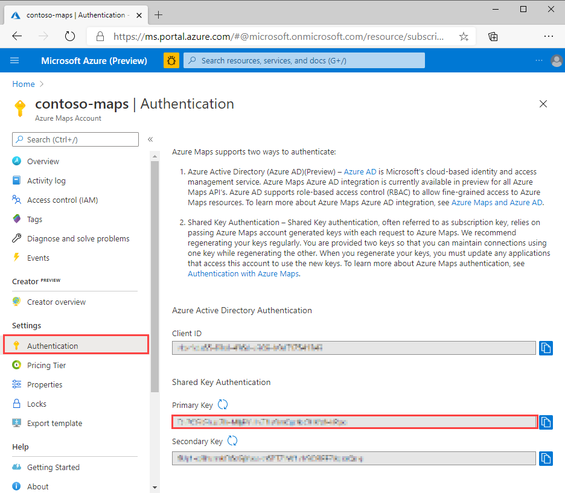

# Quickstart: Create an interactive search map by using Azure Maps

This article demonstrates the capabilities of Azure Maps to create a map that gives users an interactive search experience. It walks you through these basic steps:
* Create your own Azure Maps account.
* Get your account key to use in the demo web application.

If you don't have an Azure subscription, create a [free account](https://azure.microsoft.com/free/?WT.mc_id=A261C142F) before you begin.

## Sign in to the Azure portal

Sign in to the [Azure portal](https://portal.azure.com).

## Create an account with Azure Maps

Create a new Maps account with the following steps:

1. In the upper left-hand corner of the [Azure portal](https://portal.azure.com), click **Create a resource**.
2. In the *Search the Marketplace* box, type **Maps**.
3. From the *Results*, select **Maps**. Click **Create** button that appears below the map.
4. On the **Create Maps Account** page, enter the following values:
    * The *Subscription* that you want to use for this account.
    * The *Resource group* name for this account. You may choose to *Create new* or *Use existing* resource group.
    * The *Name* of your new account.
    * The *Pricing tier* for this account.
    * Read the *License* and *Privacy Statement*, and check the checkbox to accept the terms.
    * Click the **Create** button.

## Get the primary key for your account

Once your Maps account is successfully created, retrieve the key that enables you to query the Maps APIs. We recommend using your account's primary key as the subscription key when calling Azure Maps services.

1. Open your Maps account in the portal.
2. In the settings section, select **Authentication**.
3. Copy the **Primary Key** to your clipboard. Save it locally to use later in this tutorial.

## Download the application

1. Go to [interactiveSearch.html](https://github.com/Azure-Samples/AzureMapsCodeSamples/blob/master/AzureMapsCodeSamples/Tutorials/interactiveSearch.html) and click it to view the contents within the GitHub User Interface. Right click on the **Raw** button and copy the content of the file or 'Save as' to download the file.
2. Save the contents of this file locally as **AzureMapDemo.html**. Open it in a text editor.
3. Search for the string `<Your Azure Maps Key>`. Replace it with the **Primary Key** value from the preceding section.

## Open the application

1. Open the file **AzureMapDemo.html** in a browser of your choice.
2. Observe the map shown of the City of Los Angeles. Zoom in and out to see how the map automatically renders with more or less information depending on the zoom level. 
3. Change the default center of the map. In the **AzureMapDemo.html** file, search for the variable named **center**. Replace the longitude, latitude pair value for this variable with the new values **[-74.0060, 40.7128]**. Save the file and refresh your browser.
4. Try out the interactive search experience. In the search box on the upper-left corner of the demo web application, search for **restaurants**.
5. Move your mouse over the list of addresses and locations that appear below the search box. Notice how the corresponding pin on the map pops out information about that location. For privacy of private businesses, fictitious names and addresses are shown.

    

## Clean up resources

The tutorials detail how to use and configure Azure Maps with your account. Don't clean up the resources created in this quickstart if you plan to continue to the tutorials. If you don't plan to continue, take these steps to clean up the resources:

1. Close the browser that runs the **AzureMapDemo.html** web application.
2. From the left menu in the Azure portal, select **All resources**. Then select your Azure Maps account. At the top of the **All resources** blade, select **Delete**.

## Next steps

In this quickstart, you created your Azure Maps account and created a demo app. Take a look at the following tutorials to learn about Azure Maps:

> [!div class="nextstepaction"]
> [Search nearby points of interest by using Azure Maps](tutorial-search-location.md)

For more code examples and an interactive coding experience, see these guides:

> [!div class="nextstepaction"]
> [Find an address by using the Azure Maps search service](how-to-search-for-address.md)

> [!div class="nextstepaction"]
> [Use the Azure Maps Map Control](how-to-use-map-control.md)
