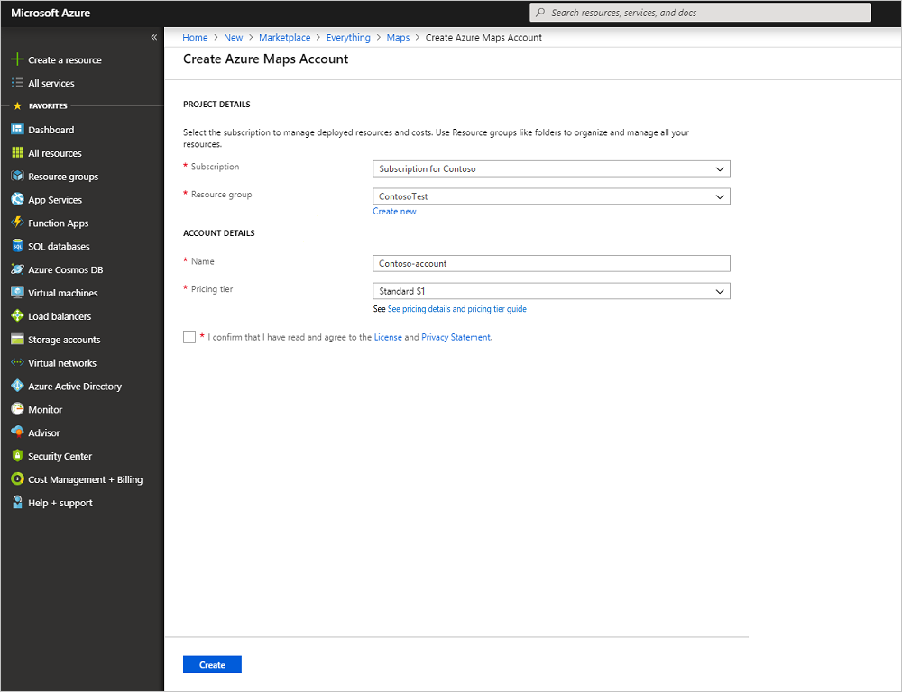
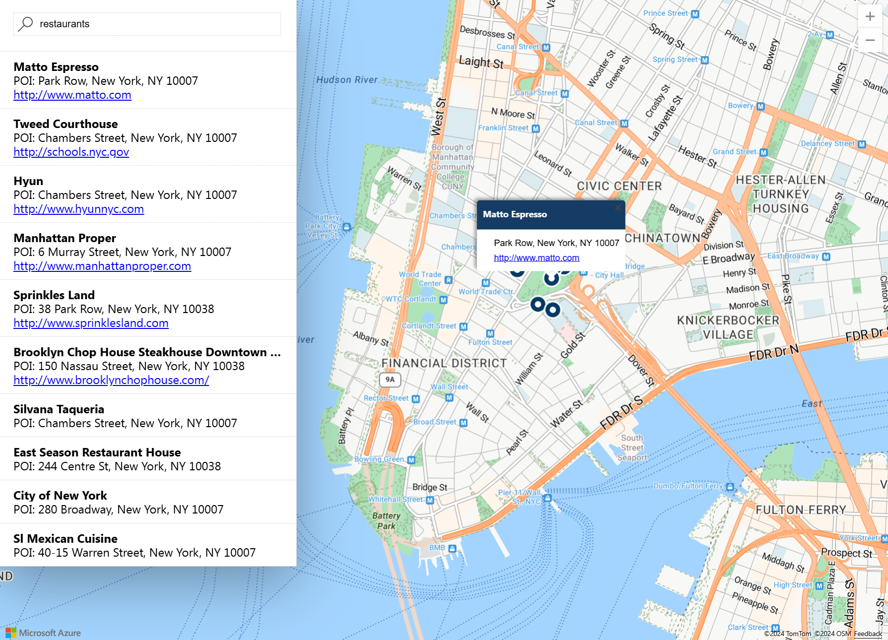

# Create an interactive search map by using Azure Maps

This article demonstrates the capabilities of Azure Maps to create a map that gives users an interactive search experience. It walks you through these basic steps:
* Create your own Azure Maps account.
* Get your account key to use in the demo web application.

If you don't have an Azure subscription, create a [free account](https://azure.microsoft.com/free/?WT.mc_id=A261C142F) before you begin.

## Sign in to the Azure portal

Sign in to the [Azure portal](https://portal.azure.com/).

## Create an account and get your key

1. In the upper-left corner of the [Azure portal](https://portal.azure.com), select **Create a resource**.
2. In the **Search the Marketplace** box, enter **Maps**.
3. From the **Results**, select **Maps**. Select the **Create** button that appears below the map.
4. On the **Create Azure Maps Account** page, enter the following values:
   - The **Name** of your new account.
   - The **Subscription** that you want to use for this account.
   - The **Resource group** for this account. You might choose to **Create new** or **Use existing** resource group.
   - Select the **Pricing Tier** of your choice.
   - Read the **License** and **Privacy Statement**. Select the check box to accept the terms.
   - Finally, select the **Create** button.

     

5. After your account is successfully created, open it and find the settings section of the account menu. Select **Keys** to view the primary and secondary keys for your Azure Maps account. Copy the **Primary Key** value to your local clipboard to use in the following section.

## Download the application

1. Download or copy the contents of the file [interactiveSearch.html](https://github.com/Azure-Samples/AzureMapsCodeSamples/blob/master/AzureMapsCodeSamples/Tutorials/interactiveSearch.html).
2. Save the contents of this file locally as **AzureMapDemo.html**. Open it in a text editor.
3. Search for the string `<Your Azure Maps Key>`. Replace it with the **Primary Key** value from the preceding section.

## Open the application

1. Open the file **AzureMapDemo.html** in a browser of your choice.
2. Observe the map shown of the City of Los Angeles. Zoom in and out to see how the map automatically renders with more or less information depending on the zoom level. 
3. Change the default center of the map. In the **AzureMapDemo.html** file, search for the variable named **center**. Replace the longitude, latitude pair value for this variable with the new values **[-74.0060, 40.7128]**. Save the file and refresh your browser.
4. Try out the interactive search experience. In the search box on the upper-left corner of the demo web application, search for **restaurants**.
5. Move your mouse over the list of addresses and locations that appear below the search box. Notice how the corresponding pin on the map pops out information about that location. For privacy of private businesses, fictitious names and addresses are shown.

    

## Clean up resources

The tutorials detail how to use and configure Azure Maps with your account. Don't clean up the resources created in this quickstart if you plan to continue to the tutorials. If you don't plan to continue, take these steps to clean up the resources:

1. Close the browser that runs the **AzureMapDemo.html** web application.
2. From the left menu in the Azure portal, select **All resources**. Then select your Azure Maps account. At the top of the **All resources** blade, select **Delete**.

## Next steps

In this quickstart, you created your Azure Maps account and created a demo app. Take a look at the following tutorials to learn about Azure Maps:

> [!div class="nextstepaction"]
> [Search nearby points of interest by using Azure Maps](tutorial-search-location.md)

For more code examples and an interactive coding experience, see these guides:

> [!div class="nextstepaction"]
> [Find an address by using the Azure Maps search service](how-to-search-for-address.md)

> [!div class="nextstepaction"]
> [Use the Azure Maps Map Control](how-to-use-map-control.md)
