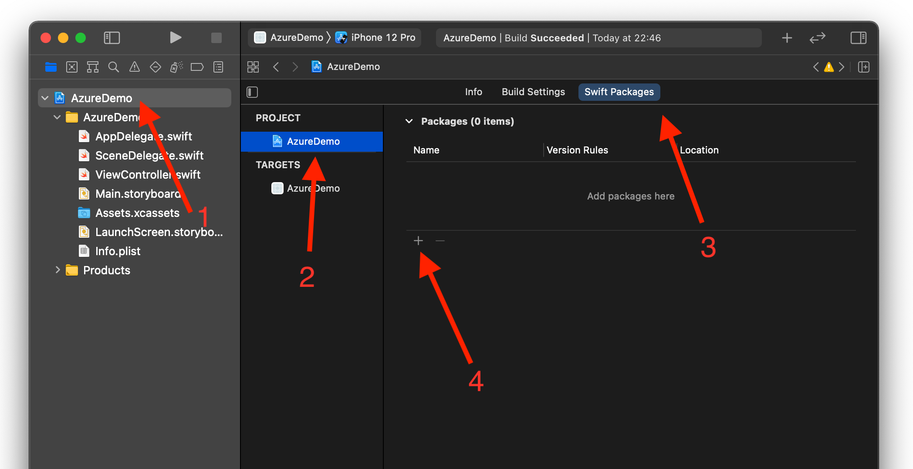
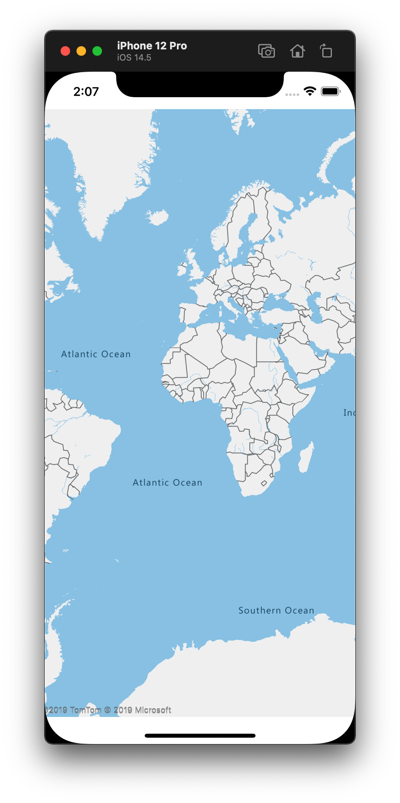

--- 
title:  Create an iOS app
description: Steps to create an Azure Maps account and the first iOS App.
author: deniseatmicrosoft
ms.author: v-dbogomolov
ms.date: 09/30/2021
ms.topic: conceptual
ms.service: azure-maps
services: azure-maps
---
#  Create an iOS app (Public Preview)

This article shows you how to add the Azure Maps to an iOS app. It walks you through these basic steps:

* Setup your development environment.
* Create your own Azure Maps account.
* Get your primary Azure Maps key to use in the app.
* Reference the Azure Maps libraries from the project.
* Add an Azure Maps control to the app.

## Prerequisites

* Create an Azure Maps account by signing into the  [Azure portal](https://portal.azure.com/) . If you don't have an Azure subscription, create a  [free account](https://azure.microsoft.com/free/)  before you begin.
* [Make an Azure Maps account](quick-demo-map-app.md#create-an-azure-maps-account)
* [Obtain a primary subscription key](quick-demo-map-app.md#get-the-primary-key-for-your-account) , also known as the primary key or the subscription key. For more information on authentication in Azure Maps, see  [manage authentication in Azure Maps](how-to-manage-authentication.md).
* Download [Xcode on the Mac App Store](https://apps.apple.com/cz/app/xcode/id497799835?mt=12) for free.

## Create an Azure Maps account

Create a new Azure Maps account with the following steps:

1. In the upper left-hand corner of the [Azure portal](https://portal.azure.com/) , click **Create a resource**.
2. In the _Search the Marketplace_ box, type **Azure Maps**.
3. From the _Results_, select **Azure Maps**. Click **Create** button that appears below the map.
4. On the **Create Maps Account** page, enter the following values:
	* The _Subscription_ that you want to use for this account.
	* The _Resource group_ name for this account. You may choose to _Create new_ or _Use existing_ resource group.
	* The _Name_ of your new account.
	* The _Pricing tier_ for this account.
	* Read the _License_ and _Privacy Statement_, and check the checkbox to accept the terms.
	* Click the **Create** button.

## Get the primary key for your account

Once your Maps account is successfully created, retrieve the primary key that enables you to query the Maps APIs.

1. Open your Maps account in the portal.
2. In the settings section, select **Authentication**.
3. Copy the **Primary Key** to your clipboard. Save it locally to use later in this tutorial.

> [!Note]
> If you use the Azure subscription key instead of the Azure Maps primary key, your map won't render properly. Also, for security purposes, it is recommended that you rotate between your primary and secondary keys. To rotate keys, update your app to use the secondary key, deploy, then press the cycle/refresh button beside the primary key to generate a new primary key. The old primary key will be disabled. For more information on key rotation, see [Set up Azure Key Vault with key rotation and auditing](../key-vault/secrets/tutorial-rotation-dual.md)

## Create a project in Xcode

First, create a new iOS App project. Complete these steps to create an Xcode project:

1. Under **File**, select **New** -> **Project**.
2. On the **iOS** tab, select **App**, and then select **Next**.
3. Enter app name, bundle ID and select **Next**.

See the [Creating an Xcode Project for an App](https://developer.apple.com/documentation/xcode/creating-an-xcode-project-for-an-app) for more help with creating a new project.

## Install the Azure Maps iOS SDK

The next step in building your application is to install the Azure Maps iOS SDK. Complete these steps to install the SDK:

1. In **Project navigator** select project file
2. In opened **Project Editor** select project
3. Switch to **Swift Package** tab
4. Add Azure Maps iOS SDK: `{link goes here}`

## Add MapControl view

1. Add custom `UIView` to view controller
2. Select `MapControl` class from `AzureMapsControl` module

3. In the **AppDelegate.swift** file you'll need to:
	* add import for the Azure Maps SDK
	* set your Azure Maps authentication information
Setting the authentication information on the AzureMaps class globally using the `AzureMaps.configure(subscriptionKey:)` or `AzureMaps.configure(aadClient:aadAppId:aadTenant:)` methods makes it so you won't have to add your authentication information on every view.

4. Select the run button, as shown in the following graphic (or press `CMD` + `R`), to build your application.

Xcode will take a few seconds to build the application. After the build is complete, you can test your application in the simulated iOS device. You should see a map like this one:

## Clean up resources

> [!WARNING]
> The tutorials listed in the [Next Steps](#next-steps) section detail how to use and configure Azure Maps with your account. Don't clean up the resources created in this quickstart if you plan to continue to the tutorials.

If you don't plan to continue to the tutorials, take these steps to clean up the resources:

1. Close Xcode and delete the project you created.
2. If you tested the application on an external device, uninstall the application from that device.

If you don't plan on continuing to develop with the Azure Maps iOS SDK:

1. Navigate to the Azure portal page. Select **All resources** from the main portal page. Or, click on the menu icon in the upper left-hand corner. Select **All resources**.
2. Click on your Azure Maps account. At the top of the page, click **Delete**.
3. Optionally, if you don't plan to continue developing iOS apps, uninstall Xcode.

<!--
For more code examples, see these guides:

*  [Manage authentication in Azure Maps](how-to-manage-authentication.md)
*  [Change map styles in iOS maps](Set%20map%20style%20%28iOS%20SDK%29.md)
*  [Add a symbol layer](Add%20a%20symbol%20layer%20%28iOS%20SDK%29.md)
*  [Add a line layer](Add%20a%20line%20layer%20to%20the%20map%20%28iOS%20SDK%29.md)
*  [Add a polygon layer](Add%20a%20polygon%20layer%20to%20the%20map%20%28iOS%20SDK%29.md)
-->

## Next steps

In this quickstart, you created your Azure Maps account and created a demo application. Take a look at the following tutorials to learn more about Azure Maps:

> [!div class="nextstepaction"]
> [Load GeoJSON data into Azure Maps](tutorial-load-geojson-file-android.md)
