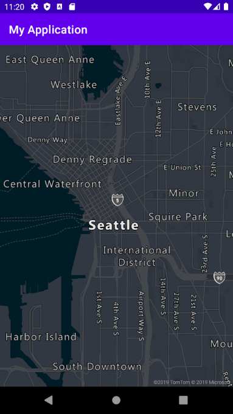
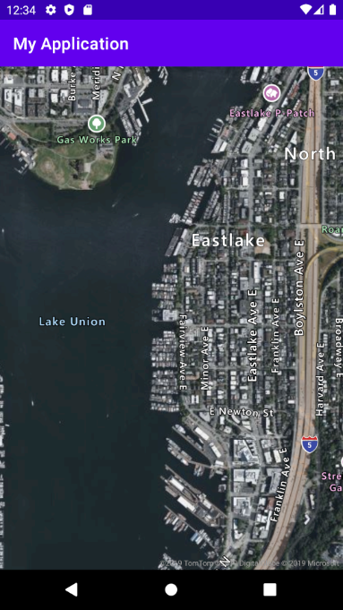

# Set map style using Azure Maps Android SDK

Azure Maps has six different maps styles to choose from. For more about map styles, see [supported map styles in Azure Maps](./supported-map-styles.md). This article shows you two ways to set map styles using the Azure Maps Android SDK.


## prerequisites

To complete the process in this article, you need to install [Azure Maps Android SDK](https://docs.microsoft.com/azure/azure-maps/how-to-use-android-map-control-library) to load a map.


## Set map style in the layout

You can set a map style in the layout file for your activity class. Edit **res > layout > activity_main.xml** so it looks like the one below:

```XML
<?xml version="1.0" encoding="utf-8"?>
<FrameLayout
    xmlns:android="http://schemas.android.com/apk/res/android"
    xmlns:app="http://schemas.android.com/apk/res-auto"
    android:layout_width="match_parent"
    android:layout_height="match_parent"
    >

    <com.microsoft.azure.maps.mapcontrol.MapControl
        android:id="@+id/mapcontrol"
        android:layout_width="match_parent"
        android:layout_height="match_parent"
        app:mapcontrol_centerLat="47.602806"
        app:mapcontrol_centerLng="-122.329330"
        app:mapcontrol_Zoom="12"
        app:mapcontrol_style="grayscale_dark"
        />

</FrameLayout>
```

The `mapcontrol_style` attribute above sets the map style to **grayscale_dark**. 



## Set map style in the activity class

Map style can be set in the activity class. Follow the steps below to set the map style to **satellite_road_labels** within the activity class.

1. Add the following code snippet to your `MainActivity.java`. 

    ```Java
     mapControl = new MapControl(this,
        center(47.64,-122.33),
        zoom(10),
        style(MapStyle.SATELLITE_ROAD_LABELS));
    
        setContentView(mapControl);
    ```

2. Remove the following lines of code from your `MainActivity.java`:

    ```Java
    setContentView(R.layout.activity_main);
    mapControl = findViewById(R.id.mapcontrol);
    ```

