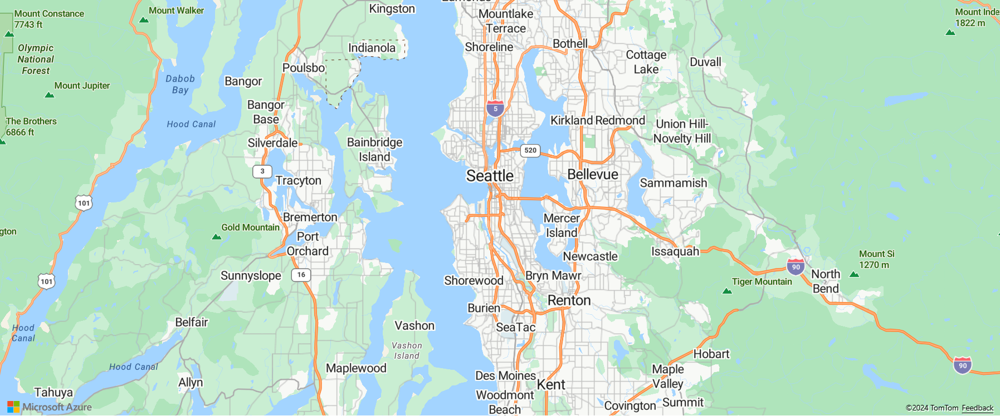
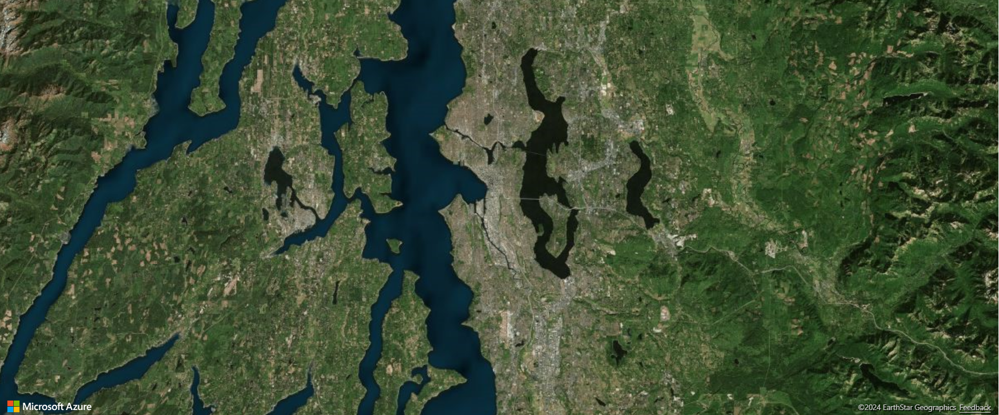
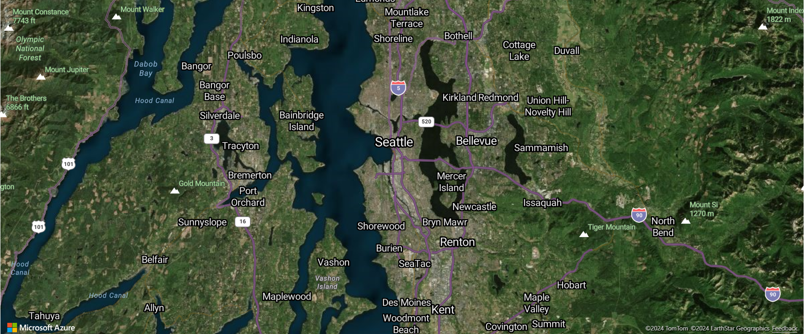
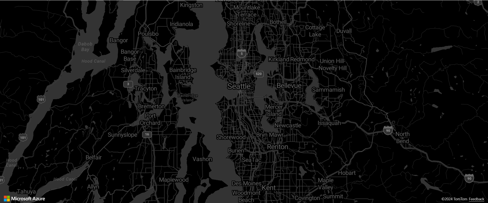
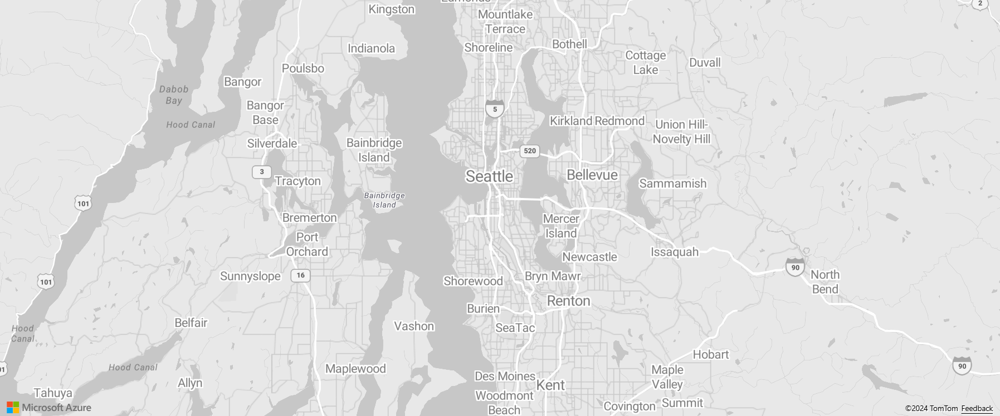
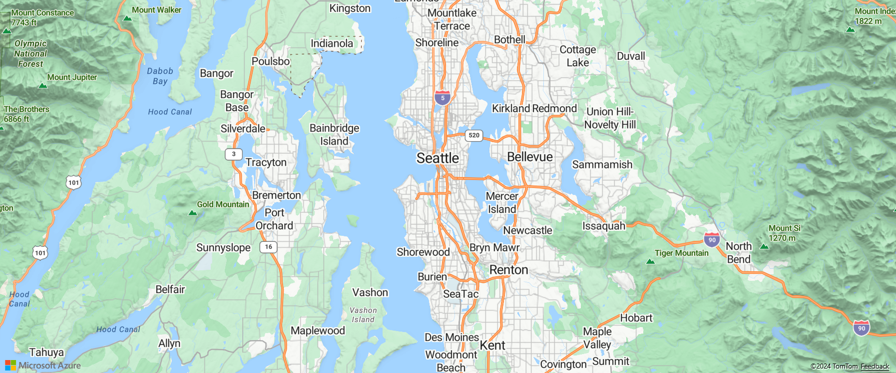
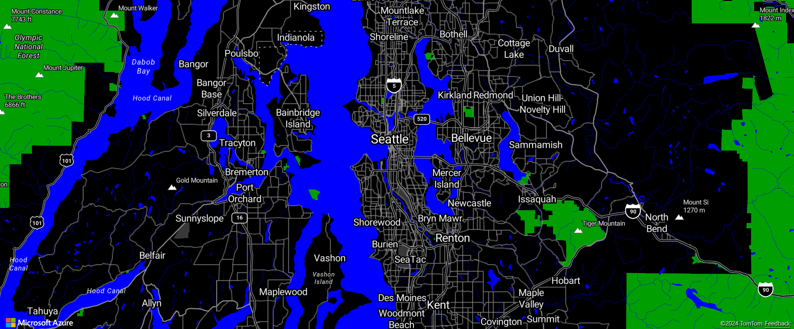

# Azure Maps supported map styles
Azure Maps supports several different built-in map styles as described below.

## road
A **road** map is a standard map that displays roads, natural and artificial features along with the labels for those features.

**Applicable APIs:**
* [Map image](https://docs.microsoft.com/rest/api/maps/render/getmapimage)
* [Map tile](https://docs.microsoft.com/rest/api/maps/render/getmaptile)
* Web SDK map control
* Android map control

## blank and blank_accessible

The **blank** and **blank_accessible** map styles provide a blank canvas on which to visualize data on. The **blank_accessible** style will continue to provide screen reader updates with map's location details, even though the base map is not displayed.

> [!Note]
> In the web SDK you can change the background color of the map by setting the CSS `background-color` style of map DIV element.

**Applicable APIs:**
* Web SDK map control

## satellite 
The **satellite** style is a combination of satellite and aerial imagery.

**Applicable APIs:**
* [Satellite tile](https://docs.microsoft.com/rest/api/maps/render/getmapimagerytilepreview)
* Web SDK map control
* Android map control

## satellite_road_labels
This map style is a hybrid of roads and labels overlaid on top of satellite and aerial imagery.

**Applicable APIs:**
* Web SDK map control
* Android map control

## grayscale_dark
**grayscale dark** is a dark version of the road map style.

**Applicable APIs:**
* [Map image](https://docs.microsoft.com/rest/api/maps/render/getmapimage)
* [Map tile](https://docs.microsoft.com/rest/api/maps/render/getmaptile)
* Web SDK map control 
* Android map control

## grayscale_light
**grayscale light** is a light version of the road map style.

**Applicable APIs:**
* Web SDK map control
* Android map control

## night
**night** is a dark version of the road map style with colored roads and symbols.

**Applicable APIs:**
* Web SDK map control
* Android map control

## road_shaded_relief
**road shaded relief** is an Azure Maps main style completed with contours of the Earth.

**Applicable APIs:**
* [Map tile](https://docs.microsoft.com/rest/api/maps/render/getmaptile)
* Web SDK map control
* Android map control

## high_contrast_dark

**high_contrast_dark** is a dark map style with a higher contrast than the other styles.

**Applicable APIs:**
* Web SDK map control

## Next steps

Learn about how to set a map style in Azure Maps:

> [!div class="nextstepaction"]
> [Choose a map style](https://docs.microsoft.com/azure/azure-maps/choose-map-style)
