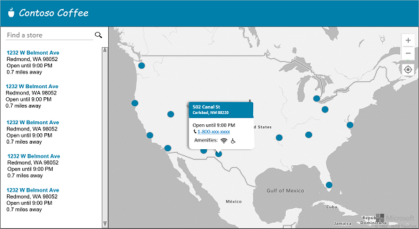
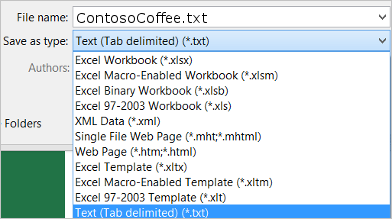
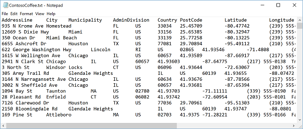
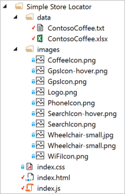
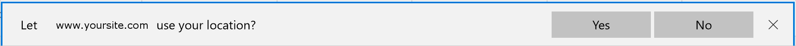
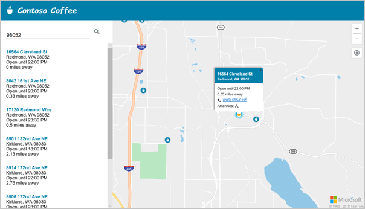

# Create a store locator by using Azure Maps

This tutorial guides you through the process of creating a simple store locator by using Azure Maps. Store locators are common. Many of the concepts that are used in this type of application are applicable to many other types of applications. Store Locators are a must for most businesses that sell directly to consumers. In this tutorial, you learn how to:
    
> [!div class="checklist"]
* Create a new webpage by using the Map Control API.
* Load custom data from a file and display it on the map.
* Use the Azure Maps search service to find an address or enter a query.
* Get the user's location from the browser and show it on the map.
* Combine multiple layers to create custom symbols on the map.  
* Cluster data points.  
* Add zoom controls to the map.

<a id="Intro"></a>

Jump ahead to the [live sample](https://azuremapscodesamples.azurewebsites.net/?sample=Simple%20Store%20Locator) or [source code](https://github.com/Azure-Samples/AzureMapsCodeSamples/tree/master/AzureMapsCodeSamples/Tutorials/Simple%20Store%20Locator). 

## Prerequisites

Before you begin, complete the steps in the first tutorial to [create your Azure Maps account](./tutorial-search-location.md#createaccount) and [get the subscription key for your account](./tutorial-search-location.md#getkey).

## Design

Before you jump into the code, it's a good idea to begin with a design. Your store locator can be as simple or complex as you want it to be. In this tutorial, we create a simple store locator. We include some tips along the way to help you extend some functionalities if you want to use them. We create a store locator for a fictional company called Contoso Coffee. The following figure shows a wireframe of the general layout of the store locator we build in this tutorial:

<br/>
<center></center>

To maximize the usefulness of this store locator, we include a responsive layout that adjusts when a user's screen width is smaller than 700 pixels wide. A responsive layout makes it easy to use the store locator on a small screen, like on a mobile device. Here's a wireframe of what a small-screen layout will look like:  

<br/>
<center></center>

In the preceding wireframes, you can see a fairly straightforward application. The application has a search box, a list of nearby stores, a map that has some markers (symbols), and a pop-up display that has additional information when the user selects a marker. In more detail, here are the features we build into this store locator in this tutorial:

* All locations from the imported tab-delimited data file are loaded on the map.
* The user can pan and zoom the map, perform a search, and select the GPS button.
* The page layout adjusts based on the width of the device screen.  
* A header shows the store logo.  
* Users can use a search box and button to search for a location, such as an address, postal code, or city. 
* A key press event added to the search box triggers a search if the user presses the Enter key. This functionality often is overlooked, but it creates a better user experience.
* When the map moves, the distance to each location from the center of the map is calculated. The results list is updated to show the closest locations at the top of the map.  
* When you select a result in the results list, the map is centered over the selected location and appears in a pop-up display.  
* Selecting a specific location on the map also triggers a pop-up display.
* When the user zooms out, locations are grouped into clusters. Clusters are represented as a circle with a number inside the circle. Clusters form and break apart as the zoom level changes.
* Selecting a cluster zooms in on the map two levels and centers over the location of the cluster.

<a id="create a data-set"></a>

## Create the store location dataset

Before we begin to develop an application, we need to create a dataset of the stores we want to display on the map. In this tutorial, we use a dataset for a fictitious coffee shop called Contoso Coffee. The dataset for this simple store locator is managed in an Excel workbook. The dataset contains 10,213 locations spread across 9 countries: the United States, Canada, the United Kingdom, France, Germany, Italy, the Netherlands, Denmark, and Spain. Here's a screenshot of what the data looks like:

<br/>
<center></center>

You can [download the Excel workbook](https://github.com/Azure-Samples/AzureMapsCodeSamples/tree/master/AzureMapsCodeSamples/Tutorials/Simple%20Store%20Locator/data). 

Looking at the screenshot of the data, we can make the following observations:
    
* Location information is stored by using the **AddressLine**, **City**, **Municipality** (county), **AdminDivision** (state/province), **PostCode** (zip code), and **Country** columns.  
* The **Latitude** and **Longitude** columns contain the coordinates for each coffee shop. If you don't have coordinates information, you can use the Search services in Azure Maps to determine the coordinates.
* Some additional columns contain some metadata related to the coffee shops: a phone number, Boolean columns for Wi-Fi hotspot and wheelchair accessibility, and store opening and closing times in 24-hour format. You can create your own columns that contain metadata that’s more relevant to your location data.

There are many ways to expose the dataset to the application. One approach is to load the data into a database and expose a web service that queries the data and sends the results to the user’s browser. This option is ideal for large datasets or for datasets that are updated frequently. However, this option requires significantly more development work and has a higher cost. Another approach is to convert this dataset into a flat text file that the browser can easily parse. The file itself can be hosted with the rest of the application. This option keeps things simple, but it's a good option only for smaller datasets because the user downloads all the data. We use the flat text file for this dataset because the file size is smaller than 1 MB.  

To convert the workbook to a flat text file, save the workbook as a tab-delimited file. It will spec each column out with a tab character, which makes it easy to parse in our code. You can use comma-separated value (CSV) format, but that would require more parsing logic. Any field that has a comma around it would be wrapped with quotation marks. To export this data as a tab-delimited file in Excel, select the **Save As** butto. In the **Save as type** drop-down list, select **Text (Tab delimited)(*.txt)**. Name the file ContosoCoffee.txt. 

<br/>
<center></center>

If you open the text file in Notepad, it looks similar to the following figure:

<br/>
<center></center>


## Set up the project

To create the project, you can use [Visual Studio](https://visualstudio.microsoft.com) or any code editor of your choice. In your project folder, create three files: index.html, index.css, and index.js. These files define the layout, styles, and logic for the application. Create a folder named data and add ContosoCoffee.txt file to the folder. Create another folder named images. There are 10 images we use in this application for icons, buttons, and markers on the map. You can [download these images](https://github.com/Azure-Samples/AzureMapsCodeSamples/tree/master/AzureMapsCodeSamples/Tutorials/Simple%20Store%20Locator/data). Your project folder should now look like the following figure:

<br/>
<center></center>

## Create the user interface

To create the user interface, add code to the index.html file:

1. Add the following meta tags to the `head` of the index.html file. The tags define the character set (UTF-8), tell Internet Explorer and Edge to use the latest versions, and specify a viewport that is well suited for responsive layouts.

    ```HTML
    <meta charset="utf-8" /> 
    <meta http-equiv="x-ua-compatible" content="IE=Edge" /> 
    <meta name="viewport" content="width=device-width, initial-scale=1, shrink-to-fit=no" />
    ```

1. Add references to the Azure Maps Web Control JavaScript and CSS files:

    ```HTML
    <link rel="stylesheet" href="https://atlas.microsoft.com/sdk/css/atlas.min.css?api-version=1" type="text/css" /> 
    <script src="https://atlas.microsoft.com/sdk/js/atlas.min.js?api-version=1"></script> 
    ```
    
1. Add a reference to the Azure Maps Services module. The module is a JavaScript library that wraps the Azure Maps REST services and makes them easy to use in JavaScript. The module is useful for powering search functionality.

    ```HTML
    <script src="https://atlas.microsoft.com/sdk/js/atlas-service.js?api-version=1"></script>
    ```
    
1. Add references to the index.js and index.css files:

    ```HTML
    <link rel="stylesheet" href="index.css" type="text/css" /> 
    <script src="index.js"></script>
    ```
    
1. In the body of the document, add a `header` tag. Inside the `header` tag, add the logo and company name.

    ```HTML
    <header> 
         
        <span>Contoso Coffee</span> 
    </header>
    ```

1. Add a `main` tag and create a search panel that has a text box and button. Also, add `div` references for the map, the list panel, and the **My Location** button.

    ```HTML
    <main> 
        <div class="searchPanel"> 
            <div> 
                <input id="searchTbx" type="search" placeholder="Find a store" /> 
                <button id="searchBtn" title="Search"></button> 
            </div> 
        </div> 

        <div id="listPanel"></div> 

        <div id="myMap"></div> 

        <button id="myLocationBtn" title="My Location"></button> 

    </main>
    ```

When you are finished, your index.html should look like [this example index.html file](https://github.com/Azure-Samples/AzureMapsCodeSamples/blob/master/AzureMapsCodeSamples/Tutorials/Simple%20Store%20Locator/index.html).

The next step is to define the CSS styles. CSS styles define how the application components are laid out and the application's appearance. Open the index.css file and add the following pieces of code to it. Note the `@media` style, which defines alternate styling options to be used when the screen width is smaller than 700 pixels.  

```css
    html, body { 
        padding: 0; 
        margin: 0; 
        font-family: Gotham, Helvetica, sans-serif; 
        overflow-x: hidden; 
    } 

    header { 
        width: calc(100vw - 10px); 
        height: 30px; 
        padding: 15px 0 20px 20px; 
        font-size: 25px; 
        font-style: italic; 
        font-family: "Comic Sans MS", cursive, sans-serif; 
        line-height: 30px; 
        font-weight: bold;     
        color: white; 
        background-color: #007faa; 
    } 

    header span { 
        vertical-align: middle; 
    } 

    header img { 
        height: 30px; 
        vertical-align: middle; 
    } 

    .searchPanel { 
        position: relative; 
        width: 350px; 
    } 

        .searchPanel div { 
            padding: 20px; 
        } 

        .searchPanel input { 
            width: calc(100% - 50px); 
            font-size: 16px; 
            border: 0; 
            border-bottom: 1px solid #ccc; 
        } 

    #listPanel { 
        position: absolute; 
        top: 135px; 
        left: 0px; 
        width: 350px; 
        height: calc(100vh - 135px); 
        overflow-y: auto; 
    } 

    #myMap { 
        position: absolute; 
        top: 65px; 
        left: 350px; 
        width: calc(100vw - 350px); 
        height: calc(100vh - 65px); 
    } 

    .statusMessage { 
        margin: 10px; 
    } 

    #myLocationBtn, #searchBtn { 
        margin: 0; 
        padding: 0; 
        border: none; 
        border-collapse: collapse; 
        width: 32px; 
        height: 32px; 
        text-align: center; 
        cursor: pointer; 
        line-height: 32px; 
        background-repeat: no-repeat; 
        background-size: 20px; 
        background-position: center center; 
        z-index: 200;     
    } 

    #myLocationBtn { 
        position: absolute; 
        top: 150px; 
        right: 10px; 
        box-shadow: 0px 0px 4px rgba(0,0,0,0.16); 
        background-color: white; 
        background-image: url("images/GpsIcon.png"); 
    } 

        #myLocationBtn:hover { 
            background-image: url("images/GpsIcon-hover.png"); 
        } 

    #searchBtn { 
        background-color: transparent; 
        background-image: url("images/SearchIcon.png"); 
    } 

        #searchBtn:hover { 
            background-image: url("images/SearchIcon-hover.png"); 
        } 

    .listItem { 
        height: 50px; 
        padding: 20px; 
        font-size: 14px; 
    } 

        .listItem:hover { 
            cursor: pointer; 
            background-color: #f1f1f1; 
        } 

    .listItem-title { 
        color: #007faa; 
        font-weight: bold; 
    } 

    .storePopup { 
        min-width: 150px;   
    } 

        .storePopup .popupTitle { 
            border-top-left-radius: 4px; 
            border-top-right-radius: 4px; 
            padding: 8px; 
            height: 30px; 
            background-color: #007faa; 
            color: white; 
            font-weight: bold; 
        } 

        .storePopup .popupSubTitle { 
            font-size: 10px; 
            line-height: 12px; 
        } 

        .storePopup .popupContent { 
            font-size: 11px; 
            line-height: 18px; 
            padding: 8px; 
        } 

        .storePopup img { 
            vertical-align:middle; 
            height: 12px; 
            margin-right: 5px;     
        } 

    /* Adjust the layout of the page when the screen width is less than 800 pixels. */ 
    @media screen and (max-width: 700px) { 
        .searchPanel { 
            width: 100vw; 
        } 

        #listPanel { 
            top: 385px; 
            width: 100%; 
            height: calc(100vh - 385px); 
        } 

        #myMap { 
            width: 100vw; 
            height: 250px; 
            top: 135px; 
            left: 0px; 
        } 

        #myLocationBtn { 
            top: 220px; 
        } 
    } 

    .mapCenterIcon { 
        display: block; 
        width: 10px; 
        height: 10px; 
        border-radius: 50%; 
        background: orange; 
        border: 2px solid white;     
        cursor: pointer;     
        box-shadow: 0 0 0 rgba(0, 204, 255, 0.4);     
        animation: pulse 3s infinite;     
    } 

    @keyframes pulse { 
        0% {     
            box-shadow: 0 0 0 0 rgba(0, 204, 255, 0.4); 
        } 

        70% { 
            box-shadow: 0 0 0 50px rgba(0, 204, 255, 0);     
        } 

        100% { 
            box-shadow: 0 0 0 0 rgba(0, 204, 255, 0); 
        } 
    }

```

If you run the application now, you see the header, search box, and **Search** button, but the map isn't visible because it hasn’t been loaded yet. If you try to do a search, nothing happens. We need to wire the JavaScript logic that's described in the next section to access all the functionality of the store locator.

## Wire the application by using JavaScript

At this point, everything is set up in the user interface. Now, we need to add the JavaScript to load and parse the data, and then render the data on the map. To get started, open the index.js file, and add code to it, as described in the following steps.

1. Add some global options to make settings easier to update. Also, define variables for the map, a pop-up display, a data source, an icon layer, an HTML marker that displays the center of a search area, and an instance of the Azure Maps search service client.

    ```Javascript
    //The maximum zoom level to cluster data point data on the map. 
    var maxClusterZoomLevel = 11; 

    //The URL to the store location data. 
    var storeLocationDataUrl = 'data/ContosoCoffee.txt'; 

    //The URL to the icon image. 
    var iconImageUrl = 'images/CoffeeIcon.png'; 
    var map, popup, datasource, iconLayer, centerMarker, serviceClient;
    ```

2. Add code to the index.js file. The following block of code initializes the map, adds an [event listener](https://docs.microsoft.com/javascript/api/azure-maps-control/atlas.map?view=azure-iot-typescript-latest#events) that waits until the page is finished loading, wires up events to monitor the loading of the map, and powers the search and **My location** buttons. When the user selects the search button, or when the user presses the Enter button in the search text box, a fuzzy search against the user's query is initiated. Pass in an array of Country ISO2 values to the `countrySet` option to limit the search results to those countries. This helps increase the accuracy of the results that are returned. When the search is finished, take the first result and set the map camera over that area. When the user clicks the **My location** button, use the HTML5 Geolocation API that's built into the browser to retrieve the user's location and center the map over their location.  

    > [!Tip]
    > When using popups, it's best to create a single Popup instance and reuse it by updating its content and position. For every popup created, a number of DOM elements are added to the page. The more DOM elements there are on a page, the more things the browser has to keep track of. If there are too many items, the browser can become slow.

    ```Javascript
    function initialize() { 
    
        //Add your Azure Maps subscription key to the map SDK.  
        atlas.setSubscriptionKey('<Your Azure Maps Key>'); 

        //Initialize a map instance. 
        map = new atlas.Map('myMap', { 
            center: [-90, 40], 
            zoom: 2 
        }); 

        //Create a popup but leave it closed so we can update it and display it later. 
        popup = new atlas.Popup(); 

        //Create an instance of the services client. 
        serviceClient = new atlas.service.Client(atlas.getSubscriptionKey()); 

        //If the user presses the search button, geocode the value they passed in. 
        document.getElementById('searchBtn').onclick = performSearch; 

        //If the user presses Enter in the search text box, perform a search. 
        document.getElementById('searchTbx').onkeyup = function (e) {
            if (e.keyCode == 13) { 
                performSearch(); 
            } 
        }; 

        //If the user presses the My Location button, use the Geolocation API to get the user's location and center/zoom the map to that location. 
        document.getElementById('myLocationBtn').onclick = setMapToUserLocation; 

        //Wait until the map resources are fully loaded. 
        map.events.add('load', function () { 

        //Add your post map load functionality here. 

        }); 
    } 

    //An array of country region ISO2 values to limit searches to. 
    var countrySet = ['US', 'CA', 'GB', 'FR','DE','IT','ES','NL','DK'];       

    function performSearch() { 
        var query = document.getElementById('searchTbx').value; 

        //Get the bounding box of the map. 
        var center = map.getCamera().center; 

        //Perform a fuzzy search on the user's query. 
        serviceClient.search.getSearchFuzzy(query, { 

            //Pass in the array of the country ISO2 code to limit the search to. 
            countrySet: countrySet 
        }).then(response => { 

            //Parse the response to GeoJSON so the map can understand. 
            var geojsonResponse = new atlas.service.geojson.GeoJsonSearchResponse(response); 
            var geojsonResults = geojsonResponse.getGeoJsonResults(); 

            if (geojsonResults.features.length > 0) { 
                //Set the camera to the bounds of the results. 
                map.setCamera({ 
                    bounds: geojsonResults.features[0].bbox, 
                    padding: 40 
                }); 
            } else { 
                document.getElementById('listPanel').innerHTML = '<div class="statusMessage">Unable to find the location you searched for.</div>'; 
            }  
        }); 
    } 

    function setMapToUserLocation() { 
        //Request the user's location. 
        navigator.geolocation.getCurrentPosition(function (position) { 
            //Convert the Geolocation API position into a longitude and latitude position value the map can understand and center the map over it. 
            map.setCamera({ 
                center: [position.coords.longitude, position.coords.latitude], 
                zoom: maxClusterZoomLevel + 1 
            }); 
        }, function (error) { 
            //If an error occurs when trying to access the user's position information, display an error message. 
            switch (error.code) { 
                case error.PERMISSION_DENIED: 
                    alert('User denied the request for Geolocation.'); 
                    break; 
                case error.POSITION_UNAVAILABLE: 
                    alert('Position information is unavailable.'); 
                    break; 
                case error.TIMEOUT: 
                    alert('The request to get user position timed out.'); 
                    break; 
                case error.UNKNOWN_ERROR: 
                    alert('An unknown error occurred.'); 
                    break; 
            } 
        }); 
    } 

    //Initialize the application when the page is loaded. 
    window.onload = initialize;
    ```

3. Within the map's load event listener, add a zoom control and an HTML marker to display the center of a search area.

    ```Javascript
    //Add the zoom control to the map. 
    map.controls.add(new atlas.control.ZoomControl(), { 
            position: 'top-right'
    }); 

    //Add an HTML marker to the map to indicate the center that's used for searching. 
    centerMarker = new atlas.HtmlMarker({ 
            htmlContent: '<div class="mapCenterIcon"></div>', 
            position: map.getCamera().center 
    });
    ```
4. In the map's load event listener, add a data source. Then, make a call to load and parse the dataset. Enable clustering on the data source. Clustering on the data source groups overlapping points together in a cluster. The clusters separate into their individual points as you zoom in. This makes a more fluid user experience and provides increased performance.

    ```Javascript
    //Create a data source, add it to the map, and then enable clustering. 
    datasource = new atlas.source.DataSource(null, { 
    cluster: true, 
    clusterMaxZoom: maxClusterZoomLevel - 1 
    }); 

    map.sources.add(datasource); 

    //Load all the store data now that the data source has been defined.  
    loadStoreData();
    ```

5. After loading the dataset within the map's load event listener, define a set of layers to render the data. A bubble layer is used to render clustered data points. A symbol layer is used to render the number of points in each cluster above the bubble layer. A second symbol layer is used to render a custom icon for individual locations on the map. Mouse over and out events are added to the bubble and icon layers to change the mouse cursor when the user hovers over a cluster or icon on the map. A click event is added to the cluster bubble layer, which zooms the map in two levels and which is centered over a cluster when the user selects any cluster. A click event is  added to the icon layer, which displays a popup with details of a coffee shop when a user selects an individual location icon. Add an event to the map to monitor when it is finished moving. When this event fires, update the items in the list panel.  

    ```Javascript
    //Create a bubble layer for rendering clustered data points. 
    var clusterBubbleLayer = new atlas.layer.BubbleLayer(datasource, null, { 
                radius: 12, 
                color: '#007faa', 
                strokeColor: 'white', 
                strokeWidth: 2, 
                filter: ['has', 'point_count'] //Only render data points that have a point_count property; clusters have this property. 
    }); 

    //Create a symbol layer to render the count of locations in a cluster. 
    var clusterLabelLayer = new atlas.layer.SymbolLayer(datasource, null, { 
                iconOptions: { 
                    image: 'none' //Hide the icon image. 
                }, 
                
                textOptions: { 
                    textField: '{point_count_abbreviated}', 
                    size: 12, 
                    font: ['StandardFont-Bold'], 
                    offset: [0, 0.4], 
                    color: 'white' 
                } 
    }); 

    map.layers.add([clusterBubbleLayer, clusterLabelLayer]); 

    //Load a custom image icon into the map resources.     
    map.imageSprite.add('myCustomIcon', iconImageUrl).then(function () {            

    //Create a layer to render a coffe cup symbol above each bubble for an individual location. 
    iconLayer = new atlas.layer.SymbolLayer(datasource, null, { 
                iconOptions: { 
                    //Pass in the ID of the custom icon that was loaded into the map resources. 
                    image: 'myCustomIcon', 

                    //Optionally, scale the size of the icon. 
                    font: ['SegoeUi-Bold'], 

                    //Anchor the center of the icon image to the coordinate. 
                    anchor: 'center', 

                    //Allow the icons to overlap. 
                    allowOverlap: true 
                }, 

                filter: ['!', ['has', 'point_count']] //Filter out clustered points from this layer. 
    }); 

    map.layers.add(iconLayer); 

    //When the mouse is over the cluster and icon layers, change the cursor to a pointer. 
    map.events.add('mouseover', [clusterBubbleLayer, iconLayer], function () { 
                map.getCanvasContainer().style.cursor = 'pointer'; 
    }); 

    //When the mouse leaves the item on the cluster and icon layers, change the cursor back to the default (grab). 
    map.events.add('mouseout', [clusterBubbleLayer, iconLayer], function () { 
                map.getCanvasContainer().style.cursor = 'grab'; 
    }); 

    //Add a click event to the cluster layer. When the user selects a cluster, zoom into it by 2 levels.  
    map.events.add('click', clusterBubbleLayer, function (e) { 
                map.setCamera({ 
                    center: e.position, 
                    zoom: map.getCamera().zoom + 2 
                }); 
    }); 

    //Add a click event to the icon layer and show the shape that was selected. 
    map.events.add('click', iconLayer, function (e) { 
                showPopup(e.shapes[0]); 
    }); 

    //Add an event to monitor when the map is finished moving. 
    map.events.add('moveend', function () { 
                //Give the map a chance to move and render data before updating the list. 
                setTimeout(updateListItems, 500); 
    });
    ```

6. When the coffee shop dataset is loaded, first it must be downloaded. Then, the text file must be split into lines. The first line contains the header information. To make the code easier to follow, we parse the header into an object, which we can then use to look up the cell index of each property. After the first line, loop through the remaining lines and create a point feature. Add the point feature to the data source. Finally, update the list panel.

    ```Javascript
    function loadStoreData() { 

    //Download the sotre location data. 
    fetch(storeLocationDataUrl)     
        .then(response => response.text()) 
        .then(function (text) { 

            //Parse the tab-delimited file data into GeoJSON features. 
            var features = []; 

            //Split the lines of the file. 
            var lines = text.split('\n'); 

            //Grab the header row. 
            var row = lines[0].split('\t'); 

            //Parse the header row and index each column, so our code for parsing each row is easier to follow. 
            var header = {}; 
            var numColumns = row.length; 
            for (var i = 0; i < row.length; i++) { 
                header[row[i]] = i; 
            } 

            //Skip the header row and then parse each row into a GeoJSON feature. 
            for (var i = 1; i < lines.length; i++) { 
                row = lines[i].split('\t'); 

                //Ensure that the row has the correct number of columns. 
                if (row.length >= numColumns) { 

                    features.push(new atlas.data.Feature(new atlas.data.Point([parseFloat(row[header['Longitude']]), parseFloat(row[header['Latitude']])]), { 

                            AddressLine: row[header['AddressLine']], 
                            City: row[header['City']], 
                            Municipality: row[header['Municipality']], 
                            AdminDivision: row[header['AdminDivision']], 
                            Country: row[header['Country']], 
                            PostCode: row[header['PostCode']], 
                            Phone: row[header['Phone']], 
                            StoreType: row[header['StoreType']], 
                            IsWiFiHotSpot: (row[header['IsWiFiHotSpot']].toLowerCase() == 'true') ? true : false, 
                            IsWheelchairAccessible: (row[header['IsWheelchairAccessible']].toLowerCase() == 'true') ? true : false, 
                            Opens: parseInt(row[header['Opens']]), 
                            Closes: parseInt(row[header['Closes']]) 
                    })); 
                } 
            } 

            //Add the features to the data source. 
            datasource.add(new atlas.data.FeatureCollection(features)); 

            //Initially, update the list items. 
            updateListItems(); 
        }); 
    }
    ```

7. When the list panel is updated, the distance from the center of the map to all point features in the current map view is calculated. The features are then sorted by distance and HTML is generated to display each location in the list panel.

    ```Javascript
    var listItemTemplate = '<div class="listItem" onclick="itemSelected(\'{id}\')"><div class="listItem-title">{title}</div>{city}<br />Open until {closes}<br />{distance} miles away</div>'; 

    function updateListItems() { 
        //Remove the center marker from the map. 
        map.markers.remove(centerMarker); 

        //Get the current camera/view information for the map. 
        var camera = map.getCamera(); 
        var listPanel = document.getElementById('listPanel'); 

        //Check to see whether the user is significantly zoomed out. If they are, tell them to zoom in closer and to perform a search or press the My Location button. 
        if (camera.zoom < maxClusterZoomLevel) { 
            //Close the popup because clusters might be displayed on the map.  
            popup.close(); 
            listPanel.innerHTML = '<div class="statusMessage">Search for a location, zoom the map, or press the "My Location" button to see individual locations.</div>'; 
        } else { 
            //Update the location of the centerMarker property. 
            centerMarker.setOptions({ 
                position: camera.center, 
                visible: true 
            }); 

            //Add the center marker to the map. 
            map.markers.add(centerMarker); 

            //Get all the shapes that have been rendered in the bubble layer.  
            var data = map.layers.getRenderedShapes(map.getCamera().bounds, [iconLayer]); 

            data.forEach(function (shape) { 
                if (shape instanceof atlas.Shape) { 
                    //Calculate the distance from the center of the map to each shape and store the data in a distance property.  
                    shape.distance = atlas.math.getDistanceTo(camera.center, shape.getCoordinates(), 'miles'); 
                } 
            }); 

            //Sort the data by distance. 
            data.sort(function (x, y) { 
                return x.distance - y.distance; 
            }); 

            //List the ten closest locations in the side panel. 
            var html = [], properties; 

            /* 
            Generating HTML for each item that looks like this: 
                <div class="listItem" onclick="itemSelected('id')"> 
                    <div class="listItem-title">1 Microsoft Way</div> 
                    Redmond, WA 98052<br /> 
                    Open until 9:00 PM<br /> 
                    0.7 miles away 
                </div> 
                */ 

            data.forEach(function (shape) { 
                    properties = shape.getProperties(); 
                    html.push('<div class="listItem" onclick="itemSelected(\'', shape.getId(), '\')"><div class="listItem-title">', 
                    properties['AddressLine'], 
                    '</div>', 
                    //Get a formatted address line 2 value that consists of City, Municipality, AdminDivision, and PostCode. 
                    getAddressLine2(properties), 
                    '<br />', 

                    //Convert the closing time to a formatted time. 
                    getOpenTillTime(properties), 
                    '<br />', 

                    //Route the distance to 2 decimal places.  
                    (Math.round(shape.distance * 100) / 100), 
                    ' miles away</div>'); 
            }); 

            listPanel.innerHTML = html.join(''); 

            //Scroll to the top of the list panel in case the user has scrolled down. 
            listPanel.scrollTop = 0; 
        } 
    } 

    //This converts a time in 2400 format to an AM/PM time or noon/midnight string. 
    function getOpenTillTime(properties) { 
        var time = properties['Closes']; 
        var t = time / 100; 
        var sTime; 

        if (time == 1200) { 
            sTime = 'noon'; 
        } else if (time == 0 || time == 2400) { 
            sTime = 'midnight'; 
        } else {     
            sTime = Math.round(t) + ':'; 

            //Get the minutes. 
            t = (t - Math.round(t)) * 100; 

            if (t == 0) { 
                sTime += '00'; 
            } else if (t < 10) { 
                sTime += '0' + t; 
            } else { 
                sTime += Math.round(t); 
            } 

            if (time < 1200) { 
                sTime += ' AM'; 
            } else { 
                sTime += ' PM'; 
            } 
        } 

        return 'Open until ' + sTime; 
    } 

    //Creates an addressLine2 string that contains City, Municipality, AdminDivision, and PostCode. 
    function getAddressLine2(properties) { 
        var html = [properties['City']]; 

        if (properties['Municipality']) { 
            html.push(', ', properties['Municipality']); 
        } 

        if (properties['AdminDivision']) { 
            html.push(', ', properties['AdminDivision']); 
        } 

        if (properties['PostCode']) { 
            html.push(' ', properties['PostCode']); 
        } 

        return html.join(''); 
    }
    ```

8. When an item in the list panel is selected, the shape to which the item is related is retrieved from the data source. A popup is generated based on the property information stored in the shape and the map centered over it. If the map is less than 700 pixels wide, the map view is offset to allow room for the popup to be displayed.

    ```Javascript
    //When a user selects a result in the side panel, look up the shape by its ID value and show the popup. 
    function itemSelected(id) { 
        //Get the shape from the data source using it's id.  
        var shape = datasource.getShapeById(id); 
        showPopup(shape); 

        //Center the map over the shape on the map. 
        var center = shape.getCoordinates(); 

        //If the map is less than 700 pixels wide, the layout is set for small screens. 
        if (map.getCanvas().width < 700) { 

            /*When the map is small, offset the center of the map relative to the shape so there's room for the popup to appear. 
                Calculate the pixel coordinate of the shape's cooridnate.*/ 
            var p = map.positionsToPixels([center]); 

            //Offset the y value. 
            p[0][1] -= 80; 

            //Calculate the coordinate on the map for the offset pixel value. 
            center = map.pixelsToPositions(p)[0]; 
        }      

        map.setCamera({ 
            center: center 
        }); 
    } 

    function showPopup(shape) { 
        var properties = shape.getProperties(); 

        /* Generating HTML for the popup that looks like this: 

                <div class="storePopup"> 
                    <div class="popupTitle"> 
                        3159 Tongass Avenue 
                        <div class="popupSubTitle">Ketchikan, AK 99901</div> 
                    </div> 
                    <div class="popupContent"> 
                        Open until 22:00 PM<br/> 
                         
                        <a href="tel:1-800-XXX-XXXX">1-800-XXX-XXXX</a> 
                        <br>Amenities: 
                         
                         
                    </div> 
                </div> 
            */ 

        var html = ['<div class="storePopup">']; 
        html.push('<div class="popupTitle">', 
            properties['AddressLine'], 
            '<div class="popupSubTitle">', 
            getAddressLine2(properties), 
            '</div></div><div class="popupContent">', 

            //Convert the closing time to a formatted time. 
            getOpenTillTime(properties), 

            //Route the distance to 2 decimal places.  
            '<br/>', (Math.round(shape.distance * 100) / 100), 
            ' miles away', 
            '<br /><a href="tel:', 
            properties['Phone'], 
            '">',  
            properties['Phone'], 
            '</a>' 
        ); 

        if (properties['IsWiFiHotSpot'] || properties['IsWheelchairAccessible']) { 
            html.push('<br/>Amenities: '); 
            
            if (properties['IsWiFiHotSpot']) { 
                html.push('') 
            } 

            if (properties['IsWheelchairAccessible']) { 
                html.push('') 
            } 
        } 

        html.push('</div></div>'); 

        //Update the content and position of the popup for the specified shape information. 
        popup.setOptions({ 

            //Create a table from the properties in the feature. 
            content:  html.join(''),     
            position: shape.getCoordinates() 
        }); 

        //Open the popup. 
        popup.open(map); 
    }
    ```

Now, you have a fully functional store locator. Open the index.html file in a web browser. When the clusters are rendered on the map, you can search for a location by using the search box, selecting the **My Location** button, selecting a cluster, or zooming in on the map to see individual locations. The first time a user selects the **My Location** button, the browser displays a security warning that asks for permission to access the user’s location. If the user agrees to share their location, the map zooms in on their location and nearby coffee shops are shown. 

<br/>
<center></center>

When you zoom in close enough in an area that has coffee shop locations, the clusters break apart into their individual locations. Select one of the icons on the map or an item in the side panel to see a popup that shows information for that location.

<br/>
<center></center>


If you resize the browser window to less than 700 pixels wide or open the application on a mobile device, the layout changes to be better suited for smaller screens. 

<br/>
<center></center>

## Next steps

In this tutorial, you can see how easy it is to create a store locator by using Azure Maps. This might be all the functionality you need. The following list shows some additional and more advance features you might be interested in adding to your store locator for a more custom user experience. 

> [!div class="checklist"]
* Enable [suggestions as you type](https://azuremapscodesamples.azurewebsites.net/?sample=Search%20Autosuggest%20and%20JQuery%20UI) in the search box.  
* Add [support for multiple languages](https://azuremapscodesamples.azurewebsites.net/?sample=Map%20Localization). 
* Allow the user to [filter locations along a route](https://azuremapscodesamples.azurewebsites.net/?sample=Filter%20Data%20Along%20Route). 
* Add the ability to [set filters](https://azuremapscodesamples.azurewebsites.net/?sample=Filter%20Symbols%20by%20Property). 
* Add support to specify an initial search value by using a query string. This option allows users to bookmark and share searches. It  also provides an easy method for you to pass searches to this page from another page.  
* Deploy as an [Azure Web App](https://docs.microsoft.com/azure/app-service/app-service-web-get-started-html). 
* Store your data in a database and search for nearby locations. 
  - Read the [SQL Server spatial data types overview](https://docs.microsoft.com/sql/relational-databases/spatial/spatial-data-types-overview?view=sql-server-2017) 
  - Learn how to [query spatial data for nearest neighbor](https://docs.microsoft.com/en-us/relational-databases/spatial/query-spatial-data-for-nearest-neighbor?view=sql-server-2017)