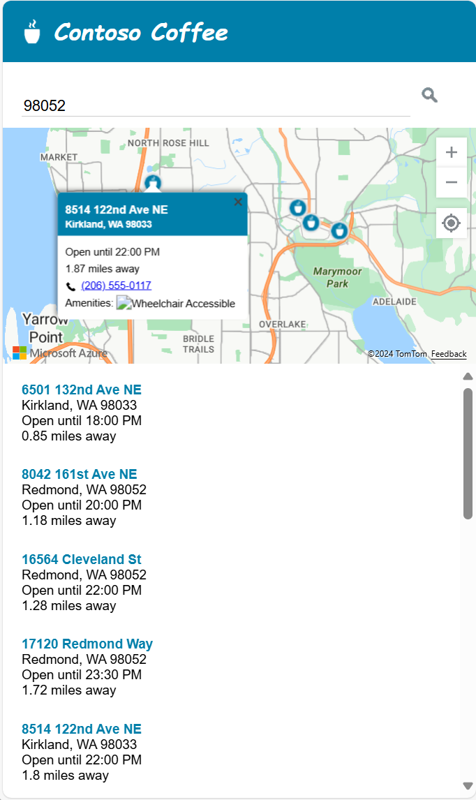

# Tutorial: Use Azure Maps to create a store locator

This tutorial guides you through the process of creating a simple store locator using Azure Maps.

In this tutorial, you'll learn how to:

> [!div class="checklist"]
>
> * Create a new webpage by using the Azure Map Control API.
> * Load custom data from a file and display it on a map.
> * Use the Azure Maps Search service to find an address or enter a query.
> * Get the user's location from the browser and show it on the map.
> * Combine multiple layers to create custom symbols on the map.  
> * Cluster data points.  
> * Add zoom controls to the map.

<a id="Intro"></a>

## Prerequisites

* [Visual Studio Code] is recommended for this tutorial, but you can use any suitable integrated development environment (IDE).
* An [Azure Maps account]
* A [subscription key]

> [!NOTE]
> For more information on authentication in Azure Maps, see [manage authentication in Azure Maps].

## Sample code

This tutorial demonstrates how to create a store locator for a fictional company named *Contoso Coffee*, along with tips to extend the store locator with additional functionality.

To see a live sample of what you're creating in this tutorial, see [Simple Store Locator] on the **Azure Maps Code Samples** site.

To more easily follow and engage this tutorial, download the following resources:

* [Simple Store Locator] source code.
* [Store location data] used to import into the store locator dataset.
* The [Map images].

## Store locator features

This section lists the Azure Maps features that are demonstrated in the Contoso Coffee store locator application created in this tutorial.

### User interface features

* A store logo on the header
* A map that supports panning and zooming
* A **My Location** button to search over the user's current location.
* A Page layout that adjusts based on the width of the devices screen
* A search box and a search button

### Functionality features

* A `keypress` event added to the search box triggers a search when the user presses **Enter**.
* When the map moves, the distance to each location from the center of the map recalculates. The results list updates to display the closest locations at the top of the map.  
* When the user selects a result in the results list, the map is centered over the selected location and information about the location appears in a pop-up window.  
* When the user selects a specific location, the map triggers a pop-up window.
* When the user zooms out, locations are grouped in clusters. Each cluster is represented by a circle with a number inside the circle. Clusters form and separate as the user changes the zoom level.
* Selecting a cluster zooms in two levels on the map and centers over the location of the cluster.

## Store locator design

The following screenshot shows the general layout of the Contoso Coffee store locator application. To view and interact with the live sample, see the [Simple Store Locator] sample application on the **Azure Maps Code Samples** site.

:::image type="content" source="./media/tutorial-create-store-locator/store-locator-wireframe.png" lightbox="./media/tutorial-create-store-locator/store-locator-wireframe.png" alt-text="A screenshot showing the Contoso Coffee store locator Azure Maps sample application.":::

To maximize the usefulness of this store locator, we include a responsive layout that adjusts when a user's screen width is smaller than 700 pixels wide. A responsive layout makes it easy to use the store locator on a small screen, like on a mobile device. Here's a screenshot showing a sample of the small-screen layout:  

:::image type="content" source="./media/tutorial-create-store-locator/store-locator-wireframe-mobile.png" alt-text="A screenshot showing what the Contoso Coffee store locator application looks like on a mobile device.":::

<a id="create a data-set"></a>

## Create the store location dataset

This section describes how to create a dataset of the stores that you want to display on the map. The dataset for the Contoso Coffee locator is created inside an Excel workbook. The dataset contains 10,213 Contoso Coffee coffee shop locations spread across nine countries or regions: the United States, Canada, the United Kingdom, France, Germany, Italy, the Netherlands, Denmark, and Spain. Here's a screenshot of what the data looks like:

:::image type="content" source="./media/tutorial-create-store-locator/store-locator-data-spreadsheet.png" alt-text="Screenshot of the store locator data in an Excel workbook.":::

Download the excel file containing the full dataset for the Contoso Coffee locator sample application from the [data] folder of the _Azure Maps code samples_ repository in GitHub.

From the above screenshot of the data, we can make the following observations:

* Location information is stored in the following six columns: **AddressLine**, **City**, **Municipality** (county), **AdminDivision** (state/province), **PostCode** (postal code), and **Country**.  
* The **Latitude** and **Longitude** columns contain the coordinates for each Contoso Coffee location. If you don't have coordinate information, you can use the [Search service] to determine the location coordinates.
* Some other columns contain metadata that's related to the coffee shops: a phone number, Boolean columns, and store opening and closing times in 24-hour format. The Boolean columns are for Wi-Fi and wheelchair accessibility. You can create your own columns that contain metadata that's more relevant to your location data.

> [!NOTE]
> Azure Maps renders data in the [Spherical Mercator projection] "[EPSG:3857]" but reads data in "[EPSG:4326]" that use the WGS84 datum.

## Load Contoso Coffee shop locator dataset

 The Contoso Coffee shop locator dataset is small, so it can be converted into a tab-delimited text file that the browser downloads when the application loads.

> [!TIP]
> If your dataset is too large for client download, or is updated frequently, you might consider storing your dataset in a database. After your data is loaded into a database, you can then set up a web service that accepts queries for the data, then sends the results to the user's browser.

### Convert data to tab-delimited text file

To convert the Contoso Coffee shop location data from an Excel workbook into a tab-delimited text file:

1. Download the Excel workbook [ContosoCoffee.xlsx] and Open it in Excel.

1. Select **File > Save As...**.

1. In the **Save as type** drop-down list, select **Text (Tab delimited)(*.txt)**.

1. Name the file *ContosoCoffee*.

:::image type="content" source="./media/tutorial-create-store-locator/data-delimited-text.png" alt-text="Screenshot of the Save as type dialog box.":::

If you open the text file in Notepad, it looks similar to the following text:

:::image type="content" source="./media/tutorial-create-store-locator/data-delimited-file.png" alt-text="Screenshot of a Notepad file that shows a tab-delimited dataset.":::

## Set up the project

1. Open [Visual Studio Code], or your choice of development environments.

2. Select **File > Open Workspace...**.

3. Create a new folder named *ContosoCoffee*.

4. Select **ContosoCoffee** in the explorer.

5. Create the following three files that define the layout, style, and logic for the application:

    * *index.html*
    * *index.css*
    * *index.js*

6. Create a folder named *data*.

7. Add the *ContosoCoffee.txt* file that you previously created from the Excel workbook _ContosoCoffee.xlsx_ to the *data* folder.

8. Create another folder named *images*.

9. If you haven't already, download the 10 [Map images] from the images directory in the GitHub Repository and add them to the *images* folder.

    Your workspace folder should now look like the following screenshot:

    :::image type="content" source="./media/tutorial-create-store-locator/store-locator-workspace.png" alt-text="Screenshot of the images folder in the Contoso Coffee directory.":::

## Create the HTML

To create the HTML:

1. Add the following `meta` tags to the `head` of *index.html*:

    ```HTML
    <meta charset="utf-8">
    <meta http-equiv="x-ua-compatible" content="IE=Edge">
    <meta name="viewport" content="width=device-width, initial-scale=1, shrink-to-fit=no">
    ```

2. Add references to the Azure Maps web control JavaScript and CSS files:

    ```HTML
    <!-- Add references to the Azure Maps Map control JavaScript and CSS files. -->
    <link rel="stylesheet" href="https://atlas.microsoft.com/sdk/javascript/mapcontrol/3/atlas.min.css" type="text/css">
    <script src="https://atlas.microsoft.com/sdk/javascript/mapcontrol/3/atlas.min.js"></script>
    ```

3. Next, add a reference to the Azure Maps Services module. This module is a JavaScript library that wraps the Azure Maps REST services, making them easy to use in JavaScript. The Services module is useful for powering search functionality.

    ```HTML
    <!-- Add a reference to the Azure Maps Services Module JavaScript file. -->
    <script src="https://atlas.microsoft.com/sdk/javascript/service/2/atlas-service.min.js"></script>
    ```

4. Add references to *index.js* and *index.css*.

    ```HTML
    <!-- Add references to the store locator JavaScript and CSS files. -->
    <link rel="stylesheet" href="index.css" type="text/css">
    <script src="index.js"></script>
    ```

5. In the body of the document, add a `header` tag. Inside the `header` tag, add the logo and company name.

    ```HTML
    <header>
        
        <span>Contoso Coffee</span>
    </header>
    ```

6. Add a `main` tag and create a search panel that has a text box and search button. Also, add `div` references for the map, the list panel, and the My Location GPS button.

    ```HTML
    <main>
        <div class="searchPanel">
            <div>
                <input id="searchTbx" type="search" placeholder="Find a store" />
                <button id="searchBtn" title="Search"></button>
            </div>
        </div>
        <div id="listPanel"></div>
        <div id="myMap"></div>
        <button id="myLocationBtn" title="My Location"></button>
    </main>
    ```

Once completed, *index.html* should look like [Simple Store Locator.html] in the tutorial sample code.

## Define the CSS styles

The next step is to define the CSS styles. CSS styles define how the application components are laid out and the application's appearance.

1. Open *index.css*.

2. Add the following css code:

    >[!NOTE]
    > The `@media` style defines alternate style options to use when the screen width is smaller than 700 pixels.  

   ```CSS
    html, body {
        padding: 0;
        margin: 0;
        font-family: Gotham, Helvetica, sans-serif;
        overflow-x: hidden;
    } 

    header {
        width: calc(100vw - 10px);
        height: 30px;
        padding: 15px 0 20px 20px;
        font-size: 25px;
        font-style: italic;
        font-family: "Comic Sans MS", cursive, sans-serif;
        line-height: 30px;
        font-weight: bold;
        color: white;
        background-color: #007faa;
    }

    header span {
        vertical-align: middle;
    }

    header img {
        height: 30px;
        vertical-align: middle;
    }

    .searchPanel {
        position: relative;
        width: 350px;
    }

    .searchPanel div {
        padding: 20px;
    }

    .searchPanel input {
        width: calc(100% - 50px);
        font-size: 16px;
        border: 0;
        border-bottom: 1px solid #ccc;
    }

    #listPanel {
        position: absolute;
        top: 135px;
        left: 0px;
        width: 350px;
        height: calc(100vh - 135px);
        overflow-y: auto;
    }

    #myMap { 
        position: absolute;
        top: 65px;
        left: 350px;
        width: calc(100vw - 350px);
        height: calc(100vh - 65px);
    }

    .statusMessage {
        margin: 10px;
    }

    #myLocationBtn, #searchBtn {
        margin: 0;
        padding: 0;
        border: none;
        border-collapse: collapse;
        width: 32px;
        height: 32px; 
        text-align: center;
        cursor: pointer;
        line-height: 32px;
        background-repeat: no-repeat;
        background-size: 20px;
        background-position: center center;
        z-index: 200;
    }

    #myLocationBtn {
        position: absolute;
        top: 150px;
        right: 10px;
        box-shadow: 0px 0px 4px rgba(0,0,0,0.16);
        background-color: white;
        background-image: url("images/GpsIcon.png");
    }

    #myLocationBtn:hover {
        background-image: url("images/GpsIcon-hover.png");
    }

    #searchBtn {
        background-color: transparent;
        background-image: url("images/SearchIcon.png");
    }

    #searchBtn:hover {
        background-image: url("images/SearchIcon-hover.png");
    }

    .listItem {
        height: 50px;
        padding: 20px;
        font-size: 14px;
    }

    .listItem:hover {
        cursor: pointer;
        background-color: #f1f1f1;
    }

    .listItem-title {
        color: #007faa;
        font-weight: bold;
    }

    .storePopup {
        min-width: 150px;
    }

    .storePopup .popupTitle {
        border-top-left-radius: 4px;
        border-top-right-radius: 4px;
        padding: 8px;
        height: 30px;
        background-color: #007faa;
        color: white;
        font-weight: bold;
    }

    .storePopup .popupSubTitle {
        font-size: 10px;
        line-height: 12px;
    }

    .storePopup .popupContent {
        font-size: 11px;
        line-height: 18px;
        padding: 8px;
    }

    .storePopup img {
        vertical-align:middle;
        height: 12px;
        margin-right: 5px;
    }

    /* Adjust the layout of the page when the screen width is fewer than 700 pixels. */
    @media screen and (max-width: 700px) {
        .searchPanel {
            width: 100vw;
        }

        #listPanel {
            top: 385px;
            width: 100%;
            height: calc(100vh - 385px);
        }

        #myMap {
            width: 100vw;
            height: 250px;
            top: 135px;
            left: 0px;
        }

        #myLocationBtn {
            top: 220px;
        }
    }

    .mapCenterIcon {
        display: block;
        width: 10px;
        height: 10px;
        border-radius: 50%;
        background: orange;
        border: 2px solid white;
        cursor: pointer;
        box-shadow: 0 0 0 rgba(0, 204, 255, 0.4);
        animation: pulse 3s infinite;
    }

    @keyframes pulse {
        0% {
            box-shadow: 0 0 0 0 rgba(0, 204, 255, 0.4);
        }

        70% {
            box-shadow: 0 0 0 50px rgba(0, 204, 255, 0);
        }

        100% {
            box-shadow: 0 0 0 0 rgba(0, 204, 255, 0);
        }
    }
   ```

If you run the application at this point, the header, search box, and search button appear. However, the map isn't visible because it hasn't been loaded yet. If you try to do a search, nothing happens. The next section describes adding the JavaScript logic needed to access all the functionality of the store locator.

## Add JavaScript code

The JavaScript code in the Contoso Coffee shop locator app enables the following processes:

1. Adds an [event listener] called `ready` to wait until the page has completed its loading process. When the page loading is complete, the event handler creates more event listeners to monitor the loading of the map, and give functionality to the search and **My location** buttons.

2. When the user selects the search button, or types a location in the search box then presses enter, a fuzzy search against the user's query begins. The code passes in an array of country/region ISO 2 values to the `countrySet` option to limit the search results to those countries/regions. Limiting the countries/regions to search helps increase the accuracy of the results that are returned.
  
3. Once the search completes, the first location result is used as the center focus of the map. When the user selects the My Location button, the code retrieves the user's location using the *HTML5 Geolocation API* that's built into the browser. Once the location is retrieved, the code centers the map over the user's location.  

To add the JavaScript:

1. Open *index.js*.

2. Add global options to make settings easier to update. Define the variables for the map, pop up window, data source, icon layer, and HTML marker. Set the HTML marker to indicate the center of a search area. And, define an instance of the Azure Maps search service client.

    ```JavaScript
    //The maximum zoom level to cluster data point data on the map.
    var maxClusterZoomLevel = 11;
    
    //The URL to the store location data.
    var storeLocationDataUrl = 'data/ContosoCoffee.txt';
    
    //The URL to the icon image. 
    var iconImageUrl = 'images/CoffeeIcon.png';
    
    //An array of country region ISO2 values to limit searches to.
    var countrySet = ['US', 'CA', 'GB', 'FR','DE','IT','ES','NL','DK'];      
    
    //
    var map, popup, datasource, iconLayer, centerMarker, searchURL;

    // Used in function updateListItems
    var listItemTemplate = '<div class="listItem" onclick="itemSelected(\'{id}\')"><div class="listItem-title">{title}</div>{city}<br />Open until {closes}<br />{distance} miles away</div>';

    ```

3. Add the following initialization code. Make sure to replace `<Your Azure Maps Key>` with your Azure Maps subscription key.

   > [!Tip]
   > When you use pop-up windows, it's best to create a single `Popup` instance and reuse the instance by updating its content and position. For every `Popup`instance you add to your code, multiple DOM elements are added to the page. The more DOM elements there are on a page, the more things the browser has to keep track of. If there are too many items, the browser might become slow.

    ```JavaScript

    function initialize() {
        //Initialize a map instance.
        map = new atlas.Map('myMap', {
            center: [-90, 40],
            zoom: 2,

            //Add your Azure Maps subscription key to the map SDK.
            authOptions: {
                authType: 'subscriptionKey',
                subscriptionKey: '<Your Azure Maps Key>'
            }
        });

        //Create a pop-up window, but leave it closed so we can update it and display it later.
        popup = new atlas.Popup();

        //Use MapControlCredential to share authentication between a map control and the service module.
        var pipeline = atlas.service.MapsURL.newPipeline(new atlas.service.MapControlCredential(map));

        //Create an instance of the SearchURL client.
        searchURL = new atlas.service.SearchURL(pipeline);

        //If the user selects the search button, geocode the value the user passed in.
        document.getElementById('searchBtn').onclick = performSearch;

        //If the user presses Enter in the search box, perform a search.
        document.getElementById('searchTbx').onkeyup = function(e) {
            if (e.keyCode === 13) {
                performSearch();
            }
        };

        //If the user selects the My Location button, use the Geolocation API to get the user's location. Center and zoom the map on that location.
        document.getElementById('myLocationBtn').onclick = setMapToUserLocation;

        //Wait until the map resources are ready.
        map.events.add('ready', function() {

            //Add your maps post load functionality.

        });
    }

    function performSearch() {
        var query = document.getElementById('searchTbx').value;

        //Perform a fuzzy search on the users query.
        searchURL.searchFuzzy(atlas.service.Aborter.timeout(3000), query, {
            //Pass in the array of country/region ISO2 for which we want to limit the search to.
            countrySet: countrySet,
            view: 'Auto'
        }).then(results => {
            //Parse the response into GeoJSON so that the map can understand.
            var data = results.geojson.getFeatures();

            if (data.features.length > 0) {
                //Set the camera to the bounds of the results.
                map.setCamera({
                    bounds: data.features[0].bbox,
                    padding: 40
                });
            } else {
                document.getElementById('listPanel').innerHTML = '<div class="statusMessage">Unable to find the location you searched for.</div>';
            }
        });
    }

    function setMapToUserLocation() {
        //Request the user's location.
        navigator.geolocation.getCurrentPosition(function(position) {
            //Convert the geolocation API position into a longitude/latitude position value the map can understand and center the map over it.
            map.setCamera({
                center: [position.coords.longitude, position.coords.latitude],
                zoom: maxClusterZoomLevel + 1
            });
        }, function(error) {
            //If an error occurs when trying to access the users position information, display an error message.
            switch (error.code) {
                case error.PERMISSION_DENIED:
                    alert('User denied the request for geolocation.');
                    break;
                case error.POSITION_UNAVAILABLE:
                    alert('Position information is unavailable.');
                    break;
                case error.TIMEOUT:
                    alert('The request to get user position timed out.');
                    break;
                case error.UNKNOWN_ERROR:
                    alert('An unknown error occurred.');
                    break;
            }
        });
    }

    //Initialize the application when the page is loaded.
    window.onload = initialize;
    ```

4. In the map's `ready` event handler, add a zoom control and an HTML marker to display the center of a search area.

    ```JavaScript
    //Add a zoom control to the map.
    map.controls.add(new atlas.control.ZoomControl(), {
        position: 'top-right'
    });

    //Add an HTML marker to the map to indicate the center to use for searching.
    centerMarker = new atlas.HtmlMarker({
        htmlContent: '<div class="mapCenterIcon"></div>',
        position: map.getCamera().center
    });

    map.markers.add(centerMarker);
    ```

5. In the map's `ready` event handler, add a data source. Then, make a call to load and parse the dataset. Enable clustering on the data source. Clustering on the data source groups overlapping points together in a cluster. As the user zooms in, the clusters separate into individual points. This behavior provides a better user experience and improves performance.

    ```JavaScript
    //Create a data source, add it to the map, and then enable clustering.
    datasource = new atlas.source.DataSource(null, {
        cluster: true,
        clusterMaxZoom: maxClusterZoomLevel - 1
    });

    map.sources.add(datasource);

    //Load all the store data now that the data source has been defined.  
    loadStoreData();
    ```

6. After the dataset loads in the map's `ready` event handler, define a set of layers to render the data. A bubble layer renders clustered data points. A symbol layer renders the number of points in each cluster above the bubble layer. A second symbol layer renders a custom icon for individual locations on the map.

   Add `mouseover` and `mouseout` events to the bubble and icon layers to change the mouse cursor when the user hovers over a cluster or icon on the map. Add a `click` event to the cluster bubble layer. This `click` event zooms in the map two levels and centers the map over a cluster when the user selects any cluster. Add a `click` event to the icon layer. This `click` event displays a pop-up window that shows the details of a coffee shop when a user selects an individual location icon. Add an event to the map to monitor when the map is finished moving. When this event fires, update the items in the list panel.  

    ```JavaScript
    //Create a bubble layer to render clustered data points.
    var clusterBubbleLayer = new atlas.layer.BubbleLayer(datasource, null, {
        radius: 12,
        color: '#007faa',
        strokeColor: 'white',
        strokeWidth: 2,
        filter: ['has', 'point_count'] //Only render data points that have a point_count property; clusters have this property.
    });

    //Create a symbol layer to render the count of locations in a cluster.
    var clusterLabelLayer = new atlas.layer.SymbolLayer(datasource, null, {
        iconOptions: {
            image: 'none' //Hide the icon image.
        },

        textOptions: {
            textField: ['get', 'point_count_abbreviated'],
            size: 12,
            font: ['StandardFont-Bold'],
            offset: [0, 0.4],
            color: 'white'
        }
    });

    map.layers.add([clusterBubbleLayer, clusterLabelLayer]);

    //Load a custom image icon into the map resources.
    map.imageSprite.add('myCustomIcon', iconImageUrl).then(function() {

       //Create a layer to render a coffee cup symbol above each bubble for an individual location.
       iconLayer = new atlas.layer.SymbolLayer(datasource, null, {
           iconOptions: {
               //Pass in the ID of the custom icon that was loaded into the map resources.
               image: 'myCustomIcon',

               //Optionally, scale the size of the icon.
               font: ['SegoeUi-Bold'],

               //Anchor the center of the icon image to the coordinate.
               anchor: 'center',

               //Allow the icons to overlap.
               allowOverlap: true
           },

           filter: ['!', ['has', 'point_count']] //Filter out clustered points from this layer.
       });

       map.layers.add(iconLayer);

       //When the mouse is over the cluster and icon layers, change the cursor to a pointer.
       map.events.add('mouseover', [clusterBubbleLayer, iconLayer], function() {
           map.getCanvasContainer().style.cursor = 'pointer';
       });

       //When the mouse leaves the item on the cluster and icon layers, change the cursor back to the default (grab).
       map.events.add('mouseout', [clusterBubbleLayer, iconLayer], function() {
           map.getCanvasContainer().style.cursor = 'grab';
       });

       //Add a click event to the cluster layer. When the user selects a cluster, zoom into it by two levels.  
       map.events.add('click', clusterBubbleLayer, function(e) {
           map.setCamera({
               center: e.position,
               zoom: map.getCamera().zoom + 2
           });
       });

       //Add a click event to the icon layer and show the shape that was selected.
       map.events.add('click', iconLayer, function(e) {
           showPopup(e.shapes[0]);
       });

       //Add an event to monitor when the map has finished rendering.
       map.events.add('render', function() {
           //Update the data in the list.
           updateListItems();
       });
    });
    ```

7. When the coffee shop dataset is needed, it must first be downloaded. Once downloaded, the file must be split into lines. The first line contains the header information. To make the code easier to follow, we parse the header into an object, which we can then use to look up the cell index of each property. After the first line, loop through the remaining lines and create a point feature. Add the point feature to the data source. Finally, update the list panel.

    ```JavaScript
    function loadStoreData() {

    //Download the store location data.
    fetch(storeLocationDataUrl)
        .then(response => response.text())
        .then(function(text) {

            //Parse the tab-delimited file data into GeoJSON features.
            var features = [];

            //Split the lines of the file.
            var lines = text.split('\n');

            //Grab the header row.
            var row = lines[0].split('\t');

            //Parse the header row and index each column to make the code for parsing each row easier to follow.
            var header = {};
            var numColumns = row.length;
            for (var i = 0; i < row.length; i++) {
                header[row[i]] = i;
            }

            //Skip the header row and then parse each row into a GeoJSON feature.
            for (var i = 1; i < lines.length; i++) {
                row = lines[i].split('\t');

                //Ensure that the row has the correct number of columns.
                if (row.length >= numColumns) {

                    features.push(new atlas.data.Feature(new atlas.data.Point([parseFloat(row[header['Longitude']]), parseFloat(row[header['Latitude']])]), {
                        AddressLine: row[header['AddressLine']],
                        City: row[header['City']],
                        Municipality: row[header['Municipality']],
                        AdminDivision: row[header['AdminDivision']],
                        Country: row[header['Country']],
                        PostCode: row[header['PostCode']],
                        Phone: row[header['Phone']],
                        StoreType: row[header['StoreType']],
                        IsWiFiHotSpot: (row[header['IsWiFiHotSpot']].toLowerCase() === 'true') ? true : false,
                        IsWheelchairAccessible: (row[header['IsWheelchairAccessible']].toLowerCase() === 'true') ? true : false,
                        Opens: parseInt(row[header['Opens']]),
                        Closes: parseInt(row[header['Closes']])
                    }));
                }
            }

            //Add the features to the data source.
            datasource.add(new atlas.data.FeatureCollection(features));

            //Initially, update the list items.
            updateListItems();
        });
    }
    ```

8. When the list panel is updated, the distance is calculated. This distance is from the center of the map to all point features in the current map view. The features are then sorted by distance. HTML is generated to display each location in the list panel.

    ```JavaScript
    var listItemTemplate = '<div class="listItem" onclick="itemSelected(\'{id}\')"><div class="listItem-title">{title}</div>{city}<br />Open until {closes}<br />{distance} miles away</div>';

    function updateListItems() {
        //Hide the center marker.
        centerMarker.setOptions({
            visible: false
        });

        //Get the current camera and view information for the map.
        var camera = map.getCamera();
        var listPanel = document.getElementById('listPanel');

        //Check to see if the user is zoomed out a substantial distance. If they are, tell them to zoom in and to perform a search or select the My Location button.
        if (camera.zoom < maxClusterZoomLevel) {
            //Close the pop-up window; clusters might be displayed on the map.  
            popup.close(); 
            listPanel.innerHTML = '<div class="statusMessage">Search for a location, zoom the map, or select the My Location button to see individual locations.</div>';
        } else {
            //Update the location of the centerMarker property.
            centerMarker.setOptions({
                position: camera.center,
                visible: true
            });

            //List the ten closest locations in the side panel.
            var html = [], properties;

            /*
            Generating HTML for each item that looks like this:
            <div class="listItem" onclick="itemSelected('id')">
                <div class="listItem-title">1 Microsoft Way</div>
                Redmond, WA 98052<br />
                Open until 9:00 PM<br />
                0.7 miles away
            </div>
            */

            //Get all the shapes that have been rendered in the bubble layer. 
            var data = map.layers.getRenderedShapes(map.getCamera().bounds, [iconLayer]);

            //Create an index of the distances of each shape.
            var distances = {};

            data.forEach(function (shape) {
                if (shape instanceof atlas.Shape) {

                    //Calculate the distance from the center of the map to each shape and store in the index. Round to 2 decimals.
                    distances[shape.getId()] = Math.round(atlas.math.getDistanceTo(camera.center, shape.getCoordinates(), 'miles') * 100) / 100;
                }
            });

            //Sort the data by distance.
            data.sort(function (x, y) {
                return distances[x.getId()] - distances[y.getId()];
            });

            data.forEach(function(shape) {
                properties = shape.getProperties();
                html.push('<div class="listItem" onclick="itemSelected(\'', shape.getId(), '\')"><div class="listItem-title">',
                properties['AddressLine'],
                '</div>',
                //Get a formatted addressLine2 value that consists of City, Municipality, AdminDivision, and PostCode.
                getAddressLine2(properties),
                '<br />',

                //Convert the closing time to a format that is easier to read.
                getOpenTillTime(properties),
                '<br />',

                //Get the distance of the shape.
                distances[shape.getId()],
                ' miles away</div>');
            });

            listPanel.innerHTML = html.join('');

            //Scroll to the top of the list panel in case the user has scrolled down.
            listPanel.scrollTop = 0;
        }
    }

    //This converts a time that's in a 24-hour format to an AM/PM time or noon/midnight string.
    function getOpenTillTime(properties) {
        var time = properties['Closes'];
        var t = time / 100;
        var sTime;

        if (time === 1200) {
            sTime = 'noon';
        } else if (time === 0 || time === 2400) {
            sTime = 'midnight';
        } else {
            sTime = Math.round(t) + ':';

            //Get the minutes.
            t = (t - Math.round(t)) * 100;

            if (t === 0) {
                sTime += '00';
            } else if (t < 10) {
                sTime += '0' + t;
            } else {
                sTime += Math.round(t);
            }

            if (time < 1200) {
                sTime += ' AM';
            } else {
                sTime += ' PM';
            }
        }

        return 'Open until ' + sTime;
    }

    //Create an addressLine2 string that contains City, Municipality, AdminDivision, and PostCode.
    function getAddressLine2(properties) {
        var html = [properties['City']];

        if (properties['Municipality']) {
            html.push(', ', properties['Municipality']);
        }

        if (properties['AdminDivision']) {
            html.push(', ', properties['AdminDivision']);
        }

        if (properties['PostCode']) {
            html.push(' ', properties['PostCode']);
        }

        return html.join('');
    }
    ```

9. When the user selects an item in the list panel, the shape to which the item is related is retrieved from the data source. A pop-up window is generated that's based on the property information stored in the shape. The map centers over the shape. If the map is fewer than 700 pixels wide, the map view is offset so the pop-up window is visible.

    ```JavaScript
    //When a user selects a result in the side panel, look up the shape by its ID value and display the pop-up window.
    function itemSelected(id) {
        //Get the shape from the data source by using its ID.  
        var shape = datasource.getShapeById(id);
        showPopup(shape);

        //Center the map over the shape on the map.
        var center = shape.getCoordinates();
        var offset;

        //If the map is fewer than 700 pixels wide, then the layout is set for small screens.
        if (map.getCanvas().width < 700) {
            //When the map is small, offset the center of the map relative to the shape so that there is room for the popup to appear.
            offset = [0, -80];
        }

        map.setCamera({
            center: center,
            centerOffset: offset
        });
    }

    function showPopup(shape) {
        var properties = shape.getProperties();

        /* Generating HTML for the pop-up window that looks like this:

            <div class="storePopup">
                <div class="popupTitle">
                    3159 Tongass Avenue
                    <div class="popupSubTitle">Ketchikan, AK 99901</div>
                </div>
                <div class="popupContent">
                    Open until 22:00 PM<br/>
                    
                    <a href="tel:1-800-XXX-XXXX">1-800-XXX-XXXX</a>
                    <br>Amenities:
                    
                    
                </div>
            </div>
        */

         //Calculate the distance from the center of the map to the shape in miles, round to 2 decimals.
        var distance = Math.round(atlas.math.getDistanceTo(map.getCamera().center, shape.getCoordinates(), 'miles') * 100)/100;

        var html = ['<div class="storePopup">'];
        html.push('<div class="popupTitle">',
            properties['AddressLine'],
            '<div class="popupSubTitle">',
            getAddressLine2(properties),
            '</div></div><div class="popupContent">',

            //Convert the closing time to a format that's easier to read.
            getOpenTillTime(properties),

            //Add the distance information.  
            '<br/>', distance,
            ' miles away',
            '<br /><a href="tel:',
            properties['Phone'],
            '">',  
            properties['Phone'],
            '</a>'
        );

        if (properties['IsWiFiHotSpot'] || properties['IsWheelchairAccessible']) {
            html.push('<br/>Amenities: ');

            if (properties['IsWiFiHotSpot']) {
                html.push('');
            }

            if (properties['IsWheelchairAccessible']) {
                html.push('');
            }
        }

        html.push('</div></div>');

        //Update the content and position of the pop-up window for the specified shape information.
        popup.setOptions({

            //Create a table from the properties in the feature.
            content:  html.join(''),
            position: shape.getCoordinates()
        });

        //Open the pop-up window.
        popup.open(map);
    }
    ```

Now, you have a fully functional store locator. Open the *index.html* file in a web browser. When the clusters appear on the map, you can search for a location using any of the following methods:

1. The search box.
1. Selecting the My Location button
1. Selecting a cluster
1. Zooming in on the map to see individual locations.

The first time a user selects the My Location button, the browser displays a security warning that asks for permission to access the user's location. If the user agrees to share their location, the map zooms in on the user's location, and nearby coffee shops are shown.


When you zoom in close enough in an area that has coffee shop locations, the clusters separate into individual locations. Select one of the icons on the map or select an item in the side panel to see a pop-up window. The pop-up shows information for the selected location.

:::image type="content" source="./media/tutorial-create-store-locator/finished-simple-store-locator.png" lightbox="./media/tutorial-create-store-locator/finished-simple-store-locator.png" alt-text="Screenshot of the finished store locator.":::

If you resize the browser window to fewer than 700 pixels wide or open the application on a mobile device, the layout changes to be better suited for smaller screens.



In this tutorial, you learned how to create a basic store locator by using Azure Maps. The store locator you create in this tutorial might have all the functionality you need. You can add features to your store locator or use more advance features for a more custom user experience:

* Enable [suggestions as you type] in the search box.  
* Add [support for multiple languages].
* Allow the user to [filter locations along a route].
* Add the ability to [set filters].
* Add support to specify an initial search value by using a query string. When you include this option in your store locator, users are then able to bookmark and share searches. It  also provides an easy method for you to pass searches to this page from another page.  
* Deploy your store locator as an [Azure App Service Web App].
* Store your data in a database and search for nearby locations. To learn more, see the [SQL Server spatial data types overview] and [Query spatial data for the nearest neighbor].

## Additional information

* For the completed code, see the [Simple Store Locator tutorial on GitHub].
* To view this sample live, see [Simple Store Locator] on the **Azure Maps Code Samples** site.
* learn more about the coverage and capabilities of Azure Maps by using [Zoom levels and tile grid].
* You can also [Use data-driven style expressions] to apply to your business logic.

## Next steps

To see more code examples and an interactive coding experience:

> [!div class="nextstepaction"]
> [How to use the map control](how-to-use-map-control.md)

[Azure Maps account]: quick-demo-map-app.md#create-an-azure-maps-account
[subscription key]: quick-demo-map-app.md#get-the-subscription-key-for-your-account
[Manage authentication in Azure Maps]: how-to-manage-authentication.md
[Visual Studio Code]: https://code.visualstudio.com
[Simple Store Locator]: https://samples.azuremaps.com/?sample=simple-store-locator
[Simple Store Locator tutorial on GitHub]: https://github.com/Azure-Samples/AzureMapsCodeSamples/tree/master/Samples/Tutorials/Simple%20Store%20Locator
[Simple Store Locator.html]: https://github.com/Azure-Samples/AzureMapsCodeSamples/blob/master/Samples/Tutorials/Simple%20Store%20Locator/Simple%20Store%20Locator.html

[data]: https://github.com/Azure-Samples/AzureMapsCodeSamples/tree/master/Samples/Tutorials/Simple%20Store%20Locator/data
[Search service]: /rest/api/maps/search
[Spherical Mercator projection]: glossary.md#spherical-mercator-projection
[EPSG:3857]: https://epsg.io/3857
[EPSG:4326]: https://epsg.io/4326
[ContosoCoffee.xlsx]: https://github.com/Azure-Samples/AzureMapsCodeSamples/tree/master/Samples/Tutorials/Simple%20Store%20Locator/data
[Map images]: https://github.com/Azure-Samples/AzureMapsCodeSamples/tree/master/Samples/Tutorials/Simple%20Store%20Locator/images
[event listener]: /javascript/api/azure-maps-control/atlas.map#events
[suggestions as you type]: https://samples.azuremaps.com/?sample=search-autosuggest-and-jquery-ui
[support for multiple languages]: https://samples.azuremaps.com/?sample=map-localization
[filter locations along a route]: https://samples.azuremaps.com/?sample=filter-data-along-route
[set filters]: https://samples.azuremaps.com/?sample=filter-symbols-by-property
[Azure App Service Web App]: ../app-service/quickstart-html.md
[SQL Server spatial data types overview]: /sql/relational-databases/spatial/spatial-data-types-overview?preserve-view=true&view=sql-server-2017
[Query spatial data for the nearest neighbor]: /sql/relational-databases/spatial/query-spatial-data-for-nearest-neighbor?preserve-view=true&view=sql-server-2017
[Zoom levels and tile grid]: zoom-levels-and-tile-grid.md
[Use data-driven style expressions]: data-driven-style-expressions-web-sdk.md
[Store location data]: https://github.com/Azure-Samples/AzureMapsCodeSamples/tree/master/Samples/Tutorials/Simple%20Store%20Locator/data
