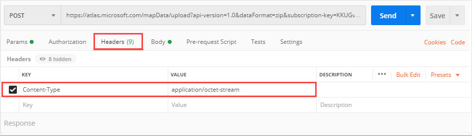

# Tutorial: Use Creator to create indoor maps

This tutorial shows you how to create indoor maps. In this tutorial, you'll learn how to use the API to:

> [!div class="checklist"]
> * Upload your indoor map Drawing package
> * Convert your Drawing package into map data
> * Create a dataset from your map data
> * Create a tileset from the data in your dataset
> * Query the  Azure Maps Web Feature Service (WFS) API to learn about your map features
> * Create a feature stateset by using your map features and the data in your dataset
> * Update your feature stateset

## Prerequisites

To create indoor maps:

1. [Make an Azure Maps account](quick-demo-map-app.md#create-an-azure-maps-account)
2. [Obtain a primary subscription key](quick-demo-map-app.md#get-the-primary-key-for-your-account), also known as the primary key or the subscription key.
3. [Create a Creator resource](how-to-manage-creator.md)
4. Download the [Sample Drawing package](https://github.com/Azure-Samples/am-creator-indoor-data-examples/blob/master/Sample%20-%20Contoso%20Drawing%20Package.zip).

This tutorial uses the [Postman](https://www.postman.com/) application, but you may choose a different API development environment.

>[!IMPORTANT]
> The API urls in this document may have to be adjusted according to the location of your Creator resource. For more details, see [Access to Creator Services](how-to-manage-creator.md#access-to-creator-services).

## Upload a Drawing package

Use the [Data Upload API](/rest/api/maps/data/uploadpreview) to upload the Drawing package to Azure Maps resources.

The Data Upload API is a long running transaction that implements the pattern defined here. Once the operation completes, we'll use the `udid` to access the uploaded package to convert it. Follow the steps below to obtain the `udid`.

1. Open the Postman app. Near the top of the Postman app, select **New**. In the **Create New** window, select **Collection**.  Name the collection and select the **Create** button.

2. To create the request, select **New** again. In the **Create New** window, select **Request**. Enter a **Request name** for the request. Select the collection you created in the previous step, and then select **Save**.

3. Select the **POST** HTTP method in the builder tab and enter the following URL to upload the Drawing package to the Azure Maps service. For this request, and other requests mentioned in this article, replace `{Azure-Maps-Primary-Subscription-key}` with your primary subscription key.

    ```http
    https://atlas.microsoft.com/mapData/upload?api-version=1.0&dataFormat=zip&subscription-key={Azure-Maps-Primary-Subscription-key}
    ```

4. In the **Headers** tab, specify a value for the `Content-Type` key. The Drawing package is a zipped folder, so use the `application/octet-stream` value. In the **Body** tab, select **binary**. Click on **Select File** and choose a Drawing package.

     

5. Click the blue **Send** button and wait for the request to process. Once the request completes, go to the **Headers** tab of the response. Copy the value of the **Location** key, which is the `status URL`.

6. To check the status of the API call, create a **GET** HTTP request on the `status URL`. You'll need to append your primary subscription key to the URL for authentication. The **GET** request should look like the following URL:

    ```http
    https://atlas.microsoft.com/mapData/operations/<operationId>?api-version=1.0&subscription-key={Azure-Maps-Primary-Subscription-key}
    ```

7. When the **GET** HTTP request completes successfully, it will return a `resourceLocation`. The `resourceLocation` contains the unique `udid` for the uploaded content. Optionally, you can use the `resourceLocation` URL to retrieve metadata from this resource in the next step.

    ```json
    {
        "status": "Succeeded",
        "resourceLocation": "https://atlas.microsoft.com/mapData/metadata/{udid}?api-version=1.0"
    }
    ```

8. To retrieve content metadata, create a **GET** HTTP request on the `resourceLocation` URL that was retrieved in step 7. Make sure to append your primary subscription key to the URL for authentication. The **GET** request should like the following URL:

    ```http
   https://atlas.microsoft.com/mapData/metadata/{udid}?api-version=1.0&subscription-key={Azure-Maps-Primary-Subscription-key}
    ```

9. When the **GET** HTTP request completes successfully, the response body will contain the `udid` specified in the `resourceLocation` of step 7, the location to access/download the content in the future, and some other metadata about the content like created/updated date, size, and so on. An example of the overall response is:

    ```json
    {
        "udid": "{udid}",
        "location": "https://atlas.microsoft.com/mapData/{udid}?api-version=1.0",
        "created": "2020-02-03T02:32:25.0509366+00:00",
        "updated": "2020-02-11T06:12:13.0309351+00:00",
        "sizeInBytes": 766,
        "uploadStatus": "Completed"
    }
    ```

## Convert a Drawing package

 Now that the Drawing package is uploaded, we'll use `udid` for the uploaded package to convert the package into map data. The Conversion API uses a long running transaction that implements the pattern defined [here](creator-long-running-operation.md). Once the operation completes, we'll use the `conversionId` to access the converted data. Follow the steps below to obtain the `conversionId`.

1. Select **New**. In the **Create New** window, select **Request**. Enter a **Request name** and select a collection. Click **Save**.

2. Select the **POST** HTTP method in the builder tab and enter the following URL to convert your uploaded Drawing package into map data. Use the `udid` for the uploaded package.

    ```http
    https://atlas.microsoft.com/conversion/convert?subscription-key={Azure-Maps-Primary-Subscription-key}&api-version=1.0&udid={udid}&inputType=DWG
    ```

    >[!IMPORTANT]
    > The API urls in this document may have to be adjusted according to the location of your Creator resource. For more details, see [Access to Creator Services](how-to-manage-creator.md#access-to-creator-services).

3. Click the **Send** button and wait for the request to process. Once the request completes, go to the **Headers** tab of the response, and look for the **Location** key. Copy the value of the **Location** key, which is the `status URL` for the conversion request. You will use this in the next step.

    :::image type="content" source="./media/tutorial-creator-indoor-maps/copy-location-uri-dialog.png" border="true" alt-text="Copy the value of the location key":::

4. Start a new **GET** HTTP method in the builder tab. Append your Azure Maps primary subscription key to the `status URL`. Make a **GET** request at the `status URL` that you copied in step 3. The `status URL` looks like the following URL:

    ```http
    https://atlas.microsoft.com/conversion/operations/<operationId>?api-version=1.0&subscription-key={Azure-Maps-Primary-Subscription-key}
    ```

    If the conversion process hasn't yet completed, you may see something like the following JSON response:

    ```json
    {
        "operationId": "<operationId>",
        "created": "2020-04-22T19:39:54.9518496+00:00",
        "status": "Running"
    }
    ```

5. Once the request completes successfully, you'll see a success status message in the response body.  Copy the `conversionId` from the `resourceLocation` URL for the converted package. The `conversionId` is used by other API to access the converted map data.

    ```json
   {
        "operationId": "<operationId>",
        "created": "2020-04-22T19:39:54.9518496+00:00",
        "status": "Succeeded",
        "resourceLocation": "https://atlas.microsoft.com/conversion/{conversionId}?api-version=1.0",
        "properties": {}
    }
    ```

>[!NOTE]
>The Postman application does not natively support HTTP Long Running Requests. As a result, you may notice a long delay while making a **GET** request at the status URL.  Wait about thirty seconds and try clicking the **Send** button again until the response shows success or fail.

The sample Drawing package should be converted without errors or warnings. However, if you receive errors or warnings from your own Drawing package, the JSON response will give you a link to the [Drawing error visualizer](drawing-error-visualizer.md). The Drawing Error visualizer allows you to inspect the details of errors and warnings. To receive recommendations on how to resolve conversion errors and warnings, see the [Drawing conversion errors and warnings](drawing-conversion-error-codes.md).

```json
{
    "operationId": "<operationId>",
    "created": "2020-04-22T19:39:54.9518496+00:00",
    "status": "Failed",
    "resourceLocation": "https://atlas.microsoft.com/conversion/{conversionId}?api-version=1.0",
    "properties": {
        "diagnosticPackageLocation": "https://atlas.microsoft.com/mapData/ce61c3c1-faa8-75b7-349f-d863f6523748?api-version=1.0"
    }
}
```

## Create a dataset

The dataset is a collection of map features, such as buildings, levels, and rooms. To create a dataset, use the [Dataset Create API](/rest/api/maps/dataset/createpreview). The dataset Create API takes the `conversionId` for the converted Drawing package and returns a `datasetId` of the created dataset. The steps below show you how to create a dataset.

1. In the Postman application, select **New**. In the **Create New** window, select **Request**. Enter a **Request name** and select a collection. Click **Save**

2. Make a **POST** request to the [Dataset Create API](/rest/api/maps/dataset/createpreview) to create a new dataset. Before submitting the request, append both your subscription key and the `conversionId` with the `conversionId` obtained during the Conversion process in step 5.  The request should look like the following URL:

    ```http
    https://atlas.microsoft.com/dataset/create?api-version=1.0&conversionID={conversionId}&type=facility&subscription-key={Azure-Maps-Primary-Subscription-key}
    ```

3. Obtain the `statusURL` in the **Location** key of the response **Headers**.

4. Make a **GET** request at the `statusURL` to obtain the `datasetId`. Append your Azure Maps primary subscription key for authentication. The request should look like the following URL:

    ```http
    https://atlas.microsoft.com/dataset/operations/<operationId>?api-version=1.0&subscription-key={Azure-Maps-Primary-Subscription-key}
    ```

5. When the **GET** HTTP request completes successfully, the response header will contain the `datasetId` for the created dataset. Copy the `datasetId`. You'll need to use the `datasetId` to create a tileset.

    ```json
    {
        "operationId": "<operationId>",
        "created": "2020-04-22T19:52:38.9352189+00:00",
        "status": "Succeeded",
        "resourceLocation": "https://azure.microsoft.com/dataset/{datasetiId}?api-version=1.0"
     }
    ```

## Create a tileset

A tileset is a set of vector tiles that render on the map. Tilesets are created from existing datasets. However, a tileset is independent from the dataset from which it was sourced. If the dataset is deleted, the tileset will continue to exist. To create a tileset, follow the steps below:

1. In the Postman application, select **New**. In the **Create New** window, select **Request**. Enter a **Request name** and select a collection. Click **Save**

2. Make a **POST** request in the builder tab. The request URL should look like the following URL:

    ```http
    https://atlas.microsoft.com/tileset/create/vector?api-version=1.0&datasetID={datasetId}&subscription-key={Azure-Maps-Primary-Subscription-key}
    ```

3. Make a **GET** request at the `statusURL` for the tileset. Append your Azure Maps primary subscription key for authentication. The request should look like the following URL:

   ```http
    https://atlas.microsoft.com/tileset/operations/<operationId>?api-version=1.0&subscription-key={Azure-Maps-Primary-Subscription-key}
    ```

4. When the **GET** HTTP request completes successfully, the response header will contain the `tilesetId` for the created tileset. Copy the `tilesetId`.

    ```json
    {
        "operationId": "<operationId>",
        "createdDateTime": "3/11/2020 8:45:13 PM +00:00",
        "status": "Succeeded",
        "resourceLocation": "https://atlas.microsoft.com/tileset/{tilesetId}?api-version=1.0"
    }
    ```

## Query datasets with WFS API

 Datasets can be queried using  [WFS API](/rest/api/maps/wfs). With the WFS API you can query for feature collections, a specific collection, or a specific feature with a feature **ID**. The feature **ID** uniquely identifies the feature within the dataset. It's used, for example, to identify which feature state should be updated in a given stateset.

1. In the Postman application, select **New**. In the **Create New** window, select **Request**. Enter a **Request name** and select a collection. Click **Save**

2. Make a **GET** request to view a list of the collections in your dataset. Replace `<dataset-id>` with your `datasetId`. Use your Azure Maps primary key instead of the placeholder. The request should look like the following URL:

    ```http
    https://atlas.microsoft.com/wfs/datasets/{datasetId}/collections?subscription-key={Azure-Maps-Primary-Subscription-key}&api-version=1.0
    ```

3. The response body will be delivered in GeoJSON format and will contain all collections in the dataset. For simplicity, the example here only shows the `unit` collection. To see an example that contains all collections, see [WFS Describe Collections API](/rest/api/maps/wfs/collectiondescriptionpreview). To learn more about any collection, you can click on any of the URLs inside the `link` element.

    ```json
    {
    "collections": [
        {
            "name": "unit",
            "description": "A physical and non-overlapping area which might be occupied and traversed by a navigating agent. Can be a hallway, a room, a courtyard, etc. It is surrounded by physical obstruction (wall), unless the is_open_area attribute is equal to true, and one must add openings where the obstruction shouldn't be there. If is_open_area attribute is equal to true, all the sides are assumed open to the surroundings and walls are to be added where needed. Walls for open areas are represented as a line_element or area_element with is_obstruction equal to true.",
            "links": [
                {
                    "href": "https://atlas.microsoft.com/wfs/datasets/{datasetId}/collections/unit/definition?api-version=1.0",
                    "rel": "describedBy",
                    "title": "Metadata catalogue for unit"
                },
                {
                    "href": "https://atlas.microsoft.com/wfs/datasets/{datasetId}/collections/unit/items?api-version=1.0",
                    "rel": "data",
                    "title": "unit"
                }
                {
                    "href": "https://atlas.microsoft.com/wfs/datasets/{datasetId}/collections/unit?api-version=1.0",
                    "rel": "self",
                    "title": "Metadata catalogue for unit"
                }
            ]
        },
    ```

4. Make a **GET** request for the `unit` feature collections.  Replace `{datasetId}` with your `datasetId`. Use your Azure Maps primary key instead of the placeholder. The response body will contain all the features of the `unit` collection. The request should look like the following URL:

    ```http
    https://atlas.microsoft.com/wfs/datasets/{datasetId}/collections/unit/items?subscription-key={Azure-Maps-Primary-Subscription-key}&api-version=1.0
    ```

5. Copy the feature `id` for a unit feature that has style properties that can be dynamically modified.  Because the unit occupancy status and temperature can be dynamically updated, we'll use this feature `id` in the next section. In the following example, the feature `id` is "UNIT26". we'll refer to the style properties of this feature as states, and we'll use the feature to make a stateset.

     ```json
    {
        "type": "FeatureCollection",
        "features": [
            {
                "type": "Feature",
                "geometry": {
                    "type": "Polygon",
                    "coordinates": ["..."]
                },
                "properties": {
                    "original_id": "b7410920-8cb0-490b-ab23-b489fd35aed0",
                    "category_id": "CTG8",
                    "is_open_area": true,
                    "navigable_by": [
                        "pedestrian"
                    ],
                    "route_through_behavior": "allowed",
                    "level_id": "LVL14",
                    "occupants": [],
                    "address_id": "DIR1",
                    "name": "157"
                },
                "id": "UNIT26",
                "featureType": ""
            }, {"..."}
        ]
    }
    ```

## Create a feature stateset

1. In the Postman application, select **New**. In the **Create New** window, select **Request**. Enter a **Request name** and select a collection. Click **Save**

2. Make a **POST** request to the [Create Stateset API](/rest/api/maps/featurestate/createstatesetpreview). Use the `datasetId` of the dataset that contains the state you want to modify. The request should look like the following URL:

    ```http
    https://atlas.microsoft.com/featureState/stateset?api-version=1.0&datasetId={datasetId}&subscription-key={Azure-Maps-Primary-Subscription-key}
    ```

3. In the **Headers** of the **POST** request, set `Content-Type` to `application/json`. In the **Body**, provide the styles below to reflect changes to the `occupied` and `temperature` *states*. When you're done, click **Send**.

    ```json
    {
       "styles":[
          {
             "keyname":"occupied",
             "type":"boolean",
             "rules":[
                {
                   "true":"#FF0000",
                   "false":"#00FF00"
                }
             ]
          },
          {
             "keyname":"temperature",
             "type":"number",
             "rules":[
                {
                   "range":{
                      "exclusiveMaximum":66
                   },
                   "color":"#00204e"
                },
                {
                   "range":{
                      "minimum":66,
                      "exclusiveMaximum":70
                   },
                   "color":"#0278da"
                },
                {
                   "range":{
                      "minimum":70,
                      "exclusiveMaximum":74
                   },
                   "color":"#187d1d"
                },
                {
                   "range":{
                      "minimum":74,
                      "exclusiveMaximum":78
                   },
                   "color":"#fef200"
                },
                {
                   "range":{
                      "minimum":78,
                      "exclusiveMaximum":82
                   },
                   "color":"#fe8c01"
                },
                {
                   "range":{
                      "minimum":82
                   },
                   "color":"#e71123"
                }
             ]
          }
       ]
    }
    ```

4. Copy the `statesetId` from the response body.

5. Create a **POST** request to update the state: Pass the statesetId and feature `ID` with your Azure Maps subscription key. The request should look like the following URL:

    ```http
    https://atlas.microsoft.com/featureState/state?api-version=1.0&statesetID={statesetId}&featureID={featureId}&subscription-key={Azure-Maps-Primary-Subscription-key}
    ```

6. In the **Headers** of the **POST** request, set `Content-Type` to `application/json`. In the **BODY** of the **POST** request, copy and paste the JSON in the sample below.

    ```json
    {
        "states": [
            {
                "keyName": "occupied",
                "value": true,
                "eventTimestamp": "2019-11-14T17:10:20"
            }
        ]
    }
    ```

    >[!NOTE]
    > The update will only be saved if the time posted stamp is after the time stamp of the previous request. We can pass any keyname that we've previously configured during creation.

7. Upon a successful update, you'll receive a `200 OK` HTTP status code. If you have  [dynamic styling implemented](indoor-map-dynamic-styling.md) for an indoor map, the update will display in your rendered map at the specified time stamp.

The [Feature Get States API](/rest/api/maps/featurestate/getstatespreview) allows you to retrieve the state of a feature using its feature `ID`. You can also delete the stateset and its resources by using the [Feature State Delete API](/rest/api/maps/featurestate/deletestatesetpreview).

To learn more about the different Azure Maps Creator services discussed in this article see, [Creator Indoor Maps](creator-indoor-maps.md).

## Next steps

To learn how to use the indoor maps module, see

> [!div class="nextstepaction"]
> [Use the Indoor Maps module](how-to-use-indoor-module.md)