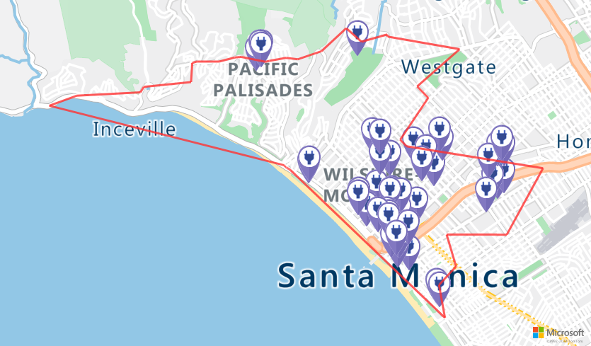

# Tutorial: Route electric vehicles by using Azure Notebooks (Python)

Azure Maps is a portfolio of geospatial service APIs that are natively integrated into Azure. These APIs enable developers, enterprises, and ISVs to develop location-aware apps, IoT, mobility, logistics, and asset tracking solutions. 

The Azure Maps REST APIs can be called from languages such as Python and R to enable geospatial data analysis and machine learning scenarios. Azure Maps offers a robust set of [routing APIs](https://docs.microsoft.com/rest/api/maps/route) that allow users to calculate routes between several data points. The calculations are based on various conditions, such as vehicle type or reachable area. 

In this tutorial, you walk help a driver whose electric vehicle battery is low. The driver needs to find the closest possible charging station from the vehicle's location.

In this tutorial, you will:

> [!div class="checklist"]
> *	Create and run a Jupyter notebook on [Azure Notebooks](https://docs.microsoft.com/azure/notebooks) in the cloud.
> *	Call Azure Maps REST APIs in Python.
> *	Search for a reachable range based on the electric vehicle's consumption model.
> *	Search for electric vehicle charging stations within the reachable range, or isochrone.
> *	Render the reachable range boundary and charging stations on a map.
> *	Find and visualize a route to the closest electric vehicle charging station based on drive time.


## Prerequisites 

To complete this tutorial, you first need to create an Azure Maps account and get your primary key (subscription key). 

To create an Azure Maps account subscription, follow instructions in [Create an account](quick-demo-map-app.md#create-an-account-with-azure-maps). You need an Azure Maps account subscription with the S1 price tier. 

To get the primary subscription key for your account, follow the instructions in [get primary key](quick-demo-map-app.md#get-the-primary-key-for-your-account).

For more information on authentication in Azure Maps, see [manage authentication in Azure Maps](./how-to-manage-authentication.md).

## Create an Azure notebook

To follow along with this tutorial, you need to create an Azure notebook project and download and run the Jupyter notebook file. The notebook file contains Python code, which implements the scenario in this tutorial. To create an Azure notebook project and upload the Jupyter notebook document to it, do the following steps:

1. Go to [Azure Notebooks](https://notebooks.azure.com) and sign in. For more information, see [Quickstart: Sign in and set a user ID](https://docs.microsoft.com/azure/notebooks/quickstart-sign-in-azure-notebooks).
1. At the top of your public profile page, select **My Projects**.

    

1. On the **My Projects** page, select **New Project**.
 
   

1. In the **Create New Project** pane, enter a project name and project ID.
 
    

1. Select **Create**.

1. After your project is created, download this [Jupyter notebook document file](https://github.com/Azure-Samples/Azure-Maps-Jupyter-Notebook/blob/master/AzureMapsJupyterSamples/Tutorials/EV%20Routing%20and%20Reachable%20Range/EVrouting.ipynb) from the [Azure Maps Jupyter notebook repository](https://github.com/Azure-Samples/Azure-Maps-Jupyter-Notebook).

1. In the projects list on the **My Projects** page, select your project, and then select **Upload** to upload the Jupyter notebook document file. 

    

1. Upload the file from your computer, and then select **Done**.

1. After the upload has finished successfully, your file is displayed on your project page. Double-click on the file to open it as a Jupyter notebook.

Try to understand the functionality that's implemented in the notebook file. Run the code, in the notebook file, one cell at a time. You can run the code in each cell by selecting the **Run** button at the top of the notebook app.

  

## Install project level packages

To run the code in the notebook, install packages at the project level by doing the following steps:

1. Download the [*requirements.txt*](https://github.com/Azure-Samples/Azure-Maps-Jupyter-Notebook/blob/master/AzureMapsJupyterSamples/Tutorials/EV%20Routing%20and%20Reachable%20Range/requirements.txt) file from the [Azure Maps Jupyter notebook repository](https://github.com/Azure-Samples/Azure-Maps-Jupyter-Notebook), and then upload it to your project.
1. On the project dashboard, select **Project Settings**. 
1. In the **Project Settings** pane, select the **Environment** tab, and then select **Add**.
1. Under **Environment Setup Steps**, do the following:   
    a. In the first drop-down list, select **Requirements.txt**.  
    b. In the second drop-down list, select your *requirements.txt* file.  
    c. In the third drop-down list, select **Python Version 3.6** as your version.
1. Select **Save**.

    

## Load the required modules and frameworks

To load all the required modules and frameworks, run the following script.

```Python
import time
import aiohttp
import urllib.parse
from IPython.display import Image, display
```

## Request the reachable range boundary

A package delivery company has some electric vehicles in its fleet. During the day, electric vehicles need to be recharged without having to return to the warehouse. Every time the remaining charge drops to less than an hour, you search for a set of charging stations that are within a reachable range. Essentially, you search for a charging station when the battery is low on charge. And, you get the boundary information for that range of charging stations. 

Because the company prefers to use routes that require a balance of economy and speed, the requested routeType is *eco*. The following script calls the [Get Route Range API](https://docs.microsoft.com/rest/api/maps/route/getrouterange) of the Azure Maps routing service. It uses parameters for the vehicle's consumption model. The script then parses the response to create a polygon object of the geojson format, which represents the car's maximum reachable range.

To determine the boundaries for the electric vehicle's reachable range, run the script in the following cell:

```python
subscriptionKey = "Your Azure Maps key"
currentLocation = [34.028115,-118.5184279]
session = aiohttp.ClientSession()

# Parameters for the vehicle consumption model 
travelMode = "car"
vehicleEngineType = "electric"
currentChargeInkWh=45
maxChargeInkWh=80
timeBudgetInSec=550
routeType="eco"
constantSpeedConsumptionInkWhPerHundredkm="50,8.2:130,21.3"


# Get boundaries for the electric vehicle's reachable range.
routeRangeResponse = await (await session.get("https://atlas.microsoft.com/route/range/json?subscription-key={}&api-version=1.0&query={}&travelMode={}&vehicleEngineType={}&currentChargeInkWh={}&maxChargeInkWh={}&timeBudgetInSec={}&routeType={}&constantSpeedConsumptionInkWhPerHundredkm={}"
                                              .format(subscriptionKey,str(currentLocation[0])+","+str(currentLocation[1]),travelMode, vehicleEngineType, currentChargeInkWh, maxChargeInkWh, timeBudgetInSec, routeType, constantSpeedConsumptionInkWhPerHundredkm))).json()

polyBounds = routeRangeResponse["reachableRange"]["boundary"]

for i in range(len(polyBounds)):
    coordList = list(polyBounds[i].values())
    coordList[0], coordList[1] = coordList[1], coordList[0]
    polyBounds[i] = coordList

polyBounds.pop()
polyBounds.append(polyBounds[0])

boundsData = {
               "geometry": {
                 "type": "Polygon",
                 "coordinates": 
                   [
                      polyBounds
                   ]
                }
             }
```

## Search for electric vehicle charging stations within the reachable range

After you've determined the reachable range (isochrone) for the electric vehicle, you can search for charging stations within that range. 

The following script calls the Azure Maps [Post Search Inside Geometry API](https://docs.microsoft.com/rest/api/maps/search/postsearchinsidegeometry). It searches for charging stations for electric vehicle, within the boundaries of the car's maximum reachable range. Then, the script parses the response to an array of reachable locations.

To search for electric vehicle charging stations within the reachable range, run the following script:

```python
# Search for electric vehicle stations within reachable range.
searchPolyResponse = await (await session.post(url = "https://atlas.microsoft.com/search/geometry/json?subscription-key={}&api-version=1.0&query=electric vehicle station&idxSet=POI&limit=50".format(subscriptionKey), json = boundsData)).json() 

reachableLocations = []
for loc in range(len(searchPolyResponse["results"])):
                location = list(searchPolyResponse["results"][loc]["position"].values())
                location[0], location[1] = location[1], location[0]
                reachableLocations.append(location)
```

## Upload the reachable range and charging points to Azure Maps Data Service

On a map, you'll want to visualize the charging stations and the boundary for the maximum reachable range of the electric vehicle. To do so, upload the boundary data and charging stations data as geojson objects to Azure Maps Data Service. Use the [Data Upload API](https://docs.microsoft.com/rest/api/maps/data/uploadpreview). 

To upload the boundary and charging point data to Azure Maps Data Service, run the following two cells:

```python
rangeData = {
  "type": "FeatureCollection",
  "features": [
    {
      "type": "Feature",
      "properties": {},
      "geometry": {
        "type": "Polygon",
        "coordinates": [
          polyBounds
        ]
      }
    }
  ]
}

# Upload the range data to Azure Maps Data Service.
uploadRangeResponse = await session.post("https://atlas.microsoft.com/mapData/upload?subscription-key={}&api-version=1.0&dataFormat=geojson".format(subscriptionKey), json = rangeData)

rangeUdidRequest = uploadRangeResponse.headers["Location"]+"&subscription-key={}".format(subscriptionKey)

while True:
    getRangeUdid = await (await session.get(rangeUdidRequest)).json()
    if 'udid' in getRangeUdid:
        break
    else:
        time.sleep(0.2)
rangeUdid = getRangeUdid["udid"]
```

```python
poiData = {
    "type": "FeatureCollection",
    "features": [
      {
        "type": "Feature",
        "properties": {},
        "geometry": {
            "type": "MultiPoint",
            "coordinates": reachableLocations
        }
    }
  ]
}

# Upload the electric vehicle charging station data to Azure Maps Data Service.
uploadPOIsResponse = await session.post("https://atlas.microsoft.com/mapData/upload?subscription-key={}&api-version=1.0&dataFormat=geojson".format(subscriptionKey), json = poiData)

poiUdidRequest = uploadPOIsResponse.headers["Location"]+"&subscription-key={}".format(subscriptionKey)

while True:
    getPoiUdid = await (await session.get(poiUdidRequest)).json()
    if 'udid' in getPoiUdid:
        break
    else:
        time.sleep(0.2)
poiUdid = getPoiUdid["udid"]
```

## Render the charging stations and reachable range on a map

After you've uploaded the data to the data service, call the Azure Maps [Get Map Image service](https://docs.microsoft.com/rest/api/maps/render/getmapimage). This service is used to render the charging points and maximum reachable boundary on the static map image by running the following script:

```python
# Get boundaries for the bounding box.
def getBounds(polyBounds):
    maxLon = max(map(lambda x: x[0], polyBounds))
    minLon = min(map(lambda x: x[0], polyBounds))

    maxLat = max(map(lambda x: x[1], polyBounds))
    minLat = min(map(lambda x: x[1], polyBounds))
    
    # Buffer the bounding box by 10 percent to account for the pixel size of pins at the ends of the route.
    lonBuffer = (maxLon-minLon)*0.1
    minLon -= lonBuffer
    maxLon += lonBuffer

    latBuffer = (maxLat-minLat)*0.1
    minLat -= latBuffer
    maxLat += latBuffer
    
    return [minLon, maxLon, minLat, maxLat]

minLon, maxLon, minLat, maxLat = getBounds(polyBounds)

path = "lcff3333|lw3|la0.80|fa0.35||udid-{}".format(rangeUdid)
pins = "custom|an15 53||udid-{}||https://raw.githubusercontent.com/Azure-Samples/AzureMapsCodeSamples/master/AzureMapsCodeSamples/Common/images/icons/ev_pin.png".format(poiUdid)

encodedPins = urllib.parse.quote(pins, safe='')

# Render the range and electric vehicle charging points on the map.
staticMapResponse =  await session.get("https://atlas.microsoft.com/map/static/png?api-version=1.0&subscription-key={}&pins={}&path={}&bbox={}&zoom=12".format(subscriptionKey,encodedPins,path,str(minLon)+", "+str(minLat)+", "+str(maxLon)+", "+str(maxLat)))

poiRangeMap = await staticMapResponse.content.read()

display(Image(poiRangeMap))
```




## Find the optimal charging station

First, you want to determine all the potential charging stations within the reachable range. Then, you want to know which of them can be reached in a minimum amount of time. 

The following script calls the Azure Maps [Matrix Routing API](https://docs.microsoft.com/rest/api/maps/route/postroutematrix). It returns the specified vehicle location, the travel time, and the distance to each charging station. The script in the next cell parses the response to locate the closest reachable charging station with respect to time.

To find the closest reachable charging station that can be reached in the least amount of time, run the script in the following cell:

```python
locationData = {
            "origins": {
              "type": "MultiPoint",
              "coordinates": [[currentLocation[1],currentLocation[0]]]
            },
            "destinations": {
              "type": "MultiPoint",
              "coordinates": reachableLocations
            }
         }

# Get the travel time and distance to each specified charging station.
searchPolyRes = await (await session.post(url = "https://atlas.microsoft.com/route/matrix/json?subscription-key={}&api-version=1.0&routeType=shortest&waitForResults=true".format(subscriptionKey), json = locationData)).json()

distances = []
for dist in range(len(reachableLocations)):
    distances.append(searchPolyRes["matrix"][0][dist]["response"]["routeSummary"]["travelTimeInSeconds"])

minDistLoc = []
minDistIndex = distances.index(min(distances))
minDistLoc.extend([reachableLocations[minDistIndex][1], reachableLocations[minDistIndex][0]])
closestChargeLoc = ",".join(str(i) for i in minDistLoc)
```

## Calculate the route to the closest charging station

Now that you've found the closest charging station, you can call the [Get Route Directions API](https://docs.microsoft.com/rest/api/maps/route/getroutedirections) to request the detailed route from the electric vehicle's current location to the charging station.

To get the route to the charging station and to parse the response to create a geojson object that represents the route, run the script in the following cell:

```python
# Get the route from the electric vehicle's current location to the closest charging station. 
routeResponse = await (await session.get("https://atlas.microsoft.com/route/directions/json?subscription-key={}&api-version=1.0&query={}:{}".format(subscriptionKey, str(currentLocation[0])+","+str(currentLocation[1]), closestChargeLoc))).json()

route = []
for loc in range(len(routeResponse["routes"][0]["legs"][0]["points"])):
                location = list(routeResponse["routes"][0]["legs"][0]["points"][loc].values())
                location[0], location[1] = location[1], location[0]
                route.append(location)

routeData = {
         "type": "LineString",
         "coordinates": route
     }
```

## Visualize the route

To help visualize the route, you first upload the route data as a geojson object to Azure Maps Data Service. To do so, use the Azure Maps [Data Upload API](https://docs.microsoft.com/rest/api/maps/data/uploadpreview). Then, call the rendering service, [Get Map Image API](https://docs.microsoft.com/rest/api/maps/render/getmapimage), to render the route on the map, and visualize it.

To get an image for the rendered route on the map, run the following script:

```python
# Upload the route data to Azure Maps Data Service.
routeUploadRequest = await session.post("https://atlas.microsoft.com/mapData/upload?subscription-key={}&api-version=1.0&dataFormat=geojson".format(subscriptionKey), json = routeData)

udidRequestURI = routeUploadRequest.headers["Location"]+"&subscription-key={}".format(subscriptionKey)

while True:
    udidRequest = await (await session.get(udidRequestURI)).json()
    if 'udid' in udidRequest:
        break
    else:
        time.sleep(0.2)

udid = udidRequest["udid"]

destination = route[-1]

destination[1], destination[0] = destination[0], destination[1]

path = "lc0f6dd9|lw6||udid-{}".format(udid)
pins = "default|codb1818||{} {}|{} {}".format(str(currentLocation[1]),str(currentLocation[0]),destination[1],destination[0])


# Get boundaries for the bounding box.
minLat, maxLat = (float(destination[0]),currentLocation[0]) if float(destination[0])<currentLocation[0] else (currentLocation[0], float(destination[0]))
minLon, maxLon = (float(destination[1]),currentLocation[1]) if float(destination[1])<currentLocation[1] else (currentLocation[1], float(destination[1]))

# Buffer the bounding box by 10 percent to account for the pixel size of pins at the ends of the route.
lonBuffer = (maxLon-minLon)*0.1
minLon -= lonBuffer
maxLon += lonBuffer

latBuffer = (maxLat-minLat)*0.1
minLat -= latBuffer
maxLat += latBuffer

# Render the route on the map.
staticMapResponse = await session.get("https://atlas.microsoft.com/map/static/png?api-version=1.0&subscription-key={}&&path={}&pins={}&bbox={}&zoom=16".format(subscriptionKey,path,pins,str(minLon)+", "+str(minLat)+", "+str(maxLon)+", "+str(maxLat)))

staticMapImage = await staticMapResponse.content.read()

await session.close()
display(Image(staticMapImage))
```


## Next steps

In this tutorial, you learned how to call Azure Maps REST APIs directly and visualize Azure Maps data by using Python.

To explore the Azure Maps APIs that are used in this tutorial, see:

* [Get Route Range](https://docs.microsoft.com/rest/api/maps/route/getrouterange)
* [Post Search Inside Geometry](https://docs.microsoft.com/rest/api/maps/search/postsearchinsidegeometry)
* [Data Upload](https://docs.microsoft.com/rest/api/maps/data/uploadpreview)
* [Render - Get Map Image](https://docs.microsoft.com/rest/api/maps/render/getmapimage)
* [Post Route Matrix](https://docs.microsoft.com/rest/api/maps/route/postroutematrix)
* [Get Route Directions](https://docs.microsoft.com/rest/api/maps/route/getroutedirections)

For a complete list of Azure Maps REST APIs, see [Azure Maps REST APIs](https://docs.microsoft.com/azure/azure-maps/consumption-model).

To learn more about Azure Notebooks, see [Azure Notebooks](https://docs.microsoft.com/azure/notebooks).
