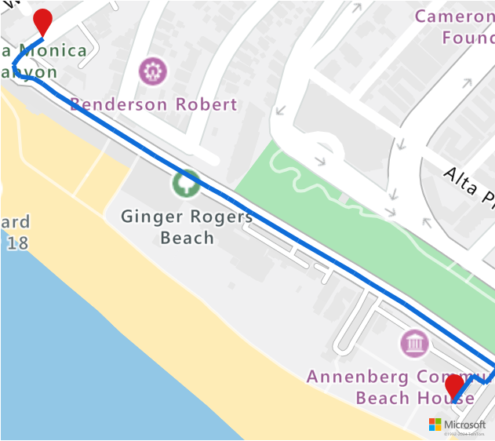

# Electric Vehicle Routing using Azure Notebooks (Python)

Azure Maps is a portfolio of geospatial service APIs natively integrated into Azure that enable developers, enterprises and ISVs to create location aware apps and IoT, mobility, logistics and asset tracking solutions.  Also, users can leverage our services to support their scenarios, for example, around data analysis and machine learning (ML).  In order to perform data analysis, users can call directly Azure Maps REST APIs and visualize Azure Maps data using Python. Azure Maps offers a robust set of [routing APIs]([https://docs.microsoft.com/rest/api/maps/route) that allows users to calculate routes between the desired set of points based on various conditions such as vehicle type or reachable area. In this tutorial, we will implement a scenario consisting of an electric vehicle with low charge and its driver who needs to find the closest possible charging station with respect to drive time.

In this tutorial you will:

> [!div class="checklist"]
> *	Create and run a Jupyter Notebook on [Azure Notebooks](https://docs.microsoft.com/azure/notebooks) in the cloud
> *	Call Azure Maps REST APIs in Python
> *	Search for a reachable range based on the electric vehicle's consumption model.
> *	Search for electric vehicle charging stations within the reachable range (or isochrone).
> *	Render the reachable range boundary and charging stations on a map.
> *	Find and visualize route to the closest electric vehicle charging station based on time.


## Prerequisites 

To complete the steps in this tutorial, you first need to create an Azure Maps account subscription with S1 pricing tier and get your Azure Maps subscription key. To learn how to create an Azure Maps account subscription see, [manage account](https://docs.microsoft.com/azure/azure-maps/how-to-manage-account-keys). To learn how to get your subscription key, see [authentication details](https://docs.microsoft.com/azure/azure-maps/how-to-manage-authentication#view-authentication-details).

## Create an Azure Notebook

In order to follow along with this tutorial, you will need to create an Azure Notebook project and download and run the Jupyter notebook file. The notebook file contains Python code, which is an implementation of the scenario in this tutorial. Follow the steps below to create an Azure Notebook project and upload the Jupyter notebook document into it.

1. Go to [Azure Notebooks](https://notebooks.azure.com) and sign in. For more information, see [Quickstart](https://docs.microsoft.com/azure/notebooks/quickstart-sign-in-azure-notebooks).
2. From your public profile page, select **My Projects** at the top of the page.

    

3. On the **My Projects** page, select **New Project**.
 
   

4. In the **Create New Project** popup that appears, enter the following information and click **Create**:
    * Project Name
    * Project ID
 
    

5. Once your project is created, select your project from the projects list on the **My Projects** page and click on **Upload** to upload the Jupyter notebook document file. Upload the file from your computer and click **Done**.

    

6. Upon a successful upload, you will see your file in your project page. Click on the notebook file to open the file as a Jupyter Notebook.

In order to better understand the functionality implemented in the notebook file, we recommend you to run the code in the notebook one cell at a time. You can run the code in each cell by clicking on the **Run** button at the top in the notebook app.

  

## Install project level packages

You need to install packages at the project level in order to run the code in the notebook. Follow the steps below to install the required packages:

1. Download the "requirements.txt" file from the repo and upload it to your project.
2. On the project dashboard, select **Project Settings**. 
3. In the popup that appears, select the **Environment tab**, then select **Add**.
4. Under **Environment Setup Steps**, 
    * In the first drop-down control, choose **Requirements.txt**.
    * In the second drop-down control, choose your "requirements.txt" file.
    * In the third drop-down control, choose Python Version 3.6 as the python version.
7. Select **Save**.

    

## Load required modules and frameworks

Run the following script to load all of the required modules and frameworks.

```python
import os
import json
import time
import aiohttp
import requests
import urllib.parse
from IPython.display import Image, display
```

## Request for reachable range boundary

In our scenario, package delivery company has some electric vehicles in their fleet. During the day electric vehicles need to be recharged without having to return to the warehouse. Every time the current charge goes below 45 kWH (electric vehicle is low on charge), we need to search for a set of charging stations that are within the reachable range and get the boundary information for that range. Because company prefers to use routes balanced by economy and speed, the requested routeType is 'eco'. The following script calls the [Get route range API](https://docs.microsoft.com/rest/api/maps/route/getrouterange) of the Azure Maps routing service with parameters for the vehicle's consumption model and parses the response to create a polygon object of the geojson format representing the car's maximum reachable range.

Run the script below to get bounds for the electric vehicle's reachable range.

```python
subscriptionKey = "tTk1JVEaeNvDkxxnxHm9cYaCvqlOq1u-fXTvyXn2XkA"
currentLocation = [34.028115,-118.5184279]
session = aiohttp.ClientSession()

routeRangeResponse = await (await session.get("https://atlas.microsoft.com/route/range/json?subscription-key={}&api-version=1.0&query={}&travelMode=car&vehicleEngineType=electric&currentChargeInkWh=45&maxChargeInkWh=80&timeBudgetInSec=550&routeType=eco&constantSpeedConsumptionInkWhPerHundredkm=50,8.2:130,21.3".format(subscriptionKey,str(currentLocation[0])+","+str(currentLocation[1])))).json()

polyBounds = routeRangeResponse["reachableRange"]["boundary"]

for i in range(len(polyBounds)):
    coordList = list(polyBounds[i].values())
    coordList[0], coordList[1] = coordList[1], coordList[0]
    polyBounds[i] = coordList

polyBounds.pop()
polyBounds.append(polyBounds[0])

boundsData = {
               "geometry": {
                 "type": "Polygon",
                 "coordinates": 
                   [
                      polyBounds
                   ]
                }
             }


polyBoundsCenter = list(routeRangeResponse["reachableRange"]["center"].values())
```

## Search electric vehicle charging stations within reachable range

Once we have the reachable range (isochrone) for the electric vehicle,  we can search for charging stations in that range. The following script calls the Azure Maps [Post Search Inside Geometry API](https://docs.microsoft.com/rest/api/maps/search/postsearchinsidegeometry) to search for electric vehicle charging stations within bounds of the car's maximum reachable range, and then parses the response to an array of reachable locations.

Run the following script to search for electric vehicle charging stations within reachable range.

```python
searchPolyResponse = await (await session.post(url = "https://atlas.microsoft.com/search/geometry/json?subscription-key={}&api-version=1.0&query=electric vehicle station".format(subscriptionKey), json = boundsData)).json() 

reachableLocations = []
for loc in range(len(searchPolyResponse["results"])):
                location = list(searchPolyResponse["results"][loc]["position"].values())
                location[0], location[1] = location[1], location[0]
                reachableLocations.append(location)

```

## Upload reachable range and charging points to Azure Maps Data service

In order to visualize the charging stations and boundary for the maximum reachable range of the electric vehicle on the map, we need to upload the boundary data and charging stations data as geojson objects to the Azure Maps Data service, using the [Data Upload API](https://docs.microsoft.com/en-us/rest/api/maps/data/uploadpreview). 

Run the following two cells to upload the boundary and charging point data to the Azure Maps data service.

```python
rangeData = {
  "type": "FeatureCollection",
  "features": [
    {
      "type": "Feature",
      "properties": {},
      "geometry": {
        "type": "Polygon",
        "coordinates": [
          polyBounds
        ]
      }
    }
  ]
}

uploadRangeResponse = await session.post("https://atlas.microsoft.com/mapData/upload?subscription-key={}&api-version=1.0&dataFormat=geojson".format(subscriptionKey), json = rangeData)

rangeUdidRequest = uploadRangeResponse.headers["Location"]+"&subscription-key={}".format(subscriptionKey)
# getRangeUdid = await (await session.get(rangeUdidRequest)).json()

while True:
    getRangeUdid = await (await session.get(rangeUdidRequest)).json()
    if 'udid' in getRangeUdid:
        break
    else:
        time.sleep(0.2)
rangeUdid = getRangeUdid["udid"]
```

```python
poiData = {
    "type": "FeatureCollection",
    "features": [
      {
        "type": "Feature",
        "properties": {},
        "geometry": {
            "type": "MultiPoint",
            "coordinates": reachableLocations
        }
    }
  ]
}

uploadPOIsResponse = await session.post("https://atlas.microsoft.com/mapData/upload?subscription-key={}&api-version=1.0&dataFormat=geojson".format(subscriptionKey), json = poiData)
poiUdidRequest = uploadPOIsResponse.headers["Location"]+"&subscription-key={}".format(subscriptionKey)

while True:
    getPoiUdid = await (await session.get(poiUdidRequest)).json()
    if 'udid' in getPoiUdid:
        break
    else:
        time.sleep(0.2)

poiUdid = getPoiUdid["udid"]
```

## Render charging stations and reachable range on map

Once we have the data uploaded to the data service, we will now run the following script to call the Azure Maps Get Map Image service, [Get Map Image API](https://docs.microsoft.com/en-us/rest/api/maps/render/getmapimage) to render the charging points and maximum reachable boundary on the static map image. 

```python
path = "lc1773c6|fcdcbdba|lw3|la0.80|fa0.40||udid-{}".format(rangeUdid)
pins = "default|la-35+50|ls12|lc003C62|co197cd9||udid-{}".format(poiUdid)

staticMapResponse =  await session.get("https://atlas.microsoft.com/map/static/png?api-version=1.0&subscription-key={}&pins={}&path={}&center=-118.36669921875,34.17318076114497&zoom=7".format(subscriptionKey,pins,path))
poiRangeMap = await staticMapResponse.content.read()


display(Image(poiRangeMap))
```


## Find the optimal charging station to stop

After we have all the potential charging stations within the reachable range, we want to know which one of the stations can be reached in the minimum amount of time. The following script calls the Azure Maps [Matrix routing API](https://docs.microsoft.com/rest/api/maps/route/postroutematrixpreview) returning for the given vehicle location the travel time and distance to every given charging station location. Next the script parses the response to get location for the closest reachable charging station with respect to time.

Run the following script to find the closest reachable charging station that can be reached in the minimum amount of time.

```python
locationData = {
            "origins": {
              "type": "MultiPoint",
              "coordinates": [[-122.1386142, 47.6422088]]
            },
            "destinations": {
              "type": "MultiPoint",
              "coordinates": reachableLocations
            }
         }

searchPolyRes = await session.post(url = "https://atlas.microsoft.com/route/matrix/json?subscription-key={}&api-version=1.0&waitForResults=false".format(subscriptionKey), json = locationData) 
routeMatrixResponse = await (await session.get(searchPolyRes.headers["Location"])).json()

distances = []
for dist in range(len(reachableLocations)):
    distances.append(routeMatrixResponse["matrix"][0][dist]["response"]["routeSummary"]["travelTimeInSeconds"])
    
minDistIndex = distances.index(min(distances))
reachableLocations[minDistIndex][0], reachableLocations[minDistIndex][1] = reachableLocations[minDistIndex][1], reachableLocations[minDistIndex][0]
closestChargeLoc = ",".join(str(i) for i in reachableLocations[minDistIndex])
```

## Calculate route to the closest charging station

After we have found the closest charging station, next we will call the [Get Route Directions API](https://docs.microsoft.com/en-us/rest/api/maps/route/getroutedirections) to request the detailed route from the electric vehicle's current location to the charging station.

First, you need to run the following script to get the route, and parse the response to create a geojson object of the route.

```python
routeResponse = await (await session.get("https://atlas.microsoft.com/route/directions/json?subscription-key={}&api-version=1.0&query={}:{}".format(subscriptionKey, currentLocation, closestChargeLoc))).json()

routeResponse
route = []
for loc in range(len(routeResponse["routes"][0]["legs"][0]["points"])):
                location = list(routeResponse["routes"][0]["legs"][0]["points"][loc].values())
                location[0], location[1] = location[1], location[0]
                route.append(location)

routeData = {
         "type": "LineString",
         "coordinates": route
     }
```

## Visualize the route

In order to visualize the route, we will first upload the route data as a geojson object into the Azure Maps Data service using the Azure Maps [Data Upload API](https://docs.microsoft.com/rest/api/maps/data/uploadpreview). And then call the Render service, [Get Map Image API](https://docs.microsoft.com/en-us/rest/api/maps/render/getmapimage) to render the route on the map and visualize it.

Run the following script to get the image for the rendered route on the map.

```python
routeUploadRequest = await session.post("https://atlas.microsoft.com/mapData/upload?subscription-key={}&api-version=1.0&dataFormat=geojson".format(subscriptionKey), json = routeData)

udidRequestURI = routeUploadRequest.headers["Location"]+"&subscription-key={}".format(subscriptionKey)

while True:
    udidRequest = await (await session.get(udidRequestURI)).json()
    if 'udid' in udidRequest:
        break
    else:
        time.sleep(0.2)

udid = udidRequest["udid"]

origin = currentLocation.split(",")
destination = closestChargeLoc.split(",")

path = "lc0f6dd9|lw5||udid-{}".format(udid)
pins = "default|la-35+50|ls12|codb1818||{} {}|{} {}".format(origin[1],origin[0],destination[1],destination[0])

staticMapResponse = await session.get("https://atlas.microsoft.com/map/static/png?api-version=1.0&subscription-key={}&&path={}&pins={}&center=-118.34609985351562,34.04469442222683&zoom=10".format(subscriptionKey,path,pins))
staticMapImage = await staticMapResponse.content.read()

await session.close()

display(Image(staticMapImage))
```



## Next steps

In this tutorial you learned how to call directly Azure Maps REST APIs and visualize Azure Maps data using Python.

For a complete list of Azure Maps REST APIs, see:

* [Azure Maps REST APIs](https://docs.microsoft.com/azure/azure-maps/#reference)