# Tutorial: Set up a geofence by using Azure Maps

This tutorial walks you through the basics steps to set up geofence by using Azure Maps. Consider this scenario, a construction Site Manager has to monitor potential hazardous equipment. The manager needs to ensure that the equipment stays in the chosen overall construction areas. This overall construction area is a hard parameter. Regulations require equipment to stay within this parameter and violations are reported to the Operations Manager.  

We use the Data Upload API to store a geofence and use the Geofence API to check the equipment location relative to the geofence. Both the Data Upload API and the Geofence API are from Azure Maps. We also use Azure Event Grid to stream the geofence results and set up a notification based on the geofence results. To learn more about Event Grid, see [Azure Event Grid](https://docs.microsoft.com/azure/event-grid/overview).

In this tutorial we cover how to:

> [!div class="checklist"]
> * Upload geofence area in the Azure Maps, Data service using the Data Upload API.
> *   Set up an Event Grid to handle geofence events.
> *   Setup geofence events handler.
> *   Set up alerts in response to geofence events using Logic Apps.
> *   Use Azure Maps geofence service APIs to track whether a construction asset is within the construction site or not.


## Prerequisites

### Create an Azure Maps account 

Follow instructions in [Create an account](quick-demo-map-app.md#create-an-account-with-azure-maps) to create an Azure Maps account subscription with S1 pricing tier. The steps in [get primary key](quick-demo-map-app.md#get-the-primary-key-for-your-account) show you how to retrieve the primary key of your account. For more information on authentication in Azure Maps, see [manage authentication in Azure Maps](./how-to-manage-authentication.md).

## Upload geofences

We assume that the main geofence is subsite1, which has a set expiration time. You can create more nested geofences as per your requirements. These sets of fences can be used to track different construction areas within the overall construction area. For example, subsite1 could be where work is taking place during week 1 to 4 of the schedule. subsite2 could be where work takes place during week 5 to 7. All such fences can be loaded as a single dataset at the beginning of the project. These fences are used to track rules based on time and space. 

To upload the geofence for the construction site using the Data Upload API, we use the postman application. Install the [postman application](https://www.getpostman.com/) and make a free account. 

Once the Postman app is installed, follow these steps to upload the construction site geofence using the Azure Maps, Data Upload API.

1. Open the Postman app and click new | Create new, and select Request. Enter a Request name for Upload geofence data, select a collection or folder to save it to, and click Save.

    

2. Select POST HTTP method on the builder tab and enter the following URL to make a POST request.

    ```HTTP
    https://atlas.microsoft.com/mapData/upload?subscription-key={subscription-key}&api-version=1.0&dataFormat=geojson
    ```
    
    The GEOJSON parameter in the URL path represents the data format of the data being uploaded.

3. Click **Params**, and enter the following Key/Value pairs to be used for the POST request URL. Replace {subscription-key} with your Azure Maps subscription key, also known as primary key.
   
    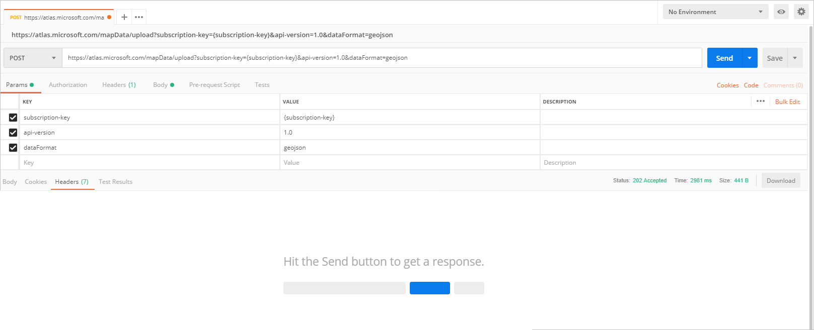

4. Click **Body** then select the raw input format and choose JSON as the input format from the dropdown list. Provide the following JSON as data to be uploaded:

   ```JSON
   {
      "type": "FeatureCollection",
      "features": [
        {
          "type": "Feature",
          "geometry": {
            "type": "Polygon",
            "coordinates": [
              [
                [
                  -122.13393688201903,
                  47.63829579223815
                ],
                [
                  -122.13389128446579,
                  47.63782047131512
                ],
                [
                  -122.13240802288054,
                  47.63783312249837
                ],
                [
                  -122.13238388299942,
                  47.63829037035086
                ],
                [
                  -122.13393688201903,
                  47.63829579223815
                ]
              ]
            ]
          },
          "properties": {
            "geometryId": "1"
          }
        },
        {
          "type": "Feature",
          "geometry": {
            "type": "Polygon",
            "coordinates": [
              [
                [
                  -122.13374376296996,
                  47.63784758098976
                ],
                [
                  -122.13277012109755,
                  47.63784577367854
                ],
                [
                  -122.13314831256866,
                  47.6382813338708
                ],
                [
                  -122.1334782242775,
                  47.63827591198201
                ],
                [
                  -122.13374376296996,
                  47.63784758098976
                ]
              ]
            ]
          },
          "properties": {
            "geometryId": "2",
            "validityTime": {
              "expiredTime": "2019-01-15T00:00:00",
              "validityPeriod": [
                {
                  "startTime": "2019-01-08T01:00:00",
                  "endTime": "2019-01-08T17:00:00",
                  "recurrenceType": "Daily",
                  "recurrenceFrequency": 1,
                  "businessDayOnly": true
                }
              ]
            }
          }
        }
      ]
   }
   ```

5. Click send and review the response header. Upon a successful request, the **Location** header will contain the status URI. The status URI is of the following format. The uploadStatusId value isn't between { }. It's a common practice to use { } to show values that the user must enter, or values that are different for different user.

   ```HTTP
   https://atlas.microsoft.com/mapData/{uploadStatusId}/status?api-version=1.0
   ```

6. Copy your status URI and append the subscription-key. The status URI format should be like the one below. Notice that in the format below, you would change the {subscription-key}, don't including the { }, with your subscription key.

   ```HTTP
   https://atlas.microsoft.com/mapData/{uploadStatusId}/status?api-version=1.0&subscription-key={Subscription-key}
   ```

7. To get the `udId`,  open a new tab in the Postman app and select GET HTTP method on the builder tab. Make a GET request at the status URI from the previous step. If your data upload was successful, you'll receive the udId in the response body. Copy the udId for later use.

   ```JSON
   {
    "status": "Succeeded",
    "resourceLocation": "https://atlas.microsoft.com/mapData/metadata/{udId}?api-version=1.0"
   }
   ```

## Set up an event handler

In this section, We create an event handler that receives notifications. This event handler should notify the Operations Manager about enter and exit events of any equipment.

We make two [Logic Apps](https://docs.microsoft.com/azure/event-grid/event-handlers#logic-apps) services to handle enter and exit events. When the events in the Logic Apps trigger, more events trigger in sequence. The idea is to send alerts, in this case emails, to the Operations Manager. The following figure illustrates creation of a Logic App for geofence enter event. Similarly, you can create another one for exit event. You can see all [supported event handlers](https://docs.microsoft.com/azure/event-grid/event-handlers) for more info.

1. Create a Logic App in Azure portal. Select the Logic App in Azure Marketplace. Then, select the **Create** button.

   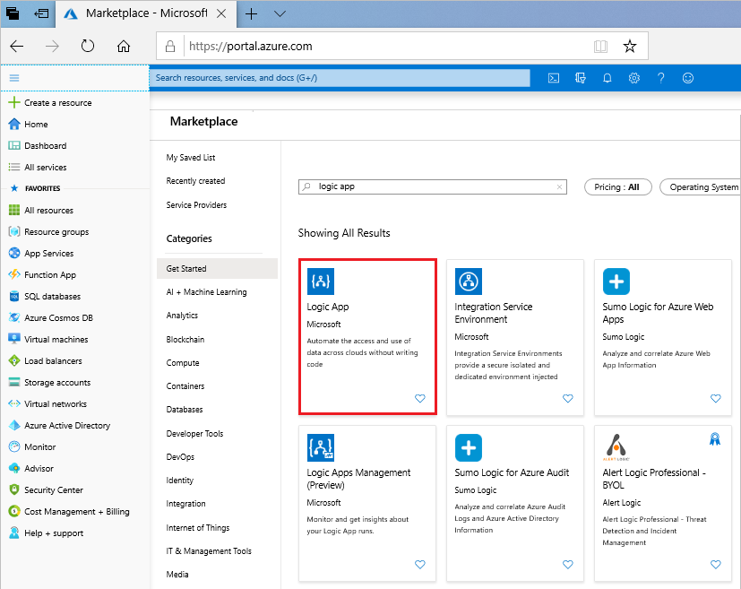

2. On the settings menu for the Logic App, navigate to **Logic App Designer**

3. Select an HTTP request trigger and then select "New Step". In the outlook connector, select "send an email" as an action
  
   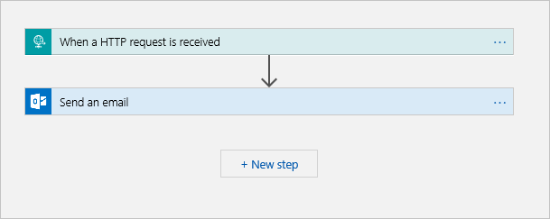

4. Fill in the fields for sending an email. Leave the HTTP URL, it will automatically generate after you click "save"

   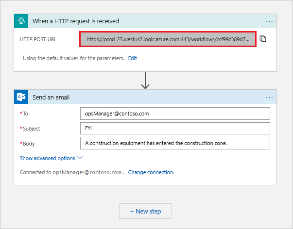

5. Save the logic app to generate the HTTP URL endpoint and copy the HTTP URL.

## Create an Azure Maps Events subscription

Azure Maps supports three event types. You can have a look at the Azure Maps supported event types [here](https://docs.microsoft.com/azure/event-grid/event-schema-azure-maps). We need two different event subscriptions, one for the enter event and one for the exit events.

Follow the steps below to create an event subscription for the geofence enter events. You can subscribe to geofence exit events in a similar manner.

1. Navigate to your Azure Maps account. In the dashboard, select Subscriptions. Click on your subscription name and select **events** from the settings menu.

   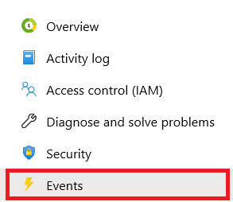

2. To create an event subscription, select Event Subscription from the events page.

   

3. Name the events subscription, and subscribe to the Enter event type. Now, select Web Hook as "Endpoint Type". Click on "Select an endpoint" and copy your Logic App HTTP URL endpoint into "{Endpoint}"

   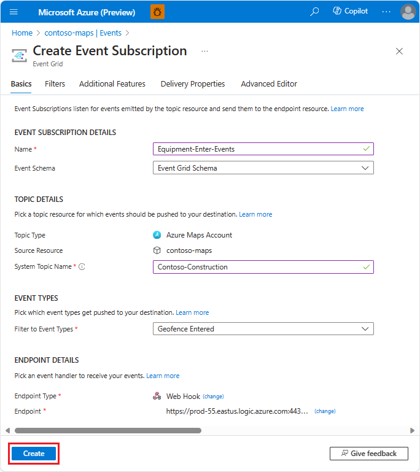


## Use Geofence API

You can use the Geofence API to check whether a **device**, in this case equipment, is inside or outside a geofence. Lets query the Geofence GET API against different locations, where a particular equipment has moved over time. The following figure illustrates five locations with five construction equipment. 

> [!Note]
> The scenario and behavior is based on the same **device id** so that it reflects the five different locations as in the figure below.

The "deviceId" is a unique ID that you provide for your device in the GET request, when querying for its location. When you make an asynchronous request to the **search geofence - GET API**, the "deviceId" helps in publishing geofence events for that device, relative to the specified geofence. In this tutorial, we have made asynchronous requests to the API with a unique "deviceId". The requests in the tutorial are made in chronological order, as in the diagram. The "isEventPublished" property in the response gets published whenever a device enters or exits the geofence. You do not have to register a device to follow with this tutorial.

Lets look back at the diagram. Each of these five locations is used to assess the geofence enter and exit status change against the fence. If a state change occurs, the geofence service triggers an event, which is sent to the Logic App by the Event Grid. As a result, the operation's manager will receive the corresponding enter or exit notification via an email.

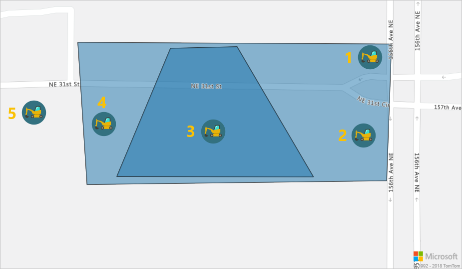

In the Postman app, open a new tab in the same collection you created above. Select GET HTTP method on the builder tab:

The following are five HTTP GET Geofencing API requests, with different location coordinates of the equipment. The coordinates are as observed in chronological order. Each request is followed by the response body.
 
1. Location 1:
    
   ```HTTP
   https://atlas.microsoft.com/spatial/geofence/json?subscription-key={subscription-key}&api-version=1.0&deviceId=device_01&udId={udId}&lat=47.638237&lon=-122.1324831&searchBuffer=5&isAsync=True&mode=EnterAndExit
   ```
   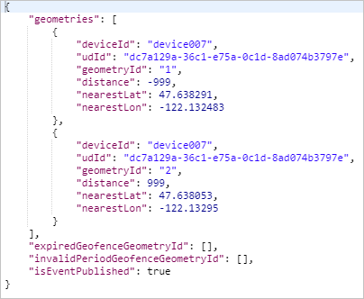

   In the response above, the negative distance from the main geofence means the equipment is inside the geofence. The positive distance from the subsite geofence means the equipment is outside the subsite geofence. 

2. Location 2: 
   
   ```HTTP
   https://atlas.microsoft.com/spatial/geofence/json?subscription-key={subscription-key}&api-version=1.0&deviceId=device_01&udId={udId}&lat=47.63800&lon=-122.132531&searchBuffer=5&isAsync=True&mode=EnterAndExit
   ```
    
   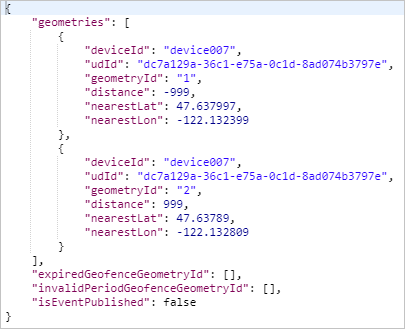

   If you look at the preceding JSON response carefully the equipment is outside the subsite, but it is inside the main fence. No event is triggered and no email is sent.

3. Location 3: 
  
   ```HTTP
   https://atlas.microsoft.com/spatial/geofence/json?subscription-key={subscription-key}&api-version=1.0&deviceId=device_01&udId={udId}&lat=47.63810783315048&lon=-122.13336020708084&searchBuffer=5&isAsync=True&mode=EnterAndExit
   ```

   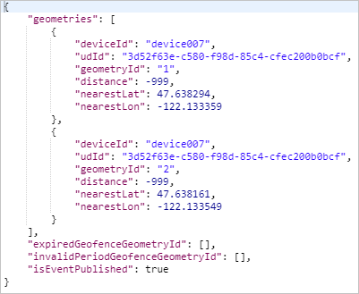

   A state change has occurred and now the equipment is within both the main and subsite geofences. This change causes an event to publish and a notification email will be sent to the Operations Manager.

4. Location 4: 

   ```HTTP
   https://atlas.microsoft.com/spatial/geofence/json?subscription-key={subscription-key}&api-version=1.0&deviceId=device_01&udId={udId}&lat=47.637988&lon=-122.1338344&searchBuffer=5&isAsync=True&mode=EnterAndExit
   ```
  
   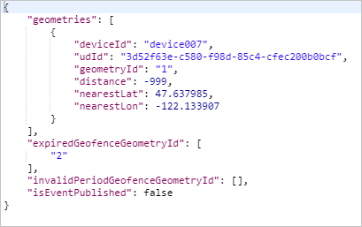

   By observing the corresponding response carefully, you can note that no event gets published here even though the equipment has exited the subsite geofence. If you look at the user's specified time in the GET request, you can see that the subsite geofence has expired for this time. The equipment is still in the main geofence. You can also see the geometry ID of the subsite geofence under `expiredGeofenceGeometryId` in the response body.


5. Location 5:
      
   ```HTTP
   https://atlas.microsoft.com/spatial/geofence/json?subscription-key={subscription-key}&api-version=1.0&deviceId=device_01&udId={udId}&lat=47.63799&lon=-122.134505&userTime=2019-01-16&searchBuffer=5&isAsync=True&mode=EnterAndExit
   ```

   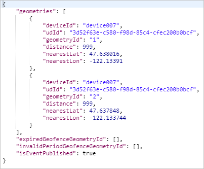

   You can see that the equipment has left the main construction site geofence. An event is published and an alert email is sent to the Operations Manager.

## Next steps

In this tutorial you learned: how to set up geofence by uploading it in the Azure Maps and Data service using the Data Upload API. You also learned how to use Azure Maps Events Grid to subscribe to and handle geofence events. 

* See [Handle content types in Azure Logic Apps](https://docs.microsoft.com/azure/logic-apps/logic-apps-content-type), to learn how to use Logic Apps to parse JSON to build a more complex logic.
* To know more about event handlers in Event Grid, see [supported Events Handlers in Event Grid](https://docs.microsoft.com/azure/event-grid/event-handlers).
