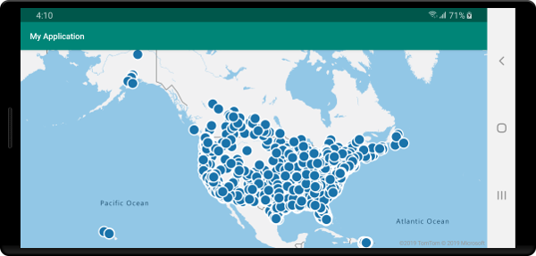

# Tutorial: Load GeoJSON data into Azure Maps Android SDK

This tutorial guides you through the process of importing a GeoJSON file of location data into the Azure Maps Android SDK. In this tutorial, you learn how to:

> [!div class="checklist"]
> * Add Azure Maps to an Android application.
> * Create a data source and load in a GeoJSON file from a local file or the web.
> * Display the data on the map.

## Prerequisites

1. Complete the [Quickstart: Create an Android app](quick-android-map.md). This tutorial will extend the code used in that quickstart.
2. Download the [Sample Points of Interest](https://raw.githubusercontent.com/Azure-Samples/AzureMapsCodeSamples/master/AzureMapsCodeSamples/Common/data/geojson/SamplePoiDataSet.json) GeoJSON file.

### Import GeoJSON data from web or assets folder

Most GeoJSON files wrap all data within a `FeatureCollection`. With this in mind, if the GeoJSON files are loaded into the application as a string, they can be passed into the feature collection's static `fromJson` method, which will deserialize the string into a GeoJSON `FeatureCollection` object that can be added to the map.

The following steps show you how to import a GeoJSON file into the application and deserialize it as a GeoJSON `FeatureCollection` object.

1. Complete the [Quickstart: Create an Android app](quick-android-map.md) as the following steps build on top of this application.
2. In the project panel of Android studio, right-click on the **app** folder and go to `New > Folder > Assets Folder`.
3. Drag and drop the [Sample Points of Interest](https://raw.githubusercontent.com/Azure-Samples/AzureMapsCodeSamples/master/AzureMapsCodeSamples/Common/data/geojson/SamplePoiDataSet.json) GeoJSON file into the assets folder.

::: zone pivot="programming-language-java-android"

4. Create a new file called **Utils.java** and add the following code to that file. This code provides a static method called `importData` that asynchronously imports a file from the `assets` folder of the application or from the web using a URL as a string and returns it back to the UI thread using a simple callback method.

    ```java
    //Modify the package name as needed to align with your application.
    package com.example.myapplication;
    
    import android.content.Context;
    import android.os.Handler;
    import android.os.Looper;
    import android.webkit.URLUtil;
    
    import java.io.BufferedReader;
    import java.io.IOException;
    import java.io.InputStream;
    import java.io.InputStreamReader;
    import java.net.URL;
    import java.util.concurrent.ExecutorService;
    import java.util.concurrent.Executors;
    
    import javax.net.ssl.HttpsURLConnection;
    
    public class Utils {
    
        interface SimpleCallback {
            void notify(String result);
        }
    
        /**
         * Imports data from a web url or asset file name and returns it to a callback.
         * @param urlOrFileName A web url or asset file name that points to data to load.
         * @param context The context of the app.
         * @param callback The callback function to return the data to.
         */
        public static void importData(String urlOrFileName, Context context, SimpleCallback callback){
            importData(urlOrFileName, context, callback, null);
        }
        
        /**
         * Imports data from a web url or asset file name and returns it to a callback.
         * @param urlOrFileName A web url or asset file name that points to data to load.
         * @param context The context of the app.
         * @param callback The callback function to return the data to.
         * @param error A callback function to return errors to.
         */
        public static void importData(String urlOrFileName, Context context, SimpleCallback callback, SimpleCallback error){
            if(urlOrFileName != null && callback != null) {
                ExecutorService executor = Executors.newSingleThreadExecutor();
                Handler handler = new Handler(Looper.getMainLooper());
    
                executor.execute(() -> {
                    String data = null;
    
                    try {
    
                        if(URLUtil.isNetworkUrl(urlOrFileName)){
                            data = importFromWeb(urlOrFileName);
                        } else {
                            //Assume file is in assets folder.
                            data = importFromAssets(context, urlOrFileName);
                        }
    
                        final String result = data;
    
                        handler.post(() -> {
                            //Ensure the resulting data string is not null or empty.
                            if (result != null && !result.isEmpty()) {
                                callback.notify(result);
                            } else {
                                error.notify("No data imported.");
                            }
                        });
                    } catch(Exception e) {
                        if(error != null){
                            error.notify(e.getMessage());
                        }
                    }
                });
            }
        }
    
        /**
         * Imports data from an assets file as a string.
         * @param context The context of the app.
         * @param fileName The asset file name.
         * @return
         * @throws IOException
         */
        private static String importFromAssets(Context context, String fileName) throws IOException {
            InputStream stream = null;
    
            try {
                stream = context.getAssets().open(fileName);
    
                if(stream != null) {
                    return readStreamAsString(stream);
                }
            } catch (Exception e) {
                e.printStackTrace();
            } finally {
                // Close Stream and disconnect HTTPS connection.
                if (stream != null) {
                    stream.close();
                }
            }
    
            return null;
        }
    
        /**
         * Imports data from the web as a string.
         * @param url URL to the data.
         * @return
         * @throws IOException
         */
        private static String importFromWeb(String url) throws IOException {
            InputStream stream = null;
            HttpsURLConnection connection = null;
            String result = null;
    
            try {
                connection = (HttpsURLConnection) new URL(url).openConnection();
    
                //For this use case, set HTTP method to GET.
                connection.setRequestMethod("GET");
    
                //Open communications link (network traffic occurs here).
                connection.connect();
    
                int responseCode = connection.getResponseCode();
                if (responseCode != HttpsURLConnection.HTTP_OK) {
                    throw new IOException("HTTP error code: " + responseCode);
                }
    
                //Retrieve the response body as an InputStream.
                stream = connection.getInputStream();
    
                if (stream != null) {
                    return readStreamAsString(stream);
                }
            } catch (Exception e) {
                e.printStackTrace();
            } finally {
                // Close Stream and disconnect HTTPS connection.
                if (stream != null) {
                    stream.close();
                }
                if (connection != null) {
                    connection.disconnect();
                }
            }
    
            return result;
        }
    
        /**
         * Reads an input stream as a string.
         * @param stream Stream to convert.
         * @return
         * @throws IOException
         */
        private static String readStreamAsString(InputStream stream) throws IOException {
            //Convert the contents of an InputStream to a String.
            BufferedReader in = new BufferedReader(new InputStreamReader(stream, "UTF-8"));
    
            String inputLine;
            StringBuffer response = new StringBuffer();
    
            while ((inputLine = in.readLine()) != null) {
                response.append(inputLine);
            }
    
            in.close();
    
            return response.toString();
        }
    }
    ```

5. Go into the **MainActivity.java** file and add the following code inside the callback for the `mapControl.onReady` event, this is located inside the `onCreate` method. This code uses the import utility to read in the **SamplePoiDataSet.json** file as a string, then deserializes it as a feature collection using the static `fromJson` method of the `FeatureCollection` class. This code also calculates the bounding box area for all the data in the feature collection and uses this to set the camera of the map to focus in on the data.

    ```java
    //Create a data source and add it to the map.
    DataSource source = new DataSource();
    map.sources.add(source);
    
    //Import the GeoJSON data and add it to the data source.
    Utils.importData("SamplePoiDataSet.json",
        this,
        (String result) -> {
            //Parse the data as a GeoJSON Feature Collection.
            FeatureCollection fc = FeatureCollection.fromJson(result);
    
            //Add the feature collection to the data source.
            source.add(fc);
    
            //Optionally, update the maps camera to focus in on the data.
    
            //Calculate the bounding box of all the data in the Feature Collection.
            BoundingBox bbox = MapMath.fromData(fc);
    
            //Update the maps camera so it is focused on the data.
            map.setCamera(
                bounds(bbox),

                //Padding added to account for pixel size of rendered points.
                padding(20)
            );
        });
    ```

6. Using the code to load the GeoJSON data a data source, we now need to specify how that data should be displayed on the map. There are several different rendering layers for point data; [Bubble layer](map-add-bubble-layer-android.md), [Symbol layer](how-to-add-symbol-to-android-map.md), and [Heat map layer](map-add-heat-map-layer-android.md) are the most commonly used layers. Add the following code to render the data in a bubble layer in the callback for the `mapControl.onReady` event after the code for importing the data.

    ```java
    //Create a layer and add it to the map.
    BubbleLayer layer = new BubbleLayer(source);
    map.layers.add(layer);
    ```

::: zone-end

::: zone pivot="programming-language-kotlin"

4. Create a new file called **Utils.kt** and add the following code to that file. This code provides a static method called `importData` that asynchronously imports a file from the `assets` folder of the application or from the web using a URL as a string and returns it back to the UI thread using a simple callback method.

    ```kotlin
    //Modify the package name as needed to align with your application.
    package com.example.myapplication;

    import android.content.Context
    import android.os.Handler
    import android.os.Looper
    import android.webkit.URLUtil
    import java.net.URL
    import java.util.concurrent.ExecutorService
    import java.util.concurrent.Executors
    
    class Utils {
        companion object {
    
            /**
             * Imports data from a web url or asset file name and returns it to a callback.
             * @param urlOrFileName A web url or asset file name that points to data to load.
             * @param context The context of the app.
             * @param callback The callback function to return the data to.
             */
            fun importData(urlOrFileName: String?, context: Context, callback: (String?) -> Unit) {
                importData(urlOrFileName, context, callback, null)
            }
    
            /**
             * Imports data from a web url or asset file name and returns it to a callback.
             * @param urlOrFileName A web url or asset file name that points to data to load.
             * @param context The context of the app.
             * @param callback The callback function to return the data to.
             * @param error A callback function to return errors to.
             */
            public fun importData(urlOrFileName: String?, context: Context, callback: (String?) -> Unit, error: ((String?) -> Unit)?) {
                if (urlOrFileName != null && callback != null) {
                    val executor: ExecutorService = Executors.newSingleThreadExecutor()
                    val handler = Handler(Looper.getMainLooper())
                    executor.execute {
                        var data: String? = null
                        
                        try {
                            data = if (URLUtil.isNetworkUrl(urlOrFileName)) {
                                URL(urlOrFileName).readText()
                            } else { //Assume file is in assets folder.
                                context.assets.open(urlOrFileName).bufferedReader().use{
                                    it.readText()
                                }
                            }
    
                            handler.post {
                                //Ensure the resulting data string is not null or empty.
                                if (data != null && !data.isEmpty()) {
                                    callback(data)
                                } else {
                                    error!!("No data imported.")
                                }
                            }
                        } catch (e: Exception) {
                            error!!(e.message)
                        }
                    }
                }
            }
        }
    }
    ```

5. Go into the **MainActivity.kt** file and add the following code inside the callback for the `mapControl.onReady` event, this is located inside the `onCreate` method. This code uses the import utility to read in the **SamplePoiDataSet.json** file as a string, then deserializes it as a feature collection using the static `fromJson` method of the `FeatureCollection` class. This code also calculates the bounding box area for all the data in the feature collection and uses this to set the camera of the map to focus in on the data.

    ```kotlin
    //Create a data source and add it to the map.
    DataSource source = new DataSource();
    map.sources.add(source);
    
    //Import the GeoJSON data and add it to the data source.
    Utils.importData("SamplePoiDataSet.json", this) { 
        result: String? ->
            //Parse the data as a GeoJSON Feature Collection.
             val fc = FeatureCollection.fromJson(result!!)
    
            //Add the feature collection to the data source.
            source.add(fc)
    
            //Optionally, update the maps camera to focus in on the data.
    
            //Calculate the bounding box of all the data in the Feature Collection.
            val bbox = MapMath.fromData(fc);

            //Update the maps camera so it is focused on the data.
            map.setCamera(
                bounds(bbox),

                //Padding added to account for pixel size of rendered points.
                padding(20)
            )
        }
    ```

6. Using the code to load the GeoJSON data a data source, we now need to specify how that data should be displayed on the map. There are several different rendering layers for point data; [Bubble layer](map-add-bubble-layer-android.md), [Symbol layer](how-to-add-symbol-to-android-map.md), and [Heat map layer](map-add-heat-map-layer-android.md) are the most commonly used layers. Add the following code to render the data in a bubble layer in the callback for the `mapControl.onReady` event after the code for importing the data.

    ```kotlin
    //Create a layer and add it to the map.
    val layer = new BubbleLayer(source)
    map.layers.add(layer)
    ```

::: zone-end

7. Run the application. A map will be displayed focused over the USA, with circles overlaid for each location in the GeoJSON file.

    

## Clean up resources

Take to following steps to clean up the resources from this tutorial:

1. Close Android Studio and delete the application you created.
2. If you tested the application on an external device, uninstall the application from that device.

## Next steps

To see more code examples and an interactive coding experience:

> [!div class="nextstepaction"]
> [Use data-driven style expressions](data-driven-style-expressions-android-sdk.md)

> [!div class="nextstepaction"]
> [Display feature information](display-feature-information-android.md)

> [!div class="nextstepaction"]
> [Add a symbol layer](how-to-add-symbol-to-android-map.md)

> [!div class="nextstepaction"]
> [Add a line layer](android-map-add-line-layer.md)

> [!div class="nextstepaction"]
> [Add a polygon layer](how-to-add-shapes-to-android-map.md)
