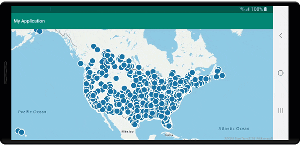

# Tutorial: Load GeoJSON data into Azure Maps Android SDK

This tutorial guides you through the process of importing a GeoJSON file of location data into the Azure Maps Android SDK. In this tutorial, you learn how to:

> [!div class="checklist"]
> * Add Azure Maps to an Android application.
> * Create a data source and load in a GeoJSON file from a local file or the web.
> * Display the data on the map.
> * Interact with the data on the maps to view its details.

## Prerequisites

1. Complete the [Quickstart: Create an Android app](quick-android-map.md). This tutorial extends the code used in that quickstart.
2. Download the [Sample Points of Interest](https://github.com/Azure-Samples/AzureMapsCodeSamples/blob/master/Static/data/geojson/SamplePoiDataSet.json) GeoJSON file.

### Import GeoJSON data from web or assets folder

Most GeoJSON files wrap all data within a `FeatureCollection`. With this scenario in mind, if the GeoJSON files are loaded into the application as a string, they can be passed into the feature collection's static `fromJson` method, which deserializes the string into a GeoJSON `FeatureCollection` object that can be added to the map.

The following steps show you how to import a GeoJSON file into the application and deserialize it as a GeoJSON `FeatureCollection` object.

1. Complete the [Quickstart: Create an Android app](quick-android-map.md) as the following steps build on top of this application.
2. In the project panel of Android studio, right-click on the **app** folder and go to `New > Folder > Assets Folder`.
3. Drag and drop the [Sample Points of Interest](https://github.com/Azure-Samples/AzureMapsCodeSamples/blob/master/Static/data/geojson/SamplePoiDataSet.json) GeoJSON file into the assets folder.

::: zone pivot="programming-language-java-android"

4. Go into the **MainActivity.java** file and add the following code inside the callback for the `mapControl.onReady` event, inside the `onCreate` method. This code loads the **SamplePoiDataSet.json** file from the assets folder into a data source using `importDataFromUrl` method and then adds it to the map.

```java
//Create a data source and add it to the map.
DataSource source = new DataSource();

//Import the geojson data and add it to the data source.
source.importDataFromUrl("asset://SamplePoiDataSet.json");

//Add data source to the map.
map.sources.add(source);
```

::: zone-end

::: zone pivot="programming-language-kotlin"

4. Go into the **MainActivity.kt** file and add the following code inside the callback for the `mapControl.onReady` event, inside the `onCreate` method. This code loads the **SamplePoiDataSet.json** file from the assets folder into a data source using `importDataFromUrl` method and then adds it to the map.

```kotlin
//Create a data source and add it to the map.
DataSource source = new DataSource();

//Import the geojson data and add it to the data source.
source.importDataFromUrl("asset://SamplePoiDataSet.json");

//Add data source to the map.
map.sources.add(source);
```

::: zone-end

5. Using the code to load the GeoJSON data a data source, we now need to specify how that data should be displayed on the map. There are several different rendering layers for point data; [Bubble layer](map-add-bubble-layer-android.md), [Symbol layer](how-to-add-symbol-to-android-map.md), and [Heat map layer](map-add-heat-map-layer-android.md) are the most commonly used layers. Add the following code to render the data in a bubble layer in the callback for the `mapControl.onReady` event after the code for importing the data.

::: zone pivot="programming-language-java-android"

```java
//Create a layer and add it to the map.
BubbleLayer layer = new BubbleLayer(source);
map.layers.add(layer);
```

::: zone-end

::: zone pivot="programming-language-kotlin"

```kotlin
//Create a layer and add it to the map.
val layer = new BubbleLayer(source)
map.layers.add(layer)
```

::: zone-end

6. In the project panel of Android studio, right-click on the **layout** folder under the path `app > res > layout` and go to `New > File`. Create a new file called **popup_text.xml**.
7. Open the **popup_text.xml** file. If the file opens in a designer view, right-click on the screen and select "Go to XML". Copy and paste the following XML into this file. This XML creates a simple layout that can be used with a popup and contains a text view.

```xml
<?xml version="1.0" encoding="utf-8"?>
<RelativeLayout xmlns:android="http://schemas.android.com/apk/res/android"
    android:layout_width="match_parent"
    android:orientation="vertical"
    android:background="#ffffff"
    android:layout_margin="8dp"
    android:padding="10dp"

    android:layout_height="match_parent">

    <TextView
        android:id="@+id/message"
        android:layout_width="wrap_content"
        android:text=""
        android:textSize="18dp"
        android:textColor="#222"
        android:layout_height="wrap_content"
        android:width="200dp"/>

</RelativeLayout>
```

::: zone pivot="programming-language-java-android"

8. Go back into the  **MainActivity.java** file and after the code for the bubble layer, add the following code to create a reusable popup.

```java
//Create a popup and add it to the map.
Popup popup = new Popup();
map.popups.add(popup);

//Close it initially.
popup.close();
```

::: zone-end

::: zone pivot="programming-language-kotlin"

8. Go back into the  **MainActivity.kt** file and after the code for the bubble layer, add the following code to create a reusable popup.

```kotlin
//Create a popup and add it to the map.
val popup = Popup()
map.popups.add(popup)
    
//Close it initially.
popup.close()
```

::: zone-end

9. Add the following code to attach a click event to the bubble layer. When a bubble in the bubble layer is tapped, the event will fire and retrieve some details from the properties of the selected feature, create a view using the **popup_text.xml** layout file, pass it in as content into the popup, then show the popup at the features position.

::: zone pivot="programming-language-java-android"

```java
//Add a click event to the layer.
map.events.add((OnFeatureClick)(feature) -> {
    //Get the first feature and it's properties.
    Feature f = feature.get(0);
    JsonObject props = f.properties();

    //Retrieve the custom layout for the popup.
    View customView = LayoutInflater.from(this).inflate(R.layout.popup_text, null);

    //Display the name and entity type information of the feature into the text view of the popup layout.
    TextView tv = customView.findViewById(R.id.message);
    tv.setText("%s\n%s",
        f.getStringProperty("Name"),
        f.getStringProperty("EntityType")
    );

    //Get the position of the clicked feature.
    Position pos = MapMath.getPosition((Point)f.geometry());

    //Set the options on the popup.
    popup.setOptions(
            //Set the popups position.
            position(pos),

            //Set the anchor point of the popup content.
            anchor(AnchorType.BOTTOM),

            //Set the content of the popup.
            content(customView)
    );

    //Open the popup.
    popup.open();

    //Return a boolean indicating if event should be consumed or continue to bubble up.
    return false;
}, layer);
```

::: zone-end

::: zone pivot="programming-language-kotlin"

```kotlin
//Add a click event to the layer.
map.events.add(OnFeatureClick { feature: List<Feature> ->
    //Get the first feature and it's properties.
    val f = feature[0]
    val props = f.properties()

    //Retrieve the custom layout for the popup.
    val customView: View = LayoutInflater.from(this).inflate(R.layout.popup_text, null)

    //Display the name and entity type information of the feature into the text view of the popup layout.
    val tv = customView.findViewById<TextView>(R.id.message)
    tv.text = String.format(
        "%s\n%s",
        f.getStringProperty("Name"),
        f.getStringProperty("EntityType")
    )

    //Get the position of the clicked feature.
    val pos = MapMath.getPosition(f.geometry() as Point?)

    //Set the options on the popup.
    popup.setOptions( //Set the popups position.
        position(pos),  //Set the anchor point of the popup content.
        anchor(AnchorType.BOTTOM),  //Set the content of the popup.
        content(customView)
    )

    //Open the popup.
    popup.open()

    //Return a boolean indicating if event should be consumed or continue to bubble up.
    false
} as OnFeatureClick, layer)
```

::: zone-end

10. Run the application. A map is displayed with bubbles overlaid for each location in the GeoJSON file. Tapping on any bubble displays a popup with the name and entity type of the feature touched.

    

## Clean up resources

Take the following steps to clean up the resources from this tutorial:

1. Close Android Studio and delete the application you created.
2. If you tested the application on an external device, uninstall the application from that device.

## Next steps

To see more code examples and an interactive coding experience:

> [!div class="nextstepaction"]
> [Use data-driven style expressions](data-driven-style-expressions-android-sdk.md)

> [!div class="nextstepaction"]
> [Display feature information](display-feature-information-android.md)

> [!div class="nextstepaction"]
> [Add a symbol layer](how-to-add-symbol-to-android-map.md)

> [!div class="nextstepaction"]
> [Add a line layer](android-map-add-line-layer.md)

> [!div class="nextstepaction"]
> [Add a polygon layer](how-to-add-shapes-to-android-map.md)
