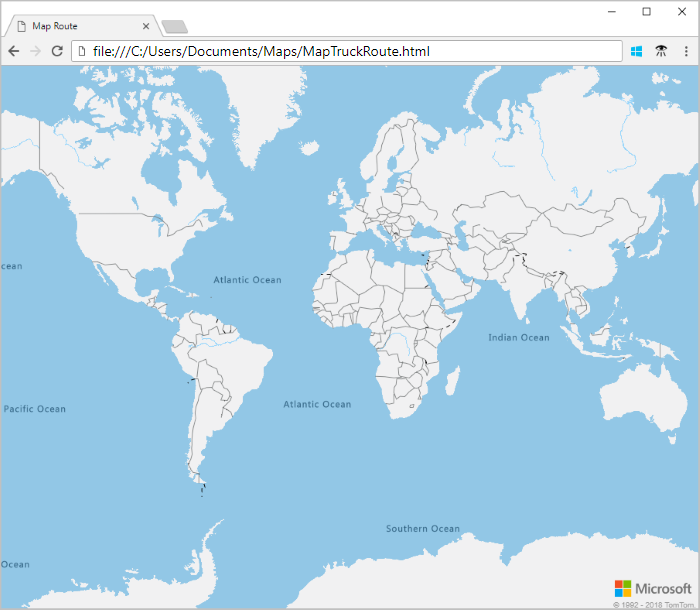
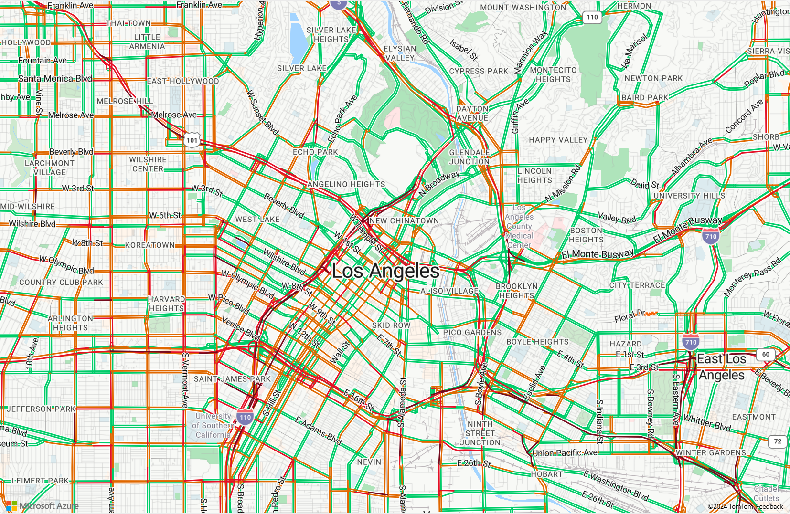
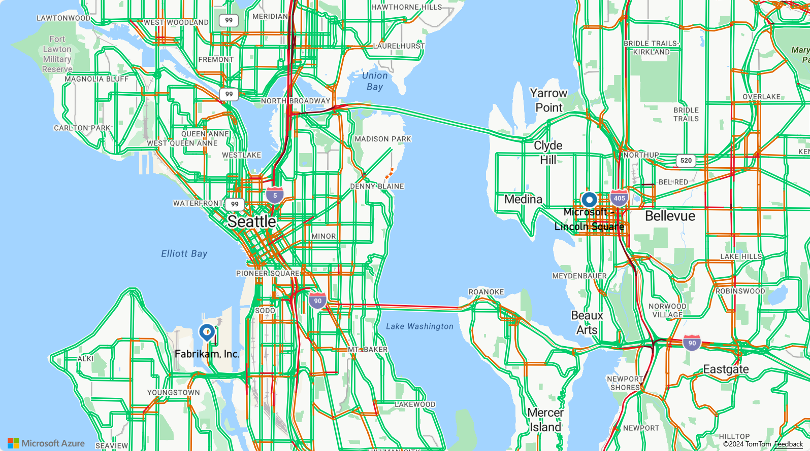
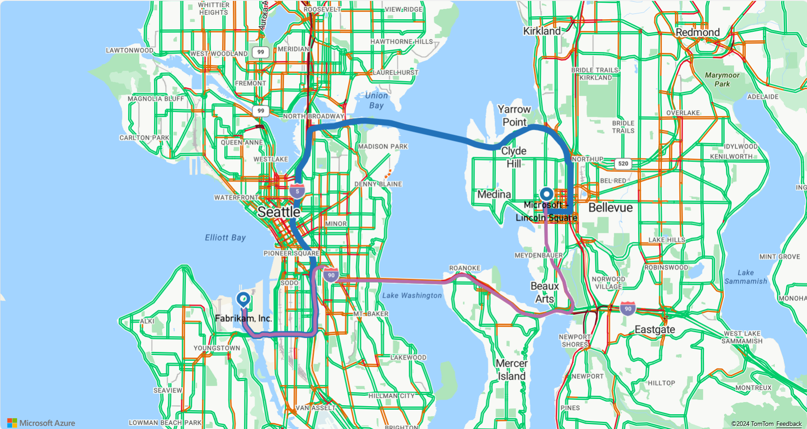

# Find routes for different modes of travel using Azure Maps

This tutorial shows how to use your Azure Maps account and the route service to find the route to your point of interest, prioritized by your mode of travel. You display two different routes on your map, one for cars and one for trucks that may have route restrictions because of height, weight, or hazardous cargo. In this tutorial, you learn how to:

> [!div class="checklist"]
> * Create a new web page using the map control API
> * Visualize traffic flow on your map
> * Create route queries that declare mode of travel
> * Display multiple routes on your map

## Prerequisites

Before you proceed, follow the steps in the first tutorial to [create your Azure Maps account](./tutorial-search-location.md#createaccount), and [get the subscription key for your account](./tutorial-search-location.md#getkey).

## Create a new map

The following steps show you how to create a static HTML page embedded with the Map Control API.

1. On your local machine, create a new file and name it **MapTruckRoute.html**.
2. Add the following HTML components to the file:

    ```HTML
    <!DOCTYPE html>
    <html lang="en">

    <head>
        <meta charset="utf-8" />
        <meta name="viewport" content="width=device-width, user-scalable=no" />
        <title>Map Truck Route</title>
        <link rel="stylesheet" href="https://atlas.microsoft.com/sdk/css/atlas.min.css?api-version=1" type="text/css" />
        <script src="https://atlas.microsoft.com/sdk/js/atlas.min.js?api-version=1"></script>
        <script src="https://atlas.microsoft.com/sdk/js/atlas-service.min.js?api-version=1"></script>
        <style>
            html,
            body {
                width: 100%;
                height: 100%;
                padding: 0;
                margin: 0;
            }

            #map {
                width: 100%;
                height: 100%;
            }
        </style>
    </head>

    <body>
        <div id="map"></div>
        <script>
            // Embed Map Control JavaScript code here
        </script>
    </body>

    </html>
    ```
    The HTML header embeds the resource locations for CSS and JavaScript files for the Azure Maps library. The *script* segment in the body of the HTML will contain the inline JavaScript code for the map.
3. Add the following JavaScript code to the *script* block of the HTML file. Replace the string **\<your account key\>** with the primary key that you copied from your Maps account. If you don't tell the map where to focus, you see the whole world view. This code sets the center point for the map, and declares a zoom level so that you can focus on a particular area by default.

    ```JavaScript
    // Instantiate map to the div with id "map"
    var MapsAccountKey = "<your account key>";
    var map = new atlas.Map("map", {
        "subscription-key": MapsAccountKey
         center: [-118.2437, 34.0522],
         zoom: 12
    });
    ```
    The **atlas.Map** provides the control for a visual and interactive web map, and is a component of the Azure Map Control API.

4. Save the file and open it in your browser. At this point, you have a basic map that you can develop further. 

   

## Visualize traffic flow

1. Add the traffic flow display to the map.  The **map.addEventListener** ensures that all maps functions added to the map are loaded after the map is loaded fully.

    ```JavaScript
    map.addEventListener("load", function() {
        // Add Traffic Flow to the Map
        map.setTraffic({
            flow: "relative"
        });
    });
    ```
    This code sets the traffic flow to `relative`, which is the speed of the road relative to free-flow. You could also set it to `absolute` speed of the road or `relative-delay`, which displays the relative speed where it differs from free-flow.

2. Save the **MapTruckRoute.html** file and refresh the page in your browser. You should see the streets of Los Angeles with their current traffic data.

   

<a id="queryroutes"></a>

## Set start and end points

For this tutorial, set the start point as a fictitious company in Seattle called Fabrikam, and the destination point as a Microsoft office.

1. Add the following JavaScript code to create the pins for the start and end points of the route:

    ```JavaScript
    // Create the GeoJSON objects which represent the start and end point of the route
    var startPoint = new atlas.data.Point([-122.356099, 47.580045]);
    var startPin = new atlas.data.Feature(startPoint, {
        title: "Fabrikam, Inc.",
        icon: "pin-round-blue"
    });

    var destinationPoint = new atlas.data.Point([-122.130137, 47.644702]);
    var destinationPin = new atlas.data.Feature(destinationPoint, {
        title: "Microsoft",
        icon: "pin-blue"
    });
    ```
    This code creates two [GeoJSON objects](https://en.wikipedia.org/wiki/GeoJSON) to represent the start and end points of the route.

2. Add the following JavaScript code to add the start and end points to the map:

    ```JavaScript
    // Fit the map window to the bounding box defined by the start and destination points
    var swLon = Math.min(startPoint.coordinates[0], destinationPoint.coordinates[0]);
    var swLat = Math.min(startPoint.coordinates[1], destinationPoint.coordinates[1]);
    var neLon = Math.max(startPoint.coordinates[0], destinationPoint.coordinates[0]);
    var neLat = Math.max(startPoint.coordinates[1], destinationPoint.coordinates[1]);
    map.setCameraBounds({
        bounds: [swLon, swLat, neLon, neLat],
        padding: 100
    });
    
    map.addEventListener("load", function() { 
        // Add pins to the map for the start and end point of the route
        map.addPins([startPin, destinationPin], {
            name: "route-pins",
            textFont: "SegoeUi-Regular",
            textOffset: [0, -20]
        });
    });
    ```
    The **map.setCameraBounds** call adjusts the map window according to the coordinates of the start and end points. The **map.addEventListener** ensures that all maps functions added to the map are loaded after the map is loaded fully. The API **map.addPins** adds the points to the Map control as visual components.

3. Save the file and refresh your browser to see the pins displayed on your map. Even though you declared your map with a center point in Los Angeles, the **map.setCameraBounds** moved the view to display the start and end points.

   

<a id="multipleroutes"></a>

## Render routes prioritized by mode of travel

This section shows how to use the Maps route service API to find multiple routes from a given start point to a destination based on your mode of transport. The route service provides APIs to plan *fastest*, *shortest*, *eco*, or *thrilling* routes between two locations, considering the current traffic conditions. It also allows users to plan routes in the future by using Azure's extensive historic traffic database and predicting route durations for any day and time. For more information, see [Get route directions](https://docs.microsoft.com/rest/api/maps/route/getroutedirections).  All of the following code blocks should be added **within the map load eventListener** to ensure that they load after the map loads fully.

1. First, add a new layer on the map to display the route path, or *linestring*. In this tutorial, there are two different routes, **car-route** and **truck-route**, each with their own styling. Add the following JavaScript code to the *script* block:

    ```JavaScript
    // Place route layers on the map
    var carRouteLayerName = "car-route";
    map.addLinestrings([], {
        name: carRouteLayerName,
        color: "#B76DAB",
        width: 5,
        cap: "round",
        join: "round",
        before: "labels"
    });

    var truckRouteLayerName = "truck-route";
    map.addLinestrings([], {
        name: truckRouteLayerName,
        color: "#2272B9",
        width: 9,
        cap: "round",
        join: "round",
        before: carRouteLayerName
    });
    ```

2. Add the following JavaScript code to the *script* block, to request the route for a truck and display the results on the map:

    ```JavaScript
    // Instantiate the service client  
    var client = new atlas.service.Client(MapsAccountKey);

    // Construct the route query string
    var routeQuery = startPoint.coordinates[1] +
        "," +
        startPoint.coordinates[0] +
        ":" +
        destinationPoint.coordinates[1] +
        "," +
        destinationPoint.coordinates[0];

    // Execute the truck route query then add the route to the map once a response is received  
    client.route.getRouteDirections(routeQuery, {
        travelMode: "truck",
        vehicleWidth: 2,
        vehicleHeight: 2,
        vehicleLength: 5,
        vehicleLoadType: "USHazmatClass2"
    }).then(response => {
        // Parse the response into GeoJSON
        var geoJsonResponse = new atlas.service.geojson
            .GeoJsonRouteDirectionsResponse(response);

        // Get the first in the array of routes and add it to the map
        map.addLinestrings([geoJsonResponse.getGeoJsonRoutes().features[0]], {
            name: truckRouteLayerName
        });
    });
    ```
    This code snippet above instantiates a service client, and constructs a route query string. It then queries the Azure Maps routing service through the [getRouteDirections](https://docs.microsoft.com/javascript/api/azure-maps-rest/services.route?view=azure-iot-typescript-latest#getroutedirections) method and then parses the response into GeoJSON format using the [getGeoJsonRouteDirectionsResponse](https://docs.microsoft.com/javascript/api/azure-maps-rest/atlas.service.geojson.geojsonroutedirectionsresponse?view=azure-iot-typescript-latest). And then creates an array of coordinates for the route returned, and adds it to the map's `truckRouteLayerName` layer.

3. Add the following JavaScript code to request the route for a car and display the results:

    ```JavaScript
    // Execute the car route query then add the route to the map once a response is received  
    client.route.getRouteDirections(routeQuery).then(response => {
        // Parse the response into GeoJSON
        var geoJsonResponse = new tlas.service.geojson
            .GeoJsonRouteDiraectionsResponse(response);

        // Get the first in the array of routes and add it to the map 
        map.addLinestrings([geoJsonResponse.getGeoJsonRoutes().features[0]], {
            name: carRouteLayerName
        });
    });
    ```
    This code snippet uses the same truck route query for a car. It queries the Azure Maps routing service through the [getRouteDirections](https://docs.microsoft.com/javascript/api/azure-maps-rest/services.route?view=azure-iot-typescript-latest#getroutedirections) method and then parses the response into GeoJSON format using the [getGeoJsonRouteDirectionsResponse](https://docs.microsoft.com/javascript/api/azure-maps-rest/atlas.service.geojson.geojsonroutedirectionsresponse?view=azure-iot-typescript-latest). And then creates an array of coordinates for the route returned, and adds it to the map's `carRouteLayerName` layer.

4. Save the **MapTruckRoute.html** file and refresh your browser to observe the result. For a successful connection with the Maps' APIs, you should see a map similar to the following.

    

    The truck route is blue and thicker, while the car route is purple and thinner. The car route goes across Lake Washington via I-90, which goes through tunnels under residential areas and so restricts hazardous waste cargo. The truck route, which specifies a USHazmatClass2 cargo type, is correctly directed to use a different highway.

## Next steps

In this tutorial, you learned how to:

> [!div class="checklist"]
> * Create a new web page using the map control API
> * Visualize traffic flow on your map
> * Create route queries that declare mode of travel
> * Display multiple routes on your map

You can access the code sample for this tutorial here:

> [Multiple routes with Azure Maps](https://github.com/Azure-Samples/azure-maps-samples/blob/master/src/truckRoute.html)

To learn more about the coverage and capabilities of Azure Maps:

> [!div class="nextstepaction"]
> [Zoom levels and tile grid](zoom-levels-and-tile-grid.md)

To see more code examples and an interactive coding experience:

> [!div class="nextstepaction"]
> [How to use the map control](how-to-use-map-control.md)