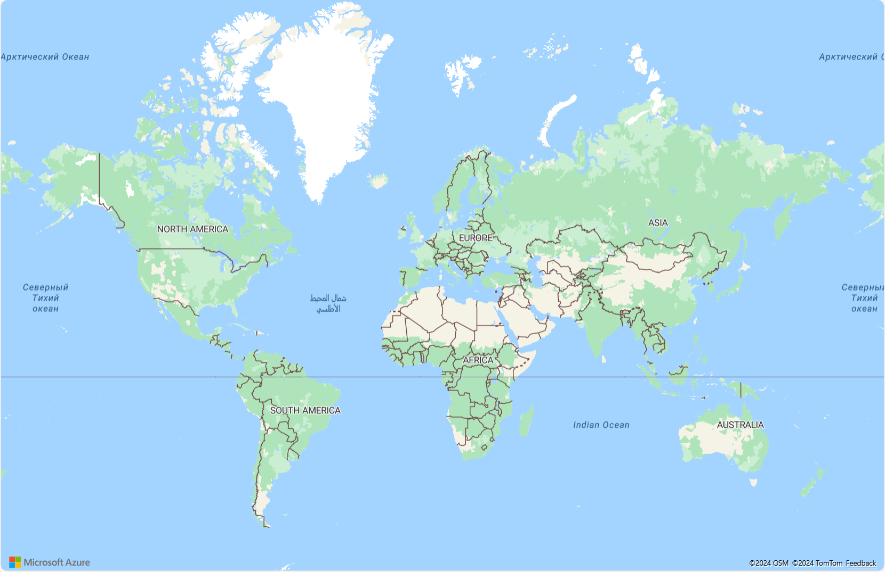
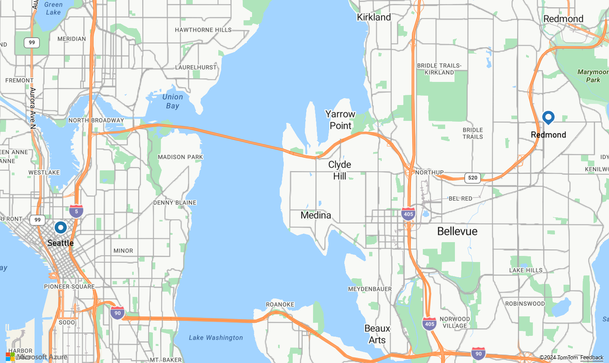
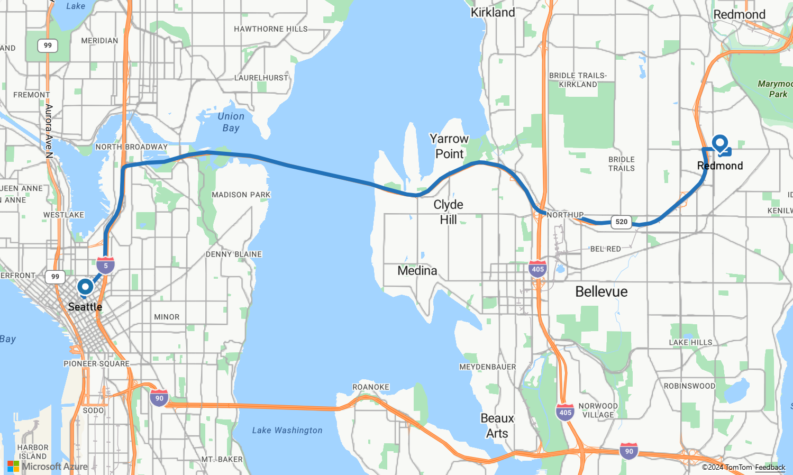

# Tutorial: Route to a point of interest using Azure Maps

This tutorial shows how to use your Azure Maps account and the Route Service SDK to find the route to your point of interest. In this tutorial, you learn how to:

> [!div class="checklist"]
> * Create a new web page using the map control API
> * Set address coordinates
> * Query Route Service for directions to point of interest

## Prerequisites

Before you continue, follow instructions in [Create an account](quick-demo-map-app.md#create-an-account-with-azure-maps), you need a subscription with S1 pricing tier. Follow the steps in [get primary key](quick-demo-map-app.md#get-the-primary-key-for-your-account) to get the primary key for your account. For more information on authentication in Azure Maps, see [manage authentication in Azure Maps](how-to-manage-authentication.md).

<a id="getcoordinates"></a>

## Create a new map

The following steps show you how to create a static HTML page embedded with the Map Control API.

1. On your local machine, create a new file and name it **MapRoute.html**.
2. Add the following HTML components to the file:

    ```HTML
    <!DOCTYPE html>
    <html>
    <head>
        <title>Map Route</title>
        <meta charset="utf-8">
        <meta name="viewport" content="width=device-width, initial-scale=1, shrink-to-fit=no">

        <!-- Add references to the Azure Maps Map control JavaScript and CSS files. -->
        <link rel="stylesheet" href="https://atlas.microsoft.com/sdk/javascript/mapcontrol/2/atlas.min.css" type="text/css">
        <script src="https://atlas.microsoft.com/sdk/javascript/mapcontrol/2/atlas.min.js"></script>

        <!-- Add a reference to the Azure Maps Services Module JavaScript file. -->
        <script src="https://atlas.microsoft.com/sdk/javascript/service/2/atlas-service.min.js"></script>

        <script>
            var map, datasource, client;

            function GetMap() {
                //Add Map Control JavaScript code here.
            }
        </script>
        <style>
            html,
            body {
                width: 100%;
                height: 100%;
                padding: 0;
                margin: 0;
            }

            #myMap {
                width: 100%;
                height: 100%;
            }
        </style>
    </head>
    <body onload="GetMap()">
        <div id="myMap"></div>
    </body>
    </html>
    ```

    Notice that the HTML header includes the CSS and JavaScript resource files hosted by the Azure Map Control library. Note the `onload` event on the body of the page, which will call the `GetMap` function when the body of the page has loaded. This function will contain the inline JavaScript code to access the Azure Maps APIs. 

3. Add the following JavaScript code to the `GetMap` function. Replace the string `<Your Azure Maps Key>` with the primary key that you copied from your Maps account.

    ```JavaScript
   //Instantiate a map object
   var map = new atlas.Map("myMap", {
        //Add your Azure Maps subscription key to the map SDK. Get an Azure Maps key at https://azure.com/maps
        authOptions: {
           authType: 'subscriptionKey',
           subscriptionKey: '<Your Azure Maps Key>'
        }
   });
   ```

    The `atlas.Map` provides the control for a visual and interactive web map, and is a component of the Azure Map Control API.

4. Save the file and open it in your browser. At this point, you have a basic map that you can develop further.

   

## Define how the route will be rendered

In this tutorial, a simple route will be rendered using a symbol icon for the start and end of the route, and a line for the route path.

1. After initializing the map, add the following JavaScript code.

    ```JavaScript
    //Wait until the map resources are ready.
    map.events.add('ready', function() {

        //Create a data source and add it to the map.
        datasource = new atlas.source.DataSource();
        map.sources.add(datasource);

        //Add a layer for rendering the route lines and have it render under the map labels.
        map.layers.add(new atlas.layer.LineLayer(datasource, null, {
            strokeColor: '#2272B9',
            strokeWidth: 5,
            lineJoin: 'round',
            lineCap: 'round'
        }), 'labels');

        //Add a layer for rendering point data.
        map.layers.add(new atlas.layer.SymbolLayer(datasource, null, {
            iconOptions: {
                image: ['get', 'icon'],
                allowOverlap: true
           },
            textOptions: {
                textField: ['get', 'title'],
                offset: [0, 1.2]
            },
            filter: ['any', ['==', ['geometry-type'], 'Point'], ['==', ['geometry-type'], 'MultiPoint']] //Only render Point or MultiPoints in this layer.
        }));
    });
    ```
    
    In the maps `ready` event handler, a data source is created to store the route line and the start and end points. A line layer is created and attached to the data source to defined how the route line will be rendered. The route line will be rendered as a nice shade of blue. It will have a width of five pixels, rounded line joins, and caps. When adding the layer to the map a second parameter with the value of `'labels'` is passed in which specifies to render this layer below the map labels. This will ensure that the route line doesn't cover up the road labels. A symbol layer is created and attached to the data source. This layer specifies how the start and end points are rendered. In this case, expressions have been added to retrieve the icon image and text label information from properties on each point object. 
    
2. For this tutorial, set the start point as Microsoft, and the end point as a gas station in Seattle. In the maps `ready` event handler, add the following code.

    ```JavaScript
    //Create the GeoJSON objects which represent the start and end points of the route.
    var startPoint = new atlas.data.Feature(new atlas.data.Point([-122.130137, 47.644702]), {
        title: "Redmond",
        icon: "pin-blue"
    });

    var endPoint = new atlas.data.Feature(new atlas.data.Point([-122.3352, 47.61397]), {
        title: "Seattle",
        icon: "pin-round-blue"
    });

    //Add the data to the data source.
    datasource.add([startPoint, endPoint]);

    map.setCamera({
        bounds: atlas.data.BoundingBox.fromData([startPoint, endPoint]),
        padding: 80
    });
    ```

    This code creates two [GeoJSON Point objects](https://en.wikipedia.org/wiki/GeoJSON) to represent the start and end points of the route and adds the points to the datasource. A `title` and `icon` property is added to each point. The last block sets the camera view using the latitude and longitude of the start and end points, using the Map's [setCamera](/javascript/api/azure-maps-control/atlas.map#setcamera-cameraoptions---cameraboundsoptions---animationoptions-) property.

3. Save the **MapRoute.html** file and refresh your browser. Now the map is centered over Seattle, and you can see the blue pin marking the start point and the round blue pin marking the finish point.

   

<a id="getroute"></a>

## Get directions

This section shows how to use Azure Maps route service API. The route service API finds the route from a given start point to an end point. Within this service, there are APIs to plan *fastest*, *shortest*, *eco*, or *thrilling* routes between two locations. This service also allows users to plan routes in the future by using Azure's extensive historic traffic database. Users can see the prediction of the route durations at any chosen day and time. For more information, see [Get route directions](https://docs.microsoft.com/rest/api/maps/route/getroutedirections). All of the following functionalities should be added **within the map ready eventListener** to ensure that they load after the map resources are ready to be accessed.

1. In the GetMap function, add the following to the JavaScript code.

    ```JavaScript
    // Use SubscriptionKeyCredential with a subscription key
    var subscriptionKeyCredential = new atlas.service.SubscriptionKeyCredential(atlas.getSubscriptionKey());

    // Use subscriptionKeyCredential to create a pipeline
    var pipeline = atlas.service.MapsURL.newPipeline(subscriptionKeyCredential);

    // Construct the RouteURL object
    var routeURL = new atlas.service.RouteURL(pipeline);
    ```

   The `SubscriptionKeyCredential` creates a `SubscriptionKeyCredentialPolicy` to authenticate HTTP requests to Azure Maps with the subscription key. The `atlas.service.MapsURL.newPipeline()` takes in the `SubscriptionKeyCredential` policy and creates a [Pipeline](https://docs.microsoft.com/javascript/api/azure-maps-rest/atlas.service.pipeline?view=azure-maps-typescript-latest) instance. The `routeURL` represents a URL to Azure Maps [Route](https://docs.microsoft.com/rest/api/maps/route) operations.

2. After setting up credentials and the URL, add the following JavaScript code to construct the route from start to end point. The `routeURL` requests the Azure Maps route service to calculate route directions. A GeoJSON feature collection from the response is then extracted using the `geojson.getFeatures()` method and added to the data source.

    ```JavaScript
    //Start and end point input to the routeURL
    var coordinates= [[startPoint.geometry.coordinates[0], startPoint.geometry.coordinates[1]], [endPoint.geometry.coordinates[0], endPoint.geometry.coordinates[1]]];

    //Make a search route request
    routeURL.calculateRouteDirections(atlas.service.Aborter.timeout(10000), coordinates).then((directions) => {
        //Get data features from response
        var data = directions.geojson.getFeatures();
        datasource.add(data);
    });
    ```

3. Save the **MapRoute.html** file and refresh your web browser. For a successful connection with the Maps APIs, you should see a map similar to the following.

    

## Next steps

In this tutorial, you learned how to:

> [!div class="checklist"]
> * Create a new web page using the map control API
> * Set address coordinates
> * Query the route service for directions to point of interest

> [!div class="nextstepaction"]
> [View full source code](https://github.com/Azure-Samples/AzureMapsCodeSamples/blob/master/AzureMapsCodeSamples/Tutorials/route.html)

> [!div class="nextstepaction"]
> [View live sample](https://azuremapscodesamples.azurewebsites.net/?sample=Route%20to%20a%20destination)

The next tutorial demonstrates how to create a route query with restrictions like mode of travel or type of cargo, then display multiple routes on the same map.

> [!div class="nextstepaction"]
> [Find routes for different modes of travel](./tutorial-prioritized-routes.md)
