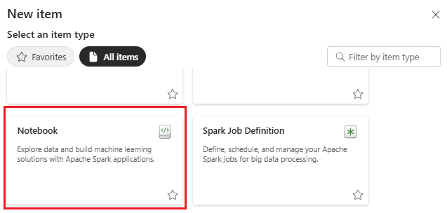
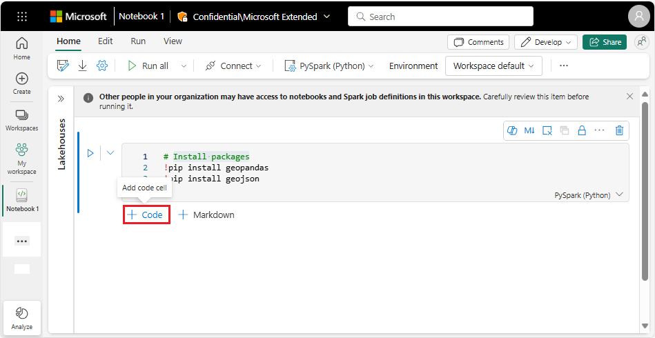
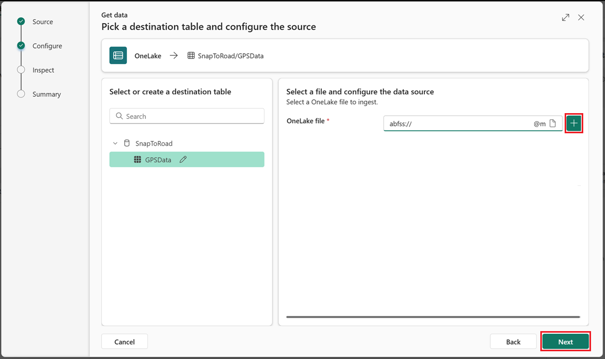
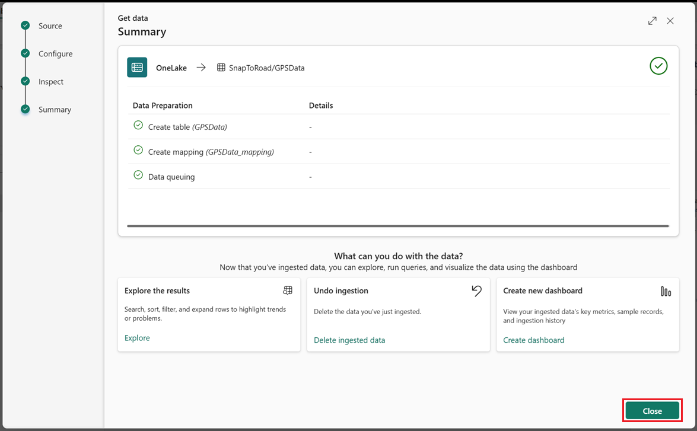
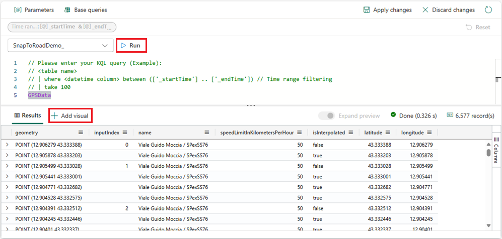
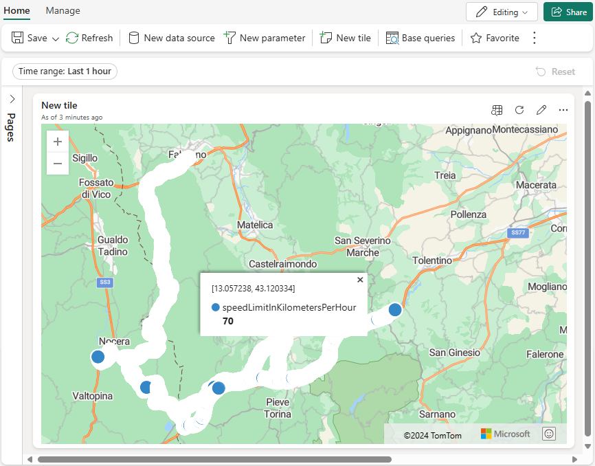

# Tutorial: Snap to road route using Fabric notebooks (Python)

Snap to Roads is an Azure Maps service that processes a set of GPS points collected along a route and snaps them to the most probable roads the vehicle traveled. This feature is useful in determining the exact path followed by a vehicle, even when the GPS data collected is off slightly.

This tutorial explains how to use Azure Maps [Snap to Roads] API with Microsoft Fabric to analyze GPS data from moving assets, even when the data is inaccurate or incomplete due to signal loss. It walks you through making calls to the Azure Maps Snap to Roads API from a Fabric notebook to snap the GPS points to the nearest road, fill missing points using interpolated data points and enrich them with additional attributes such as road names and speed limits.

In this tutorial, you will:

> [!div class="checklist"]
>
> * Create a lakehouse and import a vechicle's raw GPS data into it.
> * Create a new Fabric notebook that takes raw GPS data and returns the requested snapped coordinate information using the Azure Maps Snap to Roads API.
> * Create an Eventhouse and Kusto Database and import the snapped GPS data into it.
> * Create a real-time dashboard using the snapped GPS data in the Kusto Database.
> * Query KQL data and display the snapped GPS data in a Map Visual.

## Prerequisites

* An [Azure Maps account]
* A [subscription key]
* A [Microsoft Fabric account]
* Basic understanding of [Microsoft Fabric].

> [!NOTE]
> For more information on authentication in Azure Maps, see [manage authentication in Azure Maps].

## Create a Fabric notebook and lakehouse

Follow these steps to create a Fabric notebook:

1. Go to your [My Workspace] and select **New item**.

    

1. When the **New item** screen appears, scroll down and select **Notebook**.

    

1. In the notebook **Explorer** screen, select the **Lakehouses** arrow **>**.

    

1. Select the **Add** button.

    

1. In the **Add lakehouse** dialog, select **New Lakehouse** then the **Add** button.

1. In the **New lakehouse** dialog, enter a name "_Azure_Maps_Data_" then select the **Create** button.

    

## Add a data file to the lakehouse

Snap to Roads takes GPS point data (lat, lon), and returns a list of objects that form a route snapped to the roads on a map. A data file containing the required GPS data can be added as a file to the lakehouse and referenced by the python code in your notebook.

### Download file locally

> [!IMPORTANT]
> **Open issue: Need a permanent location to store the data file.**

Download the sample data (mockData_20240919.csv) from GitHub to your local storage device, it's uploaded into lakehouse in the next section. This file contains an array of GPS coordinates that the Snap to Roads service modifies as needed to ensure that each coordinate points to a valid road.

<!-------------------  Step #1 load data in lake house   ------------------------------>
### Upload file into lakehouse

The following steps explain how to add a data source to lakehouse.

1. From the **Files** folder in lakehouse, select **Upload > Upload files**.

    

1. Bring up the file open dialog by selecting the _folder_ icon. Select the desired file then the **Open** button. Once the file open dialog box closes and the correct filename appears in the **Upload files** control, select the **Upload** button to upload the file into lakehouse.

    

## Add code to notebook

You need to add and execute four cells of code to perform the _Snap to Roads_ scenario. The following sections walk you through this.

### Install packages

You first need to load the required packages:

```python
!pip install geopandas
!pip install geojson
```

1. Enter the pip install statements into the first cell of your notebook, then to execute the statements select the _run arrow_.

    

<!-------------------  Step #2 read it from the lake house   ------------------------------>
### Load data

Next, load the sample data you previously uploaded into your lakehouse.

1. Hover your pointer just below the cell used to install the packages. Options appear to add code or markdown. Select **+ Code** to add another code cell to your notebook.

    

1. Once the new cell is created, add the following code.

    ```py
    import geopandas as gpd
    import pandas as pd
    
    lakehouseFilePath = "/lakehouse/default/Files/"
    
    mockdata_df = gpd.read_file(lakehouseFilePath + "mockData_20240919.csv")
    mockdata_df = gpd.GeoDataFrame(
        mockdata_df, geometry=gpd.points_from_xy(mockdata_df.longitude, mockdata_df.latitude), crs="EPSG:4326"
    )
    
    mockdata_df.head()

    mockdata_df.tripID.unique()
    ```

1. Execute the code by selecting the _run arrow_. This loads your sample data.

<!-------------------  Step #3 Enrich with snap to road metadata   ------------------------------>
### Enrich with Snap to Roads

The notebook reads raw GPS data from the lakehouse file and calls the Azure Maps Snap Points to Road API. With interpolation enabled, the API adds points between GPS locations to complete the route path along the road. It also provides attributes like road names and speed limits when available. The output is saved as a CSV file in the lakehouse for later import into Eventhouse.

1. Hover your pointer just below the cell used to install the packages in the previous step. Options appear to add code or markdown. Select **+ Code** to add another code cell to your notebook.
1. Once the new cell is created, add the following code. Make sure you add your subscription key.

    ```python
    import requests
    import json
    
    az_maps_subkey = ""
    az_maps_snaproads_url = "https://atlas.microsoft.com/route/snapToRoads?api-version=2024-07-01-preview&subscription-key=" + az_maps_subkey
    
    # Function to process snap to road for each given trip
    def process_route(df, outputFilePath):
        # List to store successful responses
        successful_responses = []
    
        # Function to send a chunk of features
        def send_chunk_snaproads(chunk):
            geojson_data = chunk.to_json()
            # Convert the JSON string to a Python dictionary
            geojson_dict = json.loads(geojson_data)
    
            # Add the new fields at the end of the dictionary
            geojson_dict['includeSpeedLimit'] = True
            geojson_dict['interpolate'] = True
            geojson_dict['travelMode'] = "driving"
    
            # Convert the dictionary back to a JSON string
            updated_geojson_data = json.dumps(geojson_dict)
    
            response = requests.post(
            az_maps_snaproads_url, 
            headers={'Content-Type': 'application/json'}, 
            data=updated_geojson_data
            )
    
            if response.status_code == 200:
                print('Chunk request was successful...')
                successful_responses.append(response.json())
            else:
                print(f'Failed to send request. Status code: {response.status_code}')
                print('Response body:', response.text)
    
        # Loop over the GeoDataFrame in chunks of 100
        chunk_size = 100
        for start in range(0, len(df), chunk_size):
            end = start + chunk_size
            chunk = df.iloc[start:end]
            send_chunk_snaproads(chunk)
    
        # Extract features with geometry from successful responses
        features_with_geometry = []
        for response in successful_responses:
            if 'features' in response:
                for feature in response['features']:
                    if 'geometry' in feature:
                        longitude = feature['geometry']['coordinates'][0]
                        latitude = feature['geometry']['coordinates'][1]
                        feature['properties']['latitude'] = latitude
                        feature['properties']['longitude'] = longitude
                        features_with_geometry.append(feature)
    
        # Convert the list of features with geometry to a GeoDataFrame
        if features_with_geometry:
            responses_gdf = gpd.GeoDataFrame.from_features(features_with_geometry)
    
            # Write successful responses to a cvs file
            #responses_gdf.to_file(outputFilePath, driver='GeoJSON')
            responses_gdf.to_csv(outputFilePath, encoding='utf-8', index=False)
    
            print(f'Successful responses written to {outputFilePath}')
        else:
            print('No valid features with geometry found in the responses.')
    ```

1. Execute the code by selecting the _run arrow_.

### Execute and Save as CSV

```python
lakehouseFilePath = "/lakehouse/default/Files/"
#execute snap to road
outputFilePath = lakehouseFilePath + "SnapRoadResponses" + ".csv"
df = mockdata_df.sort_values(by='timeStamp').reset_index(drop=True)
process_route(df, outputFilePath)
```

### Copy file path

The _ABFS path_ to the _SnapRoadResponses.csv_ file will be required later in this tutorial when you create the Eventhouse. To get the ABFS path to this file, select the ellipse (**...**) next to the file, then from the popup menu, select **Copy ABFS Path**. Once copied, save it for later.


> [!TIP]
> If the new file does not appear after running the notebook code, you may need to refresh your browser.

## Create Eventhouse and link to data in lakehouse

Create an Eventhouse to manage the telemetry data for your fleet or moving assets. A KQL database is created automatically by default. In this tutorial, you'll import the snapped data from the lake house into the KQL database. For real-time analytics, add streaming data. Once the data is uploaded, you can query your data using Kusto Query Language in a KQL queryset.

1. Go to your [My Workspace] and select **New item**.
1. When the **New item** screen appears, scroll down and select **Eventhouse**.
1. In the **New Eventhouse** screen, enter a name for your new Eventhouse, such as _SnapToRoadDemo_

    Next, link the Lakehouse you created previously to your new Eventhouse

1. Select the ellipse next to your new Eventhouse, then **Get data > OneLake** from the popup menu.

    

1. Select **New table**, name it **GPSData** then select **Next**.

    

1. Enter the ABFS path to the Lakehouse data file in the **OneLake file** control that you [saved previously](#copy-file-path), then select the plus sign (**+**) to add it to the list.

    

1. Select **Next**.

1. After verifying the data, select **Finish**.

    

1. Select **Close**.

    

The Eventhouse should now be created and contain the GPS data.


## Create real-time dashboard

A real-time dashboard can be created to connect to your dataset in the Eventhouse. The input in this tutorial is static data, not a real-time stream, but the tiles in the dashboard, such as Azure Maps Visual, can be used for visual representation and analytics.

### Add data source

1. Go to your [My Workspace] and select **New item**.
1. When the **New item** screen appears, search for, or scroll down and select **real-time dashboard**.
1. In the **New Real-Time Dashboard** screen, enter the name _SnapToRoadDashboard_, the select **Create**.
1. In the new **Real-Time Dashboard** screen, select **New data source**.
1. Select the **Add +** button, then select **OneLake data hub**.

    

1. Select your data source, the **Connect**.

    

1. Enter a **Display name** then select **Add**.

    

1. Close the **Data sources** panel.

Now that you

### Add query and map visual

1. Select **+ Add tile**.

    

1. Enter `GPSData` then select **> Run**. Once you verified that the query works, select **+ Add visual**.

    

1. In the **Visual formatting** panel, select **Map** from the **Visual type** drop-down.
1. Next, set your values in the **Data** section:

    | Data setting       | value                  |
    |--------------------|------------------------|
    | Define by location | Latitude and longitude |
    | Latitude column    | latitude (real)        |
    | Longitude column   | longitude (real)       |

1. Update the map info card by selecting a value from the **Label column** drop-down. Select **gps_speed (real)**.
1. Select **Apply changes**

    

## Next steps

To learn more about Fabric notebooks:

> [!div class="nextstepaction"]
> [How to use Microsoft Fabric notebooks]

This tutorial created a dashboard for post trip route analysis. For a step-by-step guide to building real-time dashboards in Fabric:

> [!div class="nextstepaction"]
> [Real-Time Intelligence]

<!--  do we need to add anything related to Lakehouse, Eventhouse, Kusto database etc.     -->

[Azure Maps account]: quick-demo-map-app.md#create-an-azure-maps-account
[Microsoft Fabric]: https://www.microsoft.com/en-us/microsoft-fabric/getting-started#Resources
[manage authentication in Azure Maps]: how-to-manage-authentication.md
[Microsoft Fabric account]: https://www.microsoft.com/en-us/microsoft-fabric/getting-started
[My Workspace]: https://msit.powerbi.com/groups/me/list?experience=power-bi
[How to use Microsoft Fabric notebooks]: /fabric/data-engineering/how-to-use-notebook
[Real-Time Intelligence]: /fabric/real-time-intelligence/overview
[Snap to Roads]: /rest/api/maps/route/post-snap-to-roads
[subscription key]: quick-demo-map-app.md#get-the-subscription-key-for-your-account
