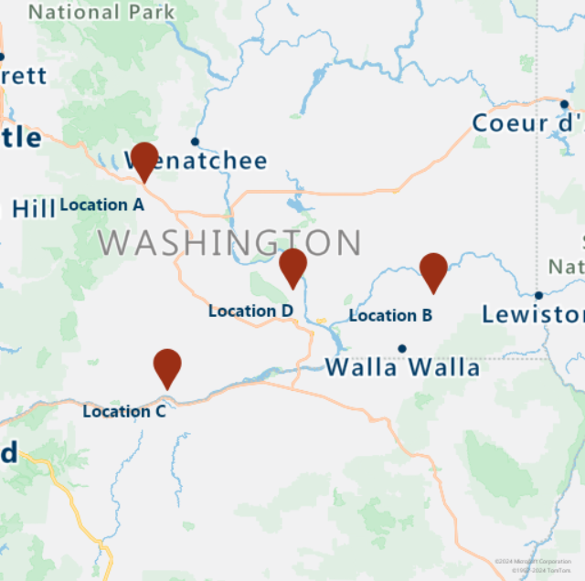
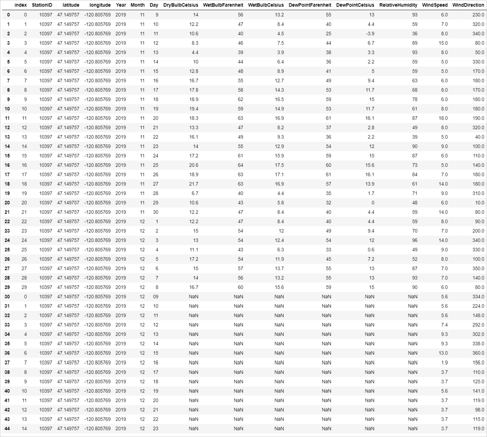
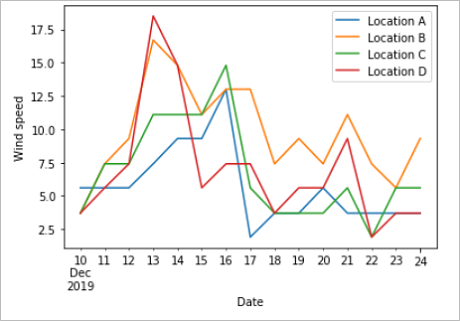
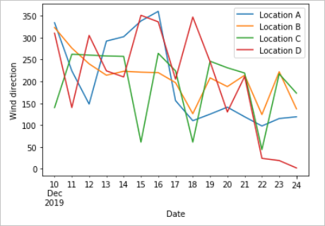

# Tutorial: Join sensor data with weather forecast data by using Azure Notebooks (Python)

Wind power is one alternative energy source for fossil fuels to combat against climate change. Because wind isn't consistent by nature, wind power operators need to build machine learning (ML) models to predict the wind power capacity. This prediction is necessary to meet electricity demand and ensure the grid stability. In this tutorial, we walk through how Azure Maps weather forecast data is combined with demo data for weather readings. Weather forecast data is requested by calling Azure Maps Weather services.

In this tutorial, you will:

> [!div class="checklist"]
>
> * Work with data files in [Azure Notebooks] in the cloud.
> * Load demo data from file.
> * Call Azure Maps REST APIs in Python.
> * Render location data on the map.
> * Enrich the demo data with Azure Maps [Daily Forecast] weather data.
> * Plot forecast data in graphs.

## Prerequisites

If you don't have an Azure subscription, create a [free account] before you begin.

* An [Azure Maps account]
* A [subscription key]

> [!NOTE]
> For more information on authentication in Azure Maps, see [manage authentication in Azure Maps].

To get familiar with Azure notebooks and to know how to get started, follow the instructions [Create an Azure Notebook].

> [!NOTE]
> The Jupyter notebook file for this project can be downloaded from the [Weather Maps Jupyter Notebook repository].

## Load the required modules and frameworks

To load all the required modules and frameworks, run the following script:

```python
import pandas as pd
import datetime
from IPython.display import Image, display
!pip install aiohttp
import aiohttp
```

## Import weather data

This tutorial uses weather data readings from sensors installed at four different wind turbines. The sample data consists of 30 days of weather readings. These readings are gathered from weather data centers near each turbine location. The demo data contains data readings for temperature, wind speed and, direction. You can download the demo data contained in [weather_dataset_demo.csv] from GitHub. The script below imports demo data to the Azure Notebook.

```python
df = pd.read_csv("./data/weather_dataset_demo.csv")
```

## Request daily forecast data

In our scenario, we would like to request daily forecast for each sensor location. The following script calls the [Daily Forecast API] of the Azure Maps Weather services. This API returns weather forecast for each wind turbine, for the next 15 days from the current date.

```python
subscription_key = "Your Azure Maps key"

# Get a lists of unique station IDs and their coordinates 
station_ids = pd.unique(df[['StationID']].values.ravel())
coords = pd.unique(df[['latitude','longitude']].values.ravel())

years,months,days = [],[],[]
dates_check=set()
wind_speeds, wind_direction = [], []

# Call azure maps Weather services to get daily forecast data for 15 days from current date
session = aiohttp.ClientSession()
j=-1
for i in range(0, len(coords), 2):
    wind_speeds.append([])
    wind_direction.append([])
    
    query = str(coords[i])+', '+str(coords[i+1])
    forecast_response = await(await session.get("https://atlas.microsoft.com/weather/forecast/daily/json?query={}&api-version=1.0&subscription-key={Your-Azure-Maps-Subscription-key}&duration=15".format(query, subscription_key))).json()
    j+=1
    for day in range(len(forecast_response['forecasts'])):
            date = forecast_response['forecasts'][day]['date'][:10]
            wind_speeds[j].append(forecast_response['forecasts'][day]['day']['wind']['speed']['value'])
            wind_direction[j].append(forecast_response['forecasts'][day]['day']['windGust']['direction']['degrees'])
            
            if date not in dates_check:
                year,month,day= date.split('-')
                years.append(year)
                months.append(month)
                days.append(day)
                dates_check.add(date)
            
await session.close()
```

The following script renders the turbine locations on the map by calling the [Get Map Image service].

```python
# Render the turbine locations on the map by calling the Azure Maps Get Map Image service
session = aiohttp.ClientSession()

pins="default|la-25+60|ls12|lc003C62|co9B2F15||'Location A'{} {}|'Location B'{} {}|'Location C'{} {}|'Location D'{} {}".format(coords[1],coords[0],coords[3],coords[2],coords[5],coords[4], coords[7],coords[6])

image_response = "https://atlas.microsoft.com/map/static/png?subscription-key={Your-Azure-Maps-Subscription-key}&api-version=1.0&layer=basic&style=main&zoom=6&center={},{}&pins={}".format(subscription_key,coords[7],coords[6],pins)

static_map_response = await session.get(image_response)

poi_range_map = await static_map_response.content.read()

await session.close()

display(Image(poi_range_map))
```



Group the forecast data with the demo data based on the station ID. The station ID is for the weather data center. This grouping augments the demo data with the forecast data.

```python
# Group forecasted data for all locations
df = df.reset_index(drop=True)
forecast_data = pd.DataFrame(columns=['StationID','latitude','longitude','Year','Month','Day','DryBulbCelsius','WetBulbFarenheit','WetBulbCelsius','DewPointFarenheit','DewPointCelsius','RelativeHumidity','WindSpeed','WindDirection'])

for i in range(len(station_ids)):
    loc_forecast = pd.DataFrame({'StationID':station_ids[i], 'latitude':coords[0], 'longitude':coords[1], 'Year':years, 'Month':months, 'Day':days, 'WindSpeed':wind_speeds[i], 'WindDirection':wind_direction[i]})
    forecast_data = pd.concat([forecast_data,loc_forecast], axis=0, sort=False)
    
combined_weather_data = pd.concat([df,forecast_data])
grouped_weather_data = combined_weather_data.groupby(['StationID'])
```

The following table displays the combined historical and forecast data for one of the turbine locations.

```python
# Display data for first location
grouped_weather_data.get_group(station_ids[0]).reset_index()
```

<center></center>

## Plot forecast data

Plot the forecasted values against the days for which they're forecasted. This plot allows us to see the speed and direction changes of the wind for the next 15 days.

```python
# Plot wind speed
curr_date = datetime.datetime.now().date()
windsPlot_df = pd.DataFrame({ 'Location A': wind_speeds[0], 'Location B': wind_speeds[1], 'Location C': wind_speeds[2], 'Location D': wind_speeds[3]}, index=pd.date_range(curr_date,periods=15))
windsPlot = windsPlot_df.plot.line()
windsPlot.set_xlabel("Date")
windsPlot.set_ylabel("Wind speed")
```

```python
#Plot wind direction 
windsPlot_df = pd.DataFrame({ 'Location A': wind_direction[0], 'Location B': wind_direction[1], 'Location C': wind_direction[2], 'Location D': wind_direction[3]}, index=pd.date_range(curr_date,periods=15))
windsPlot = windsPlot_df.plot.line()
windsPlot.set_xlabel("Date")
windsPlot.set_ylabel("Wind direction")
```

The following graphs visualize the forecast data. For the change of wind speed, see the left graph. For change in wind direction, see the right graph. This data is prediction for next 15 days from the day the data is requested.

<center>
 
</center>

In this tutorial, you learned how to call Azure Maps REST APIs to get weather forecast data. You also learned how to visualize the data on graphs.

To learn more about how to call Azure Maps REST APIs inside Azure Notebooks, see [EV routing using Azure Notebooks].

To explore the Azure Maps APIs that are used in this tutorial, see:

* [Daily Forecast]
* [Render - Get Map Image]

For a complete list of Azure Maps REST APIs, see [Azure Maps REST APIs].

## Clean up resources

There are no resources that require cleanup.

## Next steps

To learn more about Azure Notebooks, see

> [!div class="nextstepaction"]
> [Azure Notebooks]

[Azure Maps account]: quick-demo-map-app.md#create-an-azure-maps-account
[Azure Maps REST APIs]: consumption-model.md
[Azure Notebooks]: https://notebooks.azure.com
[Create an Azure Notebook]: tutorial-ev-routing.md#create-an-azure-notebooks-project
[Daily Forecast API]: /rest/api/maps/weather/getdailyforecast
[Daily Forecast]: /rest/api/maps/weather/getdailyforecast
[EV routing using Azure Notebooks]: tutorial-ev-routing.md
[free account]: https://azure.microsoft.com/free/
[Get Map Image service]: /rest/api/maps/render/getmapimage
[manage authentication in Azure Maps]: how-to-manage-authentication.md
[Render - Get Map Image]: /rest/api/maps/render/getmapimage
[subscription key]: quick-demo-map-app.md#get-the-subscription-key-for-your-account
[Weather Maps Jupyter Notebook repository]: https://github.com/Azure-Samples/Azure-Maps-Jupyter-Notebook/tree/master/AzureMapsJupyterSamples/Tutorials/Analyze%20Weather%20Data
[weather_dataset_demo.csv]: https://github.com/Azure-Samples/Azure-Maps-Jupyter-Notebook/tree/master/AzureMapsJupyterSamples/Tutorials/Analyze%20Weather%20Data/data
