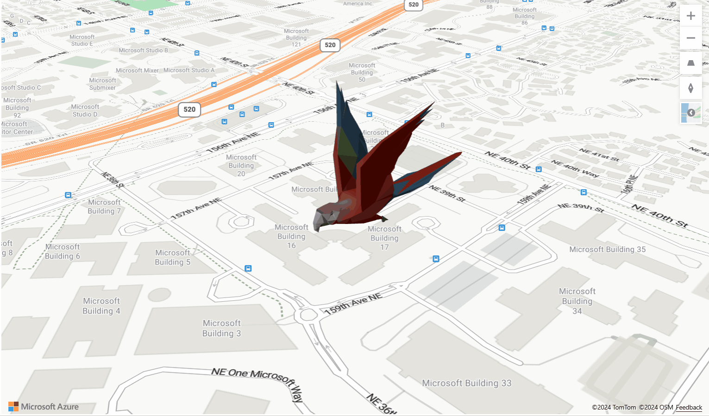

# Add a custom WebGL layer to a map

The Azure Maps Web SDK supports creating custom layers using [WebGL]. WebGL is based on [OpenGL ES] and enables rendering 2D and 3D graphics in web browsers.

Using WebGL, you can build high-performance interactive graphics that render in the browser in real-time that support scenarios like simulations, data visualization, animations and 3D modeling.

Developers can access the WebGL context of the map during rendering and use custom WebGL layers to integrate with other libraries such as [three.js] and [deck.gl] to provide enriched and interactive content on the map.

## Add a WebGL layer

Before you can add a WebGL layer to a map, you need to have an object that implements the `WebGLRenderer` interface. First, create a WebGL layer by providing an `id` and `renderer` object to the constructor, then add the layer to the map to have it rendered.

The following sample code demonstrates how to add a WebGL layer to a map:

```js
var myRenderer = {
    /**
     * Either "2d" or "3d". Defaults to "2d".
     * - "3d" to use the depth buffer and share it with other layers
     * - "2d" to add a layer with no depth. If you need to use the depth buffer for a "2d"
     *   layer you must use an offscreen framebuffer and the prerender method.
     */
    renderingMode: "2d",

    /**
     * Optional method called when the layer has been added to the Map.
     * This gives the layer a chance to initialize gl resources and register event listeners.
     * @param map The Map this custom layer was just added to.
     * @param gl The gl context for the map.
     */
    onAdd: function (map, gl) {},

    /**
     * Optional method called when the layer has been removed from the Map.
     * This gives the layer a chance to clean up gl resources and event listeners.
     * @param map The Map this custom layer was just added to.
     * @param gl The gl context for the map.
     */
    onRemove: function (map, gl) {},

    /**
     * Optional method called during a render frame to allow a layer to prepare resources
     * or render into a texture.
     *
     * The layer cannot make any assumptions about the current GL state and must bind a framebuffer before rendering.
     *
     * @param gl The map's gl context.
     * @param matrix The map's camera matrix.
     */
    prerender: function (gl, matrix) {},

    /**
     * Required. Called during a render frame allowing the layer to draw into the GL context.
     *
     * The layer can assume blending and depth state is set to allow the layer to
     * properly blend and clip other layers. The layer cannot make any other 
     * assumptions about the current GL state.
     *
     * If the layer needs to render to a texture, it should implement the prerender
     * method to do this and only use the render method for drawing directly into the
     * main framebuffer.
     *
     * The blend function is set to gl.blendFunc(gl.ONE, gl.ONE_MINUS_SRC_ALPHA).
     * This expects colors to be provided in premultiplied alpha form where the r, g and b
     * values are already multiplied by the a value. If you are unable to provide colors in
     * premultiplied form you may want to change the blend function to
     * gl.blendFuncSeparate(gl.SRC_ALPHA, gl.ONE_MINUS_SRC_ALPHA, gl.ONE, gl.ONE_MINUS_SRC_ALPHA).
     *
     * @param gl The map's gl context.
     * @param matrix The map's camera matrix.
     */
    render: function (gl, matrix) {}
};
 
//Add the layer to the map.
map.layers.add(new atlas.layer.WebGLLayer("layerId", { renderer: myRenderer }));
```

> [!NOTE]
> The `WebGLLayer` class supports the `minZoom`, `maxZoom`, and `visible` layer options.

```js
//Add the layer to the map with layer options. 
map.layers.add(new atlas.layer.WebGLLayer("layerId", 
    { 
        renderer: myRenderer, 
        minZoom: 10, 
        maxZoom: 22, 
        visible: true
    }
));
```

This sample renders a triangle on the map using a WebGL layer.

:::image type="content" source="./media/how-to-webgl-custom-layer/triangle.png" lightbox="./media/how-to-webgl-custom-layer/triangle.png" alt-text="A screenshot showing a triangle rendered on a map, using a WebGL layer.":::

For a fully functional sample with source code, see [Simple 2D WebGL layer] in the Azure Maps Samples.

The map's camera matrix is used to project spherical Mercator point to `gl` coordinates. Mercator point \[0, 0\] represents the top left corner
of the Mercator world and \[1, 1\] represents the bottom right corner. When `renderingMode` is `"3d"`, the z coordinate is conformal.
A box with identical x, y, and z lengths in Mercator units would be rendered as a cube.

The `MercatorPoint` class has `fromPosition`, `fromPositions`, and
`toFloat32Array` static methods that can be used to convert a geospatial
Position to a Mercator point. Similarly the `toPosition` and `toPositions`
methods can be used to project a Mercator point to a Position.

## Render a 3D model

Use a WebGL layer to render 3D models. The following example shows how
to load a [glTF] file and render it on the map using [three.js].

You need to add the following script files.

```html
<script src="https://unpkg.com/three@latest/build/three.min.js"></script>
<script src="https://unpkg.com/three@latest/examples/js/loaders/GLTFLoader.js"></script>
```

This sample renders an animated 3D parrot on the map.



For a fully functional sample with source code, see [Three custom WebGL layer] in the Azure Maps Samples.

The `onAdd` function loads a `.glb` file into memory and instantiates [three.js] objects such as Camera, Scene, Light, and a `THREE.WebGLRenderer`.

The `render` function calculates the projection matrix of the camera and renders the model to the scene.

>[!TIP]
>
> - To have a continuous and smooth animation, you can trigger the repaint of a single frame by calling `map.triggerRepaint()` in the `render` function.
> - To enable anti-aliasing simply set `antialias` to `true` as one of the style options while creating the map.

## Render a 3D model using babylon.js

[Babylon.js] is one of the world's leading WebGL-based graphics engines. The following example shows how to load a GLTF file and render it on the map using babylon.js.

You need to add the following script files.  

```html
<script src="https://cdn.babylonjs.com/babylon.js"></script> 
<script src="https://cdn.babylonjs.com/loaders/babylonjs.loaders.min.js"></script> 
```

This sample renders a satellite tower on the map.

The `onAdd` function instantiates a BABYLON engine and a scene. It then loads a `.gltf` file using BABYLON.SceneLoader.  

The `render` function calculates the projection matrix of the camera and renders the model to the scene.

:::image type="content" source="./media/how-to-webgl-custom-layer/render-3d-model.png" lightbox="./media/how-to-webgl-custom-layer/render-3d-model.png" alt-text="A screenshot showing an example of rendering a 3D model using babylon.js.":::

For a fully functional sample with source code, see [Babylon custom WebGL layer] in the Azure Maps Samples.

## Render a deck.gl layer

A WebGL layer can be used to render layers from the [deck.gl] library. The following sample demonstrates the data visualization of
people migration flow in the United States from county to county within a certain time range.

You need to add the following script file.

```html
<script src="https://unpkg.com/deck.gl@latest/dist.min.js"></script> 
```

Define a layer class that extends `atlas.layer.WebGLLayer`.

```js
class DeckGLLayer extends atlas.layer.WebGLLayer { 

    constructor(options) { 
        super(options.id); 

        //Create an instance of deck.gl layer 
        this._mbLayer = new deck.MapboxLayer(options); 

        //Create a renderer 
        const deckGLRenderer = { 
            renderingMode: "3d", 
            onAdd: (map, gl) => { 
               this._mbLayer.onAdd?.(map["map"], gl); 
            }, 
            onRemove: (map, gl) => { 
                this._mbLayer.onRemove?.(map["map"], gl); 
            }, 
            prerender: (gl, matrix) => { 
                this._mbLayer.prerender?.(gl, matrix); 
            }, 
            render: (gl, matrix) => { 
                this._mbLayer.render(gl, matrix); 
            } 
        }; 
        this.setOptions({ renderer: deckGLRenderer }); 
    } 
} 
```

This sample renders an arc-layer google the [deck.gl] library.

:::image type="content" source="./media/how-to-webgl-custom-layer/arc-layer.png" lightbox="./media/how-to-webgl-custom-layer/arc-layer.png" alt-text="A screenshot showing an arc-layer from the Deck G L library.":::

For a fully functional sample with source code, see [Deck GL custom WebGL layer] in the Azure Maps Samples.

## Next steps

Learn more about the classes and methods used in this article:

> [!div class="nextstepaction"]
> [WebGLLayer]

> [!div class="nextstepaction"]
> [WebGLLayerOptions]

> [!div class="nextstepaction"]
> [WebGLRenderer interface]

> [!div class="nextstepaction"]
> [MercatorPoint]

[Babylon custom WebGL layer]: https://samples.azuremaps.com/?sample=babylon-custom-webgl-layer
[Babylon.js]: https://www.babylonjs.com/
[Deck GL custom WebGL layer]: https://samples.azuremaps.com/?sample=deck-gl-custom-webgl-layer
[deck.gl]: https://deck.gl/
[glTF]: https://www.khronos.org/gltf/
[MercatorPoint]: /javascript/api/azure-maps-control/atlas.data.mercatorpoint
[OpenGL ES]: https://www.khronos.org/opengles/
[Simple 2D WebGL layer]: https://samples.azuremaps.com/?sample=simple-2d-webgl-layer
[Three custom WebGL layer]: https://samples.azuremaps.com/?sample=three-custom-webgl-layer
[three.js]: https://threejs.org/
[WebGL]: https://developer.mozilla.org/en-US/docs/web/api/webgl_api/tutorial/getting_started_with_webgl
[WebGLLayer]: /javascript/api/azure-maps-control/atlas.layer.webgllayer
[WebGLLayerOptions]: /javascript/api/azure-maps-control/atlas.webgllayeroptions
[WebGLRenderer interface]: /javascript/api/azure-maps-control/atlas.webglrenderer
