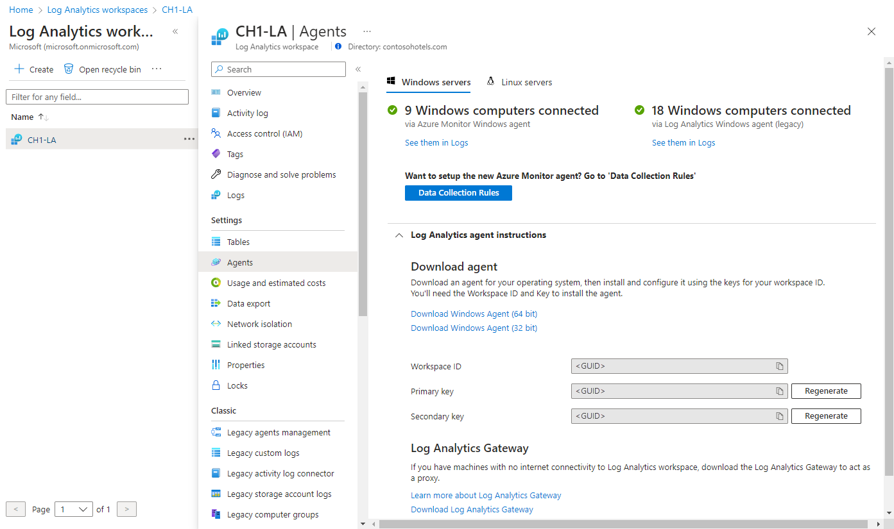

# Install Log Analytics agent on Windows computers

This article provides information on how to install the Log Analytics agent on Windows computers by using the following methods:

* Manual installation using the setup wizard or command line.
* Azure Automation Desired State Configuration (DSC). 

The installation methods described in this article are typically used for virtual machines on-premises or in other clouds. For more efficient options that you can use for Azure virtual machines, see [Installation options](./log-analytics-agent.md#installation-options).

[!INCLUDE [Log Analytics agent deprecation](../../../includes/log-analytics-agent-deprecation.md)]

> [!NOTE]
> Installing the Log Analytics agent typically won't require you to restart the machine.

## Requirements

### Supported operating systems

For a list of Windows versions supported by the Log Analytics agent, see [Overview of Azure Monitor agents](agents-overview.md#supported-operating-systems).

### SHA-2 code signing support requirement

The Windows agent began to exclusively use SHA-2 signing on August 17, 2020. This change affected customers using the Log Analytics agent on a legacy OS as part of any Azure service, such as Azure Monitor, Azure Automation, Azure Update Management, Azure Change Tracking, Microsoft Defender for Cloud, Microsoft Sentinel, and Windows Defender Advanced Threat Protection. 

The change doesn't require any customer action unless you're running the agent on a legacy OS version, such as Windows 7, Windows Server 2008 R2, and Windows Server 2008. Customers running on a legacy OS version were required to take the following actions on their machines before August 17, 2020, or their agents stopped sending data to their Log Analytics workspaces:

1. Install the latest service pack for your OS. The required service pack versions are:

    - Windows 7 SP1
    - Windows Server 2008 SP2
    - Windows Server 2008 R2 SP1

1. Install the SHA-2 signing Windows updates for your OS as described in [2019 SHA-2 code signing support requirement for Windows and WSUS](https://support.microsoft.com/help/4472027/2019-sha-2-code-signing-support-requirement-for-windows-and-wsus).
1. Update to the latest version of the Windows agent (version 10.20.18067).
1. We recommend that you configure the agent to [use TLS 1.2](agent-windows.md#configure-agent-to-use-tls-12).

### Network requirements
See [Log Analytics agent overview](./log-analytics-agent.md#network-requirements) for the network requirements for the Windows agent.
 
### Configure Agent to use TLS 1.2
[TLS 1.2](/windows-server/security/tls/tls-registry-settings#tls-12) protocol ensures the security of data in transit for communication between the Windows agent and the Log Analytics service. If you're installing on an [operating system without TLS 1.2 enabled by default](../logs/data-security.md#sending-data-securely-using-tls-12), then you should configure TLS 1.2 using the steps below.

1. Locate the following registry subkey: **HKEY_LOCAL_MACHINE\System\CurrentControlSet\Control\SecurityProviders\SCHANNEL\Protocols**.
1. Create a subkey under **Protocols** for TLS 1.2: **HKLM\System\CurrentControlSet\Control\SecurityProviders\SCHANNEL\Protocols\TLS 1.2**.
1. Create a **Client** subkey under the TLS 1.2 protocol version subkey you created earlier. For example, **HKLM\System\CurrentControlSet\Control\SecurityProviders\SCHANNEL\Protocols\TLS 1.2\Client**.
1. Create the following DWORD values under **HKLM\System\CurrentControlSet\Control\SecurityProviders\SCHANNEL\Protocols\TLS 1.2\Client**:

    * **Enabled** [Value = 1]
    * **DisabledByDefault** [Value = 0]  

Configure .NET Framework 4.6 or later to support secure cryptography because by default it's disabled. The [strong cryptography](/dotnet/framework/network-programming/tls#schusestrongcrypto) uses more secure network protocols like TLS 1.2 and blocks protocols that aren't secure.

1. Locate the following registry subkey: **HKEY_LOCAL_MACHINE\SOFTWARE\Microsoft\\.NETFramework\v4.0.30319**.
1. Create the DWORD value **SchUseStrongCrypto** under this subkey with a value of **1**.
1. Locate the following registry subkey: **HKEY_LOCAL_MACHINE\SOFTWARE\WOW6432Node\Microsoft\\.NETFramework\v4.0.30319**.
1. Create the DWORD value **SchUseStrongCrypto** under this subkey with a value of **1**.
1. Restart the system for the settings to take effect.

### Workspace ID and key

Regardless of the installation method used, you'll require the workspace ID and key for the Log Analytics workspace that the agent will connect to. Select the workspace from the **Log Analytics workspaces** menu in the Azure portal. Then in the **Settings** section, select **Agents**.

[](media/log-analytics-agent/workspace-details.png#lightbox)

> [!NOTE]
> You can't configure the agent to report to more than one workspace during initial setup. [Add or remove a workspace](agent-manage.md#add-or-remove-a-workspace) after installation by updating the settings from Control Panel or PowerShell.

## Install the agent 

[!INCLUDE [Log Analytics agent deprecation](../../../includes/log-analytics-agent-deprecation.md)]

### [Setup wizard](#tab/setup-wizard)

The following steps install and configure the Log Analytics agent in Azure and Azure Government cloud by using the setup wizard for the agent on your computer. If you want to learn how to configure the agent to also report to a System Center Operations Manager management group, see [deploy the Operations Manager agent with the Agent Setup Wizard](/system-center/scom/manage-deploy-windows-agent-manually#to-deploy-the-operations-manager-agent-with-the-agent-setup-wizard).

1. In your Log Analytics workspace, from the **Windows Servers** page you navigated to earlier, select the appropriate **Download Windows Agent** version to download depending on the processor architecture of the Windows operating system.   
2. Run Setup to install the agent on your computer.
2. On the **Welcome** page, click **Next**.
3. On the **License Terms** page, read the license and then click **I Agree**.
4. On the **Destination Folder** page, change or keep the default installation folder and then click **Next**.
5. On the **Agent Setup Options** page, choose to connect the agent to Azure Log Analytics and then click **Next**.   
6. On the **Azure Log Analytics** page, perform the following:
   1. Paste the **Workspace ID** and **Workspace Key (Primary Key)** that you copied earlier.  If the computer should report to a Log Analytics workspace in Azure Government cloud, select **Azure US Government** from the **Azure Cloud** drop-down list.  
   2. If the computer needs to communicate through a proxy server to the Log Analytics service, click **Advanced** and provide the URL and port number of the proxy server.  If your proxy server requires authentication, type the username and password to authenticate with the proxy server and then click **Next**.  
7. Click **Next** once you have completed providing the necessary configuration settings.<br><br> <br><br>
8. On the **Ready to Install** page, review your choices and then click **Install**.
9. On the **Configuration completed successfully** page, click **Finish**.

When complete, the **Microsoft Monitoring Agent** appears in **Control Panel**. To confirm it is reporting to Log Analytics, review [Verify agent connectivity to Log Analytics](#verify-agent-connectivity-to-azure-monitor). 

### [Command Line](#tab/command-line)

The downloaded file for the agent is a self-contained installation package.  The setup program for the agent and supporting files are contained in the package and need to be extracted in order to properly install using the command line shown in the following examples.    

>[!NOTE]
>If you want to upgrade an agent, you need to use the Log Analytics scripting API. For more information, see [Managing and maintaining the Log Analytics agent for Windows and Linux](agent-manage.md).

The following table highlights the specific parameters supported by setup for the agent, including when deployed by using Automation DSC.

|MMA-specific options                   |Notes         |
|---------------------------------------|--------------|
| NOAPM=1                               | Optional parameter. Installs the agent without .NET Application Performance Monitoring.|   
|ADD_OPINSIGHTS_WORKSPACE               | 1 = Configure the agent to report to a workspace.               |
|OPINSIGHTS_WORKSPACE_ID                | Workspace ID (guid) for the workspace to add.                   |
|OPINSIGHTS_WORKSPACE_KEY               | Workspace key used to initially authenticate with the workspace. |
|OPINSIGHTS_WORKSPACE_AZURE_CLOUD_TYPE  | Specify the cloud environment where the workspace is located. <br> 0 = Azure commercial cloud (default). <br> 1 = Azure Government. <br> 2 = Azure operated by 21Vianet cloud. |
|OPINSIGHTS_PROXY_URL               | URI for the proxy to use. Example: OPINSIGHTS_PROXY_URL=IPAddress:Port or OPINSIGHTS_PROXY_URL=FQDN:Port |
|OPINSIGHTS_PROXY_USERNAME               | Username to access an authenticated proxy. |
|OPINSIGHTS_PROXY_PASSWORD               | Password to access an authenticated proxy. |

1. To extract the agent installation files, from an elevated command prompt, run `MMASetup-<platform>.exe /c`. You're prompted for the path to extract files to. Alternatively, you can specify the path by passing the arguments `MMASetup-<platform>.exe /c /t:<Full Path>`.
1. To silently install the agent and configure it to report to a workspace in Azure commercial cloud, from the folder you extracted the setup files to, enter:

    ```shell
    setup.exe /qn NOAPM=1 ADD_OPINSIGHTS_WORKSPACE=1 OPINSIGHTS_WORKSPACE_AZURE_CLOUD_TYPE=0 OPINSIGHTS_WORKSPACE_ID="<your workspace ID>" OPINSIGHTS_WORKSPACE_KEY="<your workspace key>" AcceptEndUserLicenseAgreement=1
    ```

   Or to configure the agent to report to Azure US Government cloud, enter:

    ```shell
    setup.exe /qn NOAPM=1 ADD_OPINSIGHTS_WORKSPACE=1 OPINSIGHTS_WORKSPACE_AZURE_CLOUD_TYPE=1 OPINSIGHTS_WORKSPACE_ID="<your workspace ID>" OPINSIGHTS_WORKSPACE_KEY="<your workspace key>" AcceptEndUserLicenseAgreement=1
    ```
    
   Or to configure the agent to report to Microsoft Azure operated by 21Vianet cloud, enter:

    ```shell
    setup.exe /qn NOAPM=1 ADD_OPINSIGHTS_WORKSPACE=1 OPINSIGHTS_WORKSPACE_AZURE_CLOUD_TYPE=2 OPINSIGHTS_WORKSPACE_ID="<your workspace ID>" OPINSIGHTS_WORKSPACE_KEY="<your workspace key>" AcceptEndUserLicenseAgreement=1
    ```

    >[!NOTE]
    >The string values for the parameters *OPINSIGHTS_WORKSPACE_ID* and *OPINSIGHTS_WORKSPACE_KEY* need to be enclosed in double quotation marks to instruct Windows Installer to interpret as valid options for the package.

#### [Azure Automation](#tab/azure-automation)

You can use the following script example to install the agent using Azure Automation DSC. If you do not have an Automation account, see [Get started with Azure Automation](../../automation/index.yml) to understand requirements and steps for creating an Automation account required before using Automation DSC.  If you are not familiar with Automation DSC, review [Getting started with Automation DSC](../../automation/automation-dsc-getting-started.md).

The following example installs the 64-bit agent, identified by the `URI` value. You can also use the 32-bit version by replacing the URI value. The URIs for both versions are:

- **Windows 64-bit agent:** https://go.microsoft.com/fwlink/?LinkId=828603
- **Windows 32-bit agent:** https://go.microsoft.com/fwlink/?LinkId=828604

>[!NOTE]
>This procedure and script example does not support upgrading the agent already deployed to a Windows computer.

The 32-bit and 64-bit versions of the agent package have different product codes and new versions released also have a unique value.  The product code is a GUID that is the principal identification of an application or product and is represented by the Windows Installer **ProductCode** property.  The `ProductId` value in the **MMAgent.ps1** script has to match the product code from the 32-bit or 64-bit agent installer package.

To retrieve the product code from the agent install package directly, you can use Orca.exe from the [Windows SDK Components for Windows Installer Developers](/windows/win32/msi/platform-sdk-components-for-windows-installer-developers), which is a component of the Windows Software Development Kit, or using PowerShell following an [example script](https://www.scconfigmgr.com/2014/08/22/how-to-get-msi-file-information-with-powershell/) written by a Microsoft Valuable Professional (MVP). For either approach, you first need to extract the **MOMagent.msi** file from the MMASetup installation package, as explained in the first step of the instructions for installing the agent using the command line.  

1. Import the xPSDesiredStateConfiguration DSC Module from [https://www.powershellgallery.com/packages/xPSDesiredStateConfiguration](https://www.powershellgallery.com/packages/xPSDesiredStateConfiguration) into Azure Automation.  
2.    Create Azure Automation variable assets for *OPSINSIGHTS_WS_ID* and *OPSINSIGHTS_WS_KEY*. Set *OPSINSIGHTS_WS_ID* to your Log Analytics workspace ID and set *OPSINSIGHTS_WS_KEY* to the primary key of your workspace.
3.    Copy the script and save it as MMAgent.ps1.

        ```powershell
        Configuration MMAgent
        {
            $OIPackageLocalPath = "C:\Deploy\MMASetup-AMD64.exe"
            $OPSINSIGHTS_WS_ID = Get-AutomationVariable -Name "OPSINSIGHTS_WS_ID"
            $OPSINSIGHTS_WS_KEY = Get-AutomationVariable -Name "OPSINSIGHTS_WS_KEY"
        
            Import-DscResource -ModuleName xPSDesiredStateConfiguration
            Import-DscResource -ModuleName PSDesiredStateConfiguration
        
            Node OMSnode {
                Service OIService
                {
                    Name = "HealthService"
                    State = "Running"
                    DependsOn = "[Package]OI"
                }
        
                xRemoteFile OIPackage {
                    Uri = "https://go.microsoft.com/fwlink/?LinkId=828603"
                    DestinationPath = $OIPackageLocalPath
                }
        
                Package OI {
                    Ensure = "Present"
                    Path  = $OIPackageLocalPath
                    Name = "Microsoft Monitoring Agent"
                    ProductId = "8A7F2C51-4C7D-4BFD-9014-91D11F24AAE2"
                    Arguments = '/C:"setup.exe /qn NOAPM=1 ADD_OPINSIGHTS_WORKSPACE=1 OPINSIGHTS_WORKSPACE_ID=' + $OPSINSIGHTS_WS_ID + ' OPINSIGHTS_WORKSPACE_KEY=' + $OPSINSIGHTS_WS_KEY + ' AcceptEndUserLicenseAgreement=1"'
                    DependsOn = "[xRemoteFile]OIPackage"
                }
            }
        }
        
        ```

1. Update the `ProductId` value in the script with the product code extracted from the latest version of the agent installation package by using the methods recommended earlier.
1. [Import the MMAgent.ps1 configuration script](../../automation/automation-dsc-getting-started.md#import-a-configuration-into-azure-automation) into your Automation account.
1. [Assign a Windows computer or node](../../automation/automation-dsc-getting-started.md#enable-an-azure-resource-manager-vm-for-management-with-state-configuration) to the configuration. Within 15 minutes, the node checks its configuration and the agent is pushed to the node.

---

## Verify agent connectivity to Azure Monitor

After installation of the agent is finished, you can verify that it's successfully connected and reporting in two ways.

From the computer in **Control Panel**, find the item **Microsoft Monitoring Agent**. Select it, and on the **Azure Log Analytics** tab, the agent should display a message stating *The Microsoft Monitoring Agent has successfully connected to the Microsoft Operations Management Suite service.*<br><br> 

You can also perform a log query in the Azure portal:

1. In the Azure portal, search for and select **Monitor**.
1. Select **Logs** on the menu.
1. On the **Logs** pane, in the query field, enter:

    ```
    Heartbeat 
    | where Category == "Direct Agent" 
    | where TimeGenerated > ago(30m)  
    ```

In the search results that are returned, you should see heartbeat records for the computer that indicate it's connected and reporting to the service.

## Cache information

Data from the Log Analytics agent is cached on the local machine at *C:\Program Files\Microsoft Monitoring Agent\Agent\Health Service State* before it's sent to Azure Monitor. The agent attempts to upload every 20 seconds. If it fails, it will wait an exponentially increasing length of time until it succeeds. It will wait 30 seconds before the second attempt, 60 seconds before the next, 120 seconds, and so on to a maximum of 8.5 hours between retries until it successfully connects again. This wait time is slightly randomized to avoid all agents simultaneously attempting connection. Oldest data is discarded when the maximum buffer is reached.

The default cache size is 50 MB, but it can be configured between a minimum of 5 MB and maximum of 1.5 GB. It's stored in the registry key *HKEY_LOCAL_MACHINE\SYSTEM\CurrentControlSet\Services\HealthService\Parameters\Persistence Cache Maximum*. The value represents the number of pages, with 8 KB per page.

## Next steps

- Review [Managing and maintaining the Log Analytics agent for Windows and Linux](agent-manage.md) to learn about how to reconfigure, upgrade, or remove the agent from the virtual machine.
- Review [Troubleshooting the Windows agent](agent-windows-troubleshoot.md) if you encounter issues while you install or manage the agent.
