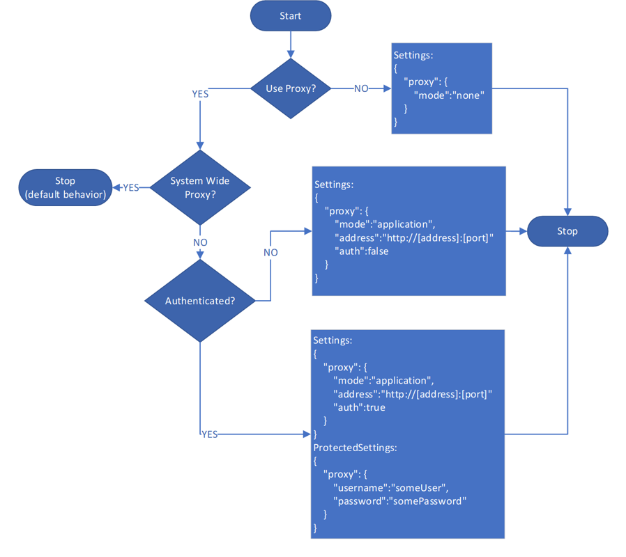

# Define Azure Monitor Agent network settings

Azure Monitor Agent supports connecting by using direct proxies, Log Analytics gateway, and private links. This article explains how to define network settings and enable network isolation for Azure Monitor Agent.

## Virtual network service tags

Azure Monitor Agent supports [Azure virtual network service tags](../../virtual-network/service-tags-overview.md). Both *AzureMonitor* and *AzureResourceManager* tags are required.

## Firewall requirements

| Cloud |Endpoint |Purpose |Port |Direction |Bypass HTTPS inspection| Example |
|------|------|------|---------|--------|--------|------|
| Azure Commercial |global.handler.control.monitor.azure.com |Access control service|Port 443 |Outbound|Yes | - |
| Azure Commercial |`<virtual-machine-region-name>`.handler.control.monitor.azure.com |Fetch data collection rules for specific machine |Port 443 |Outbound|Yes | westus2.handler.control.monitor.azure.com |
| Azure Commercial |`<log-analytics-workspace-id>`.ods.opinsights.azure.com |Ingest logs data |Port 443 |Outbound|Yes | 1234a123-aa1a-123a-aaa1-a1a345aa6789.ods.opinsights.azure.com
| Azure Commercial | management.azure.com | Only needed if sending time series data (metrics) to Azure Monitor [Custom metrics](../essentials/metrics-custom-overview.md) database | Port 443 | Outbound | Yes | - |
| Azure Commercial | `<virtual-machine-region-name>`.monitoring.azure.com  | Only needed if sending time series data (metrics) to Azure Monitor [Custom metrics](../essentials/metrics-custom-overview.md) database | Port 443 | Outbound | Yes | westus2.monitoring.azure.com |
| Azure Government | Replace '.com' above with '.us' | Same as above | Same as above | Same as above| Same as above |
| Azure China | Replace '.com' above with '.cn' | Same as above | Same as above | Same as above| Same as above |

>[!NOTE]
> If you use private links on the agent, you must also add the [data collection endpoints (DCEs)](../essentials/data-collection-endpoint-overview.md#components-of-a-data-collection-endpoint).
> The Azure Monitor Metrics (custom metrics) preview isn't available in Azure Government and Azure China clouds.

## Proxy configuration

If the machine connects through a proxy server to communicate over the internet, review the following requirements to understand the network configuration required.

The Azure Monitor Agent extensions for Windows and Linux can communicate either through a proxy server or a [Log Analytics gateway](./gateway.md) to Azure Monitor by using the HTTPS protocol. Use it for Azure virtual machines, Azure virtual machine scale sets, and Azure Arc for servers. Use the extensions settings for configuration as described in the following steps. Both anonymous and basic authentication by using a username and password are supported.

> [!IMPORTANT]
> Proxy configuration isn't supported for [Azure Monitor Metrics (public preview)](../essentials/metrics-custom-overview.md) as a destination. If you're sending metrics to this destination, it will use the public internet without any proxy.

1. Use this flowchart to determine the values of the `Settings` and `ProtectedSettings` parameters first.

    

    > [!NOTE]
    > Setting Linux system proxy via environment variables such as `http_proxy` and `https_proxy` is only supported using Azure Monitor Agent for Linux version 1.24.2 and above.

1. After you determine the `Settings` and `ProtectedSettings` parameter values, provide these other parameters when you deploy Azure Monitor Agent. Use PowerShell commands, as shown in the following examples:

# [Windows VM](#tab/PowerShellWindows)

```powershell
$settingsString = '{"proxy":{"mode":"application","address":"http://[address]:[port]","auth": true}}';
$protectedSettingsString = '{"proxy":{"username":"[username]","password": "[password]"}}';
Set-AzVMExtension -ExtensionName AzureMonitorWindowsAgent -ExtensionType AzureMonitorWindowsAgent -Publisher Microsoft.Azure.Monitor -ResourceGroupName <resource-group-name> -VMName <virtual-machine-name> -Location <location> -TypeHandlerVersion <type-handler-version> -SettingString $settingsString -ProtectedSettingString $protectedSettingsString
```

# [Linux VM](#tab/PowerShellLinux)

```powershell
$settingsString = '{"proxy":{"mode":"application","address":"http://[address]:[port]","auth": true}}';
$protectedSettingsString = '{"proxy":{"username":"[username]","password": "[password]"}}';
Set-AzVMExtension -ExtensionName AzureMonitorLinuxAgent -ExtensionType AzureMonitorLinuxAgent -Publisher Microsoft.Azure.Monitor -ResourceGroupName <resource-group-name> -VMName <virtual-machine-name> -Location <location> -TypeHandlerVersion <type-handler-version> -SettingString $settingsString -ProtectedSettingString $protectedSettingsString
```

# [Windows Arc-enabled server](#tab/PowerShellWindowsArc)

```powershell
$settings = @{"proxy" = @{mode = "application"; address = "http://[address]:[port]"; auth = "true"}}
$protectedSettings = @{"proxy" = @{username = "[username]"; password = "[password]"}}

New-AzConnectedMachineExtension -Name AzureMonitorWindowsAgent -ExtensionType AzureMonitorWindowsAgent -Publisher Microsoft.Azure.Monitor -ResourceGroupName <resource-group-name> -MachineName <arc-server-name> -Location <arc-server-location> -Setting $settings -ProtectedSetting $protectedSettings
```

# [Linux Arc-enabled server](#tab/PowerShellLinuxArc)

```powershell
$settings = @{"proxy" = @{mode = "application"; address = "http://[address]:[port]"; auth = "true"}}
$protectedSettings = @{"proxy" = @{username = "[username]"; password = "[password]"}}

New-AzConnectedMachineExtension -Name AzureMonitorLinuxAgent -ExtensionType AzureMonitorLinuxAgent -Publisher Microsoft.Azure.Monitor -ResourceGroupName <resource-group-name> -MachineName <arc-server-name> -Location <arc-server-location> -Setting $settings -ProtectedSetting $protectedSettings
```

---

## Log Analytics gateway configuration

1. Follow the preceding instructions to configure proxy settings on the agent and provide the IP address and port number that correspond to the gateway server. If you've deployed multiple gateway servers behind a load balancer, the agent proxy configuration is the virtual IP address of the load balancer instead.
1. Add the **configuration endpoint URL** to fetch data collection rules to the allowlist for the gateway
   `Add-OMSGatewayAllowedHost -Host global.handler.control.monitor.azure.com`
   `Add-OMSGatewayAllowedHost -Host <gateway-server-region-name>.handler.control.monitor.azure.com`.
   (If you're using private links on the agent, you must also add the [data collection endpoints](../essentials/data-collection-endpoint-overview.md#components-of-a-data-collection-endpoint).)
1. Add the **data ingestion endpoint URL** to the allowlist for the gateway
   `Add-OMSGatewayAllowedHost -Host <log-analytics-workspace-id>.ods.opinsights.azure.com`.
1. Restart the **OMS Gateway** service to apply the changes
   `Stop-Service -Name <gateway-name>` and
   `Start-Service -Name <gateway-name>`.

## Enable network isolation for Azure Monitor Agent

By default, Azure Monitor Agent connects to a public endpoint to connect to your Azure Monitor environment. To enable network isolation for your agents, create [data collection endpoints](../essentials/data-collection-endpoint-overview.md) and add them to your [Azure Monitor Private Link Scopes (AMPLS)](../logs/private-link-configure.md#connect-azure-monitor-resources).

### Create a data collection endpoint

[Create a data collection endpoint](../essentials/data-collection-endpoint-overview.md#create-a-data-collection-endpoint) for each of your regions so that agents can connect instead of using the public endpoint. An agent can only connect to a DCE in the same region. If you have agents in multiple regions, you must create a DCE in each one.

### Create a private link

With [Azure Private Link](../../private-link/private-link-overview.md), you can securely link Azure platform as a service (PaaS) resources to your virtual network by using private endpoints. An Azure Monitor private link connects a private endpoint to a set of Azure Monitor resources that define the boundaries of your monitoring network. That set is called an Azure Monitor Private Link Scope. For information on how to create and configure your AMPLS, see [Configure your private link](../logs/private-link-configure.md).

### Add DCEs to AMPLS

Add the data collection endpoints to a new or existing [Azure Monitor Private Link Scopes](../logs/private-link-configure.md#connect-azure-monitor-resources) resource. This process adds the DCEs to your private DNS zone (see [how to validate](../logs/private-link-configure.md#review-and-validate-your-private-link-setup)) and allows communication via private links. You can do this task from the AMPLS resource or on an existing DCE resource's **Network isolation** tab.

> [!NOTE]
> Other Azure Monitor resources like the Log Analytics workspaces configured in your data collection rules that you want to send data to must be part of this same AMPLS resource.

For your data collection endpoints, ensure the **Accept access from public networks not connected through a Private Link Scope** option is set to **No** on the **Network Isolation** tab of your endpoint resource in the Azure portal. This setting ensures that public internet access is disabled and network communication only happens via private links.

:::image type="content" source="media/azure-monitor-agent-dce/data-collection-endpoint-network-isolation.png" lightbox="media/azure-monitor-agent-dce/data-collection-endpoint-network-isolation.png" alt-text="Screenshot that shows configuring data collection endpoint network isolation.":::

### Associate DCEs to target machines
Associate the data collection endpoints to the target resources by editing the data collection rule in the Azure portal. On the **Resources** tab, select **Enable Data Collection Endpoints**. Select a DCE for each virtual machine. See [Configure data collection for Azure Monitor Agent](../agents/data-collection-rule-azure-monitor-agent.md).

:::image type="content" source="media/azure-monitor-agent-dce/data-collection-rule-virtual-machines-with-endpoint.png" lightbox="media/azure-monitor-agent-dce/data-collection-rule-virtual-machines-with-endpoint.png" alt-text="Screenshot that shows configuring data collection endpoints for an agent.":::

## Next steps

- [Associate endpoint to machines](../agents/data-collection-rule-azure-monitor-agent.md#create-a-data-collection-rule)
- [Add endpoint to AMPLS resource](../logs/private-link-configure.md#connect-azure-monitor-resources).
