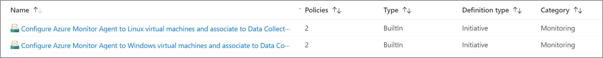
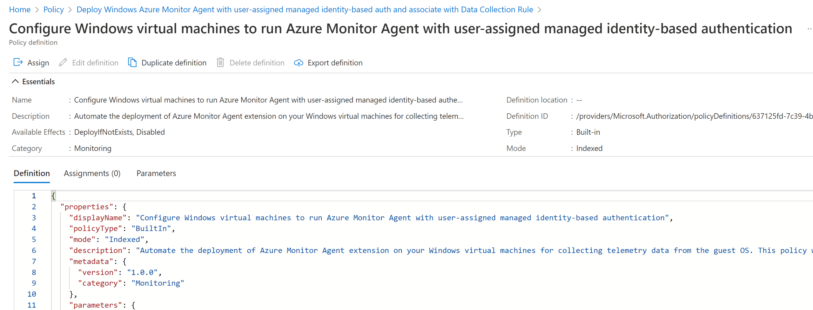
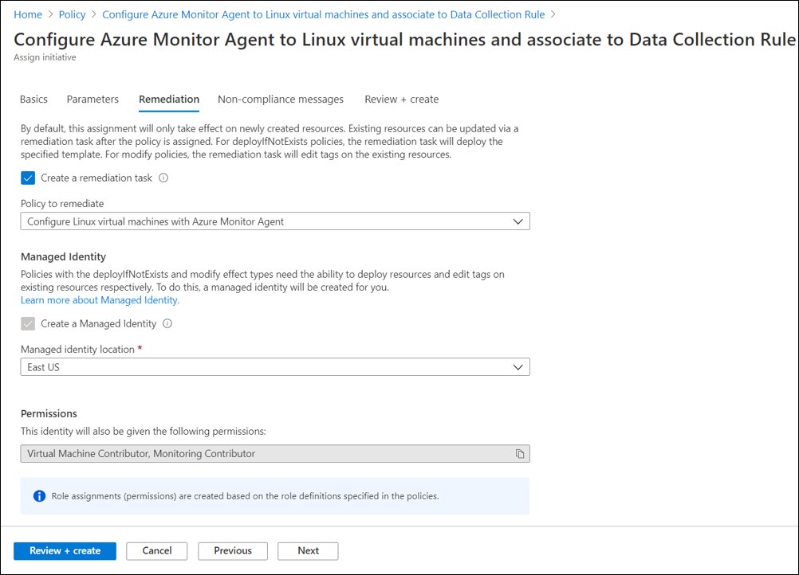

# Manage the Azure Monitor agent
This article provides the different options currently available to install, uninstall and update the [Azure Monitor agent](azure-monitor-agent-overview.md). This agent extension can be installed on Azure virtual machines, scale sets and Azure Arc-enabled servers. It also lists the options to create [associations with data collection rules](data-collection-rule-azure-monitor-agent.md) that define which data the agent should collect.  Installing, upgrading, or uninstalling the Azure Monitor Agent will not require you to restart your server.

## Virtual machine extension details
The Azure Monitor agent is implemented as an [Azure VM extension](../../virtual-machines/extensions/overview.md) with the details in the following table. It can be installed using any of the methods to install virtual machine extensions including those described in this article.

| Property | Windows | Linux |
|:---|:---|:---|
| Publisher | Microsoft.Azure.Monitor  | Microsoft.Azure.Monitor |
| Type      | AzureMonitorWindowsAgent | AzureMonitorLinuxAgent  |
| TypeHandlerVersion  | 1.2 | 1.15 |

## Extension versions
[View Azure Monitor Agent extension versions](./azure-monitor-agent-extension-versions.md).


## Prerequisites
The following prerequisites must be met prior to installing the Azure Monitor agent.

- **Permissions**: For methods other than Azure portal, you must have the following role assignments to install the agent:  

   | Built-in Role | Scope(s) | Reason |  
   |:---|:---|:---|  
   | <ul><li>[Virtual Machine Contributor](../../role-based-access-control/built-in-roles.md#virtual-machine-contributor)</li><li>[Azure Connected Machine Resource Administrator](../../role-based-access-control/built-in-roles.md#azure-connected-machine-resource-administrator)</li></ul> | <ul><li>Virtual machines, scale sets</li><li>Arc-enabled servers</li></ul> | To deploy the agent |  
   | Any role that includes the action *Microsoft.Resources/deployments/** | <ul><li>Subscription and/or</li><li>Resource group and/or </li></ul> | To deploy ARM templates |  
- **Non-Azure**: For installing the agent on physical servers and virtual machines hosted *outside* of Azure (i.e. on-premises) or in other clouds, you must [install the Azure Arc Connected Machine agent](../../azure-arc/servers/agent-overview.md) first (at no added cost)
- **Authentication**: [Managed identity](../../active-directory/managed-identities-azure-resources/overview.md) must be enabled on Azure virtual machines. Both system-assigned and user-assigned managed identities are supported.
  - **User-assigned**: This is recommended for large scale deployments, configurable via [built-in Azure policies](#using-azure-policy). It can be created once and shared across multiple VMs, and is thus more scalable than system-assigned.
  - **System-assigned**: This is suited for initial testing or small deployments. When used at scale (for example, for all VMs in a subscription) it results in substantial number of identities created (and deleted) in Azure AD (Azure Active Directory). To avoid this churn of identities, it is recommended to use user-assigned managed identities instead. **For Arc-enabled servers, system-assigned managed identity is enabled automatically** (as soon as you install the Arc agent) as it's the only supported type for Arc-enabled servers.
  - This is not required for Azure Arc-enabled servers. The system identity will be enabled automatically if the agent is installed via [creating and assigning a data collection rule using the Azure portal](data-collection-rule-azure-monitor-agent.md#create-rule-and-association-in-azure-portal).
- **Networking**: The [AzureResourceManager service tag](../../virtual-network/service-tags-overview.md) must be enabled on the virtual network for the virtual machine. Additionally, the virtual machine must have access to the following HTTPS endpoints:
  -	global.handler.control.monitor.azure.com
  -	`<virtual-machine-region-name>`.handler.control.monitor.azure.com (example: westus.handler.control.azure.com)
  -	`<log-analytics-workspace-id>`.ods.opinsights.azure.com (example: 12345a01-b1cd-1234-e1f2-1234567g8h99.ods.opsinsights.azure.com)  
    (If using private links on the agent, you must also add the [dce endpoints](../essentials/data-collection-endpoint-overview.md#components-of-a-data-collection-endpoint))


> [!NOTE]
> This article only pertains to agent installation or management. After you install the agent, you must review the next article to [configure data collection rules and associate them with the machines](./data-collection-rule-azure-monitor-agent.md) with agents installed.  
> **The Azure Monitor agents cannot function without being associated with data collection rules.**


## Using the Azure portal

### Install
To install the Azure Monitor agent using the Azure portal, follow the process to [create a data collection rule](data-collection-rule-azure-monitor-agent.md#create-rule-and-association-in-azure-portal) in the Azure portal. This not only creates the rule, but it also associates it to the selected resources and installs the Azure Monitor agent on them if not already installed.

### Uninstall
To uninstall the Azure Monitor agent using the Azure portal, navigate to your virtual machine, scale set or Arc-enabled server, select the **Extensions** tab and click on **AzureMonitorWindowsAgent** or **AzureMonitorLinuxAgent**. In the dialog that pops up, click **Uninstall**.

### Update
To perform a **one time update** of the agent, you must first uninstall the existing agent version and then install the new version as described above.  
The **recommendation** is to enable automatic update of the agent by enabling the [Automatic Extension Upgrade](../../virtual-machines/automatic-extension-upgrade.md) feature. Navigate to your virtual machine or scale set, select the **Extensions** tab and click on **AzureMonitorWindowsAgent** or **AzureMonitorLinuxAgent**. In the dialog that pops up, click **Enable automatic upgrade**.

## Using Resource Manager template

### Install
You can use Resource Manager templates to install the Azure Monitor agent on Azure virtual machines and on Azure Arc-enabled servers and to create an association with data collection rules. You must create any data collection rule prior to creating the association.

Get sample templates for installing the agent and creating the association from the following: 

- [Template to install Azure Monitor agent (Azure and Azure Arc)](../agents/resource-manager-agent.md#azure-monitor-agent) 
- [Template to create association with data collection rule](./resource-manager-data-collection-rules.md)

Install the templates using [any deployment method for Resource Manager templates](../../azure-resource-manager/templates/deploy-powershell.md) such as the following commands.

# [PowerShell](#tab/ARMAgentPowerShell)
```powershell
New-AzResourceGroupDeployment -ResourceGroupName "<resource-group-name>" -TemplateFile "<template-filename.json>" -TemplateParameterFile "<parameter-filename.json>"
```
# [CLI](#tab/ARMAgentCLI)
```powershell
New-AzResourceGroupDeployment -ResourceGroupName "<resource-group-name>" -TemplateFile "<template-filename.json>" -TemplateParameterFile "<parameter-filename.json>"
```
---

## Using PowerShell
You can install the Azure Monitor agent on Azure virtual machines and on Azure Arc-enabled servers using the PowerShell command for adding a virtual machine extension. 

### Install on Azure virtual machines
Use the following PowerShell commands to install the Azure Monitor agent on Azure virtual machines.
# [Windows](#tab/PowerShellWindows)
```powershell
Set-AzVMExtension -Name AMAWindows -ExtensionType AzureMonitorWindowsAgent -Publisher Microsoft.Azure.Monitor -ResourceGroupName <resource-group-name> -VMName <virtual-machine-name> -Location <location> -TypeHandlerVersion <version-number>
```
# [Linux](#tab/PowerShellLinux)
```powershell
Set-AzVMExtension -Name AMALinux -ExtensionType AzureMonitorLinuxAgent -Publisher Microsoft.Azure.Monitor -ResourceGroupName <resource-group-name> -VMName <virtual-machine-name> -Location <location> -TypeHandlerVersion <version-number>
```
---

### Uninstall on Azure virtual machines
Use the following PowerShell commands to install the Azure Monitor agent on Azure virtual machines.
# [Windows](#tab/PowerShellWindows)
```powershell
Remove-AzVMExtension -Name AMAWindows -ResourceGroupName <resource-group-name> -VMName <virtual-machine-name> 
```
# [Linux](#tab/PowerShellLinux)
```powershell
Remove-AzVMExtension -Name AMALinux -ResourceGroupName <resource-group-name> -VMName <virtual-machine-name> 
```
---

### Update on Azure virtual machines
To perform a **one time update** of the agent, you must first uninstall the existing agent version and then install the new version as described above.  
The **recommendation** is to enable automatic update of the agent by enabling the [Automatic Extension Upgrade](../../virtual-machines/automatic-extension-upgrade.md) feature, using the following PowerShell commands.
# [Windows](#tab/PowerShellWindows)
```powershell
Set-AzVMExtension -ExtensionName AMAWindows -ResourceGroupName <resource-group-name> -VMName <virtual-machine-name> -Publisher Microsoft.Azure.Monitor -ExtensionType AzureMonitorWindowsAgent -TypeHandlerVersion <version-number> -Location <location> -EnableAutomaticUpgrade $true
```
# [Linux](#tab/PowerShellLinux)
```powershell
Set-AzVMExtension -ExtensionName AMALinux -ResourceGroupName <resource-group-name> -VMName <virtual-machine-name> -Publisher Microsoft.Azure.Monitor -ExtensionType AzureMonitorLinuxAgent -TypeHandlerVersion <version-number> -Location <location> -EnableAutomaticUpgrade $true
```
--- 
   

### Install on Azure Arc-enabled servers
Use the following PowerShell commands to install the Azure Monitor agent on Azure Arc-enabled servers.
# [Windows](#tab/PowerShellWindowsArc)
```powershell
New-AzConnectedMachineExtension -Name AMAWindows -ExtensionType AzureMonitorWindowsAgent -Publisher Microsoft.Azure.Monitor -ResourceGroupName <resource-group-name> -MachineName <arc-server-name> -Location <arc-server-location>
```
# [Linux](#tab/PowerShellLinuxArc)
```powershell
New-AzConnectedMachineExtension -Name AMALinux -ExtensionType AzureMonitorLinuxAgent -Publisher Microsoft.Azure.Monitor -ResourceGroupName <resource-group-name> -MachineName <arc-server-name> -Location <arc-server-location>
```
---

### Uninstall on Azure Arc-enabled servers
Use the following PowerShell commands to install the Azure Monitor agent on Azure Arc-enabled servers.
# [Windows](#tab/PowerShellWindowsArc)
```powershell
Remove-AzConnectedMachineExtension -MachineName <arc-server-name> -ResourceGroupName <resource-group-name> -Name AMAWindows
```
# [Linux](#tab/PowerShellLinuxArc)
```powershell
Remove-AzConnectedMachineExtension -MachineName <arc-server-name> -ResourceGroupName <resource-group-name> -Name AMALinux
```
---

### Upgrade on Azure Arc-enabled servers
To perform a **one time** upgrade of the agent, use the following PowerShell commands:

# [Windows](#tab/PowerShellWindowsArc)
```powershell
$target = @{"Microsoft.Azure.Monitor.AzureMonitorWindowsAgent" = @{"targetVersion"=<target-version-number>}}
Update-AzConnectedExtension -ResourceGroupName $env.ResourceGroupName -MachineName <arc-server-name> -ExtensionTarget $target
```
# [Linux](#tab/PowerShellLinuxArc)
```powershell
$target = @{"Microsoft.Azure.Monitor.AzureMonitorLinuxAgent" = @{"targetVersion"=<target-version-number>}}
Update-AzConnectedExtension -ResourceGroupName $env.ResourceGroupName -MachineName <arc-server-name> -ExtensionTarget $target
```
---

The **recommendation** is to enable automatic update of the agent by enabling the [Automatic Extension Upgrade (preview)](../../azure-arc/servers/manage-automatic-vm-extension-upgrade.md#enabling-automatic-extension-upgrade-preview) feature, using the following PowerShell commands.
# [Windows](#tab/PowerShellWindowsArc)
```powershell
Update-AzConnectedMachineExtension -ResourceGroup <resource-group-name> -MachineName <arc-server-name> -Name AMAWindows -EnableAutomaticUpgrade
```
# [Linux](#tab/PowerShellLinuxArc)
```powershell
Update-AzConnectedMachineExtension -ResourceGroup <resource-group-name> -MachineName <arc-server-name> -Name AMALinux -EnableAutomaticUpgrade
```
---


## Using Azure CLI
You can install the Azure Monitor agent on Azure virtual machines and on Azure Arc-enabled servers using the Azure CLI command for adding a virtual machine extension. 

### Install on Azure virtual machines
Use the following CLI commands to install the Azure Monitor agent on Azure virtual machines.
# [Windows](#tab/CLIWindows)
```azurecli
az vm extension set --name AzureMonitorWindowsAgent --publisher Microsoft.Azure.Monitor --ids <vm-resource-id>
```
# [Linux](#tab/CLILinux)
```azurecli
az vm extension set --name AzureMonitorLinuxAgent --publisher Microsoft.Azure.Monitor --ids <vm-resource-id>
```
---

### Uninstall on Azure virtual machines
Use the following CLI commands to install the Azure Monitor agent on Azure virtual machines.
# [Windows](#tab/CLIWindows)
```azurecli
az vm extension delete --resource-group <resource-group-name> --vm-name <virtual-machine-name> -name AzureMonitorWindowsAgent
```
# [Linux](#tab/CLILinux)
```azurecli
az vm extension delete --resource-group <resource-group-name> --vm-name <virtual-machine-name> -name AzureMonitorLinuxAgent
```
---

### Update on Azure virtual machines
To perform a **one time update** of the agent, you must first uninstall the existing agent version and then install the new version as described above.  
The **recommendation** is to enable automatic update of the agent by enabling the [Automatic Extension Upgrade](../../virtual-machines/automatic-extension-upgrade.md) feature, using the following CLI commands.
# [Windows](#tab/CLIWindows)
```azurecli
az vm extension set -name AzureMonitorWindowsAgent --publisher Microsoft.Azure.Monitor --vm-name <virtual-machine-name> --resource-group <resource-group-name> --enable-auto-upgrade true
```
# [Linux](#tab/CLILinux)
```azurecli
az vm extension set -name AzureMonitorLinuxAgent --publisher Microsoft.Azure.Monitor --vm-name <virtual-machine-name> --resource-group <resource-group-name> --enable-auto-upgrade true
```
---


### Install on Azure Arc-enabled servers
Use the following CLI commands to install the Azure Monitor agent onAzure Azure Arc-enabled servers.

# [Windows](#tab/CLIWindowsArc)
```azurecli
az connectedmachine extension create --name AzureMonitorWindowsAgent --publisher Microsoft.Azure.Monitor --type AzureMonitorWindowsAgent --machine-name <arc-server-name> --resource-group <resource-group-name> --location <arc-server-location>
```
# [Linux](#tab/CLILinuxArc)
```azurecli
az connectedmachine extension create --name AzureMonitorLinuxAgent --publisher Microsoft.Azure.Monitor --type AzureMonitorLinuxAgent --machine-name <arc-server-name> --resource-group <resource-group-name> --location <arc-server-location>
```
---

### Uninstall on Azure Arc-enabled servers
Use the following CLI commands to install the Azure Monitor agent onAzure Azure Arc-enabled servers.

# [Windows](#tab/CLIWindowsArc)
```azurecli
az connectedmachine extension delete --name AzureMonitorWindowsAgent --machine-name <arc-server-name> --resource-group <resource-group-name>
```
# [Linux](#tab/CLILinuxArc)
```azurecli
az connectedmachine extension delete --name AzureMonitorLinuxAgent --machine-name <arc-server-name> --resource-group <resource-group-name>
```
---

### Upgrade on Azure Arc-enabled servers
To perform a **one time upgrade** of the agent, use the following CLI commands:
# [Windows](#tab/CLIWindowsArc)
```azurecli
az connectedmachine upgrade-extension --extension-targets "{\"Microsoft.Azure.Monitor.AzureMonitorWindowsAgent\":{\"targetVersion\":\"<target-version-number>\"}}" --machine-name <arc-server-name> --resource-group <resource-group-name>
```
# [Linux](#tab/CLILinuxArc)
```azurecli
az connectedmachine upgrade-extension --extension-targets "{\"Microsoft.Azure.Monitor.AzureMonitorWindowsAgent\":{\"targetVersion\":\"<target-version-number>\"}}" --machine-name <arc-server-name> --resource-group <resource-group-name>
```
---

The **recommendation** is to enable automatic update of the agent by enabling the [Automatic Extension Upgrade (preview)](../../azure-arc/servers/manage-automatic-vm-extension-upgrade.md#enabling-automatic-extension-upgrade-preview) feature, using the following PowerShell commands.
# [Windows](#tab/CLIWindowsArc)
```azurecli
az connectedmachine extension update --name AzureMonitorWindowsAgent --machine-name <arc-server-name> --resource-group <resource-group-name> --enable-auto-upgrade true
```
# [Linux](#tab/CLILinuxArc)
```azurecli
az connectedmachine extension update --name AzureMonitorLinuxAgent --machine-name <arc-server-name> --resource-group <resource-group-name> --enable-auto-upgrade true
```
---


## Using Azure Policy
Use the following policies and policy initiatives to automatically install the agent and associate it with a data collection rule, every time you create a virtual machine.

### Built-in policy initiatives
[View prerequisites for agent installation](azure-monitor-agent-manage.md#prerequisites). 

Policy initiatives for Windows and Linux virtual machines consist of individual policies that:

- Create and assign built-in user-assigned managed identity, per subscription, per region. [Learn more](../../active-directory/managed-identities-azure-resources/how-to-assign-managed-identity-via-azure-policy.md#policy-definition-and-details)
- Install the Azure Monitor agent extension on the virtual machine, and configure it to use user-assigned identity as specified by the parameters below
  - `Bring Your Own User-Assigned Managed Identity`: If set to false, it configures the agent to use the built-in user-assigned managed identity created by the policy above. If set to true, it configures the agent to use an existing user-assigned identity that **must be assigned** to the machine(s) in scope.
  - `User-Assigned Managed Identity Name`: If using your own identity, specify the name of the identity that's assigned to the machine(s)
  - `User-Assigned Managed Identity Name`: If using your own identity, specify the resource group where it is created
- Create and deploy the association to link the machine to specified data collection rule.

  

### Built-in policies 
You can choose to use the individual policies from the policy initiative above to perform a single action at scale. For example, if you only want to automatically install the agent, use the second policy from the initiative as shown in the following example.  

  

### Remediation
The initiatives or policies will apply to each virtual machine as it's created. A [remediation task](../../governance/policy/how-to/remediate-resources.md) deploys the policy definitions in the initiative to *existing resources*, so you can configure the Azure Monitor agent for any resources that were already created. 

When you create the assignment by using the Azure portal, you have the option of creating a remediation task at the same time. See [Remediate non-compliant resources with Azure Policy](../../governance/policy/how-to/remediate-resources.md) for details on the remediation.



## Next steps

- [Create a data collection rule](data-collection-rule-azure-monitor-agent.md) to collect data from the agent and send it to Azure Monitor.
