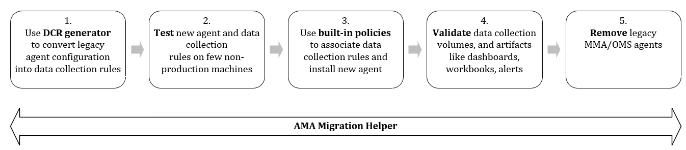

# Tools for migrating from Log Analytics Agent to Azure Monitor Agent 

Azure Monitor Agent (AMA) replaces the Log Analytics Agent (MMA/OMS) for Windows and Linux virtual machines, scale sets, on premise, 3rd party clouds and Arc-enabled servers. The [benefits of migrating to Azure Monitor Agent](../agents/azure-monitor-agent-migration.md) include enhanced security, cost-effectiveness, performance, manageability and reliability. This article explains how to use the AMA Migration Helper and DCR Config Generator tools to help automate and track the migration from Log Analytics Agent to Azure Monitor Agent.

  

> [!IMPORTANT]
> Do not remove the legacy agents if being used by other [Azure solutions or services](./azure-monitor-agent-overview.md#supported-services-and-features). Use the migration helper to discover which solutions/services you use today.

[!INCLUDE [Log Analytics agent deprecation](../../../includes/log-analytics-agent-deprecation.md)]

## Using AMA Migration Helper (preview)

AMA Migration Helper is a workbook-based Azure Monitor solution that helps you **discover what to migrate** and **track progress** as you move from Log Analytics Agent to Azure Monitor Agent. Use this single pane of glass view to expedite and track the status of your agent migration journey. 

You can access the workbook [here](https://portal.azure.com/#view/AppInsightsExtension/UsageNotebookBlade/ComponentId/Azure%20Monitor/ConfigurationId/community-Workbooks%2FAzure%20Monitor%20-%20Agents%2FAgent%20Migration%20Tracker/Type/workbook/WorkbookTemplateName/AMA%20Migration%20Helper), or find it on the [Azure portal (preview)](https://portal.azure.com/?feature.includePreviewTemplates=true) under **Monitor** > **Workbooks** > **Public Templates** > **Azure Monitor essentials** > **AMA Migration Helper**.

:::image type="content" source="media/azure-monitor-migration-tools/ama-migration-helper.png" lightbox="media/azure-monitor-migration-tools/ama-migration-helper.png" alt-text="Screenshot of the Azure Monitor Agent Migration Helper workbook. The screenshot highlights the Subscription and Workspace dropdowns and shows the Azure Virtual Machines tab, on which you can track which agent is deployed on each virtual machine.":::

## Installing and using DCR Config Generator (preview)
Azure Monitor Agent relies only on [data collection rules (DCRs)](../essentials/data-collection-rule-overview.md) for configuration, whereas Log Analytics Agent inherits its configuration from Log Analytics workspaces. 

Use the DCR Config Generator tool to parse Log Analytics Agent configuration from your workspaces and generate/deploy corresponding data collection rules automatically. You can then associate the rules to machines running the new agent using built-in association policies. 

> [!NOTE]
> DCR Config Generator does not currently support additional configuration for [Azure solutions or services](./azure-monitor-agent-overview.md#supported-services-and-features) dependent on Log Analytics Agent.

### Prerequisites
To install DCR Config Generator, you need:

1. PowerShell version 5.1 or higher. We recommend using PowerShell version 7.1.3 or higher.
1. Read access for the specified workspace resources.
1. The `Az Powershell` module to pull workspace agent configuration information.
1. The Azure credentials for running `Connect-AzAccount` and `Select-AzSubscription`, which set the context for the script to run.

To install DCR Config Generator:

1. [Download the PowerShell script](https://github.com/microsoft/AzureMonitorCommunity/tree/master/Azure%20Services/Azure%20Monitor/Agents/Migration%20Tools/DCR%20Config%20Generator).

1. Run the script:

	Option 1: Outputs **ready-to-deploy ARM template files** only that will create the generated DCR in the specified subscription and resource group, when deployed.

	```powershell
	.\WorkspaceConfigToDCRMigrationTool.ps1 -SubscriptionId $subId -ResourceGroupName $rgName -WorkspaceName $workspaceName -DCRName $dcrName -Location $location -FolderPath $folderPath
	```
	Option 2: Outputs **ready-to-deploy ARM template files** and **the DCR JSON files** separately for you to deploy via other means. You need to set the `GetDcrPayload` parameter.

	```powershell
	.\WorkspaceConfigToDCRMigrationTool.ps1 -SubscriptionId $subId -ResourceGroupName $rgName -WorkspaceName $workspaceName -DCRName $dcrName -Location $location -FolderPath $folderPath -GetDcrPayload
	```

	**Parameters**  
	
	| Parameter | Required? | Description |
	|------|------|------|
	| `SubscriptionId` | Yes | ID of the subscription that contains the target workspace. |
	| `ResourceGroupName` | Yes | Resource group that contains the target workspace. |
	| `WorkspaceName` | Yes | Name of the target workspace. |
	| `DCRName` | Yes | Name of the new DCR. |
	| `Location` | Yes | Region location for the new DCR. |
	| `GetDcrPayload` | No | When set, it generates additional DCR JSON files 
	| `FolderPath` | No | Path in which to save the ARM template files and JSON files (optional). By default, Azure Monitor uses the current directory. |  
	
1. Review the output ARM template files. The script can produce two types of ARM template files, depending on the agent configuration in the target workspace:

	- Windows ARM template and parameter files - if the target workspace contains Windows performance counters or Windows events.
	- Linux ARM template and parameter files - if the target workspace contains Linux performance counters or Linux Syslog events.
	
1. Use the built-in rule association policies to [associate the generated data collection rules with virtual machines](./data-collection-rule-azure-monitor-agent.md#create-data-collection-rule-and-association) running the new agent.
