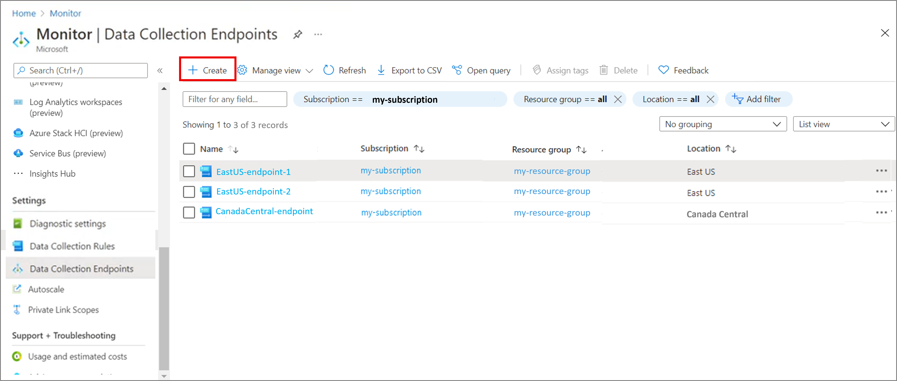
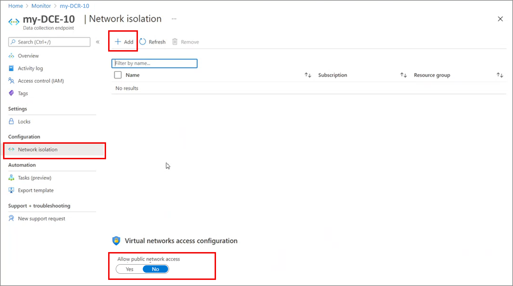

# Data collection endpoints in Azure Monitor (preview)
Data Collection Endpoints (DCE) allow you to uniquely configure ingestion settings for your machines, giving you greater control over your networking requirements. This article provides an overview of data collection endpoints including their contents and structure and how you can create and work with them.

## Components of a data collection endpoint
A data collection endpoint includes the following components.

| Component | Description |
|:---|:---|
| Configuration access endpoint | The endpoint used to access the configuration service to fetch associated data collection rules (DCR) |
| Logs ingestion endpoint | The endpoint used to ingest logs to Log Analytics workspace(s)
| Network Access Control Lists (ACLs) | Network access control rules for the endpoints


## Regionality
Data collection endpoints are ARM resources created within specific regions. An endpoint in a given region can only be **associated with machines in the same region**, although you can have more than one endpoint within the same region as per your needs.

## Limits
Data collection endpoints only support Log Analytics as a destination for collected data. 

## Create endpoint in Azure portal
You can use the Azure portal to create a data collection endpoint and associate virtual machines in your subscription to that rule. 

> [!NOTE]
> The data collection endpoint should be created in the **same region** where your virtual machines exist.  

In the **Azure Monitor** menu in the Azure portal, select **Data Collection Endpoint** from the **Settings** section. Click **Create** to create a new Data Collection Rule and assignment.

[](media/data-collection-endpoint-overview/data-collection-endpoint-overview.png#lightbox)

Click **Create** to create a new endpoint. Provide a **Rule name** and specify a **Subscription**, **Resource Group** and **Region**. This specifies where the DCE will be created.

[](media/data-collection-endpoint-overview/data-collection-endpoint-basics.png#lightbox)

Click **Review + create** to review the details of the data collection endpoint. Click **Create** to create it.

## Create rule and association using REST API

> [!NOTE]
> The data collection endpoint should be created in the **same region** where your virtual machines exist.  

Create and manage data collection endpoints using these [REST APIs](/rest/api/monitor/datacollectionendpoints).

## Sample data collection endpoint
The sample data collection endpoint below is for virtual machines with Azure Monitor agent, with public network access disabled so that agent only uses private links to communicate and send data to Azure Monitor/Log Analytics.

```json
{
  "id": "/subscriptions/xxxxxxxx-xxxx-xxxx-xxxx-xxxxxxxxxx/resourceGroups/myResourceGroup/providers/Microsoft.Insights/dataCollectionEndpoints/myCollectionEndpoint",
  "name": "myCollectionEndpoint",
  "type": "Microsoft.Insights/dataCollectionEndpoints",
  "location": "eastus",
  "tags": {
    "tag1": "A",
    "tag2": "B"
  },
  "properties": {
    "configurationAccess": {
      "endpoint": "https://mycollectionendpoint-abcd.eastus-1.control.monitor.azure.com"
    },
    "logsIngestion": {
      "endpoint": "https://mycollectionendpoint-abcd.eastus-1.ingest.monitor.azure.com"
    },
    "networkAcls": {
      "publicNetworkAccess": "Disabled"
    }
  },
  "systemData": {
    "createdBy": "user1",
    "createdByType": "User",
    "createdAt": "yyyy-mm-ddThh:mm:ss.sssssssZ",
    "lastModifiedBy": "user2",
    "lastModifiedByType": "User",
    "lastModifiedAt": "yyyy-mm-ddThh:mm:ss.sssssssZ"
  },
  "etag": "xxxxxxxx-xxxx-xxxx-xxxx-xxxxxxxxxxxx"
}
```

## Enable network isolation for the Azure Monitor Agent
You can use data collection endpoints to enable the Azure Monitor agent to communicate to the internet via private links. To do so, you must:
- Create data collection endpoint(s), at least one per region, as shown above
- Add the data collection endpoints to an [Azure Monitor Private Link Scopes (AMPLS)](../logs/private-link-security.md#connect-azure-monitor-resources) resource. This adds the DCE endpoints to your private DNS and allows communication via private links.
	> [!NOTE]
	> Other Azure Monitor resources like the Log Analytics workspace(s) you wish to send data to, must be part of this same AMPLS resource.
- Ensure **Allow public network access for ingestion** option is set to **No** under the 'Network Isolation' tab of your data collection endpoint resource. This ensures that public internet access is disabled and network communication only happen via private links.
- Configure the data collection endpoints for the target resources, as part of the data collection rules. This results in the agent using the configured the data collection endpoint(s) for network communications. See [Configure data collection for the Azure Monitor agent](../agents/data-collection-rule-azure-monitor-agent.md).



## Next steps
- [Associate endpoint to machines](data-collection-rule-azure-monitor-agent.md#create-rule-and-association-in-azure-portal)
- [Add endpoint to AMPLS resource](../logs/private-link-security.md#connect-azure-monitor-resources) 
