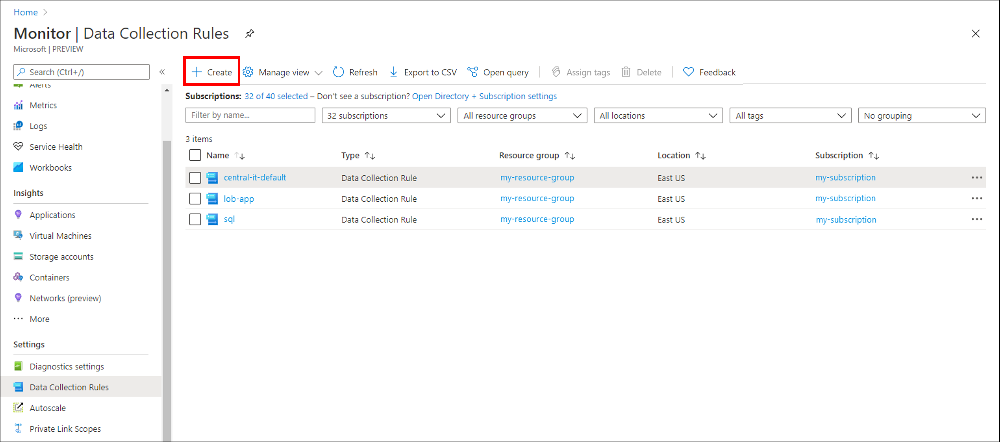
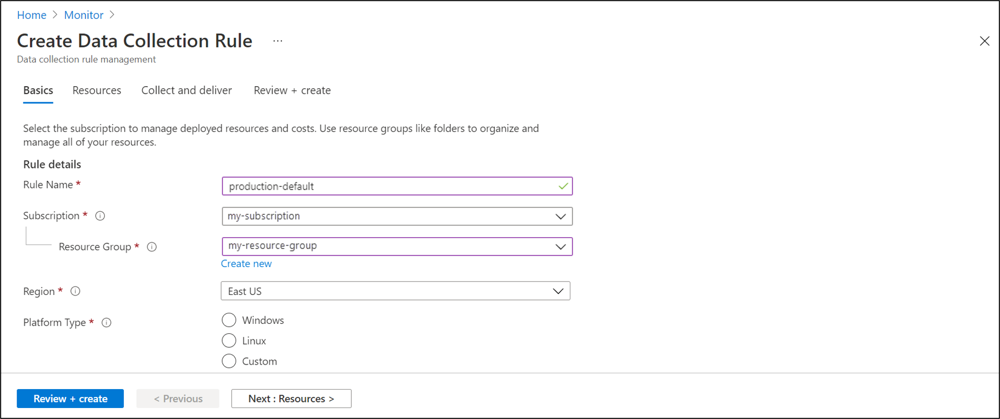

# Collect IIS logs with Azure Monitor Agent

The Internet Information Service (IIS) logs data to the local disk of Windows machines. This article explains how to collect IIS logs from monitored machines with [Azure Monitor Agent](azure-monitor-agent-overview.md) by creating a data collection rule (DCR). 

## Prerequisites
To complete this procedure, you need: 

- Log Analytics workspace where you have at least [contributor rights](../logs/manage-access.md#azure-rbac).
- [Data collection endpoints](../essentials/data-collection-endpoint-overview.md#create-a-data-collection-endpoint). 

    - If your virtual machine and Log Analytics workspace are in the same region, you need one data collection endpoint in the same region.
    - If your virtual machine and Log Analytics workspace are in different regions, you need a data collection endpoint in each region.

    For more information, see [How to set up data collection endpoints based on your deployment](../essentials/data-collection-endpoint-overview.md#how-to-set-up-data-collection-endpoints-based-on-your-deployment).

- [Permissions to create Data Collection Rule objects](../essentials/data-collection-rule-overview.md#permissions) in the workspace.
- A VM, Virtual Machine Scale Set, or Arc-enabled on-premises server that runs IIS. 
    - An IIS log file in W3C format must be stored on the local drive of the machine on which Azure Monitor Agent is running. 
    - Each entry in the log file must be delineated with an end of line. 
    - The log file must not allow circular logging, log rotation where the file is overwritten with new entries, or renaming where a file is moved and a new file with the same name is opened. 

## Create data collection rule to collect IIS logs
The [data collection rule](../essentials/data-collection-rule-overview.md) defines: 

- Which source log files Azure Monitor Agent scans for new events.
- How Azure Monitor transforms events during ingestion.
- The destination Log Analytics workspace and table to which Azure Monitor sends the data.

You can define a data collection rule to send data from multiple machines to multiple Log Analytics workspaces, including workspaces in a different region or tenant. Create the data collection rule in the *same region* as your Analytics workspace.

> [!NOTE]
> To send data across tenants, you must first enable [Azure Lighthouse](../../lighthouse/overview.md).

To create the data collection rule in the Azure portal:

1. On the **Monitor** menu, select **Data Collection Rules**.
1. Select **Create** to create a new data collection rule and associations.

    [  ](media/data-collection-rule-azure-monitor-agent/data-collection-rules-updated.png#lightbox)

1. Enter a **Rule name** and specify a **Subscription**, **Resource Group**, **Region**, **Platform Type**, and **Data collection endpoint**:

    - **Region** specifies where the DCR will be created. The virtual machines and their associations can be in any subscription or resource group in the tenant.
    - **Platform Type** specifies the type of resources this rule can apply to. The **Custom** option allows for both Windows and Linux types.
    - **Data Collection Endpoint** specifies the data collection endpoint used to collect data. The data collection endpoint must be in the same region as the Log Analytics workspace.    

    [  ](media/data-collection-rule-azure-monitor-agent/data-collection-rule-basics-updated.png#lightbox)

1. On the **Resources** tab: 
    1. Select **+ Add resources** and associate resources to the data collection rule. Resources can be virtual machines, Virtual Machine Scale Sets, and Azure Arc for servers. The Azure portal installs Azure Monitor Agent on resources that don't already have it installed. 

        > [!IMPORTANT]
        > The portal enables system-assigned managed identity on the target resources, along with existing user-assigned identities, if there are any. For existing applications, unless you specify the user-assigned identity in the request, the machine defaults to using system-assigned identity instead.
    
        If you need network isolation using private links, select existing endpoints from the same region for the respective resources or [create a new endpoint](../essentials/data-collection-endpoint-overview.md).

    1. Select **Enable Data Collection Endpoints**.
    1. Select a data collection endpoint for each of the virtual machines associate to the data collection rule. 
    
        This data collection endpoint sends configuration files to the virtual machine and must be in the same region as the virtual machine.          

    [  ](media/data-collection-rule-azure-monitor-agent/data-collection-rule-virtual-machines-with-endpoint.png#lightbox)

1. On the **Collect and deliver** tab, select **Add data source** to add a data source and set a destination.
1. Select **IIS Logs**.

    [ ](media/data-collection-iis/iis-data-collection-rule.png#lightbox)

1. Specify a file pattern to identify the directory where the log files are located. 
1. On the **Destination** tab, add a destinations for the data source.

    [  ](media/data-collection-rule-azure-monitor-agent/data-collection-rule-destination.png#lightbox)

1. Select **Review + create** to review the details of the data collection rule and association with the set of virtual machines.
1. Select **Create** to create the data collection rule.

> [!NOTE]
> It can take up to 5 minutes for data to be sent to the destinations after you create the data collection rule.


### Sample log queries

- **Count the IIS log entries by URL for the host www.contoso.com.**
    
    ```kusto
    W3CIISLog 
    | where csHost=="www.contoso.com" 
    | summarize count() by csUriStem
    ```

- **Review the total bytes received by each IIS machine.**

    ```kusto
    W3CIISLog 
    | summarize sum(csBytes) by Computer
    ```


## Sample alert rule

- **Create an alert rule on any record with a return status of 500.**
    
    ```kusto
    W3CIISLog 
    | where scStatus==500
    | summarize AggregatedValue = count() by Computer, bin(TimeGenerated, 15m)
    ```


## Troubleshoot
Use the following steps to troubleshoot collection of IIS logs. 

### Check if any IIS logs have been received
Start by checking if any records have been collected for your IIS logs by running the following query in Log Analytics. If the query doesn't return records, check the other sections for possible causes. This query looks for entires in the last two days, but you can modify for another time range.

``` kusto
W3CIISLog
| where TimeGenerated > ago(48h)
| order by TimeGenerated desc
```

### Verify that the agent is sending heartbeats successfully
Verify that Azure Monitor agent is communicating properly by running the following query in Log Analytics to check if there are any records in the Heartbeat table.

``` kusto
Heartbeat
| where TimeGenerated > ago(24h)
| where Computer has "<computer name>"
| project TimeGenerated, Category, Version
| order by TimeGenerated desc
```

### Verify that IIS logs are being created
Look at the timestamps of the log files and open the latest to see that latest timestamps are present in the log files. The default location for IIS log files is C:\\inetpub\\logs\\LogFiles\\W3SVC1.

:::image type="content" source="media/data-collection-text-log/iis-log-timestamp.png" lightbox="media/data-collection-text-log/iis-log-timestamp.png" alt-text="Screenshot of an IIS log, showing the timestamp.":::

### Verify that you specified the correct log location in the data collection rule
The data collection rule will have a section similar to the following. The `logDirectories` element specifies the path to the log file to collect from the agent computer. Check the agent computer to verify that this is correct.

``` json
    "dataSources": [
    {
            "configuration": {
                "logDirectories": ["C:\\scratch\\demo\\W3SVC1"]
            },
            "id": "myIisLogsDataSource",
            "kind": "iisLog",
            "streams": [{
                    "stream": "ONPREM_IIS_BLOB_V2"
                }
            ],
            "sendToChannels": ["gigl-dce-6a8e34db54bb4b6db22d99d86314eaee"]
        }
    ]
```

This directory should correspond to the location of the IIS logs on the agent machine.

:::image type="content" source="media/data-collection-text-log/iis-log-files.png" lightbox="media/data-collection-text-log/iis-log-files.png" alt-text="Screenshot of IIS log files on agent machine.":::

### Verify that the IIS logs are W3C formatted
Open IIS Manager and verify that the logs are being written in W3C format.

:::image type="content" source="media/data-collection-text-log/iis-log-format-setting.png" lightbox="media/data-collection-text-log/iis-log-format-setting.png" alt-text="Screenshot of IIS logging configuration dialog box on agent machine.":::

Open the IIS log file on the agent machine to verify that logs are in W3C format.

:::image type="content" source="media/data-collection-text-log/iis-log-format.png" lightbox="media/data-collection-text-log/iis-log-format.png" alt-text="Screenshot of an IIS log, showing the header, which specifies that the file is in W3C format.":::


## Next steps

Learn more about: 

- [Azure Monitor Agent](azure-monitor-agent-overview.md).
- [Data collection rules](../essentials/data-collection-rule-overview.md).
- [Best practices for cost management in Azure Monitor](../best-practices-cost.md).
