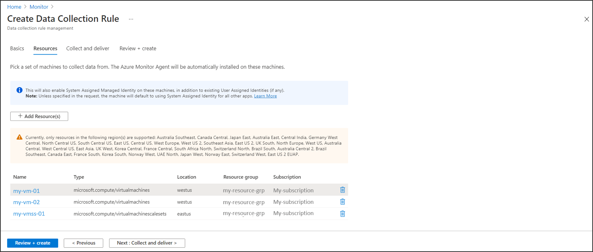
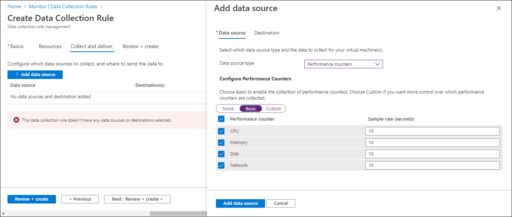

# Configure data collection for the Azure Monitor agent

Data Collection Rules (DCR) define data coming into Azure Monitor and specify where it should be sent. This article describes how to create a data collection rule to collect data from virtual machines using the Azure Monitor agent.

For a complete description of data collection rules, see [Data collection rules in Azure Monitor](data-collection-rule-overview.md).

> [!NOTE]
> This article describes how to configure data for virtual machines with the Azure Monitor agent only.

## Data collection rule associations

To apply a DCR to a virtual machine, you create an association for the virtual machine. A virtual machine may have an association to multiple DCRs, and a DCR may have multiple virtual machines associated to it. This allows you to define a set of DCRs, each matching a particular requirement, and apply them to only the virtual machines where they apply. 

For example, consider an environment with a set of virtual machines running a line of business application and others running SQL Server. You might have one default data collection rule that applies to all virtual machines and separate data collection rules that collect data specifically for the line of business application and for SQL Server. The associations for the virtual machines to the data collection rules would look similar to the following diagram.


## Create rule and association in Azure portal

You can use the Azure portal to create a data collection rule and associate virtual machines in your subscription to that rule. The Azure Monitor agent will be automatically installed and a managed identity created for any virtual machines that don't already have it installed.

> [!IMPORTANT]
> Creating a data collection rule using the portal also enables System-Assigned managed identity on the target resources, in addition to existing User-Assigned Identities (if any). For existing applications unless they specify the User-Assigned identity in the request, the machine will default to using System-Assigned Identity instead. [Learn More](../../active-directory/managed-identities-azure-resources/managed-identities-faq.md#what-identity-will-imds-default-to-if-dont-specify-the-identity-in-the-request)

                    

> [!NOTE]
> If you wish to send data to Log Analytics, you must create the data collection rule in the **same region** where your Log Analytics workspace resides. The rule can be associated to machines in other supported region(s).

In the **Azure Monitor** menu in the Azure portal, select **Data Collection Rules** from the **Settings** section. Click **Create** to create a new Data Collection Rule and assignment.

[](media/data-collection-rule-azure-monitor-agent/data-collection-rules-updated.png#lightbox)

Click **Add** to create a new rule and set of associations. Provide a **Rule name** and specify a **Subscription**, **Resource Group** and **Region**. This specifies where the DCR will be created. The virtual machines and their associations can be in any subscription or resource group in the tenant.
Additionally, choose the appropriate **Platform Type** which specifies the type of resources this rule can apply to. Custom will allow for both Windows and Linux types. This allows for pre-curated creation experiences with options scoped to the selected platform type.

[](media/data-collection-rule-azure-monitor-agent/data-collection-rule-basics-updated.png#lightbox)

In the **Resources** tab, add the resources (virtual machines, virtual machine scale sets, Arc for servers) that should have the Data Collection Rule applied. The Azure Monitor Agent will be installed on resources that don't already have it installed, and will enable Azure Managed Identity as well.

[](media/data-collection-rule-azure-monitor-agent/data-collection-rule-virtual-machines-updated.png#lightbox)

On the **Collect and deliver** tab, click **Add data source** to add a data source and destination set. Select a **Data source type**, and the corresponding details to select will be displayed. For performance counters, you can select from a predefined set of objects and their sampling rate. For events, you can select from a set of logs or facilities and the severity level. 

[](media/data-collection-rule-azure-monitor-agent/data-collection-rule-data-source-basic-updated.png#lightbox)


To specify other logs and performance counters from the [currently supported data sources](azure-monitor-agent-overview.md#data-sources-and-destinations) or to filter events using XPath queries, select **Custom**. You can then specify an [XPath ](https://www.w3schools.com/xml/xpath_syntax.asp) for any specific values to collect. See [Sample DCR](data-collection-rule-overview.md#sample-data-collection-rule) for examples.

[](media/data-collection-rule-azure-monitor-agent/data-collection-rule-data-source-custom-updated.png#lightbox)

On the **Destination** tab, add one or more destinations for the data source. Windows event and Syslog data sources can only send to Azure Monitor Logs. Performance counters can send to both Azure Monitor Metrics and Azure Monitor Logs.

[](media/data-collection-rule-azure-monitor-agent/data-collection-rule-destination.png#lightbox)

Click **Add Data Source** and then **Review + create** to review the details of the data collection rule and association with the set of VMs. Click **Create** to create it.

> [!NOTE]
> After the data collection rule and associations have been created, it might take up to 5 minutes for data to be sent to the destinations.

## Limit data collection with custom XPath queries
Since you're charged for any data collected in a Log Analytics workspace, you should collect only the data that you require. Using basic configuration in the Azure portal, you only have limited ability to filter events to collect. For Application and System logs, this is all logs with a particular severity. For Security logs, this is all audit success or all audit failure logs.

To specify additional filters, you must use Custom configuration and specify an XPath that filters out the events you don't. XPath entries are written in the form `LogName!XPathQuery`. For example, you may want to return only events from the Application event log with an event ID of 1035. The XPathQuery for these events would be `*[System[EventID=1035]]`. Since you want to retrieve the events from the Application event log, the XPath would be `Application!*[System[EventID=1035]]`

See [XPath 1.0 limitations](/windows/win32/wes/consuming-events#xpath-10-limitations) for a list of limitations in the XPath supported by Windows event log.

> [!TIP]
> Use the PowerShell cmdlet `Get-WinEvent` with the `FilterXPath` parameter to test the validity of an XPathQuery. The following script shows an example.
> 
> ```powershell
> $XPath = '*[System[EventID=1035]]'
> Get-WinEvent -LogName 'Application' -FilterXPath $XPath
> ```
>
> - If events are returned, the query is valid.
> - If you receive the message *No events were found that match the specified selection criteria.*, the query may be valid, but there are no matching events on the local machine.
> - If you receive the message *The specified query is invalid* , the query syntax is invalid. 

The following table shows examples for filtering events using a custom XPath.

| Description |  XPath |
|:---|:---|
| Collect only System events with Event ID = 4648 |  `System!*[System[EventID=4648]]`
| Collect only System events with Event ID = 4648 and a process name of consent.exe | `Security!*[System[(EventID=4648)]] and *[EventData[Data[@Name='ProcessName']='C:\Windows\System32\consent.exe']]` |
| Collect all Critical, Error, Warning, and Information events from the System event log except for Event ID = 6 (Driver loaded) |  `System!*[System[(Level=1 or Level=2 or Level=3) and (EventID != 6)]]` |
| Collect all success and failure Security events except for Event ID 4624 (Successful logon) |  `Security!*[System[(band(Keywords,13510798882111488)) and (EventID != 4624)]]` |


## Create rule and association using REST API

Follow the steps below to create a data collection rule and associations using the REST API.

> [!NOTE]
> If you wish to send data to Log Analytics, you must create the data collection rule in the **same region** where your Log Analytics workspace resides. The rule can be associated to machines in other supported region(s).

1. Manually create the DCR file using the JSON format shown in [Sample DCR](data-collection-rule-overview.md#sample-data-collection-rule).

2. Create the rule using the [REST API](/rest/api/monitor/datacollectionrules/create#examples).

3. Create an association for each virtual machine to the data collection rule using the [REST API](/rest/api/monitor/datacollectionruleassociations/create#examples).


## Create rule and association using Resource Manager template

> [!NOTE]
> If you wish to send data to Log Analytics, you must create the data collection rule in the **same region** where your Log Analytics workspace resides. The rule can be associated to machines in other supported region(s).

You can create a rule and an association for an Azure virtual machine or Azure Arc-enabled server using Resource Manager templates. See [Resource Manager template samples for data collection rules in Azure Monitor](./resource-manager-data-collection-rules.md) for sample templates).


## Manage rules and association using PowerShell

> [!NOTE]
> If you wish to send data to Log Analytics, you must create the data collection rule in the **same region** where your Log Analytics workspace resides. The rule can be associated to machines in other supported region(s).

**Data collection rules**

| Action | Command |
|:---|:---|
| Get rule(s) | [Get-AzDataCollectionRule](/powershell/module/az.monitor/get-azdatacollectionrule?view=azps-5.4.0&preserve-view=true) |
| Create a rule | [New-AzDataCollectionRule](/powershell/module/az.monitor/new-azdatacollectionrule?view=azps-6.0.0&viewFallbackFrom=azps-5.4.0&preserve-view=true) |
| Update a rule | [Set-AzDataCollectionRule](/powershell/module/az.monitor/set-azdatacollectionrule?view=azps-6.0.0&viewFallbackFrom=azps-5.4.0&preserve-view=true) |
| Delete a rule | [Remove-AzDataCollectionRule](/powershell/module/az.monitor/remove-azdatacollectionrule?view=azps-6.0.0&viewFallbackFrom=azps-5.4.0&preserve-view=true) |
| Update 'Tags' for a rule | [Update-AzDataCollectionRule](/powershell/module/az.monitor/update-azdatacollectionrule?view=azps-6.0.0&viewFallbackFrom=azps-5.4.0&preserve-view=true) |

**Data collection rule associations**

| Action | Command |
|:---|:---|
| Get association(s) | [Get-AzDataCollectionRuleAssociation](/powershell/module/az.monitor/get-azdatacollectionruleassociation?view=azps-6.0.0&viewFallbackFrom=azps-5.4.0&preserve-view=true) |
| Create an association | [New-AzDataCollectionRuleAssociation](/powershell/module/az.monitor/new-azdatacollectionruleassociation?view=azps-6.0.0&viewFallbackFrom=azps-5.4.0&preserve-view=true) |
| Delete an association | [Remove-AzDataCollectionRuleAssociation](/powershell/module/az.monitor/remove-azdatacollectionruleassociation?view=azps-6.0.0&viewFallbackFrom=azps-5.4.0&preserve-view=true) |


## Manage rules and association using Azure CLI

> [!NOTE]
> If you wish to send data to Log Analytics, you must create the data collection rule in the **same region** where your Log Analytics workspace resides. The rule can be associated to machines in other supported region(s).

This is enabled as part of Azure CLI **monitor-control-service** Extension. [View all commands](/cli/azure/monitor/data-collection/rule?view=azure-cli-latest&preserve-view=true)


## Next steps

- Learn more about the [Azure Monitor Agent](azure-monitor-agent-overview.md).
- Learn more about [data collection rules](data-collection-rule-overview.md).
