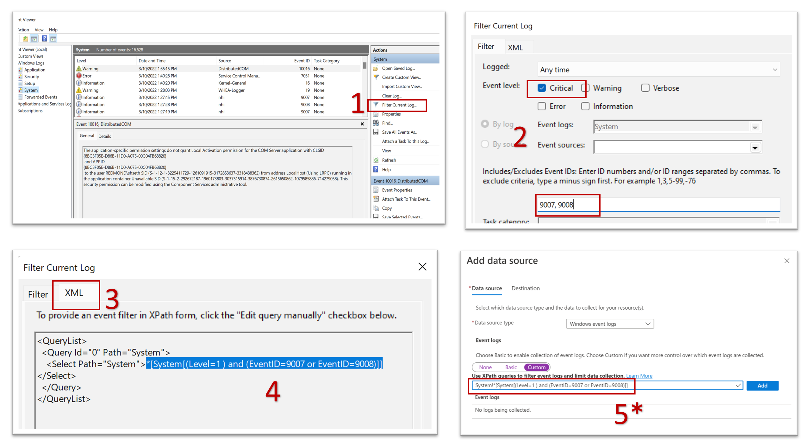

# Collect data from virtual machines with the Azure Monitor agent

This article describes how to collect events and performance counters from virtual machines using the Azure Monitor agent. 

To collect data from virtual machines using the Azure Monitor agent, you'll:

1. Create [data collection rules (DCR)](../essentials/data-collection-rule-overview.md) that define which data Azure Monitor agent sends to which destinations.
1. Associate the data collection rule to specific virtual machines.

    You can associate virtual machines to multiple data collection rules. This allows you to define each data collection rule to address a particular requirement, and associate the data collection rules to virtual machines based on the specific data you want to collect from each machine.

## Create data collection rule and association

To send data to Log Analytics, create the data collection rule in the **same region** as your Log Analytics workspace. You can still associate the rule to machines in other supported regions.

### [Portal](#tab/portal)

1. From the **Monitor** menu, select **Data Collection Rules**. 
1. Select **Create** to create a new Data Collection Rule and associations.

    [  ](media/data-collection-rule-azure-monitor-agent/data-collection-rules-updated.png#lightbox)
    
1. Provide a **Rule name** and specify a **Subscription**, **Resource Group**, **Region**, and **Platform Type**. 

    **Region** specifies where the DCR will be created. The virtual machines and their associations can be in any subscription or resource group in the tenant.

    **Platform Type** specifies the type of resources this rule can apply to. Custom allows for both Windows and Linux types. 

    [  ](media/data-collection-rule-azure-monitor-agent/data-collection-rule-basics-updated.png#lightbox)

1. On the **Resources** tab, add the resources (virtual machines, virtual machine scale sets, Arc for servers) to which to associate the data collection rule. The portal will install Azure Monitor Agent on resources that don't already have it installed, and will also enable Azure Managed Identity.

    > [!IMPORTANT]
    > The portal enables System-Assigned managed identity on the target resources, in addition to existing User-Assigned Identities (if any). For existing applications, unless you specify the User-Assigned identity in the request, the machine will default to using System-Assigned Identity instead.  

    If you need network isolation using private links, select existing endpoints from the same region for the respective resources, or [create a new endpoint](../essentials/data-collection-endpoint-overview.md).

    [  ](media/data-collection-rule-azure-monitor-agent/data-collection-rule-virtual-machines-with-endpoint.png#lightbox)


1. On the **Collect and deliver** tab, select **Add data source** to add a data source and set a destination.
1. Select a **Data source type**.
1. Select which data you want to collect. For performance counters, you can select from a predefined set of objects and their sampling rate. For events, you can select from a set of logs and severity levels. 

    [  ](media/data-collection-rule-azure-monitor-agent/data-collection-rule-data-source-basic-updated.png#lightbox)

1. Select **Custom** to collect logs and performance counters that are not [currently supported data sources](azure-monitor-agent-overview.md#data-sources-and-destinations) or to [filter events using XPath queries](#filter-events-using-xpath-queries). You can then specify an [XPath](https://www.w3schools.com/xml/xpath_syntax.asp) to collect any specific values. See [Sample DCR](data-collection-rule-sample-agent.md) for an example.

    [  ](media/data-collection-rule-azure-monitor-agent/data-collection-rule-data-source-custom-updated.png#lightbox)

1. On the **Destination** tab, add one or more destinations for the data source. You can select multiple destinations of the same or different types - for instance multiple Log Analytics workspaces (known as "multi-homing"). 

    You can send Windows event and Syslog data sources can to Azure Monitor Logs only. You can send performance counters to both Azure Monitor Metrics and Azure Monitor Logs.

    [  ](media/data-collection-rule-azure-monitor-agent/data-collection-rule-destination.png#lightbox)

1. Select **Add Data Source** and then **Review + create** to review the details of the data collection rule and association with the set of virtual machines. 
1. Select **Create** to create the data collection rule.

> [!NOTE]
> It might take up to 5 minutes for data to be sent to the destinations after you create the data collection rule and associations.

### [API](#tab/api)

1. Create a DCR file using the JSON format shown in [Sample DCR](data-collection-rule-sample-agent.md).

2. Create the rule using the [REST API](/rest/api/monitor/datacollectionrules/create#examples).

3. Create an association for each virtual machine to the data collection rule using the [REST API](/rest/api/monitor/datacollectionruleassociations/create#examples).

### [PowerShell](#tab/powershell)

**Data collection rules**

| Action | Command |
|:---|:---|
| Get rule(s) | [Get-AzDataCollectionRule](/powershell/module/az.monitor/get-azdatacollectionrule?view=azps-5.4.0&preserve-view=true) |
| Create a rule | [New-AzDataCollectionRule](/powershell/module/az.monitor/new-azdatacollectionrule?view=azps-6.0.0&viewFallbackFrom=azps-5.4.0&preserve-view=true) |
| Update a rule | [Set-AzDataCollectionRule](/powershell/module/az.monitor/set-azdatacollectionrule?view=azps-6.0.0&viewFallbackFrom=azps-5.4.0&preserve-view=true) |
| Delete a rule | [Remove-AzDataCollectionRule](/powershell/module/az.monitor/remove-azdatacollectionrule?view=azps-6.0.0&viewFallbackFrom=azps-5.4.0&preserve-view=true) |
| Update 'Tags' for a rule | [Update-AzDataCollectionRule](/powershell/module/az.monitor/update-azdatacollectionrule?view=azps-6.0.0&viewFallbackFrom=azps-5.4.0&preserve-view=true) |

**Data collection rule associations**

| Action | Command |
|:---|:---|
| Get association(s) | [Get-AzDataCollectionRuleAssociation](/powershell/module/az.monitor/get-azdatacollectionruleassociation?view=azps-6.0.0&viewFallbackFrom=azps-5.4.0&preserve-view=true) |
| Create an association | [New-AzDataCollectionRuleAssociation](/powershell/module/az.monitor/new-azdatacollectionruleassociation?view=azps-6.0.0&viewFallbackFrom=azps-5.4.0&preserve-view=true) |
| Delete an association | [Remove-AzDataCollectionRuleAssociation](/powershell/module/az.monitor/remove-azdatacollectionruleassociation?view=azps-6.0.0&viewFallbackFrom=azps-5.4.0&preserve-view=true) |

### [Azure CLI](#tab/cli)

This is enabled as part of Azure CLI **monitor-control-service** Extension. [View all commands](/cli/azure/monitor/data-collection/rule)

### [Resource Manager template](#tab/arm)

See [Resource Manager template samples for data collection rules in Azure Monitor](./resource-manager-data-collection-rules.md) for sample templates.

---
## Filter events using XPath queries
Since you're charged for any data you collect in a Log Analytics workspace, collect only the data you need. The basic configuration in the Azure portal provides you with a limited ability to filter out events. 

To specify additional filters, use Custom configuration and specify an XPath that filters out the events you don't need. XPath entries are written in the form `LogName!XPathQuery`. For example, you may want to return only events from the Application event log with an event ID of 1035. The XPathQuery for these events would be `*[System[EventID=1035]]`. Since you want to retrieve the events from the Application event log, the XPath is `Application!*[System[EventID=1035]]`

### Extracting XPath queries from Windows Event Viewer
In Windows, you can use Event Viewer to extract XPath queries as shown below.  

When you paste the XPath query into the field on the **Add data source** screen, (step 5 in the picture below), you must append the log type category followed by '!'.

[  ](media/data-collection-rule-azure-monitor-agent/data-collection-rule-extract-xpath.png#lightbox)

See [XPath 1.0 limitations](/windows/win32/wes/consuming-events#xpath-10-limitations) for a list of limitations in the XPath supported by Windows event log.

> [!TIP]
> You can use the PowerShell cmdlet `Get-WinEvent` with the `FilterXPath` parameter to test the validity of an XPathQuery locally on your machine first. The following script shows an example.
> 
> ```powershell
> $XPath = '*[System[EventID=1035]]'
> Get-WinEvent -LogName 'Application' -FilterXPath $XPath
> ```
>
> - **In the cmdlet above, the value of the *-LogName* parameter is the initial part of the XPath query until the '!'. The rest of the XPath query goes into the *$XPath* parameter.**
> - If the script returns events, the query is valid.
> - If you receive the message *No events were found that match the specified selection criteria.*, the query may be valid, but there are no matching events on the local machine.
> - If you receive the message *The specified query is invalid* , the query syntax is invalid. 

Examples of filtering events using a custom XPath:

| Description |  XPath |
|:---|:---|
| Collect only System events with Event ID = 4648 |  `System!*[System[EventID=4648]]`
| Collect Security Log events with Event ID = 4648 and a process name of consent.exe | `Security!*[System[(EventID=4648)]] and *[EventData[Data[@Name='ProcessName']='C:\Windows\System32\consent.exe']]` |
| Collect all Critical, Error, Warning, and Information events from the System event log except for Event ID = 6 (Driver loaded) |  `System!*[System[(Level=1 or Level=2 or Level=3) and (EventID != 6)]]` |
| Collect all success and failure Security events except for Event ID 4624 (Successful logon) |  `Security!*[System[(band(Keywords,13510798882111488)) and (EventID != 4624)]]` |

## Next steps

- [Collect text logs using Azure Monitor agent.](data-collection-text-log.md)
- Learn more about the [Azure Monitor Agent](azure-monitor-agent-overview.md).
- Learn more about [data collection rules](../essentials/data-collection-rule-overview.md).
