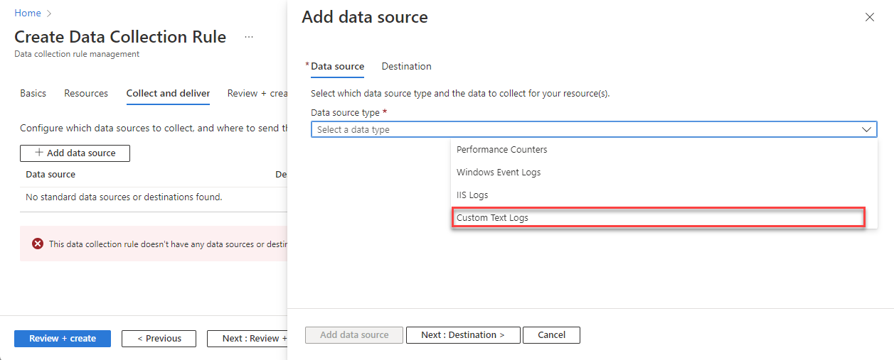

# Collect text logs with Azure Monitor Agent

Many applications log information to text files instead of standard logging services such as Windows Event log or Syslog. This article explains how to collect text logs from monitored machines using [Azure Monitor Agent](azure-monitor-agent-overview.md) by creating a [data collection rule (DCR)](../essentials/data-collection-rule-overview.md). 

## Prerequisites
To complete this procedure, you need: 

- Log Analytics workspace where you have at least [contributor rights](../logs/manage-access.md#azure-rbac).
- [Data collection endpoints](../essentials/data-collection-endpoint-overview.md#create-a-data-collection-endpoint). 

    - If your virtual machine and Log Analytics workspace are in the same region, you need one data collection endpoint in the same region.
    - If your virtual machine and Log Analytics workspace are in different regions, you need a data collection endpoint in each region.

    For more information, see [How to set up data collection endpoints based on your deployment](../essentials/data-collection-endpoint-overview.md#how-to-set-up-data-collection-endpoints-based-on-your-deployment).

- [Permissions to create Data Collection Rule objects](../essentials/data-collection-rule-overview.md#permissions) in the workspace.

- A VM, Virtual Machine Scale Set, or Arc-enabled on-premises server that writes logs to a text file.
    
    Text file requirements and best practices:    
    - Do store files on the local drive of the machine on which Azure Monitor Agent is running and in the directory that is being monitored.
    - Do delineate the end of a record with an end of line. 
    - Do use ASCII or UTF-8 encoding. Other formats such as UTF-16 aren't supported.
    - Do create a new log file every day so that you can remove old files easily. 
    - Do clean up all log files in the monitored directory. Tracking many log files can drive up agent CPU and Memory usage. Wait for at least 2 days to allow ample time for all logs to be processed.
    - Do Not overwrite an existing file with new records. You should only append new records to the end of the file. Overwriting will cause data loss.
    - Do Not rename a file to a new name and then open a new file with the same name. This could cause data loss.
    - Do Not rename or copy large log files that match the file scan pattern in to the monitored directory. If you must, do not exceed 50MB per minute.
    - Do Not rename a file that matches the file scan pattern to a new name that also matches the file scan pattern. This will cause duplicate data to be ingested. 


## Create a custom table

This step will create a new custom table, which is any table name that ends in \_CL. Currently a direct REST call to the table management endpoint is used to create a table. The script at the end of this section is the input to the REST call.

The table created in the script has two columns TimeGenerated: datetime and RawData: string, which is the default schema for a custom text log. If you know your final schema, then you can add columns in the script before creating the table. If you don't, columns can always be added in the log analytics table UI.  

The easiest way to make the REST call is from an Azure Cloud PowerShell command line (CLI). To open the shell, go to the Azure portal, press the Cloud Shell button, and select PowerShell. If this is your first-time using Azure Cloud PowerShell, you will need to walk through the one-time configuration wizard.
 

Copy and paste the following script in to PowerShell to create the table in your workspace. Make sure to replace the {subscription}, {resource group}, {workspace name}, and {table name} in the script. Make sure that there are no extra blanks at the beginning or end of the parameters

```code
$tableParams = @'
{
    "properties": {
        "schema": {
               "name": "{TableName}_CL",
               "columns": [
        {
                                "name": "TimeGenerated",
                                "type": "DateTime"
                        }, 
                       {
                                "name": "RawData",
                                "type": "String"
                       }
              ]
        }
    }
}
'@

Invoke-AzRestMethod -Path "/subscriptions/{subscription}/resourcegroups/{resourcegroup}/providers/microsoft.operationalinsights/workspaces/{WorkspaceName}/tables/{TableName}_CL?api-version=2021-12-01-preview" -Method PUT -payload $tableParams
```

Press return to execute the code. You should see a 200 response, and details about the table you just created will show up. To validate that the table was created go to your workspace and select Tables on the left blade. You should see your table in the list.
> [!Note]
> The column names are case sensitive. For example `Rawdata` will not correctly collect the event data. It must be `RawData`.


## Create data collection rule to collect text logs

The data collection rule defines: 

- Which source log files Azure Monitor Agent scans for new events.
- How Azure Monitor transforms events during ingestion.
- The destination Log Analytics workspace and table to which Azure Monitor sends the data.

You can define a data collection rule to send data from multiple machines to multiple Log Analytics workspaces, including workspaces in a different region or tenant. Create the data collection rule in the *same region* as your Log Analytics workspace.

> [!NOTE]
> To send data across tenants, you must first enable [Azure Lighthouse](../../lighthouse/overview.md).

### [Portal](#tab/portal)

To create the data collection rule in the Azure portal:

1. On the **Monitor** menu, select **Data Collection Rules**.
1. Select **Create** to create a new data collection rule and associations.

    [  ](media/data-collection-rule-azure-monitor-agent/data-collection-rules-updated.png#lightbox)

1. Enter a **Rule name** and specify a **Subscription**, **Resource Group**, **Region**, **Platform Type**, and **Data collection endpoint**:

    - **Region** specifies where the DCR will be created. The virtual machines and their associations can be in any subscription or resource group in the tenant.
    - **Platform Type** specifies the type of resources this rule can apply to. The **Custom** option allows for both Windows and Linux types.
    - **Data Collection Endpoint** specifies the data collection endpoint used to collect data. The data collection endpoint must be in the same region as the Log Analytics workspace.    

    [  ](media/data-collection-rule-azure-monitor-agent/data-collection-rule-basics-updated.png#lightbox)

1. On the **Resources** tab: 
    1. Select **+ Add resources** and associate resources to the data collection rule. Resources can be virtual machines, Virtual Machine Scale Sets, and Azure Arc for servers. The Azure portal installs Azure Monitor Agent on resources that don't already have it installed. 

        > [!IMPORTANT]
        > The portal enables system-assigned managed identity on the target resources, along with existing user-assigned identities, if there are any. For existing applications, unless you specify the user-assigned identity in the request, the machine defaults to using system-assigned identity instead.
    
        If you need network isolation using private links, select existing endpoints from the same region for the respective resources or [create a new endpoint](../essentials/data-collection-endpoint-overview.md).

    1. Select **Enable Data Collection Endpoints**.
    1. Select a data collection endpoint for each of the virtual machines associate to the data collection rule. 
    
        This data collection endpoint sends configuration files to the virtual machine and must be in the same region as the virtual machine.       

    [  ](media/data-collection-rule-azure-monitor-agent/data-collection-rule-virtual-machines-with-endpoint.png#lightbox)

1. On the **Collect and deliver** tab, select **Add data source** to add a data source and set a destination.
1. Select **Custom Text Logs**.

    [ ](media/data-collection-text-log/custom-text-log-data-collection-rule.png#lightbox)

1. Specify the following information:
 
    - **File Pattern** - Identifies where the log files are located on the local disk. You can enter multiple file patterns separated by commas (on Linux, AMA version 1.26 or higher is required to collect from a comma-separated list of file patterns).
    
        Examples of valid inputs: 
        - 20220122-MyLog.txt 
        - ProcessA_MyLog.txt  
        - ErrorsOnly_MyLog.txt, WarningOnly_MyLog.txt
    
        > [!NOTE]
        > Multiple log files of the same type commonly exist in the same directory. For example, a machine might create a new file every day to prevent the log file from growing too large. To collect log data in this scenario, you can use a file wildcard. Use the format `C:\directoryA\directoryB\*MyLog.txt` for Windows and `/var/*.log` for Linux. There is no support for directory wildcards. 
    
    
    - **Table name** - The name of the destination table you created in your Log Analytics Workspace. For more information, see [Prerequisites](#prerequisites).     
    - **Record delimiter** - Will be used in the future to allow delimiters other than the currently supported end of line (`/r/n`). 
    - **Transform** - Add an [ingestion-time transformation](../essentials/data-collection-transformations.md) or leave as **source** if you don't need to transform the collected data.
 
1. On the **Destination** tab, add one or more destinations for the data source. You can select multiple destinations of the same or different types. For instance, you can select multiple Log Analytics workspaces, which is also known as multihoming.

    [  ](media/data-collection-rule-azure-monitor-agent/data-collection-rule-destination.png#lightbox)

1. Select **Review + create** to review the details of the data collection rule and association with the set of virtual machines.
1. Select **Create** to create the data collection rule.

### [Resource Manager template](#tab/arm)

1. The data collection rule requires the resource ID of your workspace. Navigate to your workspace in the **Log Analytics workspaces** menu in the Azure portal. From the **Properties** page, copy the **Resource ID** and save it for later use.

    :::image type="content" source="../logs/media/tutorial-logs-ingestion-api/workspace-resource-id.png" lightbox="../logs/media/tutorial-logs-ingestion-api/workspace-resource-id.png" alt-text="Screenshot showing workspace resource ID.":::

1. In the Azure portal's search box, type in *template* and then select **Deploy a custom template**.

    :::image type="content" source="../logs/media/tutorial-workspace-transformations-api/deploy-custom-template.png" lightbox="../logs/media/tutorial-workspace-transformations-api/deploy-custom-template.png" alt-text="Screenshot that shows the Azure portal with template entered in the search box and Deploy a custom template highlighted in the search results.":::

1. Select **Build your own template in the editor**.

    :::image type="content" source="../logs/media/tutorial-workspace-transformations-api/build-custom-template.png" lightbox="../logs/media/tutorial-workspace-transformations-api/build-custom-template.png" alt-text="Screenshot that shows portal screen to build template in the editor.":::

1. Paste this Resource Manager template into the editor:

    ```json
    {
        "$schema": "https://schema.management.azure.com/schemas/2019-04-01/deploymentTemplate.json#",
        "contentVersion": "1.0.0.0",
        "parameters": {
            "dataCollectionRuleName": {
                "type": "string",
                "metadata": {
                    "description": "Specifies the name of the Data Collection Rule to create."
                }
            },
            "location": {
                "type": "string",
                "metadata": {
                    "description": "Specifies the location in which to create the Data Collection Rule."
                }
            },
            "workspaceName": {
                "type": "string",
                "metadata": {
                    "description": "Name of the Log Analytics workspace to use."
                }
            },
            "workspaceResourceId": {
                "type": "string",
                "metadata": {
                    "description": "Specifies the Azure resource ID of the Log Analytics workspace to use."
                }
            },
            "endpointResourceId": {
                "type": "string",
                "metadata": {
                    "description": "Specifies the Azure resource ID of the Data Collection Endpoint to use."
                }
            }
        },
        "resources": [
            {
                "type": "Microsoft.Insights/dataCollectionRules",
                "name": "[parameters('dataCollectionRuleName')]",
                "location": "[parameters('location')]",
                "apiVersion": "2021-09-01-preview",
                "properties": {
                    "dataCollectionEndpointId": "[parameters('endpointResourceId')]",
                    "streamDeclarations": {
                        "Custom-MyLogFileFormat": {
                            "columns": [
                                {
                                    "name": "TimeGenerated",
                                    "type": "datetime"
                                },
                                {
                                    "name": "RawData",
                                    "type": "string"
                                }
                            ]
                        }
                    },
                    "dataSources": {
                        "logFiles": [
                            {
                                "streams": [
                                    "Custom-MyLogFileFormat"
                                ],
                                "filePatterns": [
                                    "C:\\JavaLogs\\*.log"
                                ],
                                "format": "text",
                                "settings": {
                                    "text": {
                                        "recordStartTimestampFormat": "ISO 8601"
                                    }
                                },
                                "name": "myLogFileFormat-Windows"
                            },
                            {
                                "streams": [
                                    "Custom-MyLogFileFormat" 
                                ],
                                "filePatterns": [
                                    "//var//*.log"
                                ],
                                "format": "text",
                                "settings": {
                                    "text": {
                                        "recordStartTimestampFormat": "ISO 8601"
                                    }
                                },
                                "name": "myLogFileFormat-Linux"
                            }
                        ]
                    },
                    "destinations": {
                        "logAnalytics": [
                            {
                                "workspaceResourceId": "[parameters('workspaceResourceId')]",
                                "name": "[parameters('workspaceName')]"
                            }
                        ]
                    },
                    "dataFlows": [
                        {
                            "streams": [
                                "Custom-MyLogFileFormat"
                            ],
                            "destinations": [
                                "[parameters('workspaceName')]"
                            ],
                            "transformKql": "source",
                            "outputStream": "Custom-MyTable_CL"
                        }
                    ]
                }
            }
        ],
        "outputs": {
            "dataCollectionRuleId": {
                "type": "string",
                "value": "[resourceId('Microsoft.Insights/dataCollectionRules', parameters('dataCollectionRuleName'))]"
            }
        }
    }
    ```

1. Update the following values in the Resource Manager template:

    - `streamDeclarations`: Defines the columns of the incoming data. This must match the structure of the log file.
    - `filePatterns`: Specifies the location and file pattern of the log files to collect. This defines a separate pattern for Windows and Linux agents.
    - `transformKql`: Specifies a [transformation](../logs/../essentials//data-collection-transformations.md) to apply to the incoming data before it's sent to the workspace.

    See [Structure of a data collection rule in Azure Monitor (preview)](../essentials/data-collection-rule-structure.md#custom-logs) if you want to modify the text log DCR.
    
    > [!IMPORTANT]
    > Custom data collection rules have a prefix of *Custom-*; for example, *Custom-rulename*. The *Custom-rulename* in the stream declaration must match the *Custom-rulename* name in the Log Analytics workspace.

1. Select **Save**.

    :::image type="content" source="../logs/media/tutorial-workspace-transformations-api/edit-template.png" lightbox="../logs/media/tutorial-workspace-transformations-api/edit-template.png" alt-text="Screenshot that shows portal screen to edit Resource Manager template.":::

1. On the **Custom deployment** screen, specify a **Subscription** and **Resource group** to store the data collection rule and then provide values defined in the template. This includes a **Name** for the data collection rule and the **Workspace Resource ID** and **Endpoint Resource ID**. The **Location** should be the same location as the workspace. The **Region** will already be populated and is used for the location of the data collection rule.

    :::image type="content" source="media/data-collection-text-log/custom-deployment-values.png" lightbox="media/data-collection-text-log/custom-deployment-values.png" alt-text="Screenshot that shows the Custom Deployment screen in the portal to edit custom deployment values for data collection rule.":::

1. Select **Review + create** and then **Create** when you review the details.

1. When the deployment is complete, expand the **Deployment details** box and select your data collection rule to view its details. Select **JSON View**.

    :::image type="content" source="media/data-collection-text-log/data-collection-rule-details.png" lightbox="media/data-collection-text-log/data-collection-rule-details.png" alt-text="Screenshot that shows the Overview pane in the portal with data collection rule details.":::

1. Change the API version to **2021-09-01-preview**.

    :::image type="content" source="media/data-collection-text-log/data-collection-rule-json-view.png" lightbox="media/data-collection-text-log/data-collection-rule-json-view.png" alt-text="Screenshot that shows JSON view for data collection rule.":::

1. Copy the **Resource ID** for the data collection rule. You'll use this in the next step.

1. Create a data collection association that associates the data collection rule to the agents with the log file to be collected. You can associate the same data collection rule with multiple agents:

    1. From the **Monitor** menu in the Azure portal, select **Data Collection Rules** and select the rule that you created.
    
        :::image type="content" source="media/data-collection-text-log/data-collection-rules.png" lightbox="media/data-collection-text-log/data-collection-rules.png" alt-text="Screenshot that shows the Data Collection Rules pane in the portal with data collection rules menu item.":::
    
    1. Select **Resources** and then select **Add** to view the available resources.
    
        :::image type="content" source="media/data-collection-text-log/add-resources.png" lightbox="media/data-collection-text-log/add-resources.png" alt-text="Screenshot that shows the Data Collection Rules pane in the portal with resources for the data collection rule.":::
    
    1. Select either individual agents to associate the data collection rule, or select a resource group to create an association for all agents in that resource group. Select **Apply**.
    
        :::image type="content" source="media/data-collection-text-log/select-resources.png" lightbox="media/data-collection-text-log/select-resources.png" alt-text="Screenshot that shows the Resources pane in the portal to add resources to the data collection rule.":::

---

> [!NOTE]
> It can take up to 5 minutes for data to be sent to the destinations after you create the data collection rule.

### Sample log queries
The column names used here are for example only. The column names for your log will most likely be different.

- **Count the number of events by code.**
    
    ```kusto
    MyApp_CL
    | summarize count() by code
    ```

### Sample alert rule

- **Create an alert rule on any error event.**
    
    ```kusto
    MyApp_CL
    | where status == "Error"
    | summarize AggregatedValue = count() by Computer, bin(TimeGenerated, 15m)
    ```


## Troubleshoot
Use the following steps to troubleshoot collection of text logs. 

## Troubleshooting Tool
Use the [Azure monitor troubleshooter tool](use-azure-monitor-agent-troubleshooter.md) to look for common issues and share results with Microsoft.

### Check if any custom logs have been received
Start by checking if any records have been collected for your custom log table by running the following query in Log Analytics. If records aren't returned, check the other sections for possible causes. This query looks for entires in the last two days, but you can modify for another time range. It can take 5-7 minutes for new data from your tables to be uploaded.  Only new data will be uploaded any log file last written to prior to the DCR rules being created won't be uploaded.

``` kusto
<YourCustomLog>_CL
| where TimeGenerated > ago(48h)
| order by TimeGenerated desc
```

### Verify that you created a custom table
You must [create a custom log table](../logs/create-custom-table.md#create-a-custom-table) in your Log Analytics workspace before you can send data to it.

### Verify that the agent is sending heartbeats successfully
Verify that Azure Monitor agent is communicating properly by running the following query in Log Analytics to check if there are any records in the Heartbeat table.

``` kusto
Heartbeat
| where TimeGenerated > ago(24h)
| where Computer has "<computer name>"
| project TimeGenerated, Category, Version
| order by TimeGenerated desc
```

### Verify that you specified the correct log location in the data collection rule
The data collection rule will have a section similar to the following. The `filePatterns` element specifies the path to the log file to collect from the agent computer. Check the agent computer to verify that this is correct.


```json
"dataSources": [{
            "configuration": {
                "filePatterns": ["C:\\JavaLogs\\*.log"],
                "format": "text",
                "settings": {
                    "text": {
                        "recordStartTimestampFormat": "yyyy-MM-ddTHH:mm:ssK"
                    }
                }
            },
            "id": "myTabularLogDataSource",
            "kind": "logFile",
            "streams": [{
                    "stream": "Custom-TabularData-ABC"
                }
            ],
            "sendToChannels": ["gigl-dce-00000000000000000000000000000000"]
        }
    ]
```

This file pattern should correspond to the logs on the agent machine.


:::image type="content" source="media/data-collection-text-log/text-log-files.png" lightbox="media/data-collection-text-log/text-log-files.png" alt-text="Screenshot of text log files on agent machine.":::


### Verify that the text logs are being populated
The agent will only collect new content written to the log file being collected. If you're experimenting with the text logs collection feature, you can use the following script to generate sample logs.

```powershell
# This script writes a new log entry at the specified interval indefinitely.
# Usage:
# .\GenerateCustomLogs.ps1 [interval to sleep]
#
# Press Ctrl+C to terminate script.
#
# Example:
# .\ GenerateCustomLogs.ps1 5

param (
    [Parameter(Mandatory=$true)][int]$sleepSeconds
)

$logFolder = "c:\\JavaLogs"
if (!(Test-Path -Path $logFolder))
{
    mkdir $logFolder
}

$logFileName = "TestLog-$(Get-Date -format yyyyMMddhhmm).log"
do
{
    $count++
    $randomContent = New-Guid
    $logRecord = "$(Get-Date -format s)Z Record number $count with random content $randomContent"
    $logRecord | Out-File "$logFolder\\$logFileName" -Encoding utf8 -Append
    Start-Sleep $sleepSeconds
}
while ($true)

```


## Next steps

Learn more about: 

- [Azure Monitor Agent](azure-monitor-agent-overview.md).
- [Data collection rules](../essentials/data-collection-rule-overview.md).
- [Best practices for cost management in Azure Monitor](../best-practices-cost.md).
