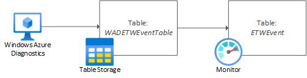
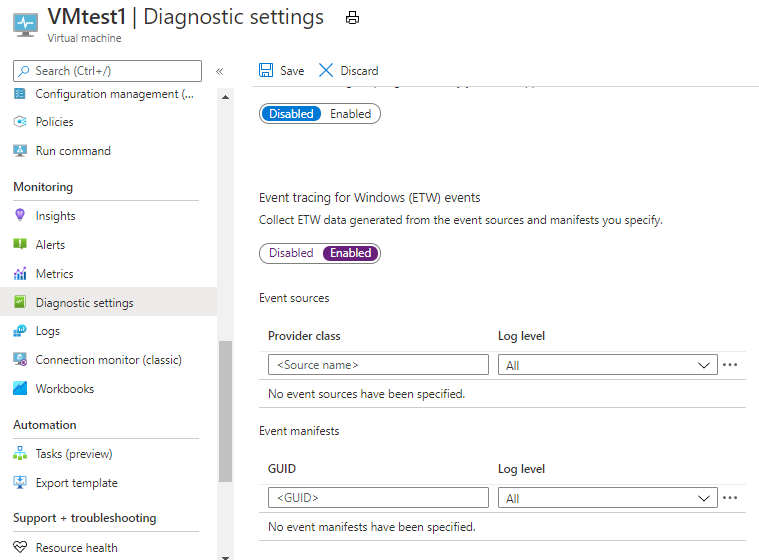

# Collecting Event Tracing for Windows (ETW) Events for analysis Azure Monitor Logs

*Event Tracing for Windows (ETW)* provides a mechanism for instrumentation of user-mode applications and kernel-mode drivers. The Log Analytics agent is used to [collect Windows events](./data-sources-windows-events.md) written to the Administrative and Operational [ETW channels](/windows/win32/wes/eventmanifestschema-channeltype-complextype). However, it is occasionally necessary to capture and analyze other events, such as those written to the Analytic channel.  

[!INCLUDE [Log Analytics agent deprecation](../../../includes/log-analytics-agent-deprecation.md)]

## Event flow

To successfully collect [manifest-based ETW events](/windows/win32/etw/about-event-tracing#types-of-providers) for analysis in Azure Monitor Logs, you must use the [Azure diagnostics extension](./diagnostics-extension-overview.md) for Windows (WAD). In this scenario, the diagnostics extension acts as the ETW consumer, writing events to Azure Storage (tables) as an intermediate store. Here it will be stored in a table named **WADETWEventTable**. Log Analytics then collects the table data from Azure storage, presenting it as a table named **ETWEvent**.



## Configuring ETW Log collection

### Step 1: Locate the correct ETW provider

Use either of the following commands to enumerate the ETW providers on a source Windows System.

Command line:

```
logman query providers
```

PowerShell:
```
Get-NetEventProvider -ShowInstalled | Select-Object Name, Guid
```
Optionally, you may choose to pipe this PowerShell output to Out-Gridview to aid navigation.

Record the ETW provider name and GUID that aligns to the Analytic or Debug log that is presented in the Event Viewer, or to the module you intend to collect event data for.

### Step 2: Diagnostics extension

Ensure the *Windows diagnostics extension* is [installed](./diagnostics-extension-windows-install.md#install-with-azure-portal) on all source systems.

### Step 3: Configure ETW log collection

1. From the pane on the left, navigate to the **Diagnostic Settings** for the virtual machine

2. Select the **Logs** tab.

3. Scroll down and enable the **Event tracing for Windows (ETW) events** option


4. Set the provider GUID or provider class based on the provider you are configuring collection for

5. Set the [**Log Level**](/windows/win32/etw/configuring-and-starting-an-event-tracing-session) as appropriate

6. Click the ellipsis adjacent to the supplied provider, and click **Configure**

7. Ensure the **Default destination table** is set to **etweventtable**

8. Set a [**Keyword filter**](/windows/win32/wes/defining-keywords-used-to-classify-types-of-events) if required

9. Save the provider and log settings

Once matching events are generated, you should start to see the ETW events appearing in the **WADetweventtable** table in Azure Storage. You can use Azure Storage Explorer to confirm this.

### Step 4: Configure Log Analytics storage account collection

Follow [these instructions](./diagnostics-extension-logs.md#collect-logs-from-azure-storage) to collect the logs from Azure Storage. Once configured, the ETW event data should appear in Log Analytics under the **ETWEvent** table.

## Next steps
- Use [custom fields](../logs/custom-fields.md) to create structure in your ETW events
- Learn about [log queries](../logs/log-query-overview.md) to analyze the data collected from data sources and solutions.
