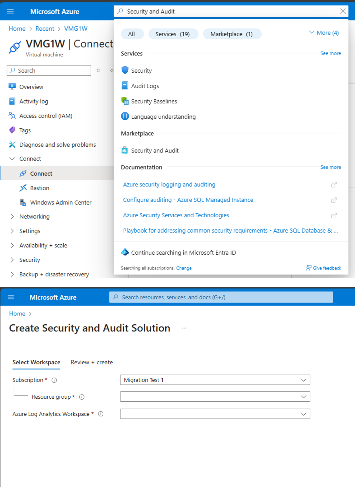
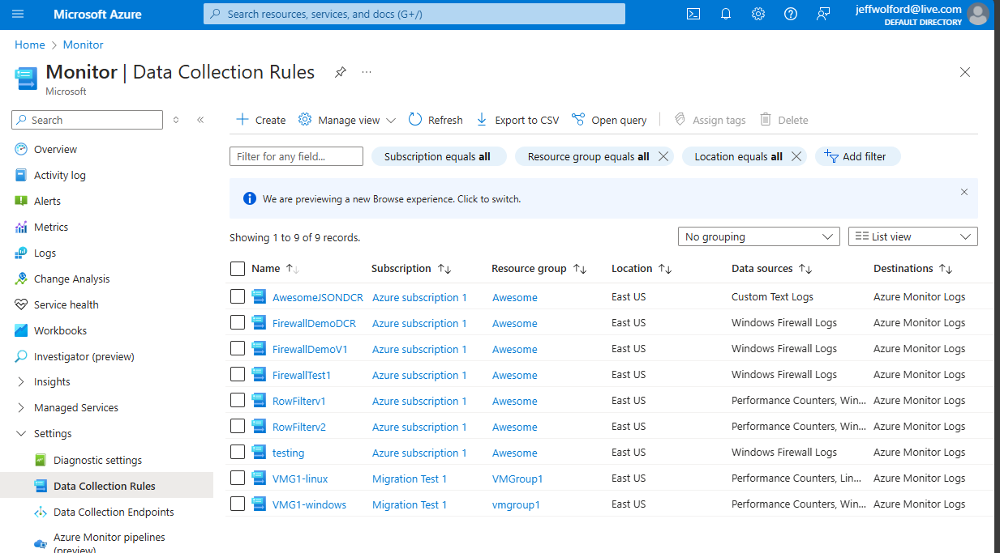
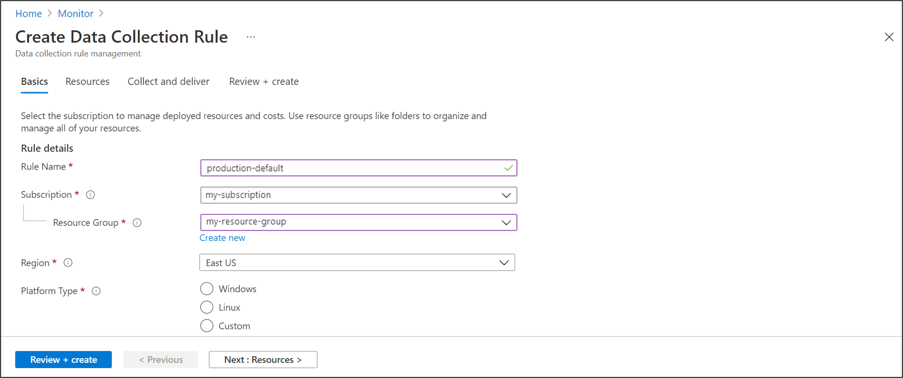
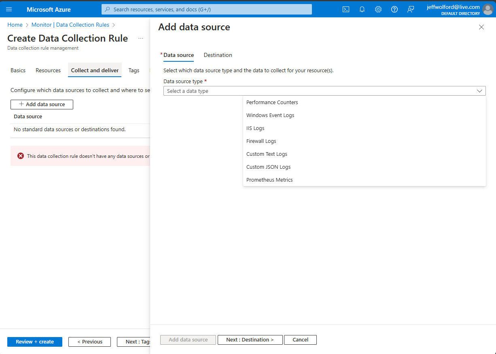
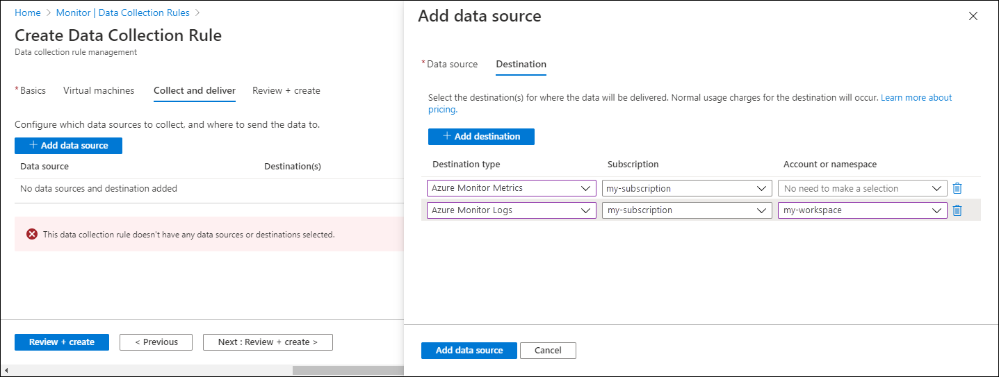
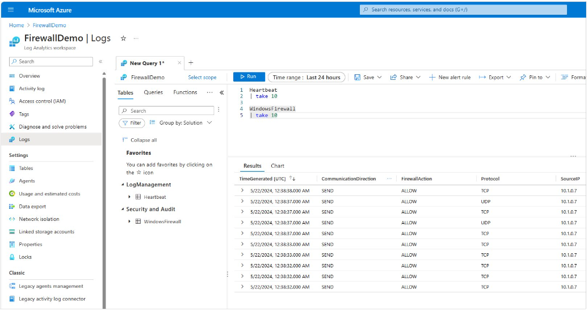
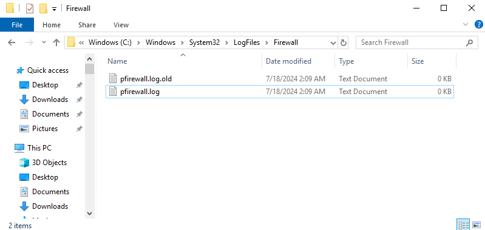
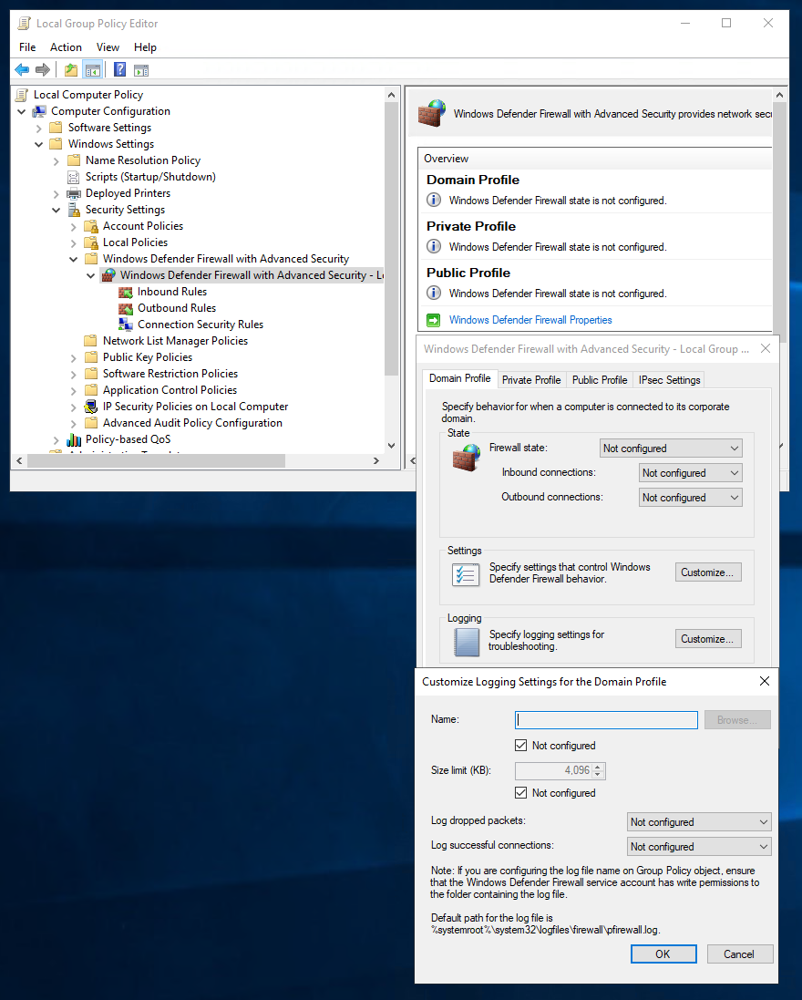

# Collect firewall logs with Azure Monitor Agent (Preview)
Windows Firewall is a Microsoft Windows application that filters information coming to your system from the Internet and blocks potentially harmful programs. Windows Firewall logs are generated on both client and server operating systems. These logs provide valuable information about network traffic, including dropped packets and successful connections. Parsing Windows Firewall log files can be done using methods like Windows Event Forwarding (WEF) or forwarding logs to a SIEM product like Azure Sentinel. You can turn it on or off by following these steps on any Windows system:
1. Select Start, then open Settings.
1. Under Update & Security, select Windows Security, Firewall & network protection.
1. Select a network profile: domain, private, or public.
1. Under Microsoft Defender Firewall, switch the setting to On or Off.

## Prerequisites
To complete this procedure, you need: 
- Log Analytics workspace where you have at least [contributor rights](../logs/manage-access.md#azure-rbac).
- [Data collection endpoint](../essentials/data-collection-endpoint-overview.md#create-a-data-collection-endpoint).
- [Permissions to create Data Collection Rule objects](../essentials/data-collection-rule-overview.md) in the workspace.
- A Virtual Machine, Virtual Machine Scale Set, or Arc-enabled on-premises machine that is running firewall. 

## Add Firewall table to Log Analytics Workspace
Unlike other tables that are created by default in LAW, the Windows Firewall table must be manually created. Search for the Security and Audit solution and create it. See screenshot below. If the table isn't present you'll get a DCR deployment error stating that the table isn't present in LAW.  The schema for the firewall table that gets created is located here: [Windows Firewall Schema](/azure/azure-monitor/reference/tables/windowsfirewall)

[  ](./media/data-collection-firewall-log/security-and-audit-solution.png#lightbox)

## Create a data collection rule to collect firewall logs
The [data collection rule](../essentials/data-collection-rule-overview.md) defines: 
- Which source log files Azure Monitor Agent scans for new events.
- How Azure Monitor transforms events during ingestion.
- The destination Log Analytics workspace and table to which Azure Monitor sends the data.

You can define a data collection rule to send data from multiple machines to multiple Log Analytics workspaces, including workspaces in a different region or tenant. Create the data collection rule in the *same region* as your Analytics workspace.

> [!NOTE]
> To send data across tenants, you must first enable [Azure Lighthouse](../../lighthouse/overview.md).

To create the data collection rule in the Azure portal:
1. On the **Monitor** menu, select **Data Collection Rules**.
1. Select **Create** to create a new data collection rule and associations.

    [  ](media/data-collection-firewall-log/data-collection-rules-updated.png#lightbox)
   
1. Enter a **Rule name** and specify a **Subscription**, **Resource Group**, **Region**, and **Platform Type**:
    - **Region** specifies where the DCR will be created. The virtual machines and their associations can be in any subscription or resource group in the tenant.
    - **Platform Type** specifies the type of resources this rule can apply to. The **Custom** option allows for both Windows and Linux types.
    -**Data Collection End Point** select a previously created data [collection end point](../essentials/data-collection-endpoint-overview.md).
      
    [  ](media/data-collection-firewall-log/data-collection-rule-basics-updated.png#lightbox)
1. On the **Resources** tab: Select **+ Add resources** and associate resources with the data collection rule. Resources can be Virtual Machines, Virtual Machine Scale Sets, and Azure Arc for servers. The Azure portal installs Azure Monitor Agent on resources that don't already have it installed. 

> [!IMPORTANT]
> The portal enables system-assigned managed identity on the target resources, along with existing user-assigned
> identities, if there are any. For existing applications, unless you specify the user-assigned identity in the
> request, the machine defaults to using system-assigned identity instead. If you need network isolation using private
> links, select existing endpoints from the same region for the respective resources or [create a new endpoint](../essentials/data-collection-endpoint-overview.md).

1. On the **Collect and deliver** tab, select **Add data source** to add a data source and set a destination.
1. Select **Firewall Logs**.

    [ ](media/data-collection-firewall-log/firewall-data-collection-rule.png#lightbox)

1. On the **Destination** tab, add one or more destinations for the data source. You can select multiple destinations of the same or different types. For instance, you can select multiple Log Analytics workspaces, which is also known as multihoming.

    [  ](media/data-collection-firewall-log/data-collection-rule-destination.png#lightbox)

1. Select **Review + create** to review the details of the data collection rule and association with the set of virtual machines.
1. Select **Create** to create the data collection rule.

> [!NOTE]
> It can take up to 5 minutes for data to be sent to the destinations after you create the data collection rule.


### Sample log queries

Count the firewall log entries by URL for the host www.contoso.com.
    
```kusto
WindowsFirewall 
| take 10
```

[  ](media/data-collection-firewall-log/law-query-results.png#lightbox)

## Troubleshoot
Use the following steps to troubleshoot the collection of firewall logs. 

### Run Azure Monitor Agent troubleshooter
To test your configuration and share logs with Microsoft [use the Azure Monitor Agent Troubleshooter](use-azure-monitor-agent-troubleshooter.md).

### Check if any firewall logs have been received
Start by checking if any records have been collected for your firewall logs by running the following query in Log Analytics. If the query doesn't return records, check the other sections for possible causes. This query looks for entries in the last two days, but you can modify for another time range.

``` kusto
WindowsFirewall
| where TimeGenerated > ago(48h)
| order by TimeGenerated desc
```

### Verify that firewall logs are being created
Look at the timestamps of the log files and open the latest to see that latest timestamps are present in the log files. The default location for firewall log files is C:\windows\system32\logfiles\firewall\pfirewall.log.

[  ](media/data-collection-firewall-log/firewall-files-on-disk.png#lightbox)

To turn on logging follow these steps.
1. gpedit {follow the picture}​
2. netsh advfirewall>set allprofiles logging allowedconnections enable​
3. netsh advfirewall>set allprofiles logging droppedconnections enable​

[  ](media/data-collection-firewall-log/turn-on-firewall-logging.png#lightbox)

## Next steps
Learn more about: 
- [Azure Monitor Agent](azure-monitor-agent-overview.md).
- [Data collection rules](../essentials/data-collection-rule-overview.md).
- [Data collection endpoints](../essentials/data-collection-endpoint-overview.md)
