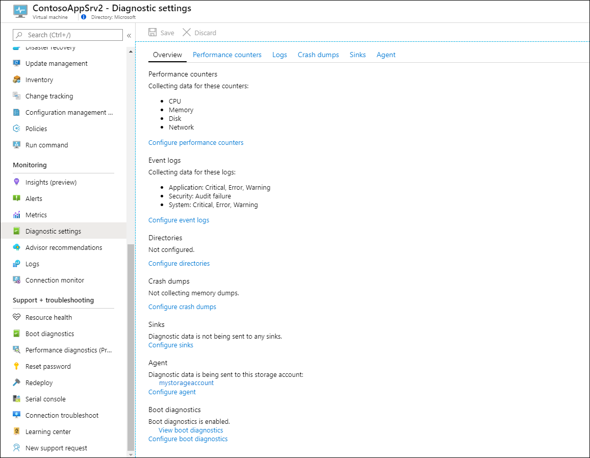
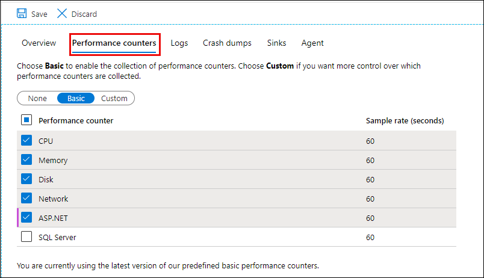
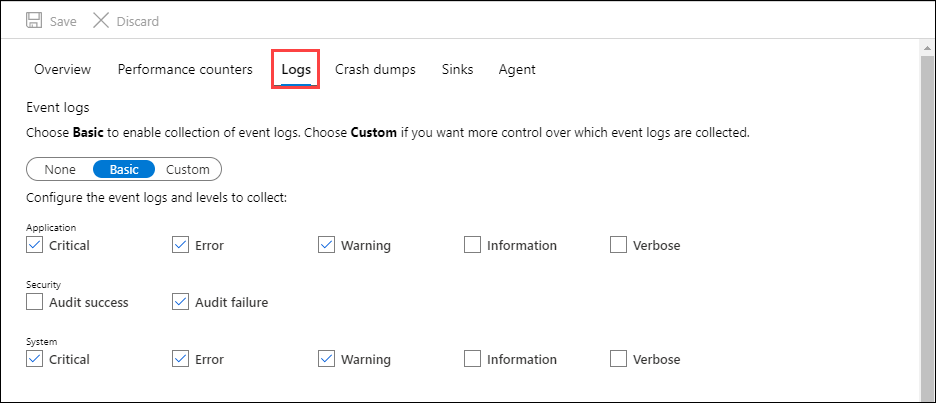
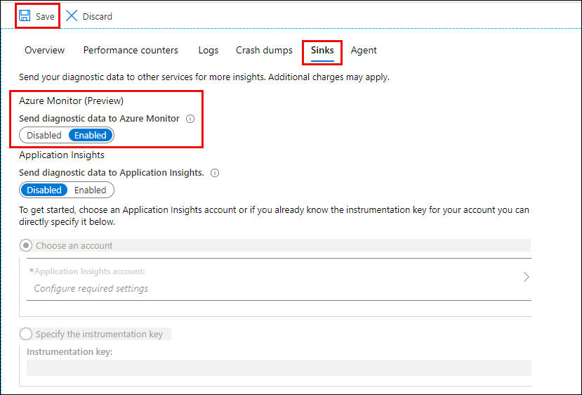
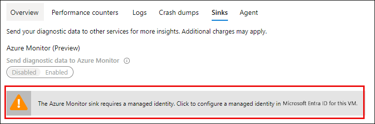

# Install and configure Windows Azure diagnostics extension (WAD)
[Azure diagnostics extension](diagnostics-extension-overview.md) is an agent in Azure Monitor that collects monitoring data from the guest operating system and workloads of Azure virtual machines and other compute resources. This article provides details on installing and configuring the Windows diagnostics extension and a description of how the data is stored in and Azure Storage account.

The diagnostics extension is implemented as a [virtual machine extension](../../virtual-machines/extensions/overview.md) in Azure, so it supports the same installation options using Resource Manager templates, PowerShell, and CLI. See [Virtual machine extensions and features for Windows](../../virtual-machines/extensions/features-windows.md) for details on installing and maintaining virtual machine extensions.

## Overview
When you configure Windows Azure the diagnostics extension, you must specify a storage account where all specified data will be sent. You can optionally add one or more *data sinks* to send the data to different locations.

- Azure Monitor sink - Send guest performance data to Azure Monitor Metrics.
- Event hub sink - Send guest performance and log data to Azure event hubs to forward outside of Azure. This sink cannot be configured in the Azure portal.


## Install with Azure portal
You can install and configure the diagnostics extension on an individual virtual machine in the Azure portal which provides you an interface as opposed to working directly with the configuration. When you enable the diagnostics extension, it will automatically use a default configuration with the most common performance counters and events. You can modify this default configuration according to your specific requirements.

> [!NOTE]
> The following describe the most common settings for the diagnostics extension. For details on all of the configuration options, see [Windows diagnostics extension schema](diagnostics-extension-schema-windows.md).

1. Open the menu for a virtual machine in the Azure portal.

2. Click on **Diagnostic settings** in the **Monitoring** section of the VM menu.

3. Click **Enable guest-level monitoring** if the diagnostics extension hasn't already been enabled.

   

4. A new Azure Storage account will be created for the VM with the name will be based on the name of the resource group for the VM, and a default set of guest performance counters and logs will be selected.

   

5. In the **Performance counters** tab, select the guest metrics you would like to collect from this virtual machine. Use the **Custom** setting for more advanced selection.

   

6. In the **Logs** tab, select the logs to collect from the virtual machine. Logs can be sent to storage or event hubs, but not to Azure Monitor. Use the [Log Analytics agent](../agents/log-analytics-agent.md) to collect guest logs to Azure Monitor.

   

7. In the **Crash dumps** tab, specify any processes to collect memory dumps after a crash. The data will be written to the storage account for the diagnostic setting, and you can optionally specify a blob container.

   

8. In the **Sinks** tab, specify whether to send the data to locations other than Azure storage. If you select **Azure Monitor**, guest performance data will be sent to Azure Monitor Metrics. You cannot configure the event hubs sink using the Azure portal.

   
   
   If you have not enabled a System Assigned Identity configured for your virtual machine, you may see the below warning when you save a configuration with the Azure Monitor sink. Click on the banner to enable the system assigned identity.
   
   

9. In the **Agent**, you can change the storage account, set the disk quota, and specify whether to collect diagnostic infrastructure logs.  

   

10. Click **Save** to save the configuration. 

> [!NOTE]
> While the configuration for diagnostics extension can be formatted in either JSON or XML, any configuration done in the Azure portal will always be stored as JSON. If you use XML with another configuration method and then change your configuration with the Azure portal, the settings will be changed to JSON.

## Resource Manager template
See [Use monitoring and diagnostics with a Windows VM and Azure Resource Manager templates](../../virtual-machines/extensions/diagnostics-template.md) on deploying the diagnostics extension with Azure Resource Manager templates. 

## Azure CLI deployment
The Azure CLI can be used to deploy the Azure Diagnostics extension to an existing virtual machine using [az vm extension set](/cli/azure/vm/extension#az_vm_extension_set) as in the following example. 

```azurecli
az vm extension set \
  --resource-group myResourceGroup \
  --vm-name myVM \
  --name IaaSDiagnostics \
  --publisher Microsoft.Azure.Diagnostics \
  --protected-settings protected-settings.json \
  --settings public-settings.json 
```

The protected settings are defined in the [PrivateConfig element](diagnostics-extension-schema-windows.md#privateconfig-element) of the configuration schema. Following is a minimal example of a protected settings file that defines the storage account. See [Example configuration](diagnostics-extension-schema-windows.md#privateconfig-element) for complete details of the private settings.

```JSON
{
    "storageAccountName": "mystorageaccount",
    "storageAccountKey": "xxxxxxxxxxxxxxxxxxxxxxxxxxxxxxxxxxx",
    "storageAccountEndPoint": "https://mystorageaccount.blob.core.windows.net"
}
```

The public settings are defined in the [Public element](diagnostics-extension-schema-windows.md#publicconfig-element) of the configuration schema. Following is a minimal example of a public settings file that enables collection of diagnostic infrastructure logs,  a single performance counter, and a single event log. See [Example configuration](diagnostics-extension-schema-windows.md#publicconfig-element) for complete details of the public settings.

```JSON
{
  "StorageAccount": "mystorageaccount",
  "WadCfg": {
    "DiagnosticMonitorConfiguration": {
      "overallQuotaInMB": 5120,
      "PerformanceCounters": {
        "scheduledTransferPeriod": "PT1M",
        "PerformanceCounterConfiguration": [
          {
            "counterSpecifier": "\\Processor Information(_Total)\\% Processor Time",
            "unit": "Percent",
            "sampleRate": "PT60S"
          }
        ]
      },
      "WindowsEventLog": {
        "scheduledTransferPeriod": "PT1M",
        "DataSource": [
          {
            "name": "Application!*[System[(Level=1 or Level=2 or Level=3)]]"
          }
        ]
      }
    }
  }
}
```


## PowerShell deployment
PowerShell can be used to deploy the Azure Diagnostics extension to an existing virtual machine using [Set-AzVMDiagnosticsExtension](/powershell/module/servicemanagement/azure.service/set-azurevmdiagnosticsextension) as in the following example. 

```powershell
Set-AzVMDiagnosticsExtension -ResourceGroupName "myvmresourcegroup" `
  -VMName "myvm" `
  -DiagnosticsConfigurationPath "DiagnosticsConfiguration.json"
```

The private settings are defined in the [PrivateConfig element](diagnostics-extension-schema-windows.md#privateconfig-element), while the public settings are defined in the [Public element](diagnostics-extension-schema-windows.md#publicconfig-element) of the configuration schema. You can also choose to specify the details of the storage account as parameters of the Set-AzVMDiagnosticsExtension cmdlet rather than including them in the private settings.

Following is a minimal example of a configuration file that enables collection of diagnostic infrastructure logs,  a single performance counter, and a single event log. See [Example configuration](diagnostics-extension-schema-windows.md#publicconfig-element) for complete details of the private and public settings. 

```JSON
{
    "PublicConfig": {
        "WadCfg": {
            "DiagnosticMonitorConfiguration": {
                "overallQuotaInMB": 10000,
                "DiagnosticInfrastructureLogs": {
                    "scheduledTransferLogLevelFilter": "Error"
                },
                "PerformanceCounters": {
                    "scheduledTransferPeriod": "PT1M",
                    "PerformanceCounterConfiguration": [
                        {
                            "counterSpecifier": "\\Processor(_Total)\\% Processor Time",
                            "sampleRate": "PT3M",
                            "unit": "percent"
                        }
                    ]
                },
                "WindowsEventLog": {
                    "scheduledTransferPeriod": "PT1M",
                        "DataSource": [
                        {
                            "name": "Application!*[System[(Level=1 or Level=2 or Level=3)]]"
                        }
                    ]
                }
            }
        },
        "StorageAccount": "mystorageaccount",
        "StorageType": "TableAndBlob"
    },
    "PrivateConfig": {
        "storageAccountName": "mystorageaccount",
        "storageAccountKey": "xxxxxxxxxxxxxxxxxxxxxxxxxxxxxxxxxxx",
        "storageAccountEndPoint": "https://mystorageaccount.blob.core.windows.net"
    }
}
```

See also [Use PowerShell to enable Azure Diagnostics in a virtual machine running Windows](../../virtual-machines/extensions/diagnostics-windows.md).

## Data storage
The following table lists the different types of data collected from the diagnostics extension and whether they're stored as a table or a blob. The data stored in tables can also be stored in blobs depending on the [StorageType setting](diagnostics-extension-schema-windows.md#publicconfig-element) in your public configuration.


| Data | Storage type | Description |
|:---|:---|:---|
| WADDiagnosticInfrastructureLogsTable | Table | Diagnostic monitor and configuration changes. |
| WADDirectoriesTable | Table | Directories that the diagnostic monitor is monitoring.  This includes IIS logs, IIS failed request logs, and custom directories.  The location of the blob log file is specified in the Container field and the name of the blob is in the RelativePath field.  The AbsolutePath field indicates the location and name of the file as it existed on the Azure virtual machine. |
| WadLogsTable | Table | Logs written in code using the trace listener. |
| WADPerformanceCountersTable | Table | Performance counters. |
| WADWindowsEventLogsTable | Table | Windows Event logs. |
| wad-iis-failedreqlogfiles | Blob | Contains information from IIS Failed Request logs. |
| wad-iis-logfiles | Blob | Contains information about IIS logs. |
| "custom" | Blob | A custom container based on configuring directories that are monitored by the diagnostic monitor.  The name of this blob container will be specified in WADDirectoriesTable. |

## Tools to view diagnostic data
Several tools are available to view the data after it is transferred to storage. For example:

* Server Explorer in Visual Studio - If you have installed the Azure Tools for Microsoft Visual Studio, you can use the Azure Storage node in Server Explorer to view read-only blob and table data from your Azure storage accounts. You can display data from your local storage emulator account and also from storage accounts you have created for Azure. For more information, see [Browsing and Managing Storage Resources with Server Explorer](/visualstudio/azure/vs-azure-tools-storage-resources-server-explorer-browse-manage).
* [Microsoft Azure Storage Explorer](../../vs-azure-tools-storage-manage-with-storage-explorer.md) is a standalone app that enables you to easily work with Azure Storage data on Windows, OSX, and Linux.
* [Azure Management Studio](https://www.cerebrata.com/products/azure-management-studio/introduction) includes Azure Diagnostics Manager which allows you to view, download and manage the diagnostics data collected by the applications running on Azure.

## Next steps
- See [Send data from Windows Azure diagnostics extension to Event Hubs](diagnostics-extension-stream-event-hubs.md) for details on forwarding monitoring data to Azure Event Hubs.
