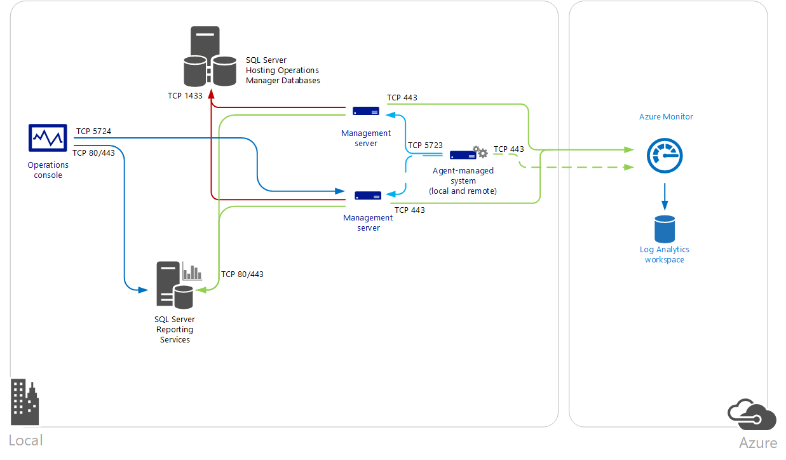

# Connect Operations Manager to Azure Monitor

To maintain your existing investment in [System Center Operations Manager](/system-center/scom/key-concepts) and use extended capabilities with Azure Monitor, you can integrate Operations Manager with your Log Analytics workspace. In this way, you can use logs in Azure Monitor while you continue to use Operations Manager to:

* Monitor the health of your IT services with Operations Manager.
* Maintain integration with your ITSM solutions that support incident and problem management.
* Manage the lifecycle of agents deployed to on-premises and public cloud infrastructure as a service (IaaS) virtual machines that you monitor with Operations Manager.

Integrating with System Center Operations Manager adds value to your service operations strategy by using the speed and efficiency of Azure Monitor in collecting, storing, and analyzing log data from Operations Manager. Azure Monitor log queries help correlate and work toward identifying the faults of problems and surfacing recurrences in support of your existing problem management process. The flexibility of the query engine to examine performance, event, and alert data with rich dashboards and reporting capabilities to expose this data in meaningful ways demonstrates the strength Azure Monitor brings in complementing Operations Manager.

The agents reporting to the Operations Manager management group collect data from your servers based on the [Log Analytics data sources](../agents/agent-data-sources.md) and solutions you've enabled in your workspace. Depending on the solutions enabled:

>[!Note]
>Newer integrations and reconfiguration of the existing integration between Operations Manager management server and Log Analytics will no longer work as this connection will be retired soon.

- The data is sent directly from an Operations Manager management server to the service, or
- The data is sent directly from the agent to a Log Analytics workspace because of the volume of data collected on the agent-managed system.

The management server forwards the data directly to the service. It's never written to the operational or data warehouse database. When a management server loses connectivity with Azure Monitor, it caches the data locally until communication is reestablished. If the management server is offline because of planned maintenance or an unplanned outage, another management server in the management group resumes connectivity with Azure Monitor.

The following diagram shows the connection between the management servers and agents in a System Center Operations Manager management group and Azure Monitor, including the direction and ports.



If your IT security policies don't allow computers on your network to connect to the internet, management servers can be configured to connect to the Log Analytics gateway to receive configuration information and send collected data depending on the solutions enabled. For more information and steps on how to configure your Operations Manager management group to communicate through a Log Analytics gateway to Azure Monitor, see [Connect computers to Azure Monitor by using the Log Analytics gateway](./gateway.md).  

## Prerequisites

Before you start, review the following requirements.

>[!Note]
>From June 30th, 2023, System Center Operations Manager versions lower than [2019 UR3](/system-center/scom/release-build-versions?view=sc-om-2019#agents&preserve-view=true) will stop sending data to Log Analytics workspaces. Ensure that your agents are on System Center Operations Manager Agent version 10.19.10177.0 ([2019 UR3](/system-center/scom/release-build-versions?view=sc-om-2019#agents&preserve-view=true) or later) or 10.22.10056.0 ([2022 RTM](/system-center/scom/release-build-versions?view=sc-om-2022#agents&preserve-view=true)) and that the System Center Operations Manager Management Group version is the System Center Operations Manager 2022 and 2019 UR3 or later version.

* Azure Monitor supports:
    * System Center Operations Manager 2022
    * System Center Operations Manager 2019
    * System Center Operations Manager 2016
* Integrating System Center Operations Manager with US Government cloud requires:
    *  System Center Operations Manager 2022
    *  System Center Operations Manager 2019
* All Operations Manager agents must meet minimum support requirements. Ensure that agents are at the minimum update. Otherwise, Windows agent communication might fail and generate errors in the Operations Manager event log.
* A Log Analytics workspace. For more information, see [Log Analytics workspace overview](../logs/workspace-design.md).
* You authenticate to Azure with an account that's a member of the [Log Analytics Contributor role](../logs/manage-access.md#azure-rbac).
* Supported regions: The following Azure regions are supported by System Center Operations Manager to connect to a Log Analytics workspace:
    - West Central US
    - Australia South East
    - West Europe
    - East US
    - South East Asia
    - Japan East
    - UK South
    - Central India
    - Canada Central
    - West US 2

>[!NOTE]
>Recent changes to Azure APIs will prevent customers from successfully configuring integration between their management group and Azure Monitor for the first time. For customers who have already integrated their management group with the service, you're not affected unless you need to reconfigure your existing connection.
>A new management pack has been released for the following versions of Operations Manager:
> - For System Center Operations Manager 2019 and newer, this management pack is included with the source media and installed during setup of a new management group or during an upgrade.
>- For System Center Operations Manager 1801/1807, download the management pack from the [Download Center](https://www.microsoft.com/download/details.aspx?id=57173).
>- For System Center Operations Manager 2016, download the management pack from the [Download Center](https://www.microsoft.com/download/details.aspx?id=57172).
>- For System Center Operations Manager 2012 R2, download the management pack from the [Download Center](https://www.microsoft.com/download/details.aspx?id=57171).

### Network

The following table lists the proxy and firewall configuration information required for the Operations Manager agent, management servers, and Operations console to communicate with Azure Monitor. Traffic from each component is outbound from your network to Azure Monitor.

|Resource | Port number| Bypass HTTP inspection|  
|---------|------|-----------------------|  
|**Agent**|||  
|\*.ods.opinsights.azure.com| 443 |Yes|  
|\*.oms.opinsights.azure.com| 443|Yes|  
|\*.blob.core.windows.net| 443|Yes|  
|\*.azure-automation.net| 443|Yes|  
|**Management server**|||  
|\*.service.opinsights.azure.com| 443||  
|\*.blob.core.windows.net| 443| Yes|  
|\*.ods.opinsights.azure.com| 443| Yes|  
|*.azure-automation.net | 443| Yes|  
|**Operations Manager console to Azure Monitor**|||  
|service.systemcenteradvisor.com| 443||  
|\*.service.opinsights.azure.com| 443||  
|\*.live.com| 80 and 443||  
|\*.microsoft.com| 80 and 443||  
|\*.microsoftonline.com| 80 and 443||  
|\*.mms.microsoft.com| 80 and 443||  
|login.windows.net| 80 and 443||  
|portal.loganalytics.io| 80 and 443||
|api.loganalytics.io| 80 and 443||
|docs.loganalytics.io| 80 and 443||  

### TLS 1.2 protocol

To ensure the security of data in transit to Azure Monitor, configure the agent and management group to use at least Transport Layer Security (TLS) 1.2. Older versions of TLS/Secure Sockets Layer (SSL) are vulnerable. Although they still currently work to allow backward compatibility, they're *not recommended*. For more information, see [Sending data securely by using TLS 1.2](../logs/data-security.md#sending-data-securely-using-tls-12).

## Connect Operations Manager to Azure Monitor

Perform the following series of steps to configure your Operations Manager management group to connect to one of your Log Analytics workspaces.

> [!NOTE]
> - If Log Analytics data stops coming in from a specific agent or management server, reset the Winsock Catalog by using `netsh winsock reset`. Then reboot the server. Resetting the Winsock Catalog allows network connections that were broken to be reestablished.
> - Newer integrations and reconfiguration of the existing integration between Operations Manager management server and Log Analytics will no longer workas this connection will be retired soon. However, you can still connect your monitored System Center Operations Manager agents to Log Analytics using the following methods based on your scenario.
>     1.	Use a Log Analytics Gateway and point the agent to that server. Learn more about [Connect computers without internet access by using the Log Analytics gateway in Azure Monitor](/azure/azure-monitor/agents/gateway).
>     2.	Use the AMA (Azure Monitoring Agent) agent side-by-side to connect the agent to Log Analytics. Learn more about [Migrate to Azure Monitor Agent from Log Analytics agent](/azure/azure-monitor/agents/azure-monitor-agent-migration). 
>     3.	Configure a direct connection to Log Analytics in the Microsoft Monitoring Agent. (Dual-Home with System Center Operations Manager).

During initial registration of your Operations Manager management group with a Log Analytics workspace, the option to specify the proxy configuration for the management group isn't available in the Operations console. The management group has to be successfully registered with the service before this option is available. To work around this situation, update the system proxy configuration by using `netsh` on the system you're running the Operations console from to configure integration, and all management servers in the management group.

1. Open an elevated command prompt:
    1. Go to **Start** and enter **cmd**.
    1. Right-click **Command prompt** and select **Run as administrator**.
1. Enter the following command and select **Enter**:

    `netsh winhttp set proxy <proxy>:<port>`

After you finish the following steps to integrate with Azure Monitor, you can remove the configuration by running `netsh winhttp reset proxy`. Then use the **Configure proxy server** option in the Operations console to specify the proxy or Log Analytics gateway server.

1. In the Operations Manager console, select the **Administration** workspace.
1. Expand the **Operations Management Suite** node and select **Connection**.
1. Select the **Register to Operations Management Suite** link.
1. On the **Operations Management Suite Onboarding Wizard: Authentication** page, enter the email address or phone number and password of the administrator account that's associated with your Operations Management Suite subscription. Select **Sign in**.

   >[!NOTE]
   >The Operations Management Suite name has been retired.

1. After you're successfully authenticated, on the **Select Workspace** page, you're prompted to select your Azure tenant, subscription, and Log Analytics workspace. If you have more than one workspace, select the workspace you want to register with the Operations Manager management group from the dropdown list. Select **Next**.

   > [!NOTE]
   > Operations Manager only supports one Log Analytics workspace at a time. The connection and the computers that were registered to Azure Monitor with the previous workspace are removed from Azure Monitor.
   >
   >
1. On the **Summary** page, confirm your settings. If they're correct, select **Create**.
1. On the **Finish** page, select **Close**.

### Add agent-managed computers

After you configure integration with your Log Analytics workspace, only a connection with the service is established. No data is collected from the agents that report to your management group. Data collection won't happen until after you configure which specific agent-managed computers collect log data for Azure Monitor.

You can select the computer objects individually, or you can select a group that contains Windows computer objects. You can't select a group that contains instances of another class, such as logical disks or SQL databases.

1. Open the Operations Manager console and select the **Administration** workspace.
1. Expand the **Operations Management Suite** node and select **Connections**.
1. Select the **Add a Computer/Group** link under the **Actions** heading on the right side of the pane.
1. In the **Computer Search** dialog, search for computers or groups monitored by Operations Manager. Select computers or groups, including the Operations Manager Management Server, to onboard to Azure Monitor. Select **Add** > **OK**.

You can view computers and groups configured to collect data from the **Managed Computers** node under **Operations Management Suite** in the **Administration** workspace of the Operations console. From here, you can add or remove computers and groups as necessary.

### Configure proxy settings in the Operations console

Perform the following steps if an internal proxy server is between the management group and Azure Monitor. These settings are centrally managed from the management group and distributed to agent-managed systems that are included in the scope to collect log data for Azure Monitor. This is beneficial for when certain solutions bypass the management server and send data directly to the service.

1. Open the Operations Manager console and select the **Administration** workspace.
1. Expand the **Operations Management Suite** node and select **Connections**.
1. In the **OMS Connection** view, select **Configure Proxy Server**.
1. On the **Operations Management Suite Wizard: Proxy Server** page, select **Use a proxy server to access the Operations Management Suite**. Enter the URL with the port number, for example, http://corpproxy:80, and select **Finish**.

If your proxy server requires authentication, perform the following steps to configure credentials and settings that need to propagate to managed computers that report to Azure Monitor in the management group.

1. Open the Operations Manager console and select the **Administration** workspace.
1. Under **RunAs Configuration**, select **Profiles**.
1. Open the **System Center Advisor Run As Profile Proxy** profile.
1. In the **Run As Profile Wizard**, select **Add** to use a Run As account. You can create a [Run As account](/previous-versions/system-center/system-center-2012-R2/hh321655(v=sc.12)) or use an existing account. This account needs to have sufficient permissions to pass through the proxy server.
1. To set the account to manage, select **A selected class, group, or object** and choose **Select**. Select **Group** to open the **Group Search** box.
1. Search for and then select **Microsoft System Center Advisor Monitoring Server Group**. Select **OK** after you select the group to close the **Group Search** box.
1. Select **OK** to close the **Add a Run As account** box.
1. Select **Save** to finish the wizard and save your changes.

After the connection is created and you configure which agents will collect and report log data to Azure Monitor, the following configuration is applied in the management group, not necessarily in order:

* The Run As account **Microsoft.SystemCenter.Advisor.RunAsAccount.Certificate** is created. It's associated with the Run As profile **Microsoft System Center Advisor Run As Profile Blob**. It targets two classes: **Collection Server** and **Operations Manager Management Group**.
* Two connectors are created. The first is named **Microsoft.SystemCenter.Advisor.DataConnector** It's automatically configured with a subscription that forwards all alerts generated from instances of all classes in the management group to Azure Monitor. The second connector is **Advisor Connector**. It's responsible for communicating with Azure Monitor and sharing data.
* Agents and groups that you've selected to collect data in the management group are added to the **Microsoft System Center Advisor Monitoring Server Group**.

## Management pack updates

After configuration is finished, the Operations Manager management group establishes a connection with Azure Monitor. The management server synchronizes with the web service and receives updated configuration information in the form of management packs for the solutions you've enabled that integrate with Operations Manager. Operations Manager checks for updates of these management packs and automatically downloads and imports them when they're available. Two rules in particular control this behavior:

* **Microsoft.SystemCenter.Advisor.MPUpdate**: Updates the base Azure Monitor management packs. Runs every 12 hours by default.
* **Microsoft.SystemCenter.Advisor.Core.GetIntelligencePacksRule**: Updates solution management packs enabled in your workspace. Runs every 5 minutes by default.

You can override these two rules to prevent automatic download by disabling them or modifying the frequency of how often the management server synchronizes with Azure Monitor to determine if a new management pack is available and should be downloaded. Follow the steps in [Override a rule or monitor](/previous-versions/system-center/system-center-2012-R2/hh212869(v=sc.12)) to modify the **Frequency** parameter with a value in seconds to change the synchronization schedule. You can also modify the **Enabled** parameter to disable the rules. Target the overrides to all objects of class Operations Manager Management Group.

To continue following your existing change control process for controlling management pack releases in your production management group, disable the rules and enable them during specific times when updates are allowed. If you have a development or QA management group in your environment and it has connectivity to the internet, configure that management group with a Log Analytics workspace to support this scenario. In this way, you can review and evaluate the iterative releases of the Azure Monitor management packs before you release them into your production management group.

## Switch an Operations Manager group to a new Log Analytics workspace

1. Sign in to the [Azure portal](https://portal.azure.com).
1. In the Azure portal, select **More services** in the lower-left corner. In the list of resources, enter **Log Analytics**. As you begin typing, the list filters based on your input. Select **Log Analytics** and create a workspace.  
1. Open the Operations Manager console with an account that's a member of the Operations Manager Administrators role and select the **Administration** workspace.
1. Expand **Log Analytics** and select **Connections**.
1. Select the **Re-configure Operation Management Suite** link in the middle of the pane.
1. Follow the **Log Analytics Onboarding Wizard**. Enter the email address or phone number and password of the administrator account that's associated with your new Log Analytics workspace.

   > [!NOTE]
   > The **Operations Management Suite Onboarding Wizard: Select Workspace** page presents the existing workspace that's in use.
   >

## Validate Operations Manager integration with Azure Monitor

Use the following query to get the connected instances of Operations Manager:

```azurepowershell
union *
| where isnotempty(MG)
| where not(ObjectName == 'Advisor Metrics' or ObjectName == 'ManagedSpace')
| summarize LastData = max(TimeGenerated) by lowerCasedComputerName=tolower(Computer), MG, ManagementGroupName
| sort by lowerCasedComputerName asc
```

## Remove integration with Azure Monitor

When you no longer require integration between your Operations Manager management group and the Log Analytics workspace, several steps are required to properly remove the connection and configuration in the management group. The following procedure has you update your Log Analytics workspace by deleting the reference of your management group, deleting the Azure Monitor connectors, and then deleting management packs that support integration with the service.

Management packs for the solutions you've enabled that integrate with Operations Manager and the management packs required to support integration with Azure Monitor can't be easily deleted from the management group. The reason is that some of the Azure Monitor management packs have dependencies on other related management packs. To delete management packs that have a dependency on other management packs, download the script to [remove a management pack with dependencies](https://gallery.technet.microsoft.com/scriptcenter/Script-to-remove-a-84f6873e) from TechNet Script Center.

1. Open the Operations Manager command shell with an account that's a member of the Operations Manager Administrators role.

    > [!WARNING]
    > Verify that you don't have any custom management packs with the word "Advisor" or "IntelligencePack" in the name before you proceed. Otherwise, follow the next steps and delete them from the management group.
    >

1. From the command shell prompt, enter: <br> `Get-SCOMManagementPack -name "*Advisor*" | Remove-SCOMManagementPack -ErrorAction SilentlyContinue`
1. Next, enter: <br> `Get-SCOMManagementPack -name "*IntelligencePack*" | Remove-SCOMManagementPack -ErrorAction SilentlyContinue`
1. To remove any management packs remaining that have a dependency on other System Center Advisor management packs, use the script `RecursiveRemove.ps1` you downloaded from the TechNet Script Center earlier.

    > [!NOTE]
    > The step to remove the Advisor management packs with PowerShell won't automatically delete the Microsoft System Center Advisor or Microsoft System Center Advisor Internal management packs. Do not attempt to delete them.
    >

1. Open the Operations Manager Operations console with an account that's a member of the Operations Manager Administrators role.
1. Under **Administration**, select the **Management Packs** node. In the **Look for:** box, enter **Advisor** and verify that the following management packs are still imported in your management group:

   * Microsoft System Center Advisor
   * Microsoft System Center Advisor Internal

1. In the Azure portal, select the **Settings** tile.
1. Select **Connected Sources**.
1. In the table under the **System Center Operations Manager** section, you should see the name of the management group you want to remove from the workspace. Under the column **Last Data**, select **Remove**.

    > [!NOTE]
    > The **Remove** link won't be available until after 14 days if there's no activity detected from the connected management group.
    >

1. Select **Yes** to confirm that you want to proceed with the removal.

To delete the two connectors, `Microsoft.SystemCenter.Advisor.DataConnector` and `Advisor Connector`, save the following PowerShell script to your computer and execute by using the following examples:

```
    .\OM2012_DeleteConnectors.ps1 "Advisor Connector" <ManagementServerName>
    .\OM2012_DeleteConnectors.ps1 "Microsoft.SystemCenter.Advisor.DataConnector" <ManagementServerName>
```

> [!NOTE]
> If the computer you run this script from isn't a management server, you should have the Operations Manager command shell installed depending on the version of your management group.
>
>

```powershell
    param(
    [String] $connectorName,
    [String] $msName="localhost"
    )
    $mg = new-object Microsoft.EnterpriseManagement.ManagementGroup $msName
    $admin = $mg.GetConnectorFrameworkAdministration()
    ##########################################################################################
    # Configures a connector with the specified name.
    ##########################################################################################
    function New-Connector([String] $name)
    {
         $connectorForTest = $null;
         foreach($connector in $admin.GetMonitoringConnectors())
    {
    if($connectorName.Name -eq ${name})
    {
         $connectorForTest = Get-SCOMConnector -id $connector.id
    }
    }
    if ($connectorForTest -eq $null)
    {
         $testConnector = New-Object Microsoft.EnterpriseManagement.ConnectorFramework.ConnectorInfo
         $testConnector.Name = $name
         $testConnector.Description = "${name} Description"
         $testConnector.DiscoveryDataIsManaged = $false
         $connectorForTest = $admin.Setup($testConnector)
         $connectorForTest.Initialize();
    }
    return $connectorForTest
    }
    ##########################################################################################
    # Removes a connector with the specified name.
    ##########################################################################################
    function Remove-Connector([String] $name)
    {
        $testConnector = $null
        foreach($connector in $admin.GetMonitoringConnectors())
       {
        if($connector.Name -eq ${name})
       {
         $testConnector = Get-SCOMConnector -id $connector.id
       }
      }
     if ($testConnector -ne $null)
     {
        if($testConnector.Initialized)
     {
     foreach($alert in $testConnector.GetMonitoringAlerts())
     {
       $alert.ConnectorId = $null;
       $alert.Update("Delete Connector");
     }
     $testConnector.Uninitialize()
     }
     $connectorIdForTest = $admin.Cleanup($testConnector)
     }
    }
    ##########################################################################################
    # Delete a connector's Subscription
    ##########################################################################################
    function Delete-Subscription([String] $name)
    {
      foreach($testconnector in $admin.GetMonitoringConnectors())
      {
      if($testconnector.Name -eq $name)
      {
        $connector = Get-SCOMConnector -id $testconnector.id
      }
    }
    $subs = $admin.GetConnectorSubscriptions()
    foreach($sub in $subs)
    {
      if($sub.MonitoringConnectorId -eq $connector.id)
      {
        $admin.DeleteConnectorSubscription($admin.GetConnectorSubscription($sub.Id))
      }
     }
    }
    #New-Connector $connectorName
    write-host "Delete-Subscription"
    Delete-Subscription $connectorName
    write-host "Remove-Connector"
    Remove-Connector $connectorName
```

In the future, if you plan on reconnecting your management group to a Log Analytics workspace, you need to re-import the `Microsoft.SystemCenter.Advisor.Resources.\<Language>\.mpb` management pack file. Depending on the version of System Center Operations Manager deployed in your environment, you can find this file in the following location:

* On the source media under the `\ManagementPacks` folder for System Center 2016: Operations Manager and higher.
* From the most recent update rollup applied to your management group. For Operations Manager 2012, the source folder is `%ProgramFiles%\Microsoft System Center 2012\Operations Manager\Server\Management Packs for Update Rollups`. For 2012 R2, it's located in `System Center 2012 R2\Operations Manager\Server\Management Packs for Update Rollups`.

## Next steps

To add functionality and gather data, see [Add Azure Monitor solutions from the Solutions Gallery](/previous-versions/azure/azure-monitor/insights/solutions).