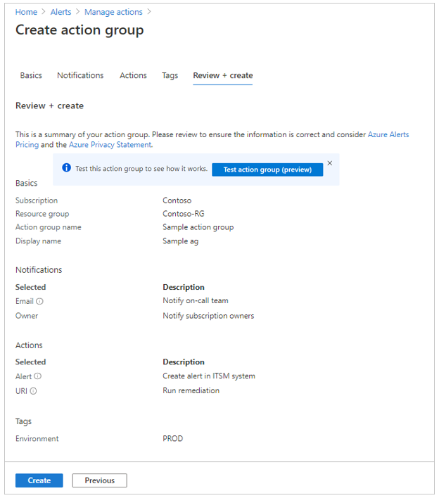
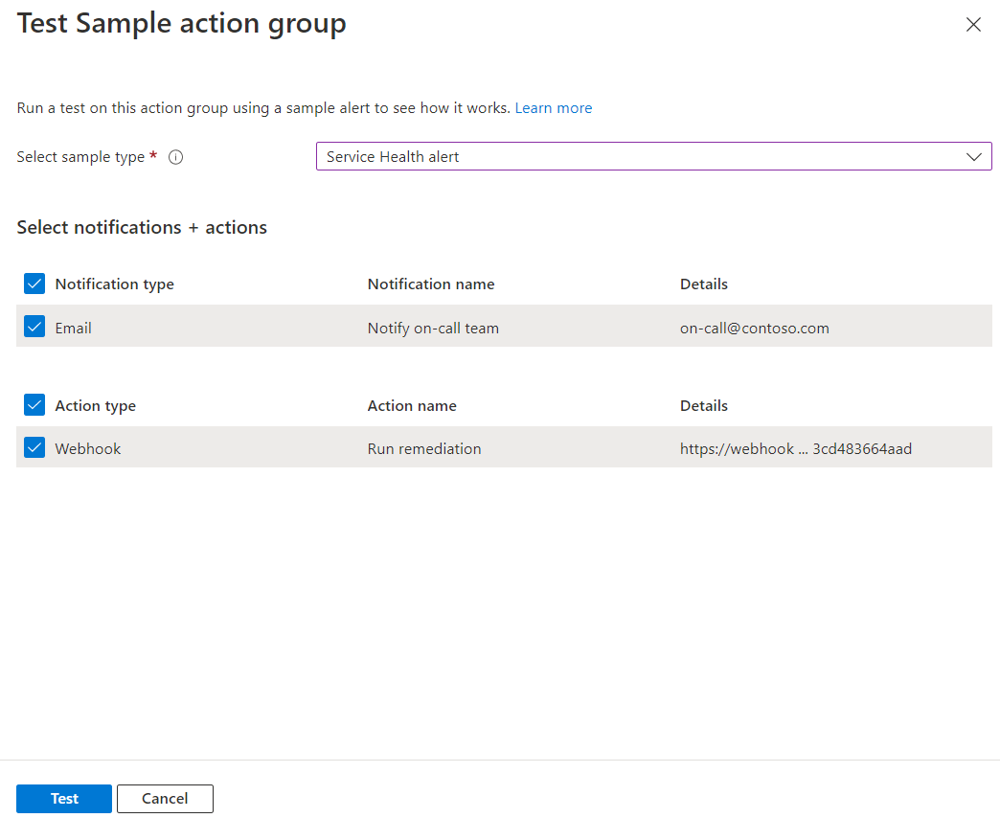
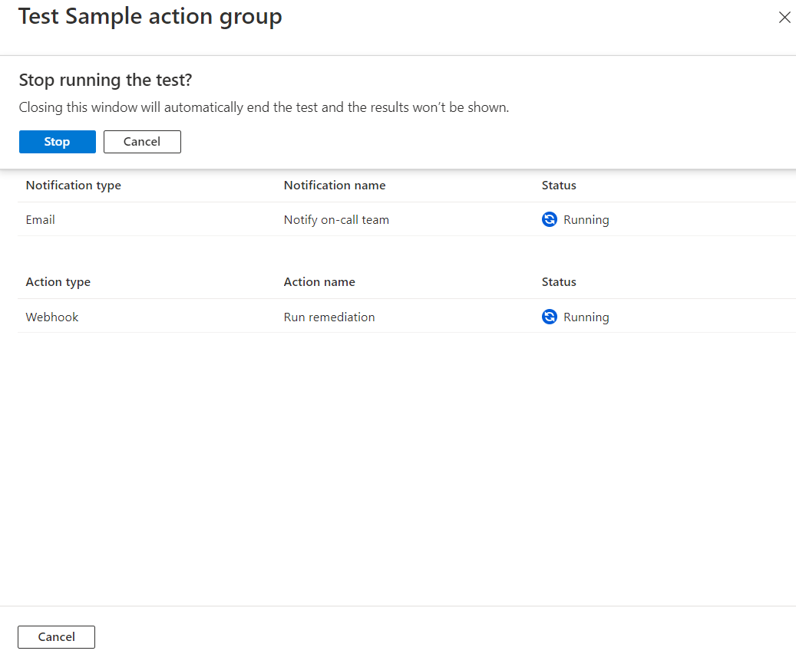
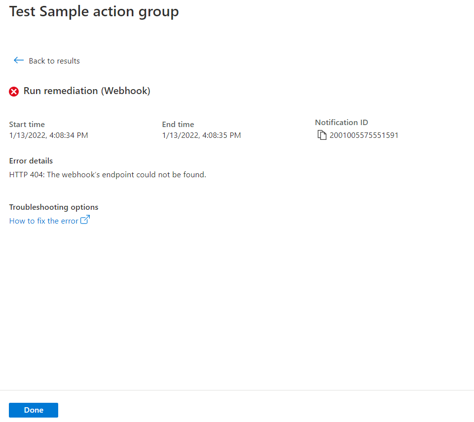

# Create and manage action groups in the Azure portal

When Azure Monitor data indicates that there might be a problem with your infrastructure or application, an alert is triggered. Azure Monitor, Service Health, and Azure Advisor then use *action groups* to notify users about the alert and take an action. An action group is a collection of notification preferences that are defined by the owner of an Azure subscription.

This article shows you how to create and manage action groups in the Azure portal. Depending on your requirements, you can configure various alerts to use the same action group or different action groups.

Each action is made up of the following properties:

- **Type**: The notification that's sent or action that's performed. Examples include sending a voice call, SMS, or email. You can also trigger various types of automated actions. For detailed information about notification and action types, see [Action-specific information](#action-specific-information), later in this article.
- **Name**: A unique identifier within the action group.
- **Details**: The corresponding details that vary by type.

For information about how to use Azure Resource Manager templates to configure action groups, see [Action group Resource Manager templates](./action-groups-create-resource-manager-template.md).

An action group is a **global** service, so there's no dependency on a specific Azure region. Requests from clients can be processed by action group services in any region. For instance, if one region of service is down, the traffic is automatically routed and processed by other regions. As global services, action groups help provide a **disaster recovery** solution.

## Create an action group by using the Azure portal

1. In the [Azure portal](https://portal.azure.com), search for and select **Monitor**. The **Monitor** pane consolidates all your monitoring settings and data in one view.

1. Select **Alerts**, and then select **Manage actions**.

   [Manage Actions button](./media/action-groups/manage-action-groups.png)

1. Select **Add action group**.

   

1. Enter information as explained in the following sections.

### Configure basic action group settings

1. Under **Project details**, select values for **Subscription** and **Resource group**. The action group is saved in the subscription and resource group that you select.

1. Under **Instance details**, enter values for **Action group name** and **Display name**. The display name is used in place of a full action group name when the group is used to send notifications.

   

### Configure notifications

1. To move to the **Notifications** tab, select **Next: Notifications**. Alternately, at the top of the page, select the **Notifications** tab.

1. Define a list of notifications to send when an alert is triggered. Provide the following information for each notification:

   - **Notification type**: Select the type of notification you want to send. The available options are:

     - **Email Azure Resource Manager Role**: Send an email to users who are assigned to certain subscription-level ARM roles.
     - **Email/SMS message/Push/Voice**: Send these notification types to specific recipients.

   - **Name**: Enter a unique name for the notification.

   - **Details**: Based on the selected notification type, enter an email address, phone number, or other information.

   - **Common alert schema**: You can choose to turn on the [common alert schema](./alerts-common-schema.md), which provides the advantage of having a single extensible and unified alert payload across all the alert services in Azure Monitor.

   

1. Select OK.

### Configure actions

1. To move to the **Actions** tab, select **Next: Actions**. Alternately at the top of the page, select the **Actions** tab.

1. Define a list of actions to trigger when an alert is triggered. Provide the following information for each action:

   - **Action type**: Select from the following options:

     - Automation Runbook
     - Azure Function
     - Event Hub
     - ITSM
     - Logic App
     - Secure Webhook
     - Webhook

   - **Name**: Enter a unique name for the action.

   - **Details**: Based on the action type, enter a webhook URI, Azure app, ITSM connection, or Automation Runbook. For ITSM Action, also enter values for **Work Item** and other fields that your ITSM tool requires.

   - **Common alert schema**: You can choose to turn on the [common alert schema](./alerts-common-schema.md), which provides the advantage of having a single extensible and unified alert payload across all the alert services in Azure Monitor.

   

### Create the action group

1. If you'd like to assign a key-value pair to the action group, select **Next: Tags** or the **Tags** tab. Otherwise, skip this step. By using tags, you can categorize your Azure resources. Tags are available for all Azure resources, resource groups, and subscriptions.

   

1. To review the settings, select **Review + create**. This step quickly checks your inputs to make sure you've entered all required information. If there are issues, they're reported here. After you've reviewed the settings, select **Create** to provision the action group.

   

> [!NOTE]
> When you configure an action to notify a person by email or SMS, they receive a confirmation indicating that they have been added to the action group.

### Test an action group in the Azure portal (Preview)

When you create or update an action group in the Azure portal, you can **test** the action group.

1. Set up an action rule, as described in the previous few sections. Then select **Review + create**. 

1. On the page that lists the information you entered, select **Test action group**.

   

1. Select a sample type and the notification and action types that you want to test. Then select **Test**.

   

1. If you close the window or select **Back to test setup** while the test is running, the test is stopped, and you don't get test results.

   

1. When the test is complete, a test status of either **Success** or **Failed** is displayed. If the test failed and you'd like to get more information, select **View details**.

   

You can use the information in the **Error details** section to understand the issue. Then you can edit and test the action group again.

When you run a test and select a notification type, you get a message with "Test" in the subject. The tests provide a way to check that your action group works as expected before you enable it in a production environment. All the details and links in test email notifications are from a sample reference set.

> [!NOTE]
> You might have a limited number of actions in a test action group. To check which limits apply to your situation, see [Rate limiting for Voice, SMS, emails, Azure App push notifications and webhook posts](./alerts-rate-limiting.md).
>
> When you configure an action group in the portal:
>
>- You can opt in or out of the common alert schema. To find common schema samples for all sample types, see [Common alert schema definitions for Test Action Group](./alerts-common-schema-test-action-definitions.md).
> - You can opt in or out of the non-common alert schema. To find non-common schema alert definitions, see [Non-common alert schema definitions for Test Action Group]](./alerts-non-common-schema-definitions.md).

## Manage your action groups

After you create an action group, you can view it in the portal:

1. From the **Monitor** page, select **Alerts**.
1. Select **Manage actions**. 
1. Select the action group you want to manage to:

   - Add, edit, or remove actions.
   - Delete the action group.

## Action-specific information

The following sections provide information on the various actions and notifications that you can configure in an action group.

> [!NOTE]
> To check numeric limits on each type of action or notification, see [Subscription Service Limits for Monitoring](../../azure-resource-manager/management/azure-subscription-service-limits.md#azure-monitor-limits).

### Automation runbook

To check limits on Automation runbook payloads, see [Automation limits](../../azure-resource-manager/management/azure-subscription-service-limits.md#automation-limits).

You might have a limited number of runbook actions per action group.

### Azure app push notifications

Enable push notifications to an [Azure mobile app](https://azure.microsoft.com/features/azure-portal/mobile-app/) by providing the email address that you use as your account ID when you configure the Azure mobile app.

You might have a limited number of Azure app actions per action group.

### Email

Ensure that your email filtering is configured appropriately. Emails are sent from the following email addresses:
 
- azure-noreply@microsoft.com
- azureemail-noreply@microsoft.com
- alerts-noreply@mail.windowsazure.com

You might have a limited number of email actions per action group. See the [rate limiting information](./alerts-rate-limiting.md) article.

### Email Azure Resource Manager role

When you use this type of notification, you can send email to the members of a subscription's role. Email will only be sent to Azure AD **user** members of the role. Email won't be sent to Azure AD groups or service principals.

A notification email is sent only to the *primary email* address.

If you don't receive notifications on your *primary email*, try the following steps:

1. In the Azure portal, go to **Active Directory**.
1. On the left, select **All users**. On the right, a list of users appears.
1. Select the user whose *primary email* you'd like to review.

   :::image type="content" source="media/action-groups/active-directory-user-profile.png" alt-text="Example of how to review user profile." border="true":::

1. In the user profile, look under **Contact info** for an **Email** value. If it's blank:

   1. At the top of the page, select **Edit**.
   1. Enter an email address.
   1. At the top of the page, select **Save**.

   :::image type="content" source="media/action-groups/active-directory-add-primary-email.png" alt-text="Example of how to add primary email." border="true":::

You might have a limited number of email actions per action group. To check which limits apply to your situation, see [Rate limiting for Voice, SMS, emails, Azure App push notifications and webhook posts](./alerts-rate-limiting.md).

When you set up *Email ARM Role*:

1. Assign an entity of type **"User"** to the role.
2. Make the assignment at the **subscription** level.
3. Make sure an email address is configured for the user in their **AAD profile**.

> [!NOTE]
> It can take upto **24 hours** for customer to start receiving notifications after they add new ARM Role to their subscription.

### Event Hub
An event hub action publishes notifications to [Azure Event Hubs](~/articles/event-hubs/event-hubs-about.md). You may then subscribe to the alert notification stream from your event receiver.

### Function
Calls an existing HTTP trigger endpoint in [Azure Functions](../../azure-functions/functions-get-started.md). To handle a request, your endpoint must handle the HTTP POST verb.

When defining the Function action the Function's httptrigger endpoint and access key are saved in the action definition. For example: `https://azfunctionurl.azurewebsites.net/api/httptrigger?code=this_is_access_key`. If you change the access key for the function, you will need to remove and recreate the Function action in the Action Group.

You might have a limited number of Function actions per action group.

### ITSM
ITSM Action requires an ITSM Connection. Learn how to create an [ITSM Connection](./itsmc-overview.md).

You might have a limited number of ITSM actions per action group.

### Logic App
You might have a limited number of Logic App actions per action group.

### Secure Webhook
The Action Groups Secure Webhook action enables you to take advantage of Azure Active Directory to secure the connection between your action group and your protected web API (webhook endpoint). The overall workflow for taking advantage of this functionality is described below. For an overview of Azure AD Applications and service principals, see [Microsoft identity platform (v2.0) overview](../../active-directory/develop/v2-overview.md).

> [!NOTE]
> Using the webhook action requires that the target webhook endpoint be capable of processing the various JSON payloads emitted by different alert sources.
> If the webhook endpoint is expecting a specific schema (for example Microsoft Teams) you should use the Logic App action to transform the alert schema to meet the target webhook's expectations.

1. Create an Azure AD Application for your protected web API. See [Protected web API: App registration](../../active-directory/develop/scenario-protected-web-api-app-registration.md).
    - Configure your protected API to be [called by a daemon app](../../active-directory/develop/scenario-protected-web-api-app-registration.md#if-your-web-api-is-called-by-a-service-or-daemon-app).

    > [!NOTE]
    > Your protected web API must be configured to [accept V2.0 access tokens](../../active-directory/develop/reference-app-manifest.md#accesstokenacceptedversion-attribute).

2. Enable Action Group to use your Azure AD Application.

    > [!NOTE]
    > You must be a member of the [Azure AD Application Administrator role](../../active-directory/roles/permissions-reference.md#all-roles) to execute this script.

    - Modify the PowerShell script's Connect-AzureAD call to use your Azure AD Tenant ID.
    - Modify the PowerShell script's variable $myAzureADApplicationObjectId to use the Object ID of your Azure AD Application.
    - Run the modified script.

    > [!NOTE]
    > Service principle need to be a member of **owner role** of Azure AD application to be able to create or modify the Secure Webhook action in the action group.

3. Configure the Action Group Secure Webhook action.
    - Copy the value $myApp.ObjectId from the script and enter it in the Application Object ID field in the Webhook action definition.

    

#### Secure Webhook PowerShell Script

```PowerShell
Connect-AzureAD -TenantId "<provide your Azure AD tenant ID here>"

# This is your Azure AD Application's ObjectId.
$myAzureADApplicationObjectId = "<the Object ID of your Azure AD Application>"

# This is the Action Group Azure AD AppId
$actionGroupsAppId = "461e8683-5575-4561-ac7f-899cc907d62a"

# This is the name of the new role we will add to your Azure AD Application
$actionGroupRoleName = "ActionGroupsSecureWebhook"

# Create an application role of given name and description
Function CreateAppRole([string] $Name, [string] $Description)
{
    $appRole = New-Object Microsoft.Open.AzureAD.Model.AppRole
    $appRole.AllowedMemberTypes = New-Object System.Collections.Generic.List[string]
    $appRole.AllowedMemberTypes.Add("Application");
    $appRole.DisplayName = $Name
    $appRole.Id = New-Guid
    $appRole.IsEnabled = $true
    $appRole.Description = $Description
    $appRole.Value = $Name;
    return $appRole
}

# Get my Azure AD Application, it's roles and service principal
$myApp = Get-AzureADApplication -ObjectId $myAzureADApplicationObjectId
$myAppRoles = $myApp.AppRoles
$actionGroupsSP = Get-AzureADServicePrincipal -Filter ("appId eq '" + $actionGroupsAppId + "'")

Write-Host "App Roles before addition of new role.."
Write-Host $myAppRoles

# Create the role if it doesn't exist
if ($myAppRoles -match "ActionGroupsSecureWebhook")
{
    Write-Host "The Action Group role is already defined.`n"
}
else
{
    $myServicePrincipal = Get-AzureADServicePrincipal -Filter ("appId eq '" + $myApp.AppId + "'")

    # Add our new role to the Azure AD Application
    $newRole = CreateAppRole -Name $actionGroupRoleName -Description "This is a role for Action Group to join"
    $myAppRoles.Add($newRole)
    Set-AzureADApplication -ObjectId $myApp.ObjectId -AppRoles $myAppRoles
}

# Create the service principal if it doesn't exist
if ($actionGroupsSP -match "AzNS AAD Webhook")
{
    Write-Host "The Service principal is already defined.`n"
}
else
{
    # Create a service principal for the Action Group Azure AD Application and add it to the role
    $actionGroupsSP = New-AzureADServicePrincipal -AppId $actionGroupsAppId
}

New-AzureADServiceAppRoleAssignment -Id $myApp.AppRoles[0].Id -ResourceId $myServicePrincipal.ObjectId -ObjectId $actionGroupsSP.ObjectId -PrincipalId $actionGroupsSP.ObjectId

Write-Host "My Azure AD Application (ObjectId): " + $myApp.ObjectId
Write-Host "My Azure AD Application's Roles"
Write-Host $myApp.AppRoles
```

### SMS
See the [rate limiting information](./alerts-rate-limiting.md) and [SMS alert behavior](./alerts-sms-behavior.md) for additional important information.

You might have a limited number of SMS actions per action group.

> [!NOTE]
> If the Azure portal Action Group user interface does not let you select your country/region code, then SMS is not supported for your country/region.  If your country/region code is not available, you can vote to have your country/region added at [user voice](https://feedback.azure.com/d365community/idea/e527eaa6-2025-ec11-b6e6-000d3a4f09d0). In the meantime, a work around is to have your Action Group call a webhook to a third-party SMS provider with support in your country/region.

Pricing for supported countries/regions is listed in the [Azure Monitor pricing page](https://azure.microsoft.com/pricing/details/monitor/).

**List of Countries where SMS Notification is supported**

| Country Code | Country Name |
|:---|:---|
| 61 | Australia |
| 43 | Austria |
| 32 | Belgium |
| 55 | Brazil |
| 1    |Canada |
| 56 | Chile |
| 86 | China |
| 420 | Czech Republic |
| 45 | Denmark |
| 372 | Estonia |
| 358 | Finland |
| 33 | France |
| 49 | Germany |
| 852 | Hong Kong |
| 91 | India |
| 353 | Ireland |
| 972 | Israel |
| 39 | Italy |
| 81 | Japan |
| 352 | Luxembourg |
| 60 | Malaysia |
| 52 | Mexico |
| 31 | Netherlands |
| 64 | New Zealand |
| 47 | Norway |
| 351 | Portugal |
| 1 | Puerto Rico |
| 40 | Romania |
| 7  | Russia  |
| 65 | Singapore |
| 27 | South Africa |
| 82 | South Korea |
| 34 | Spain |
| 41 | Switzerland |
| 886 | Taiwan |
| 971 | UAE    |
| 44 | United Kingdom |
| 1 | United States |

### Voice
See the [rate limiting information](./alerts-rate-limiting.md) article for additional important behavior.

You might have a limited number of Voice actions per action group.

> [!NOTE]
> If the Azure portal Action Group user interface does not let you select your country/region code, then voice calls are not supported for your country/region. If your country/region code is not available, you can vote to have your country/region added at [user voice](https://feedback.azure.com/d365community/idea/e527eaa6-2025-ec11-b6e6-000d3a4f09d0).  In the meantime, a work around is to have your Action Group call a webhook to a third-party voice call provider with support in your country/region.
> Only Country code supported today in Azure portal Action Group for Voice Notification is +1(United States).

Pricing for supported countries/regions is listed in the [Azure Monitor pricing page](https://azure.microsoft.com/pricing/details/monitor/).

### Webhook

> [!NOTE]
> Using the webhook action requires that the target webhook endpoint be capable of processing the various JSON payloads emitted by different alert sources.
> If the webhook endpoint is expecting a specific schema (for example Microsoft Teams) you should use the Logic App action to transform the alert schema to meet the target webhook's expectations.

Webhooks are processed using the following rules
- A webhook call is attempted a maximum of three times.
- The call will be retried if a response is not received within the timeout period or one of the following HTTP status codes is returned: 408, 429, 503 or 504.
- The first call will wait 10 seconds for a response.
- The second and third attempts will wait 30 seconds for a response.
- After the three attempts to call the webhook have failed no Action Group will call the endpoint for 15 minutes.

Please see [Action Group IP Addresses](../app/ip-addresses.md) for source IP address ranges.


## Next steps
* Learn more about [SMS alert behavior](./alerts-sms-behavior.md).
* Gain an [understanding of the activity log alert webhook schema](./activity-log-alerts-webhook.md).
* Learn more about [ITSM Connector](./itsmc-overview.md).
* Learn more about [rate limiting](./alerts-rate-limiting.md) on alerts.
* Get an [overview of activity log alerts](./alerts-overview.md), and learn how to receive alerts.
* Learn how to [configure alerts whenever a service health notification is posted](../../service-health/alerts-activity-log-service-notifications-portal.md).
