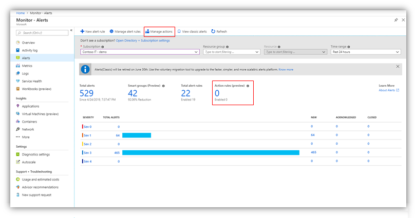
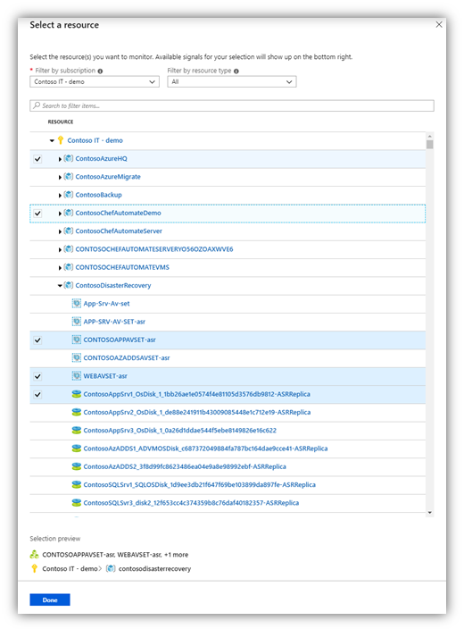
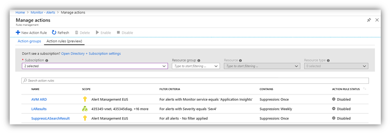
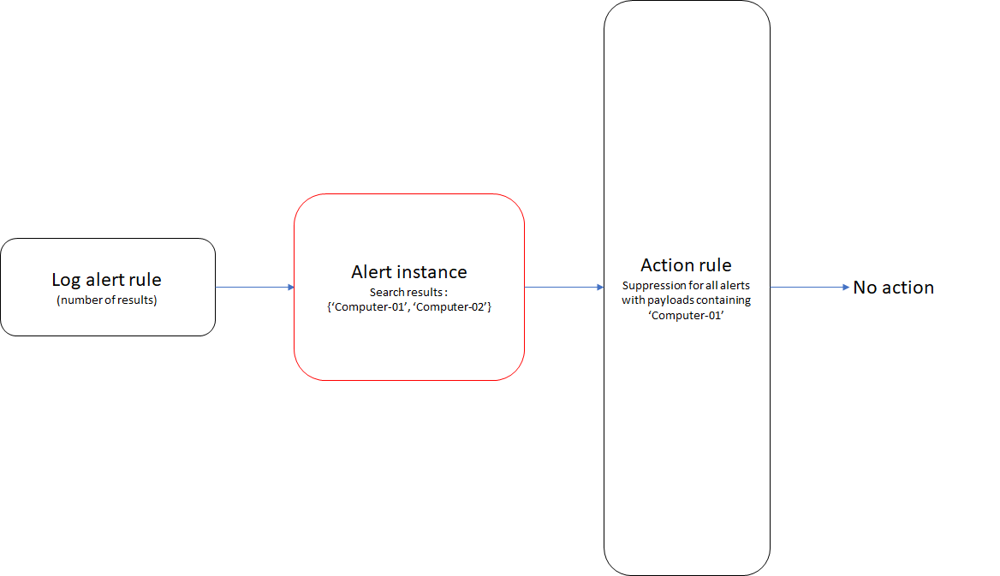
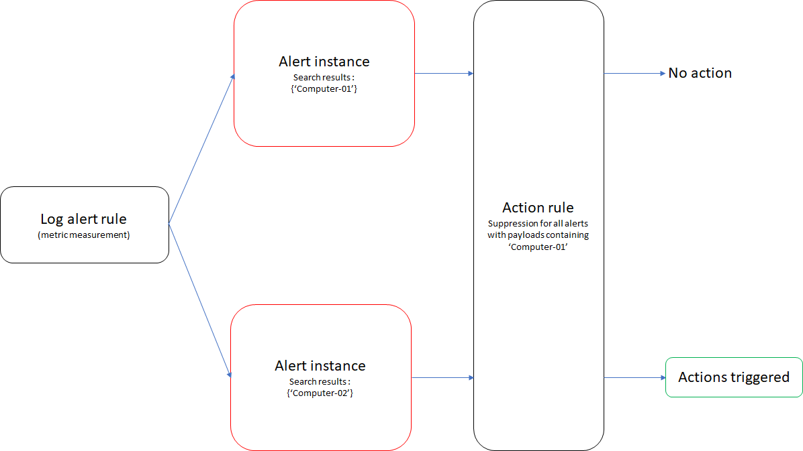

# Action rules (preview)

Action rules let you add or suppress the action groups on your fired alerts. A single rule can cover different scopes of target resources, for example - any alert on a specific resource (like a specific virtual machine) or any alert fired on any resource in a subscription. You can optionally add various filters to control which alerts are covered by a rule and define a schedule for it, for example for it to be in effect only outside business hours or during a planned maintenance window.

> [!VIDEO https://www.microsoft.com/en-us/videoplayer/embed/RE4rBZ2]

## Why and when should you use action rules?

### Suppression of alerts

There are many scenarios where it's useful to suppress the notifications that alerts generate. These scenarios range from suppression during a planned maintenance window to suppression during non-business hours. For example, the team responsible for  **ContosoVM** wants to suppress alert notifications for the upcoming weekend, because **ContosoVM** is undergoing planned maintenance.

Although the team can disable each alert rule that's configured on **ContosoVM** manually (and enable it again after maintenance), it's not a simple process. Action rules help you define alert suppression at scale with the ability to flexibly configure the period of suppression. In the previous example, the team can define one action rule on **ContosoVM** that suppresses all alert notifications for the weekend.

### Actions at scale

Although alert rules help you define the action group that triggers when the alert is generated, customers often have a common action group across their scope of operations. For example, a team responsible for the resource group **ContosoRG** will probably define the same action group for all alert rules defined within **ContosoRG**.

Action rules help you simplify this process. By defining actions at scale, an action group can be triggered for any alert that's generated on the configured scope. In the previous example, the team can define one action rule on **ContosoRG** that will trigger the same action group for all alerts generated within it.

> [!NOTE]
> Action rules do not apply to Azure Service Health alerts.

## Configuring an action rule

### [Portal](#tab/portal)

You can access the feature by selecting **Manage actions** from the **Alerts** landing page in Azure Monitor. Then, select **Action rules (preview)**. You can access the rules by selecting **Action rules (preview)** from the dashboard of the landing page for alerts.



Select **+ New Action Rule**.


Alternatively, you can create an action rule while you're configuring an alert rule.


You should now see the flow page for creating action rules. Configure the following elements:


### Scope

First choose the scope (Azure subscription, resource group, or target resource). You can also multiple-select a combination of scopes within a single subscription.



### Filter criteria

You can optionally define filters so the rule will apply to a specific subset of the alerts, or to specific events on each alert (for example, only "Fired" or only "Resolved").

The available filters are:

* **Severity**  
This rule will apply only to alerts with the selected severities.  
For example, **severity = "Sev1"** means that the rule will apply only to alerts with Sev1 severity.
* **Monitor service**  
This rule will apply only to alerts coming from the selected monitoring services.  
For example, **monitor service = “Azure Backup”** means that the rule will apply only to backup alerts (coming from  Azure Backup).
* **Resource type**  
This rule will apply only to alerts on the selected resource types.  
For example, **resource type = “Virtual Machines”** means that the rule will apply only to alerts on virtual machines.
* **Alert rule ID**  
This rule will apply only to alerts coming from a specific alert rule. The value should be the Resource Manager ID of the alert rule.  
For example, **alert rule ID = "/subscriptions/SubId1/resourceGroups/RG1/providers/microsoft.insights/metricalerts/API-Latency"** means this rule will apply only to alerts coming from "API-Latency" metric alert rule.  
_NOTE - you can get the proper alert rule ID by listing your alert rules from the CLI, or by opening a specific alert rule in the portal, clicking "Properties", and copying the "Resource ID" value._
* **Monitor condition**  
This rule will apply only to alert events with the specified monitor condition - either **"Fired"** or **"Resolved"**.
* **Description**  
This rule will apply only to alerts that contains a specific string in the alert description field. That field contains the alert rule description.  
For example, **description contains "prod"** means that the rule will only match alerts that contain the string "prod" in their description.
* **Alert context (payload)**  
This rule will apply only to alerts that contain any of one or more specific values in the alert context fields.  
For example, **alert context (payload) contains "Computer-01"** means that the rule will only apply to alerts whose payload contain the string "Computer-01".

> [!NOTE]
> Each filter may include up to five values.  
> For example, a filter on monitor service may include up to five monitor service names.


If you set multiple filters in a rule, all of them apply. For example, if you set **resource type = "Virtual Machines"** and **severity = "Sev0"**, then the rule will apply only for Sev0 alerts on virtual machines.


### Suppression or action group configuration

Next, configure the action rule for either alert suppression or action group support. You can't choose both. The configuration acts on all alert instances that match the previously defined scope and filters.

#### Suppression

If you select **suppression**, configure the duration for the suppression of actions and notifications. Choose one of the following options:
* **From now (Always)**: Suppresses all notifications indefinitely.
* **At a scheduled time**: Suppresses notifications within a bounded duration.
* **With a recurrence**: Suppresses notifications on a recurring daily, weekly, or monthly schedule.


#### Action group

If you select **Action group** in the toggle, either add an existing action group or create a new one.

> [!NOTE]
> You can associate only one action group with an action rule.


### Action rule details

Last, configure the following details for the action rule:
* Name
* Resource group in which it's saved
* Description

### [Azure CLI](#tab/azure-cli)

You can create action rules with the Azure CLI using the [az monitor action-rule create](/cli/azure/ext/alertsmanagement/monitor/action-rule#ext-alertsmanagement-az-monitor-action-rule-create) command.  The `az monitor action-rule` reference is just one of many [Azure CLI references for Azure Monitor](/cli/azure/azure-cli-reference-for-monitor).

### Prepare your environment

1. [Install the Azure CLI](/cli/azure/install-azure-cli)

   If you prefer, you can also use Azure Cloud Shell to complete the steps in this article.  Azure Cloud Shell is an interactive shell environment that you use through your browser.  Start Cloud Shell by using one of these methods:

   - Open Cloud Shell by going to [https://shell.azure.com](https://shell.azure.com)

   - Select the **Cloud Shell** button on the menu bar at the upper right corner in the [Azure portal](https://portal.azure.com)

1. Sign in.

   If you're using a local install of the CLI, sign in using the [az login](/cli/azure/reference-index#az_login) command.  Follow the steps displayed in your terminal to complete the authentication process.

    ```azurecli
    az login
    ```

1. Install the `alertsmanagement` extension

   The `az monitor action-rule` command is an experimental extension of the core Azure CLI. Learn more about extension references in [Use extension with Azure CLI](/cli/azure/azure-cli-extensions-overview?).

   ```azurecli
   az extension add --name alertsmanagement
   ```

   The following warning is expected.

   ```output
   The installed extension `alertsmanagement` is experimental and not covered by customer support.  Please use with discretion.
   ```

### Create action rules with the Azure CLI

See the Azure CLI reference content for [az monitor action-rule create](/cli/azure/ext/alertsmanagement/monitor/action-rule#ext-alertsmanagement-az-monitor-action-rule-create) to learn about required and optional parameters.

Create an action rule to suppress notifications in a resource group.

```azurecli
az monitor action-rule create --resource-group MyResourceGroupName \
                              --name MyNewActionRuleName \
                              --location Global \
                              --status Enabled \
                              --rule-type Suppression \
                              --scope-type ResourceGroup \
                              --scope /subscriptions/0b1f6471-1bf0-4dda-aec3-cb9272f09590/resourceGroups/MyResourceGroupName \
                              --suppression-recurrence-type Always \
                              --alert-context Contains Computer-01 \
                               --monitor-service Equals "Log Analytics"
```

Create an action rule to suppress notifications for all Sev4 alerts on all VMs within the subscription every weekend.

```azurecli
az monitor action-rule create --resource-group MyResourceGroupName \
                              --name MyNewActionRuleName \
                              --location Global \
                              --status Enabled \
                              --rule-type Suppression \
                              --severity Equals Sev4 \
                              --target-resource-type Equals Microsoft.Compute/VirtualMachines \
                              --suppression-recurrence-type Weekly \
                              --suppression-recurrence 0 6 \
                              --suppression-start-date 12/09/2018 \
                              --suppression-end-date 12/18/2018 \
                              --suppression-start-time 06:00:00 \
                              --suppression-end-time 14:00:00

```

* * *

## Example scenarios

### Scenario 1: Suppression of alerts based on severity

Contoso wants to suppress notifications for all Sev4 alerts on all VMs within the subscription **ContosoSub** every weekend.

**Solution:** Create an action rule with:
* Scope = **ContosoSub**
* Filters
    * Severity = **Sev4**
    * Resource Type = **Virtual Machines**
* Suppression with recurrence set to weekly, and **Saturday** and **Sunday** checked

### Scenario 2: Suppression of alerts based on alert context (payload)

Contoso wants to suppress notifications for all log alerts generated for **Computer-01** in **ContosoSub** indefinitely as it's going through maintenance.

**Solution:** Create an action rule with:
* Scope = **ContosoSub**
* Filters
    * Monitor Service = **Log Analytics**
    * Alert Context (payload) contains **Computer-01**
* Suppression set to **From now (Always)**

### Scenario 3: Action group defined at a resource group

Contoso has defined [a metric alert at a subscription level](./alerts-metric-overview.md#monitoring-at-scale-using-metric-alerts-in-azure-monitor). But it wants to define the actions that trigger specifically for alerts generated from the resource group **ContosoRG**.

**Solution:** Create an action rule with:
* Scope = **ContosoRG**
* No filters
* Action group set to **ContosoActionGroup**

> [!NOTE]
> *Action groups defined within action rules and alert rules operate independently, with no deduplication.* In the scenario described earlier, if an action group is defined for the alert rule, it triggers in conjunction with the action group defined in the action rule.

## Managing your action rules

### [Portal](#tab/portal)

You can view and manage your action rules from the list view:



From here, you can enable, disable, or delete action rules at scale by selecting the check box next to them. When you select an action rule, its configuration page opens. The page helps you update the action rule's definition and enable or disable it.

### [Azure CLI](#tab/azure-cli)

You can view and manage your action rules using the [az monitor action-rule](/cli/azure/ext/alertsmanagement/monitor) command from the Azure CLI.

Before you manage action rules with the Azure CLI, prepare your environment using the instructions provided in [Configuring an action rule](#configuring-an-action-rule).

```azurecli
# List all action rules for a subscription
az monitor action-rule list

# Get details of an action rule
az monitor action-rule show --resource-group MyResourceGroupName --name MyActionRuleName

# Update an action rule.
az monitor action-rule update --resource-group MyResourceGroupName --name MyActionRuleName --status Disabled

# Delete an action rule.
az monitor action-rule delete --resource-group MyResourceGroupName --name MyActionRuleName
```

* * *

## Best practices

Log alerts that you create with the [number of results](./alerts-unified-log.md) option generate a single alert instance by using the whole search result (which might span across multiple computers). In this scenario, if an action rule uses the **Alert Context (payload)** filter, it acts on the alert instance as long as there's a match. In Scenario 2, described previously, if the search results for the generated log alert contain both **Computer-01** and **Computer-02**, the entire notification is suppressed. There's no notification generated for **Computer-02** at all.



To best use log alerts with action rules, create log alerts with the [metric measurement](./alerts-unified-log.md) option. Separate alert instances are generated by this option, based on its defined group field. Then, in Scenario 2, separate alert instances are generated for **Computer-01** and **Computer-02**. Due to the action rule described in the scenario, only the notification for **Computer-01** is suppressed. The notification for **Computer-02** continues to fire as normal.



## FAQ

### While I'm configuring an action rule, I'd like to see all the possible overlapping action rules, so that I avoid duplicate notifications. Is it possible to do that?

After you define a scope as you configure an action rule, you can see a list of action rules that overlap on the same scope (if any). This overlap can be one of the following options:

* An exact match: For example, the action rule you're defining and the overlapping action rule are on the same subscription.
* A subset: For example, the action rule you're defining is on a subscription, and the overlapping action rule is on a resource group within the subscription.
* A superset: For example, the action rule you're defining is on a resource group, and the overlapping action rule is on the subscription that contains the resource group.
* An intersection: For example, the action rule you're defining is on **VM1** and **VM2**, and the overlapping action rule is on **VM2** and **VM3**.


### While I'm configuring an alert rule, is it possible to know if there are already action rules defined that might act on the alert rule I'm defining?

After you define the target resource for your alert rule, you can see the list of action rules that act on the same scope (if any) by selecting **View configured actions** under the **Actions** section. This list is populated based on the following scenarios for the scope:

* An exact match: For example, the alert rule you're defining and the action rule are on the same subscription.
* A subset: For example, the alert rule you're defining is on a subscription, and the action rule is on a resource group within the subscription.
* A superset: For example, the alert rule you're defining is on a resource group, and the action rule is on the subscription that contains the resource group.
* An intersection: For example, the alert rule you're defining is on **VM1** and **VM2**, and the action rule is on **VM2** and **VM3**.


### Can I see the alerts that have been suppressed by an action rule?

In the [alerts list page](./alerts-managing-alert-instances.md), you can choose an additional column called **Suppression Status**. If the notification for an alert instance was suppressed, it would show that status in the list.


### If there's an action rule with an action group and another with suppression active on the same scope, what happens?

Suppression always takes precedence on the same scope.

### What happens if I have a resource that is covered by two action rules? Do I get one or two notifications? For example, **VM2** in the following scenario:

   `action rule AR1 defined for VM1 and VM2 with action group AG1`

   `action rule AR2 defined for VM2 and VM3 with action group AG1`

For every alert on VM1 and VM3, action group AG1 would be triggered once. For every alert on **VM2**, action group AG1 would be triggered twice, because action rules don't deduplicate actions.

### What happens if I have a resource monitored in two separate action rules and one calls for action while another for suppression? For example, **VM2** in the following scenario:

   `action rule AR1 defined for VM1 and VM2 with action group AG1`

   `action rule AR2 defined for VM2 and VM3 with suppression`

For every alert on VM1, action group AG1 would be triggered once. Actions and notifications for every alert on VM2 and VM3 will be suppressed.

### What happens if I have an alert rule and an action rule defined for the same resource calling different action groups? For example, **VM1** in the following scenario:

   `alert rule rule1 on VM1 with action group AG2`

   `action rule AR1 defined for VM1 with action group AG1`

For every alert on VM1, action group AG1 would be triggered once. Whenever alert rule "rule1" is triggered, it will also trigger AG2 additionally. Action groups defined within action rules and alert rules operate independently, with no deduplication.

## Next steps

- [Learn more about alerts in Azure](./alerts-overview.md)
