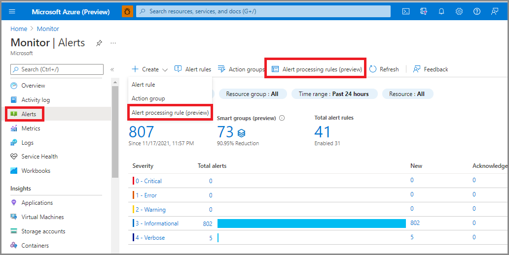
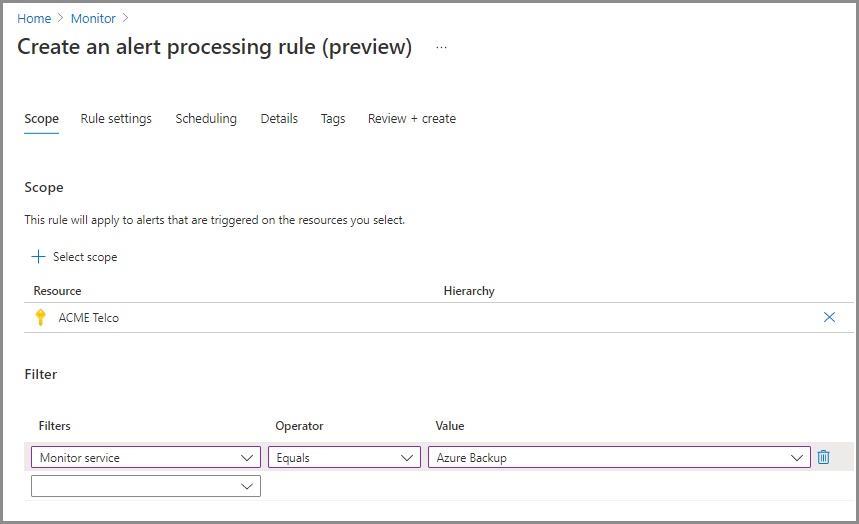
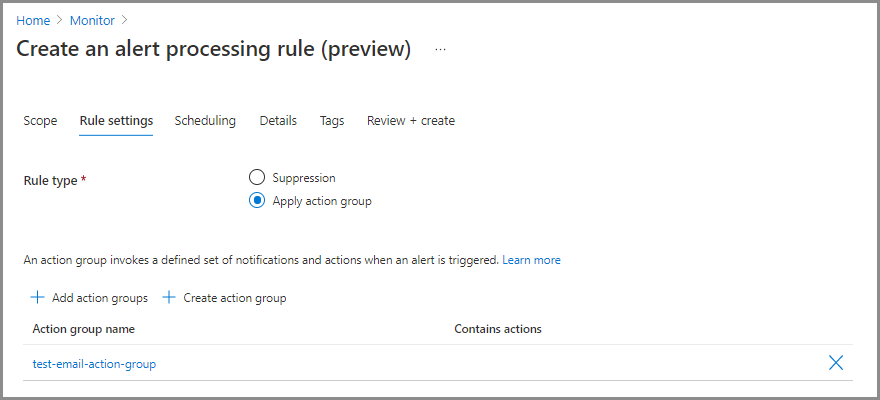
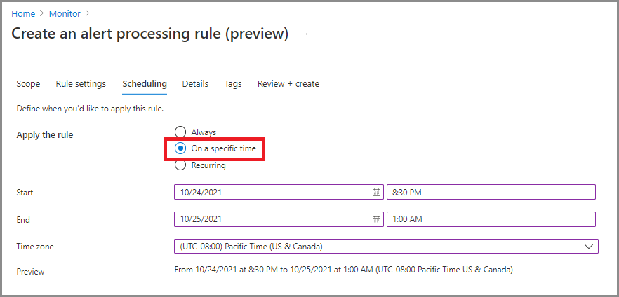
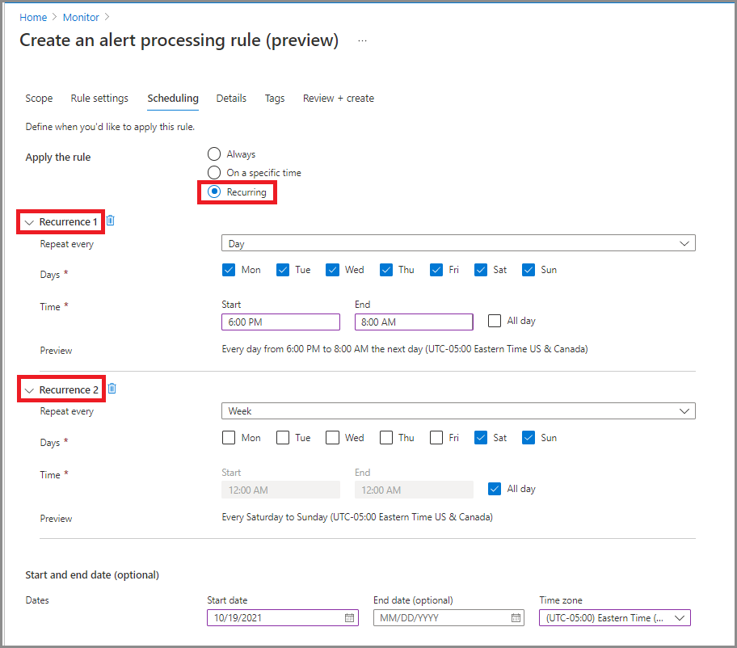
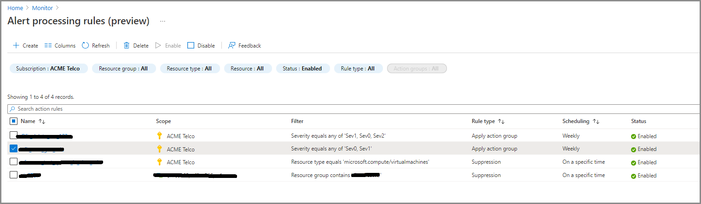

# Alert processing rules (preview)

<a name="configuring-an-action-rule"></a>
<a name="suppression-of-alerts"></a>

> [!NOTE]
> The previous name for alert processing rules was **action rules**. The Azure resource type of these rules remains **Microsoft.AlertsManagement/actionRules** for backward compatibility.

Alert processing rules allow you to apply processing on **fired alerts**. You may be familiar with Azure Monitor alert rules, which are rules that generate new alerts. Alert processing rules are different; they are rules that modify the fired alerts themselves as they are being fired. You can use alert processing rules to add [action groups](./action-groups.md) or remove (suppress) action groups from your fired alerts. Alert processing rules can be applied to different resource scopes, from a single resource to an entire subscription. They can also allow you to apply various filters or have the rule work on a pre-defined schedule.

## What are alert processing rules useful for?

Some common use cases for alert processing rules include:

### Notification suppression during planned maintenance

Many customers set up a planned maintenance time for their resources, either on a one-off basis or on a regular schedule. The planned maintenance may cover a single resource like a virtual machine, or multiple resources like all virtual machines in a resource group. Those customers may choose to stop receiving alert notifications for those resources during the maintenance window. 
  
Other customers do not need to receive alert notifications at all outside of their business hours.

You could suppress alert notifications by disabling the alert rules themselves, but this approach has several limitations:
   * You could disable the relevant alert rule at the beginning of the maintenance window. Once the maintenance is over, you can then re-enable the alert rule. However, this  approach is only practical if the scope of the alert rule is exactly the scope of the resources under maintenance. For example, a single alert rule might cover multiple resources, but only one of those resources is going through maintenance. So, if you disable the alert rule, you will miss valid alerts on the remaining resources covered by that rule.
   * You may have many alert rules that cover the resource. Updating all of them is time consuming and error prone.
   * You might have some alerts that are not created by an alert rule at all.
In all these cases, an alert processing rule provides an easy way to achieve the notification suppression goal.

### Management at scale

Most customers tend to define a few action groups that are used repeatedly in their alert rules. For example, they may want to call a specific action group whenever any high severity alert is fired. As their number of alert rule grows, manually making sure that each alert rule has the right set of action groups is becoming harder. 

Alert processing rules allow you to specify that logic in a single rule, instead of having to set it consistently in all your  alert rules. They also cover alert types that are not generated by an alert rule.

### Add action groups to all alert types

Azure Monitor alert rules let you select which action groups will be triggered when their alerts are fired. However, not all Azure alert sources let you specify action groups. Some examples of such alerts include [Azure Backup alerts](../../backup/backup-azure-monitoring-built-in-monitor.md), [VM Insights guest health alerts](../vm/vminsights-health-alerts.md), [Azure Stack Edge](../../databox-online/azure-stack-edge-gpu-manage-device-event-alert-notifications.md), and Azure Stack Hub.

For those alert types, you can use alert processing rules to add action groups.

> [!NOTE]
> Alert processing rules do not affect [Azure Service Health](../../service-health/service-health-overview.md) alerts.

## Alert processing rule properties
<a name="filter-criteria"></a>

An alert processing rule definition covers several aspects:

### Which fired alerts are affected by this rule? 

Each alert processing rule has a **scope**. A scope is a list of one or more specific Azure resources, or specific resource group, or an entire subscription. The alert processing rule will apply to alerts that fired on resources within that scope.  

You can also define **filters** to narrow down which specific subset of alerts are affected. The available filters are:  

* **Alert Context (payload)** - the rule will apply only to alerts that contain any of the filter's strings within the [alert context](./alerts-common-schema-definitions.md#alert-context) section of the alert. This section includes fields specific to each alert type.
* **Alert rule id** - the rule will apply only to alerts from a specific alert rule. The value should be the full resource ID, for example "/subscriptions/SUB1/resourceGroups/RG1/providers/microsoft.insights/metricalerts/MY-API-LATENCY".  
You can locate the alert rule ID by opening a specific alert rule in the portal, clicking "Properties", and copying the "Resource ID" value. You can also locate it by listing your alert rules from CLI/PowerShell.
* **Alert rule name** - the rule will apply only to alerts with this alert rule name. Can also be useful with a "Contains" operator.
* **Description** - the rule will apply only to alerts that contain the specified string within the alert rule description field.
* **Monitor condition** - the rule will apply only to alerts with the specified monitor condition, either "Fired" or "Resolved".
*  **Monitor service** - the rule will apply only to alerts from any of the specified monitor services.  
For example, use "Platform" to have the rule apply only to metric alerts.
* **Resource** - the rule will apply only to alerts from the specified Azure resource.  
This filter is useful with "Does not equal" operator, or with "Contains" / "Does not contain" operators.
* **Resource group** - the rule will apply only to alerts from the specified resource groups.  
This filter is useful with "Does not equal" operator, or with "Contains" / "Does not contain" operators.
* **Resource type** - the rule will apply only to alerts on resource from the specified resource types, such as virtual machines.
* **Severity** -  the  rule will apply only to alerts with the selected severities.  

If you define multiple filters in a rule, all of them apply. For example, if you set **resource type = "Virtual Machines"** and **severity = "Sev0"**, then the rule will apply only for Sev0 alerts on virtual machines in the scope.

> [!NOTE]
> Each filter may include up to five values.  

### What should this rule do?

Choose one of the following actions:

* **Suppression**  
This action removes all the action groups from the affected fired alerts. So, the fired alerts will not invoke any of their action groups (not even at the end of the maintenance window). Those fired alerts will still be visible when you list your alerts in the portal, Azure Resource Graph, API, PowerShell etc.
The suppression action has a higher priority over the "apply action groups" action - if a single fired alert is affected by different alert processing rules of both types, the action groups of that alert will be suppressed.

* **Apply action groups**  
This action adds one or more action groups to the affected fired alerts.

### When should this rule apply?

You may optionally control when will the rule apply. By default, the rule is applied unconditionally as long as it is enabled. However, you can select a one-off window for this rule to apply, or have a recurring window such as a weekly recurrence. 

## Configuring an alert processing rule

### [Portal](#tab/portal)

You can access alert processing rules by navigating to the **Alerts** home page in Azure Monitor.  
Once there, you can click **Alert processing rules (preview)** to see and manage your existing rules, or click **Create** --> **Alert processing rules (preview)** to open the new alert processing rule wizard.



Lets review the new alert processing rule wizard.  
In the first tab (**Scope**), you select which fired alerts are covered by this rule. Pick the **scope** of resources whose alerts will be covered - you may choose multiple resources and resource groups, or an entire subscription. You may also optionally add **filters**, as documented above.



In the second tab (**Rule settings**), you select which action to apply on the affected alerts. Choose between **Suppression** or **Apply action group**. If you choose the apply action group, you can either select existing action groups by clicking **Add action groups**, or create a new action group.



In the third tab (**Scheduling**), you select an optional schedule for the rule. By default the rule works all the time, as long as it is not disabled. However, you can set it to work **on a specific time**, or **set up a recurring schedule**.  
Let's see an example of a schedule for a one-off, overnight, planned maintenance. It starts in the evening until the next morning, in a specific timezone:



Let's see an example of a more complex schedule, covering an "outside of business hours" case. It has a recurring schedule with two recurrences - a daily one from the afternoon until the morning, and a weekly one covering Saturday and Sunday (full days).



In the fourth tab (**Details**), you give this rule a name, pick where it will be stored, and optionally add a description for your reference. In the fifth tab (**Tags**), you optionally add tags to the rule, and finally in the last tab you can review and create the alert processing rule.

### [Azure CLI](#tab/azure-cli)

> [!NOTE]
> The Azure CLI is in the process of being updated to leverage the GA API of alert processing rules. Until then, you can use existing CLI capabilities under the **action rule** command to create alert processing rules. Meanwhile, the existing CLI does not support some of the newer alert processing rules features.

You can create alert processing rules with the Azure CLI using the [az monitor action-rule create](/cli/azure/monitor/action-rule#az_monitor_action_rule_create) command.  The `az monitor action-rule` reference is just one of many [Azure CLI references for Azure Monitor](/cli/azure/azure-cli-reference-for-monitor).

### Prepare your environment

1. [Install the Azure CLI](/cli/azure/install-azure-cli)

   If you prefer, you can also use Azure Cloud Shell to complete the steps in this article.  Azure Cloud Shell is an interactive shell environment that you use through your browser.  Start Cloud Shell by using one of these methods:

   - Open Cloud Shell by going to [https://shell.azure.com](https://shell.azure.com)

   - Select the **Cloud Shell** button on the menu bar at the upper right corner in the [Azure portal](https://portal.azure.com)

1. Sign in.

   If you're using a local install of the CLI, sign in using the [az login](/cli/azure/reference-index#az_login) command.  Follow the steps displayed in your terminal to complete the authentication process.

    ```azurecli
    az login
    ```

1. Install the `alertsmanagement` extension

   The `az monitor action-rule` command is an experimental extension of the core Azure CLI. Learn more about extension references in [Use extension with Azure CLI](/cli/azure/azure-cli-extensions-overview?).

   ```azurecli
   az extension add --name alertsmanagement
   ```

   The following warning is expected.

   ```output
   The installed extension `alertsmanagement` is experimental and not covered by customer support.  Please use with discretion.
   ```

### Create an alert processing rule with the Azure CLI

See the Azure CLI reference content for [az monitor action-rule create](/cli/azure/monitor/action-rule#az_monitor_action_rule_create) to learn about required and optional parameters.

Create an alert processing rule to suppress notifications in a resource group.

```azurecli
az monitor action-rule create --resource-group MyResourceGroupName \
                              --name MyNewActionRuleName \
                              --location Global \
                              --status Enabled \
                              --rule-type Suppression \
                              --scope-type ResourceGroup \
                              --scope /subscriptions/0b1f6471-1bf0-4dda-aec3-cb9272f09590/resourceGroups/MyResourceGroupName \
                              --suppression-recurrence-type Always \
                              --alert-context Contains Computer-01 \
                               --monitor-service Equals "Log Analytics"
```

Create an alert processing rule to suppress notifications for all Sev4 alerts on all VMs within the subscription every weekend.

```azurecli
az monitor action-rule create --resource-group MyResourceGroupName \
                              --name MyNewActionRuleName \
                              --location Global \
                              --status Enabled \
                              --rule-type Suppression \
                              --severity Equals Sev4 \
                              --target-resource-type Equals Microsoft.Compute/VirtualMachines \
                              --suppression-recurrence-type Weekly \
                              --suppression-recurrence 0 6 \
                              --suppression-start-date 12/09/2018 \
                              --suppression-end-date 12/18/2018 \
                              --suppression-start-time 06:00:00 \
                              --suppression-end-time 14:00:00

```

* * *

## Managing alert processing rules

### [Portal](#tab/portal)

You can view and manage your alert processing rules from the list view:



From here, you can enable, disable, or delete alert processing rules at scale by selecting the check box next to them. Clicking on an alert processing rule will open it for editing - you can enable or disable the rule in the fourth tab (**Details**).

### [Azure CLI](#tab/azure-cli)

> [!NOTE]
> The Azure CLI is in the process of being updated to leverage the GA API of alert processing rules. Until then, you can use existing CLI capabilies under the **action rule** command to create alert processing rules. Meanwhile, the existing CLI does not support some of the newer alert processing rules features.

You can view and manage your alert processing rules using the [az monitor action-rule](/cli/azure/monitor) command from the Azure CLI.

Before you manage alert processing rules with the Azure CLI, prepare your environment using the instructions provided in [Configuring an alert processing rule](#configuring-an-alert-processing-rule).

```azurecli
# List all alert processing rules for a subscription
az monitor action-rule list

# Get details of an alert processing rule
az monitor action-rule show --resource-group MyResourceGroupName --name MyActionRuleName

# Update an alert processing rule
az monitor action-rule update --resource-group MyResourceGroupName --name MyActionRuleName --status Disabled

# Delete an alert processing rule
az monitor action-rule delete --resource-group MyResourceGroupName --name MyActionRuleName
```

* * *

## Next steps

- [Learn more about alerts in Azure](./alerts-overview.md)
