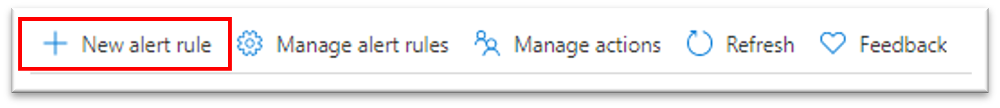
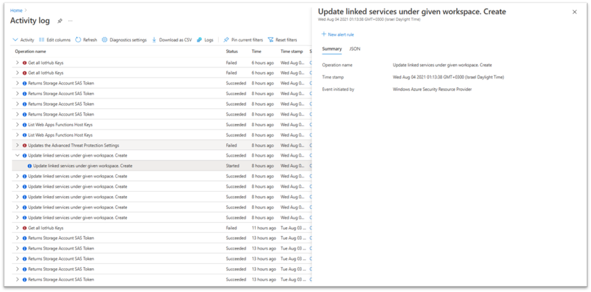
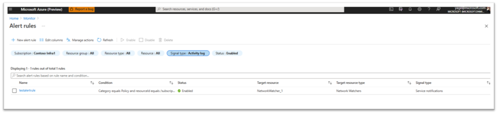

# Create, view, and manage activity log alerts by using Azure Monitor  

## Overview

Activity log alerts are the alerts that get activated when a new activity log event occurs that matches the conditions specified in the alert.

These alerts are for Azure resources and can be created by using an Azure Resource Manager template. They also can be created, updated, or deleted in the Azure portal. Typically, you create activity log alerts to receive notifications when specific changes occur to resources in your Azure subscription. Alerts are often scoped to particular resource groups or resources. For example, you might want to be notified when any virtual machine in the sample resource group **myProductionResourceGroup** is deleted. Or, you might want to get notified if any new roles are assigned to a user in your subscription.

> [!IMPORTANT]
> Alerts on service health notification can't be created via the interface for activity log alert creation. To learn more about how to create and use service health notifications, see [Receive activity log alerts on service health notifications](../../service-health/alerts-activity-log-service-notifications-portal.md).

When you create alert rules, ensure the following points:

- The subscription in the scope isn't different from the subscription where the alert is created.
- The criteria must be the level, status, caller, resource group, resource ID, or resource type event category on which the alert is configured.
- There's no "anyOf" condition or nested conditions in the alert configuration JSON. Basically, only one "allOf" condition is allowed with no further "allOf" or "anyOf" conditions.
- When the category is "administrative," you must specify at least one of the preceding criteria in your alert. You may not create an alert that activates every time an event is created in the activity logs.
- Alerts cannot be created for events in Alert category of activity log.

## Azure portal

You can use the Azure portal to create and modify activity log alert rules. The experience is integrated with an Azure activity log to ensure seamless alert creation for specific events of interest.
On the Azure portal, you can create a new activity log alert rule, either from the Azure Monitor alerts blade, or from the Azure Monitor activity log blade. 


### Create an alert rule from the Azure Monitor alerts blade

The following procedure describes how to create a metric alert rule in Azure portal:

1. In [Azure portal](https://portal.azure.com), click on **Monitor**. The Monitor blade consolidates all your monitoring settings and data in one view.

2. Click **Alerts** then click **+ New alert rule**.



> [!TIP]
> Most resource blades also have **Alerts** in their resource menu under **Monitoring**, you could create alerts from there as well.

3. Click **Select target**, in the context pane that loads, select a target resource that you want to alert on. Use **Subscription** and **Resource type** drop-downs to find the resource you want to monitor. You can also use the search bar to find your resource.
    
> [!NOTE]
> As a target, you can select an entire subscription, a resource group, or a specific resource. If you chose a subscription or a resource group as a target, and also selected a resource type, the rule will apply to all resources of that type within the selected subscription or a reosurce group. If you chose a specific target resource, the rule will apply only to that resource. You can't explicitly select multiple subscriptions, resource groups, or resources using the target selector. 

4. If the selected resource has activity log operations you can create alerts on, **Available signals** on the bottom right will include Activity Log. You can view the full list of resource types supported for activity log alerts in this [article](https://docs.microsoft.com/azure/role-based-access-control/resource-provider-operations).


5. Once you have selected a target resource, click on **Add condition**.

6. You will see a list of signals supported for the resource, which includes those from various categories of **Activity Log**. select the activity log signal/operation you want to create an alert on.

7. You will see a chart for the activity log operation for the last six hours. Use the **Chart period** dropdown to select to see longer history for the operation.

8. Under **Alert logic**, You can optionally define more filtering criteria:

- **Event level**: The severity level of the event: _Verbose_, _Informational_, _Warning_, _Error_, or _Critical_.
- **Status**: The status of the event: _Started_, _Failed_, or _Succeeded_.
- **Event initiated by**: Also known as the caller. The email address or Azure Active Directory identifier of the user who performed the operation.

> [!NOTE]
>   In order to have a high quality and effective rules, in the case that the alert scope is an entire subscription, and the selected signal is "All Administrative Operations", we ask to that as part of the definition of the condition you must fill one of the alert logic drop downs: "Event level", "Status" or "Initiated by" and by that the rule will be more specific.
        
9. Click **Done**.


10. Fill in **Alert details** like **Alert rule name**, **Description**.and **Severity**.

> [!NOTE]
>   The alert severity for activity log alerts can't currently be configured by the user, and it always defaults to Sev4.

11. Add an action group to the alert either by selecting an existing action group or creating a new action group.

12. Click **Done** to save the activity log alert rule.
     
     
### Create an alert rule from the Azure Monitor activity log blade

An alternative way to create an activity log alert is to start with an activity log event that already occurred, via the [activity log in the Azure portal](../essentials/activity-log.md#view-the-activity-log). 

1. In the **Azure Monitor - Activity log** blade, you can filter or find the desired event and then create an alert on future similar events by using the **Add activity log alert** button. 



2. The alert rule creation blade will open with the alert rule scope and condition already filled according to the previously selected activity log event. You can edit and modify the scope and condition at this stage if needed. Note that by default, the exact scope and condition for the new rule are copied 'as is' from the original event attributes. For example, the exact resource on which the event occurred, and the specific user/service name who initiated the event are included by default in the new alert rule. If you would like to make the alert rule more general, you need to modify the scope and condition accordingly, as explained in stages 3-9 above. 

3. Then follow steps 10 through 12 as previously shown.
    
### View and manage in the Azure portal

1. In the Azure portal, select **Monitor** > **Alerts**. Select **Manage alert rules** in the upper-left corner of the window.

    

    The list of available rules appears.

2. Filter or search for the activity log rule to modify.

    

    You can use the available filters, _Subscription_, _Resource group_,  _Resource_, _Signal type_, or _Status_, to find the activity rule that you want to edit.
 
3. Select the rule, and double-click to edit the rule options. Make the required changes, and then select **Save**. 

## Azure Resource Manager template
To create an activity log alert rule by using an Azure Resource Manager template, you create a resource of the type `microsoft.insights/activityLogAlerts`. Then you fill in all related properties. Here's a template that creates an activity log alert  rule:

```json
{
  "$schema": "https://schema.management.azure.com/schemas/2015-01-01/deploymentTemplate.json#",
  "contentVersion": "1.0.0.0",
  "parameters": {
    "activityLogAlertName": {
      "type": "string",
      "metadata": {
        "description": "Unique name (within the Resource Group) for the Activity log alert."
      }
    },
    "activityLogAlertEnabled": {
      "type": "bool",
      "defaultValue": true,
      "metadata": {
        "description": "Indicates whether or not the alert is enabled."
      }
    },
    "actionGroupResourceId": {
      "type": "string",
      "metadata": {
        "description": "Resource Id for the Action group."
      }
    }
  },
  "resources": [   
    {
      "type": "Microsoft.Insights/activityLogAlerts",
      "apiVersion": "2017-04-01",
      "name": "[parameters('activityLogAlertName')]",      
      "location": "Global",
      "properties": {
        "enabled": "[parameters('activityLogAlertEnabled')]",
        "scopes": [
            "[subscription().id]"
        ],        
        "condition": {
          "allOf": [
            {
              "field": "category",
              "equals": "Administrative"
            },
            {
              "field": "operationName",
              "equals": "Microsoft.Resources/deployments/write"
            },
            {
              "field": "resourceType",
              "equals": "Microsoft.Resources/deployments"
            }
          ]
        },
        "actions": {
          "actionGroups":
          [
            {
              "actionGroupId": "[parameters('actionGroupResourceId')]"
            }
          ]
        }
      }
    }
  ]
}
```
The previous sample JSON can be saved as, for example, sampleActivityLogAlert.json and can be deployed by using [Azure Resource Manager in the Azure portal](../../azure-resource-manager/templates/deploy-portal.md).

> [!NOTE]
> 
> Notice that the highest-level activity log alerts can be defined is subscription.
> Meaning there is no option to define alert on couple of subscriptions, therefore the definition should be alert  per subscription.

The following fields are the options that you can use in the Azure Resource Manager template for the conditions fields:
Notice that “Resource Health”, “Advisor” and “Service Health” have extra properties fields for their special fields. 
1. resourceId:	The resource ID of the impacted resource in the activity log event that the alert should be generated on.
2. category: The category of in the activity log event. For example: Administrative, ServiceHealth, ResourceHealth, Autoscale, Security, Recommendation, Policy.
3. caller: The email address or Azure Active Directory identifier of the user who performed the operation of the activity log event.
4. level: Level of the activity in the activity log event that the alert should be generated on. For example: Critical, Error, Warning, Informational, Verbose.
5. operationName: The name of the operation in the activity log event. For example: Microsoft.Resources/deployments/write
6. resourceGroup: Name of the resource group for the impacted resource in the activity log event.
7. resourceProvider: [Azure resource providers and types explanation](https://nam06.safelinks.protection.outlook.com/?url=https%3A%2F%2Fdocs.microsoft.com%2Fen-us%2Fazure%2Fazure-resource-manager%2Fmanagement%2Fresource-providers-and-types&data=02%7C01%7CNoga.Lavi%40microsoft.com%7C90b7c2308c0647c0347908d7c9a2918d%7C72f988bf86f141af91ab2d7cd011db47%7C1%7C0%7C637199572373543634&sdata=4RjpTkO5jsdOgPdt%2F%2FDOlYjIFE2%2B%2BuoHq5%2F7lHpCwQw%3D&reserved=0). For a list that maps resource providers to Azure services, see [Resource providers for Azure services](https://nam06.safelinks.protection.outlook.com/?url=https%3A%2F%2Fdocs.microsoft.com%2Fen-us%2Fazure%2Fazure-resource-manager%2Fmanagement%2Fazure-services-resource-providers&data=02%7C01%7CNoga.Lavi%40microsoft.com%7C90b7c2308c0647c0347908d7c9a2918d%7C72f988bf86f141af91ab2d7cd011db47%7C1%7C0%7C637199572373553639&sdata=0ZgJPK7BYuJsRifBKFytqphMOxMrkfkEwDqgVH1g8lw%3D&reserved=0).
8. status: String describing the status of the operation in the activity event. For example: Started, In Progress, Succeeded, Failed, Active, Resolved
9. subStatus: Usually the HTTP status code of the corresponding REST call, but can also include other strings describing a substatus.	For example: OK (HTTP Status Code: 200), Created (HTTP Status Code: 201), Accepted (HTTP Status Code: 202), No Content (HTTP Status Code: 204), Bad Request (HTTP Status Code: 400), Not Found (HTTP Status Code: 404), Conflict (HTTP Status Code: 409), Internal Server Error (HTTP Status Code: 500), Service Unavailable (HTTP Status Code: 503), Gateway Timeout (HTTP Status Code: 504).
10. resourceType: The type of the resource that was affected by the event. For example: Microsoft.Resources/deployments

For example:

```json
"condition": {
          "allOf": [
            {
              "field": "category",
              "equals": "Administrative"
            },
            {
              "field": "resourceType",
              "equals": "Microsoft.Resources/deployments"
            }
          ]
        }

```
More details on the activity log fields you can find [here](https://nam06.safelinks.protection.outlook.com/?url=https%3A%2F%2Fdocs.microsoft.com%2Fen-us%2Fazure%2Fazure-monitor%2Fplatform%2Factivity-log-schema&data=02%7C01%7CNoga.Lavi%40microsoft.com%7C90b7c2308c0647c0347908d7c9a2918d%7C72f988bf86f141af91ab2d7cd011db47%7C1%7C0%7C637199572373563632&sdata=6QXLswwZgUHFXCuF%2FgOSowLzA8iOALVgvL3GMVhkYJY%3D&reserved=0).


> [!NOTE]
> It might take up to 5 minutes for the new activity log alert rule to become active.

## REST API 
The [Azure Monitor Activity Log Alerts API](/rest/api/monitor/activitylogalerts) is a REST API. It's fully compatible with the Azure Resource Manager REST API. It can be used via PowerShell by using the Resource Manager cmdlet or the Azure CLI.

## PowerShell

[!INCLUDE [updated-for-az](../../../includes/updated-for-az.md)]

### Deploy the Resource Manager template with PowerShell
To use PowerShell to deploy the sample Resource Manager template shown in the previous [Azure Resource Manager template](#azure-resource-manager-template) section, use the following command:

```powershell
New-AzResourceGroupDeployment -ResourceGroupName "myRG" -TemplateFile sampleActivityLogAlert.json -TemplateParameterFile sampleActivityLogAlert.parameters.json
```

where the sampleActivityLogAlert.parameters.json contains the values provided for the parameters needed for alert rule creation.

### Use activity log PowerShell cmdlets

Activity log alerts have dedicated PowerShell cmdlets available:

- [Set-AzActivityLogAlert](/powershell/module/az.monitor/set-azactivitylogalert): Creates a new activity log alert or updates an existing activity log alert.
- [Get-AzActivityLogAlert](/powershell/module/az.monitor/get-azactivitylogalert): Gets one or more activity log alert resources.
- [Enable-AzActivityLogAlert](/powershell/module/az.monitor/enable-azactivitylogalert): Enables an existing activity log alert and sets its tags.
- [Disable-AzActivityLogAlert](/powershell/module/az.monitor/disable-azactivitylogalert): Disables an existing activity log alert and sets its tags.
- [Remove-AzActivityLogAlert](/powershell/module/az.monitor/remove-azactivitylogalert): Removes an activity log alert.

## Azure CLI

Dedicated Azure CLI commands under the set [az monitor activity-log alert](/cli/azure/monitor/activity-log/alert) are available for managing activity log alert rules.

To create a new activity log alert rule, use the following commands in this order:

1. [az monitor activity-log alert create](/cli/azure/monitor/activity-log/alert#az-monitor-activity-log-alert-create): Create a new activity log alert rule resource.
2. [az monitor activity-log alert scope](/cli/azure/monitor/activity-log/alert/scope): Add scope for the created activity log alert rule.
3. [az monitor activity-log alert action-group](/cli/azure/monitor/activity-log/alert/action-group): Add an action group to the activity log alert rule.

To retrieve one activity log alert rule resource, use the Azure CLI command [az monitor activity-log alert show](/cli/azure/monitor/activity-log/alert#az-monitor-activity-log-alert-show
). To view all activity log alert rule resources in a resource group, use [az monitor activity-log alert list](/cli/azure/monitor/activity-log/alert#az-monitor-activity-log-alert-list).
Activity log alert rule resources can be removed by using the Azure CLI command [az monitor activity-log alert delete](/cli/azure/monitor/activity-log/alert#az-monitor-activity-log-alert-delete).

## Next steps

- Learn about [webhook schema for activity logs](./activity-log-alerts-webhook.md).
- Read an [overview of activity logs](./activity-log-alerts.md).
- Learn more about [action groups](../platform/action-groups.md).  
- Learn about [service health notifications](../../service-health/service-notifications.md).

