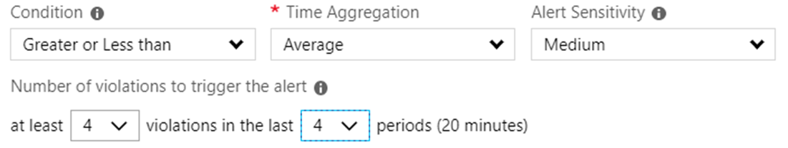

# Dynamic thresholds in metric alerts

 Dynamic thresholds in metric alerts use advanced machine learning to learn metrics' historical behavior and to identify patterns and anomalies that indicate possible service issues. Dynamic thresholds in metric alerts support both a simple UI and operations at scale by allowing users to configure alert rules through the fully automated Azure Resource Manager API.

An alert rule using a dynamic threshold only fires when the monitored metric doesn't behave as expected, based on its tailored thresholds.

To send us feedback, keep it coming at <azurealertsfeedback@microsoft.com>.

Alert rules with dynamic thresholds provide:

- **Scalable alerting**. Dynamic threshold alert rules can create tailored thresholds for hundreds of metric series at a time. They're as easy to define as an alert rule on a single metric. They give you fewer alerts to create and manage. You can use either Azure portal or the Azure Resource Manager API to create them. The scalable approach is especially useful when you're dealing with metric dimensions or applying to multiple resources, such as to all subscription resources. Learn more about how to [configure metric alerts with dynamic thresholds by using templates](./alerts-metric-create-templates.md).

- **Smart metric pattern recognition**. Using our machine learning technology, we're able to automatically detect metric patterns and adapt to metric changes over time, which often includes seasonality (hourly, daily, weekly). Adapting to the metrics' behavior over time and alerting based on deviations from its pattern relieves the burden of knowing the "right" threshold for each metric. The machine learning algorithm used in dynamic thresholds is designed to prevent noisy (low precision) or wide (low recall) thresholds that don't have an expected pattern.

- **Intuitive configuration**. Dynamic thresholds allow you to set up metric alerts by using high-level concepts, alleviating the need to have extensive domain knowledge about the metric.

## Configure alerts rules with dynamic thresholds

Alerts with dynamic thresholds can be configured using Azure Monitor metric alerts. Learn more about how to  [configure metric alerts](alerts-metric.md).

## How are the thresholds calculated?

Dynamic thresholds continuously learns the data of the metric series and tries to model it using a set of algorithms and methods. It detects patterns in the data such as seasonality (Hourly / Daily / Weekly), and is able to handle noisy metrics (such as machine CPU or memory) as well as metrics with low dispersion (such as availability and error rate).

The thresholds are selected in such a way that a deviation from these thresholds indicates an anomaly in the metric behavior.

> [!NOTE]
> Dynamic thresholds can detect seasonality for hourly, daily, or weekly patterns. Other patterns like bi-hourly or semi-weekly seasonality might not be detected. To detect weekly seasonality, at least three weeks of historical data are required.

## What does the Sensitivity setting in dynamic thresholds mean?

Alert threshold sensitivity is a high-level concept that controls the amount of deviation from metric behavior required to trigger an alert.

This option doesn't require domain knowledge about the metric like static threshold. The options available are:

- **High**: The thresholds will be tight and close to the metric series pattern. An alert rule will be triggered on the smallest deviation, resulting in more alerts.
- **Medium**: Less tight and more balanced thresholds, fewer alerts than with high sensitivity (default).
- **Low**: The thresholds will be loose with more distance from metric series pattern. An alert rule will only trigger on large deviations, resulting in fewer alerts.

## What are the Operator setting options in dynamic thresholds?

Dynamic thresholds alerts rule can create tailored thresholds based on metric behavior for both upper and lower bounds by using the same alert rule.

You can choose the alert to be triggered on one of the following three conditions:

- Greater than the upper threshold or lower than the lower threshold (default)
- Greater than the upper threshold
- Lower than the lower threshold

## What do the advanced settings in dynamic thresholds mean?

**Failing periods**. Using dynamic thresholds, you can also configure a minimum number of deviations required within a certain time window for the system to raise an alert. The default is four deviations in 20 minutes. You can configure failing periods and choose what to be alerted on by changing the failing periods and time window. These configurations reduce alert noise generated by transient spikes. For example:

To trigger an alert when the issue is continuous for 20 minutes, four consecutive times in a given period grouping of 5 minutes, use the following settings:

To trigger an alert when there was a violation from a dynamic thresholds in 20 minutes out of the last 30 minutes with a period of 5 minutes, use the following settings:

**Ignore data before**. Users can optionally define a start date from which the system should begin calculating the thresholds. A typical use case might occur when a resource was a running in a testing mode and is now promoted to serve a production workload. Therefore, the behavior of any metric during the testing phase should be disregarded.

> [!NOTE]
> An alert fires when the rule is evaluated and the result shows an anomaly. The alert is resolved if the rule is evaluated and doesn't show an anomaly three times in a row.

## How do you find out why a dynamic thresholds alert was triggered?

You can explore triggered alert instances by selecting the link in the email or text message. You can also browse to see the alerts in the Azure portal. Learn more about the [alerts view](./alerts-page.md).

The alert view displays:

- All the metric details at the moment the dynamic thresholds alert fired.
- A chart of the period in which the alert was triggered that includes the dynamic thresholds used at that point in time.
- Ability to provide feedback on the dynamic thresholds alert and the alerts view experience, which could improve future detections.

## Will slow behavior changes in the metric trigger an alert?

Probably not. Dynamic thresholds are good for detecting significant deviations rather than slowly evolving issues.

## How much data is used to preview and then calculate thresholds?

When an alert rule is first created, the thresholds appearing in the chart are calculated based on enough historical data to calculate hour or daily seasonal patterns (10 days). After an alert rule is created, dynamic thresholds uses all needed historical data that's available and will continuously learn and adapt based on new data to make the thresholds more accurate. After this calculation, the chart will also display weekly patterns.

## How much data is needed to trigger an alert?

If you have a new resource or missing metric data, dynamic thresholds won't trigger alerts before three days and at least 30 samples of metric data are available, to ensure accurate thresholds. For existing resources with sufficient metric data, dynamic thresholds can trigger alerts immediately.

## How do prolonged outages affect the calculated thresholds?

The system automatically recognizes prolonged outages and removes them from the threshold learning algorithm. As a result, despite prolonged outages, dynamic thresholds understand the data. Service issues are detected with the same sensitivity as before an outage occurred.

## Dynamic thresholds best practices

Dynamic thresholds can be applied to most platform and custom metrics in Azure Monitor and it was also tuned for the common application and infrastructure metrics.

The following items are best practices on how to configure alerts on some of these metrics using dynamic thresholds.

### Configure dynamic thresholds on virtual machine CPU percentage metrics

1. In the [Azure portal](https://portal.azure.com), select **Monitor**. The **Monitor** view consolidates all your monitoring settings and data in one view.

1. Select **Alerts** > **+ New alert rule**.

    > [!TIP]
    > Most resource panes also have **Alerts** in their resource menu under **Monitoring**. You can also create alerts from there.

1. Select **Select target**. In the context pane that opens, select a target resource that you want to alert on. Use the **Subscription** and **Virtual Machines Resource type** dropdowns to find the resource you want to monitor. You can also use the search bar to find your resource.

1. After you've selected a target resource, select **Add condition**.

1. Select the **CPU Percentage**.

1. Optionally, refine the metric by adjusting **Period** and **Aggregation**. We discourage using **Maximum** aggregation type for this metric type because it's less representative of behavior. For **Maximum** aggregation type, static threshold might be more appropriate.

1. You'll see a chart for the metric for the last 6 hours. Define the alert parameters:
    1. **Condition Type**: Select the **Dynamic** option.
    1. **Sensitivity**: Select **Medium/Low** sensitivity to reduce alert noise.
    1. **Operator**: Select **Greater Than** unless behavior represents the application usage.
    1. **Frequency**: Consider lowering the frequency based on the business impact of the alert.
    1. **Failing Periods** (Advanced Option): The look-back window should be at least 15 minutes. For example, if the period is set to 5 minutes, failing periods should be at least 3 minutes or more.

1. The metric chart displays the calculated thresholds based on recent data.

1. Select **Done**.

1. Fill in **Alert details** like **Alert Rule Name**, **Description**, and **Severity**.

1. Add an action group to the alert either by selecting an existing action group or creating a new action group.

1. Select **Done** to save the metric alert rule.

> [!NOTE]
> Metric alert rules created through portal are created in the same resource group as the target resource.

### Configure dynamic thresholds on Application Insights HTTP request execution time

1. In the [Azure portal](https://portal.azure.com), select **Monitor**. The **Monitor** view consolidates all your monitoring settings and data in one view.

1. Select **Alerts** > **+ New alert rule**.

    > [!TIP]
    > Most resource panes also have **Alerts** in their resource menu under **Monitoring**. You can also create alerts from there.

1. Select **Select target**. In the context pane that opens, select a target resource that you want to alert on. Use the **Subscription** and **Application Insights Resource type** dropdowns to find the resource you want to monitor. You can also use the search bar to find your resource.

1. After you've selected a target resource, select **Add condition**.

1. Select the **HTTP request execution time**.

1. Optionally, refine the metric by adjusting **Period** and **Aggregation**. We discourage using the **Maximum** aggregation type for this metric type because it's less representative of behavior. Static thresholds might be more appropriate for the **Maximum** aggregation type.

1. You'll see a chart for the metric for the last 6 hours. Define the alert parameters:
    1. **Condition Type**: Select **Dynamic** option.
    1. **Operator**: Select **Greater Than** to reduce alerts fired on improvement in duration.
    1. **Frequency**: Consider lowering based on business impact of the alert.

1. The metric chart displays the calculated thresholds based on recent data.

1. Select **Done**.

1. Fill in **Alert details** like **Alert Rule Name**, **Description**, and **Severity**.

1. Add an action group to the alert either by selecting an existing action group or creating a new action group.

1. Select **Done** to save the metric alert rule.

> [!NOTE]
> Metric alert rules created through portal are created in the same resource group as the target resource.

## Interpret dynamic threshold charts

The following chart shows a metric, its dynamic threshold limits, and some alerts fired when the value was outside of the allowed thresholds.

Use the following information to interpret the chart:

- **Blue line**: The actual measured metric over time.
- **Blue shaded area**: Shows the allowed range for the metric. As long as the metric values stay within this range, no alert will occur.
- **Blue dots**: If you left select on part of the chart and then hover over the blue line, a blue dot appears under your cursor that shows an individual aggregated metric value.
- **Pop-up with blue dot**: Shows the measured metric value (the blue dot) and the upper and lower values of the allowed range.  
- **Red dot with a black circle**: Shows the first metric value out of the allowed range. This value fires a metric alert and puts it in an active state.
- **Red dots**: Indicate other measured values outside of the allowed range. They won't fire more metric alerts, but the alert stays in the active state.
- **Red area**: Shows the time when the metric value was outside of the allowed range. The alert remains in the active state as long as subsequent measured values are out of the allowed range, but no new alerts are fired.
- **End of red area**: When the blue line is back inside the allowed values, the red area stops and the measured value line turns blue. The status of the metric alert fired at the time of the red dot with black outline is set to resolved.
