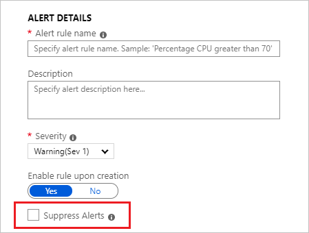
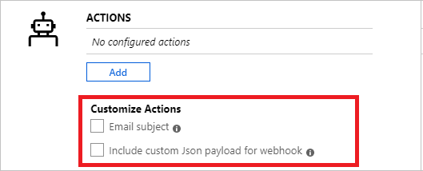

# Manage alert rules created in previous versions

> [!NOTE]
> This article describes the process of managing alert rules created in the previous UI or using API version `2018-04-16` or earlier. Alert rules created in the latest UI are viewed and managed in the new UI, as described in [Create, view, and manage log alerts using Azure Monitor](alerts-log.md).

1. In the [portal](https://portal.azure.com/), select the relevant resource.
1. Under **Monitoring**, select **Alerts**.
1. From the top command bar, select **Alert rules**.
1. Select the alert rule that you want to edit.
1. In the **Condition** section, select the condition.
1. The **Configure signal logic** pane opens, with historical data for the query appearing as a graph. You can change the time period of the chart to display data from the last six hours to last week.
    If your query results contain summarized data or  specific columns without time column, the chart shows a single value.
   
    :::image type="content" source="media/alerts-log/alerts-edit-alerts-rule.png" alt-text="Edit alerts rule.":::

1. Edit the alert rule conditions using these sections:
    - **Search Query**. In this section, you can modify your query.
    - **Alert logic**. Log Alerts can be based on two types of [**Measures**](./alerts-unified-log.md#measure):
        1. **Number of results** - Count of records returned by the query.
        1. **Metric measurement** - *Aggregate value* calculated using summarize grouped by the expressions chosen and the [bin()](/azure/data-explorer/kusto/query/binfunction) selection. For example:
            ```Kusto
            // Reported errors
            union Event, Syslog // Event table stores Windows event records, Syslog stores Linux records
            | where EventLevelName == "Error" // EventLevelName is used in the Event (Windows) records
            or SeverityLevel== "err" // SeverityLevel is used in Syslog (Linux) records
            | summarize AggregatedValue = count() by Computer, bin(TimeGenerated, 15m)
            ```
        For metric measurements alert logic, you can specify how to [split the alerts by dimensions](./alerts-unified-log.md#split-by-alert-dimensions) using the **Aggregate on** option. The row grouping expression must be unique and sorted.
        > [!NOTE]
        > Since the [bin()](/azure/data-explorer/kusto/query/binfunction) can result in uneven time intervals, the alert service will automatically convert the [bin()](/azure/data-explorer/kusto/query/binfunction) function to a [binat()](/azure/data-explorer/kusto/query/binatfunction) function with appropriate time at runtime, to ensure results with a fixed point.
        > [!NOTE]
        > Split by alert dimensions is only available for the current scheduledQueryRules API. If you use the legacy [Log Analytics Alert API](./api-alerts.md), you will need to switch. [Learn more about switching](./alerts-log-api-switch.md). Resource centric alerting at scale is only supported in the API version `2020-08-01` and above.

        :::image type="content" source="media/alerts-log/aggregate-on.png" alt-text="Aggregate on.":::

    - **Period**. Choose the time range over which to assess the specified condition, using [**Period**](./alerts-unified-log.md#query-time-range) option.
 
1. When you are finished editing the conditions, select **Done**.
1. Using the preview data, set the [**Operator**, **Threshold Value**](./alerts-unified-log.md#threshold-and-operator), and [**Frequency**](./alerts-unified-log.md#frequency).
1. Set the [number of violations to trigger an alert](./alerts-unified-log.md#number-of-violations-to-trigger-alert) by using **Total or Consecutive Breaches**.
1. Select **Done**. 
1. You can edit the rule **Description**, and **Severity**. These details are used in all alert actions. Additionally, you can choose to not activate the alert rule on creation by selecting **Enable rule upon creation**.
1. Use the [**Suppress Alerts**](./alerts-unified-log.md#state-and-resolving-alerts) option if you want to suppress rule actions for a specified time after an alert is fired. The rule will still run and create alerts but actions won't be triggered to prevent noise. Mute actions value must be greater than the frequency of alert to be effective.

   
1. Specify if the alert rule should trigger one or more [**Action Groups**](./action-groups.md#webhook) when alert condition is met.
    > [!NOTE]
    > Refer to the [Azure subscription service limits](../../azure-resource-manager/management/azure-subscription-service-limits.md) for limits on the actions that can be performed.  
    > [!NOTE]
    > Log alert rules are currently [stateless and do not resolve](./alerts-unified-log.md#state-and-resolving-alerts).
1. (Optional) Customize actions in log alert rules:
    - **Custom Email Subject**: Overrides the *e-mail subject* of email actions. You can't modify the body of the mail and this field **isn't for email addresses**.
    - **Include custom Json payload**: Overrides the webhook JSON used by Action Groups assuming the action group contains a webhook action. Learn more about [webhook action for Log Alerts](./alerts-log-webhook.md).
    
1. When you have finished editing all of the alert rule options, select **Save**.

## Next steps

* Learn about [log alerts](./alerts-unified-log.md).
* Create log alerts using [Azure Resource Manager Templates](./alerts-log-create-templates.md).
* Understand [webhook actions for log alerts](./alerts-log-webhook.md).
* Learn more about [log queries](../logs/log-query-overview.md).