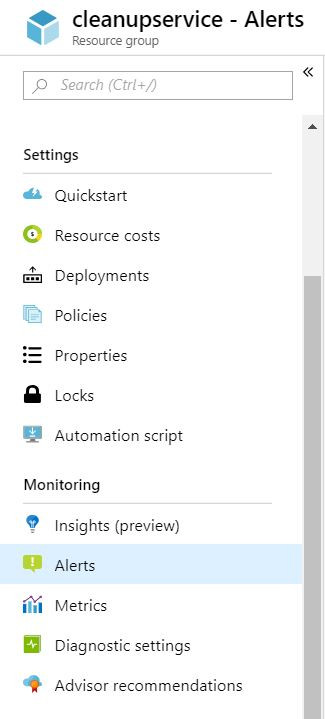

# Manage alert instances with unified alerts

With the [unified alerts experience](./alerts-overview.md) in Azure Monitor, you can see all your different types of alerts across Azure. Unified alerts span multiple subscriptions in a single pane. This article shows how you can view your alert instances, and how to find specific alert instances for troubleshooting.

> [!NOTE]
> You can only access alerts generated in the last 30 days.

## Go to the alerts page

You can go to the alerts page in any of the following ways:

- In the [Azure portal](https://portal.azure.com/), select **Monitor** > **Alerts**.  

     
  
- Use the context of a specific resource. Open a resource, go to the **Monitoring** section, and choose **Alerts**. The landing page is pre-filtered for alerts on that specific resource.

     

- Use the context of a specific resource group. Open a resource group, go to the **Monitoring** section, and choose **Alerts**. The landing page is pre-filtered for alerts on that specific resource group.    

     

## Find alert instances

The **Alerts** page summarizes all your alert instances across Azure. You can modify the results by selecting filters such as **time range**, **subscription**, **alert condition**, **severity**, and more.
> [!NOTE]
> If you navigated to the alerts page by selecting a specific alert severity, the list is pre-filtered for that severity.   

:::image type="content" source="media/alerts-managing-alert-instances/alerts-page.png" alt-text="Screenshot of alerts page.":::
 
Selecting any alert instance opens the **Alert Details** page, allowing you to see more details about that specific alert instance.   

:::image type="content" source="media/alerts-managing-alert-instances/alert-details.jpg" alt-text="Screenshot of alerts page.":::