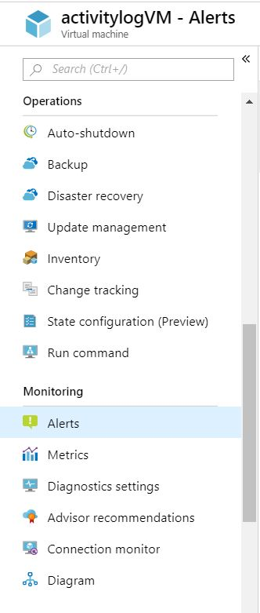

# Manage alert instances with unified alerts

With the [unified alerts experience](./alerts-overview.md) in Azure Monitor, you can see all your different types of alerts across Azure. Unified alerts span multiple subscriptions in a single pane. This article shows how you can view your alert instances, and how to find specific alert instances for troubleshooting.

> [!NOTE]
> You can only access alerts generated in the last 30 days.

## Go to the alerts page

You can go to the alerts page in any of the following ways:

- In the [Azure portal](https://portal.azure.com/), select **Monitor** > **Alerts**.  

     
  
- Use the context of a specific resource. Open a resource, go to the **Monitoring** section, and choose **Alerts**. The landing page is pre-filtered for alerts on that specific resource.

     

## The alerts page

The **Alerts** page summarizes all your alert instances across Azure.
### Alert Recommendations (preview)
> [!NOTE]
> The alert rule recommendations feature is currently in preview and is only enabled for VMs.

If you don't have alert rules defined for the selected resource, either individually or as part of a resource group or subscription, you can [create a new alert rule](alerts-log.md#create-a-new-log-alert-rule-in-the-azure-portal), or [enable recommended out-of-the-box alert rules in the Azure portal (preview)](alerts-log.md#enable-recommended-out-of-the-box-alert-rules-in-the-azure-portal-preview). 

:::image type="content" source="media/alerts-managing-alert-instances/enable-recommended-alert-rules.jpg" alt-text="Screenshot of alerts page with link to recommended alert rules.":::
### Alerts summary pane
If you have alerts configured for this resource, the alerts summary pane summarizes the alerts fired in the last 24 hours. You can modify the list of alert instances by selecting filters such as **time range**, **subscription**, **alert condition**, **severity**, and more. Select an alert instance.

To see more details about a specific alert instance, select the alerts instance to open the **Alert Details** page. 
> [!NOTE]
> If you navigated to the alerts page by selecting a specific alert severity, the list is pre-filtered for that severity.   

:::image type="content" source="media/alerts-managing-alert-instances/alerts-page.png" alt-text="Screenshot of alerts page.":::
 
## The alerts details page
 The **Alerts details** page provides details about the selected alert. Select **Change user response** to change the user response to the alert. You can see all closed alerts in the **History** tab.  

:::image type="content" source="media/alerts-managing-alert-instances/alerts-details-page.png" alt-text="Screenshot of alerts details page.":::
