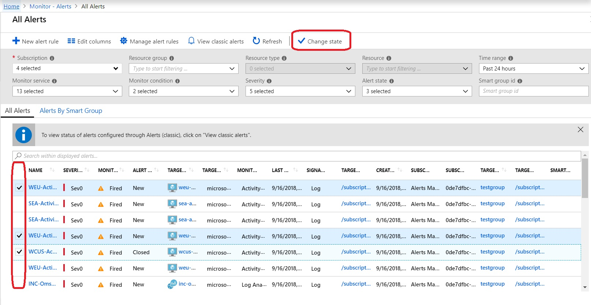
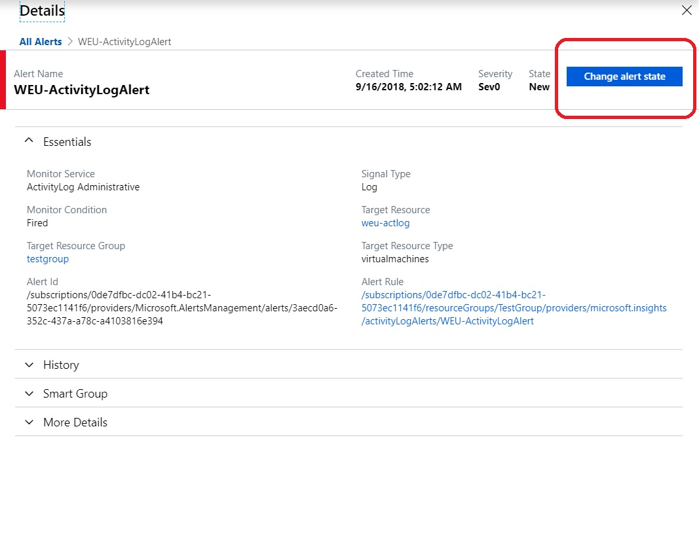
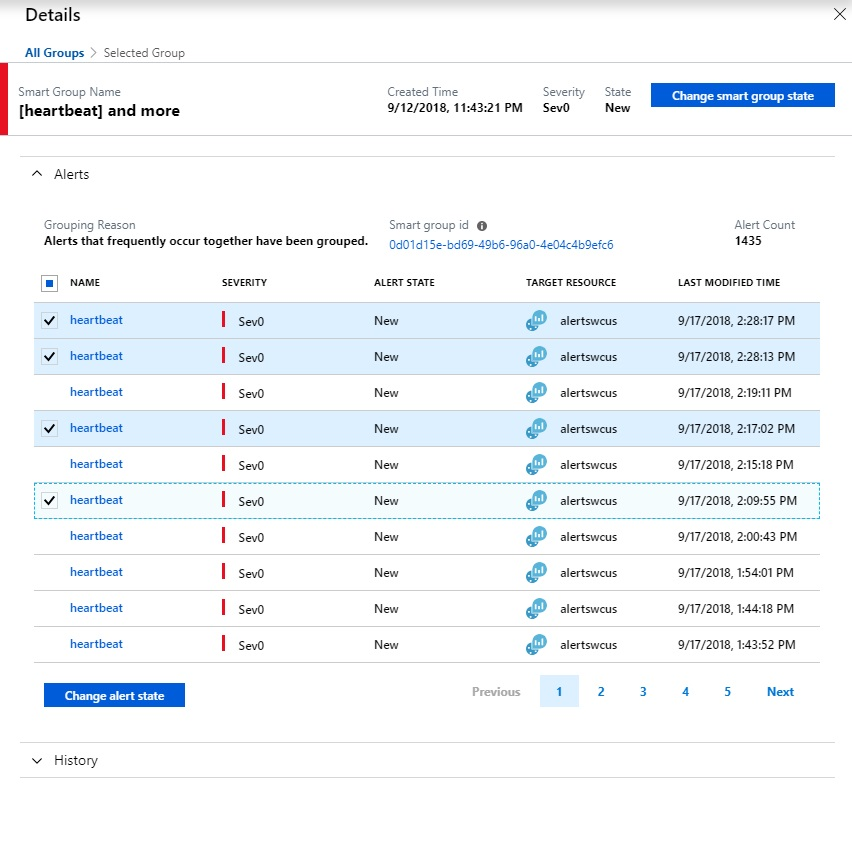
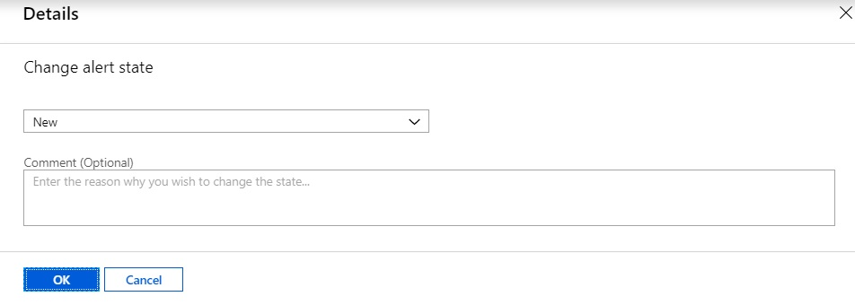
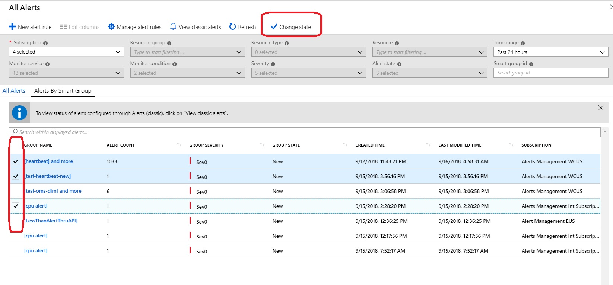

# Manage alert and smart group states

Alerts in Azure Monitor now have an [alert state and a monitor condition](./alerts-overview.md) and, similarly, Smart Groups have a [smart group state](./alerts-smartgroups-overview.md?toc=%2fazure%2fazure-monitor%2ftoc.json). Changes to the state are now captured in history associated with the respective alert or smart group. This article walks you through the process of changing the state, for both an alert and a smart group.

## Change the state of an alert

1. You can change the state of an alert in the following different ways: 
    * In the All Alerts page, click the checkbox next to the alerts you wish to change the state of, and click change state.   
    
    * In the Alert Details page for a particular alert instance, you can click change state   
    
    * In the Alert Details page for a specific alert instance, in the Smart Group pane you can click the checkbox next to the alerts you wish    
    

    * In the Smart Group Details page, in the list of member alerts you can click the checkbox next to the alerts you wish to change the state of and click Change Stateto change the state of and click Change State.   
    
1. On clicking Change State, a popup opens up allowing you to select the state (New/Acknowledged/Closed) and enter a comment if necessary.   

1. Once this is done, the state change is recorded in the history of the respective alert. This can be viewed by opening the respective Details page, and checking the history section.    

## Change the state of a smart group
1. You can change the state of a smart group in the following different ways:
    1. In the Smart Group list page, you can click the checkbox next to the smart groups you wish to change the state of and click Change State  
    
    1. In the Smart Group Details page, you can click change state        
    
1. On clicking Change State, a popup opens up allowing you to select the state (New/Acknowledged/Closed) and enter a comment if necessary. 

   > [!NOTE]
   >  Changing the state of a smart group does not change the state of the individual member alerts.

1. Once this is done, the state change is recorded in the history of the respective smart group. This can be viewed by opening the respective Details page, and checking the history section.     
